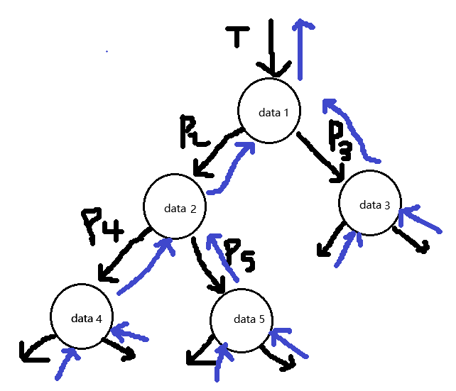
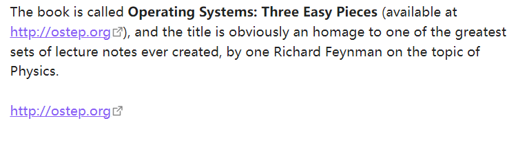

<style>
.blue-highlight {
  background: #DFEEFD; /* 浅蓝色背景 */
  padding: 10px; /* 内边距 */
  border-radius: 5px; /* 圆角 */
  
}
</style>

<style>
.green-highlight {
  background: #EDF8DB; /* 浅绿色背景 */
  padding: 10px; /* 内边距 */
  border-radius: 5px; /* 圆角 */
  
}
</style>
在这个.md文件中
<span style="color: blue;">

2. **关键点**：
   - 在这个累加式中，变量是 \( j \)，而 \( i \) 是一个**常数**（与 \( j \) 无关）。
   - 因为 \( i \) 不随 \( j \) 的变化而变化，所以每次累加的值都是 \( i \)。

</span>
其中的文字"关键点""常数"是黑色的,没有变成蓝色,怎么办
在 Markdown 文件中，`<span>` 标签的样式只会作用于其包裹的内容。在你的代码中，`<span>` 标签只包裹了部分内容，而“关键点”和“常数”没有被包裹在 `<span>` 标签内，因此它们的颜色不会改变。

要让“关键点”和“常数”也变成蓝色，你需要将它们也包裹在 `<span>` 标签内。以下是修改后的代码：

```markdown
<span style="color: blue;">

2. **<span style="color: blue;">关键点</span>**：
   - 在这个累加式中，变量是 \( j \)，而 \( i \) 是一个**<span style="color: blue;">常数</span>**（与 \( j \) 无关）。
   - 因为 \( i \) 不随 \( j \) 的变化而变化，所以每次累加的值都是 \( i \)。

</span>
```

### 修改后的效果：
- “关键点”和“常数”都会被包裹在 `<span style="color: blue;">` 中，因此它们的颜色会变成蓝色。

### 注意事项：
- 如果你希望整个段落都变成蓝色，可以直接将整个段落包裹在 `<span>` 标签中，而不是单独包裹某些词语。例如：

```markdown
<span style="color: blue;">

2. **关键点**：
   - 在这个累加式中，变量是 \( j \)，而 \( i \) 是一个**常数**（与 \( j \) 无关）。
   - 因为 \( i \) 不随 \( j \) 的变化而变化，所以每次累加的值都是 \( i \)。

</span>
```

这样，整个段落都会变成蓝色，而不需要单独包裹某些词语。

### 总结：
- 如果你只想让部分文字变色，需要确保这些文字被包裹在 `<span>` 标签内。
- 如果你想让整个段落变色，可以直接将整个段落包裹在 `<span>` 标签内。
<br>

<div class="green-highlight">
vscode使用笔记
</div>
<br>


<div class="blue-highlight">
vscode Ctrl+z是撤销，这个z是什么的缩写吗
</div>
<br>

你好！这是一个非常有趣的问题。

`Ctrl+Z` 中的 **Z** **并不是** 任何英文单词的缩写。它的选择主要是出于 **键盘布局的便利性**。

这个故事要追溯到图形用户界面（GUI）的早期。我们今天熟知的剪切、复制、粘贴和撤销这套快捷键组合，很大程度上要归功于曾在施乐帕克研究中心（Xerox PARC）和苹果公司工作的计算机科学家——拉里·特斯勒（Larry Tesler）。

以下是这组快捷键被选定的逻辑：

* **`Ctrl+C` (Copy):** "C" 是 **C**opy（复制）的首字母，非常直观。
* **`Ctrl+X` (Cut):** "X" 字母的形状很像一把剪刀 ✂️，形象地代表了“剪切”这个动作。
* **`Ctrl+V` (Paste):** "V" 被选中，主要是因为它在 QWERTY 键盘上紧挨着 "C" 和 "X"。这样，复制/剪切 (`C`/`X`) 和粘贴 (`V`) 这两个连续操作就可以很方便地用一只手完成。也有人说 "V" 的形状像一个向下的箭头或插入符号 `^` 的倒置，有“放入”的意味。
* **`Ctrl+Z` (Undo):** 与 "V" 类似，"Z" 被选中的首要原因也是它的 **位置**。它就在 "X" 和 "C" 旁边，位于键盘的左下角，与 `Ctrl` 键非常近。这使得撤销这个常用操作也能被快捷地执行。

**总结一下**：

`Ctrl+Z`、`Ctrl+X`、`Ctrl+C` 和 `Ctrl+V` 这四个快捷键被设计成一个 **功能组合**，它们在 QWERTY 键盘上排列紧密，方便用户进行最高频的编辑操作。所以，"Z" 的选择是基于 **人体工程学和操作效率**，而非其代表的单词含义。

这套由苹果在 Lisa 和 Macintosh 电脑上普及的快捷键标准，后来被微软的 Windows 系统采用，并最终成为几乎所有现代软件（包括 VS Code）通用的标准。
<br>

输入中文标点符号会自动重复，比如。变成。。之后发现禁用vscodevim插件就不会重复，但是想用vscodevim插件，退回到vscode老版本就正常了
<br>

但是重新安装vscode后按alt和v不能启动了，要重新改实际路径，如下 
```
; 确保脚本以管理员权限运行，以避免权限问题
#SingleInstance Force
#NoEnv
SetWorkingDir %A_ScriptDir%

; Alt + V 切换到 Visual Studio Code
!v::
IfWinExist, ahk_exe Code.exe
{
    WinActivate
}
else
{
    Run, "D:\Microsoft VS Code\Code.exe"  ; 替换为您的 VS Code 实际路径
}
return

; Alt + N 智能切换当前程序的多个窗口
!n::
; 获取当前活动窗口的进程名
WinGet, ActiveProcess, ProcessName, A
; 根据当前活动的程序来切换对应的多个窗口
if (ActiveProcess = "Code.exe")
{
    WinActivateBottom, ahk_exe Code.exe
}
else if (ActiveProcess = "chrome.exe")
{
    WinActivateBottom, ahk_exe chrome.exe
}
else if (ActiveProcess = "wpspdf.exe")
{
    WinActivateBottom, ahk_exe wpspdf.exe
}
else if (ActiveProcess = "PotPlayerMini.exe")
{
    WinActivateBottom, ahk_exe PotPlayerMini.exe
}
else if (ActiveProcess = "YoudaoDict.exe")
{
    WinActivateBottom, ahk_exe YoudaoDict.exe
}
else
{
    ; 如果当前程序不在支持列表中，尝试切换同进程的窗口
    WinActivateBottom, ahk_exe %ActiveProcess%
}
return

; 另一种方法：使用窗口组来更精确地控制切换
; 首先创建一个窗口组
GroupAdd, VSCodeGroup, ahk_exe Code.exe

; Alt + M 使用窗口组方式切换 VS Code 窗口
!m::
IfWinExist, ahk_group VSCodeGroup
{
    ; 激活组中的下一个窗口
    GroupActivate, VSCodeGroup, r
}
else
{
    Run, "C:\Program Files\Microsoft VS Code\Code.exe"
}
return

; Alt + P 切换到 PotPlayer
!p::
IfWinExist, ahk_exe PotPlayerMini.exe  ; 根据您的 PotPlayer 版本，可能需要调整为 PotPlayerMini.exe 或其他
{
    WinActivate
}
else
{
    Run, "D:\PotPlayer\PotPlayerMini.exe"  ; 替换为您的 PotPlayer 实际路径
}
return

; Alt + C 切换到 Chrome
!c::
IfWinExist, ahk_exe chrome.exe
{
    WinActivate
}
else
{
    Run, "C:\Program Files\Google\Chrome\Application\chrome.exe"  ; 替换为您的 Chrome 实际路径
}
return

; Chrome 多窗口切换示例
GroupAdd, ChromeGroup, ahk_exe chrome.exe
!z::
IfWinExist, ahk_group ChromeGroup
{
    GroupActivate, ChromeGroup, r
}
else
{
    Run, "C:\Program Files\Google\Chrome\Application\chrome.exe"
}
return

; Alt + W 切换到 WPS PDF
!w::
IfWinExist, ahk_exe wpspdf.exe
{
    WinActivate
}
else
{
    Run, "D:\WPS Office\12.1.0.21541\office6\wpspdf.exe"
}
return

; Alt + D 切换到网易有道翻译
!d::
IfWinExist, ahk_exe YoudaoDict.exe
{
    WinActivate
}
else
{
    Run, "D:\Dict\YoudaoDict.exe"
}
return

; 通用的多窗口切换函数
; 可以为任何程序创建多窗口切换
SwitchBetweenWindows(exeName, programPath := "")
{
    IfWinExist, ahk_exe %exeName%
    {
        WinActivateBottom, ahk_exe %exeName%
    }
    else if (programPath != "")
    {
        Run, %programPath%
    }
    return
}

; 使用通用函数的示例
; Alt + Shift + V 切换 VS Code 窗口（使用通用函数）
!+v::
SwitchBetweenWindows("Code.exe", "C:\Program Files\Microsoft VS Code\Code.exe")
return
```
<br>

<div class="blue-highlight">
怎么查找我电脑vscode的实际路径，可以是快捷方式的路径吗
</div>
<br>

要查找 VS Code 的实际安装路径或快捷方式的路径，可以按照以下方法操作：

---

### **方法 1：通过快捷方式查找实际路径（Windows）**
1. **右键点击快捷方式**  
   - 如果是桌面或任务栏的快捷方式，右键点击它。
   - 选择 **`属性`**（Properties）。

2. **查看目标路径**  
   - 在属性窗口的 **`快捷方式`** 选项卡中：
     - **`目标`** 字段会显示实际的可执行文件路径（如 `"C:\Program Files\Microsoft VS Code\Code.exe"`）。
     - **`起始位置`** 字段是工作目录，通常是安装目录。

3. **打开文件所在位置**  
   - 点击 **`打开文件所在的位置`**，会直接跳转到实际安装目录。

---

### **方法 2：通过命令查找（Windows/macOS/Linux）**
- **Windows（命令提示符/PowerShell）**  
  运行以下命令：
  ```cmd
  where code
  ```
  或（如果已添加到 PATH）：
  ```cmd
  where code.exe
  ```

- **macOS/Linux（终端）**  
  运行：
  ```bash
  which code
  ```
  这会返回 VS Code 可执行文件的路径（如 `/usr/bin/code`）。

---

### **方法 3：通过 VS Code 内部查找**
1. 打开 VS Code。
2. 按下 **`Ctrl+Shift+P`**（Windows/Linux）或 **`Cmd+Shift+P`**（macOS），输入 `Developer: Show Process Explorer`。
3. 在进程列表中，找到 `code.exe` 或 `Code Helper`，会显示完整路径。

---

### **方法 4：直接搜索文件系统**
- **默认安装路径**：
  - Windows: `C:\Program Files\Microsoft VS Code\`  
  - macOS: `/Applications/Visual Studio Code.app/Contents/Resources/app/bin/code`  
  - Linux: `/usr/share/code/` 或 `/opt/visual-studio-code/`

---

### **快捷方式的路径 ≠ 实际路径？**
- 快捷方式本身只是一个链接（`.lnk` 文件），其路径可以通过右键属性查看，但实际路径需要通过上述方法确认。

---

如果仍有疑问，可以补充你的操作系统或具体场景，我会进一步帮你排查！

<br>

<div class="blue-highlight">
我用vscode写笔记，格式为.md，刚刚差点全部删除了，要是不小心删除了，有办法恢复吗，我因为使用了vim，按了u就恢复了，还有别的方法吗
</div>
<br>

在 VSCode 中使用 Vim 插件编辑 `.md` 文件时，如果不小心删除了内容，确实有几种恢复方法。除了 Vim 的 `u`（撤销）命令外，以下是其他可行的恢复方案：

---

### **1. VSCode 自带的撤销功能**
- **快捷键**：`Ctrl + Z`（Windows/Linux）或 `Cmd + Z`（Mac）
<span style="color: red;">
这个方法很好用
</span>
  - 即使你用了 Vim 插件，VSCode 的原生撤销栈仍然有效，可以多次撤销。
- **注意**：如果 Vim 插件处于 `Normal` 模式，可能需要先按 `i` 进入 `Insert` 模式再按 `Ctrl + Z`，或者直接通过 `Cmd/Ctrl + Z` 触发。

---

### **2. Vim 的撤销/重做命令**
- **撤销**：`u`（你已使用过）
- **重做**：`Ctrl + r`（恢复被撤销的操作）
  - 如果误按了多次 `u`，可以用 `Ctrl + r` 回退到删除前的状态。

---

### **3. 检查 VSCode 的自动备份**
VSCode 可能会自动保存文件快照（需开启设置）：
1. 打开文件所在目录，检查是否有 `~` 开头的临时文件（如 `~yourfile.md`）。
2. 在 VSCode 中，尝试右键点击文件标签，选择 **Reopen Closed File**（如果文件被关闭）。
3. 如果启用了 **Auto Save**（`File > Auto Save`），内容可能已自动保存到磁盘。

---

### **4. 系统/文件恢复工具**
如果文件未保存且无法撤销：
- **Windows**：
  - 右键文件所在文件夹 → **Restore previous versions**（需系统保护已开启）。
  - 使用工具如 `Recuva` 恢复删除的文件。
- **macOS/Linux**：
  - 检查 `ls -al` 是否有隐藏的临时文件（如 `.yourfile.md.swp`）。
  - 使用 `testdisk` 或 `extundelete`（Linux）尝试恢复。

---

### **5. Vim 交换文件（Swap File）**
如果 Vim 插件崩溃或异常退出：
1. 在终端运行 `vim -r /path/to/yourfile.md`，查看是否提示恢复交换文件。
2. 或在 VSCode 中打开文件时，Vim 插件可能会自动提示恢复。

---

### **6. Git/版本控制**
- 如果文件在 Git 仓库中：
  ```bash
  git checkout -- yourfile.md  # 丢弃未提交的更改
  git restore yourfile.md      # (Git 2.23+)
  ```
- 即使未提交，某些 IDE（如 VSCode 的 Git 插件）会保留本地变更记录。

---

### **7. 文件历史（需提前配置）**
- **VSCode 插件**：安装如 **Local History** 或 **File History**，它们会自动备份文件版本。
- **云端备份**：如果文件保存在 Dropbox、OneDrive 等，可检查版本历史。

---

### **预防措施**
1. **启用 VSCode 自动保存**：`File > Auto Save`。
2. **使用 Git**：定期提交更改。
3. **安装备份插件**：如 **Local History**。
4. **配置 Vim 交换文件**：确保 `set swapfile` 在 Vim 配置中启用。

如果以上方法均无效，可以尝试用 **数据恢复软件** 扫描磁盘，但成功率取决于删除后的磁盘操作量。建议优先从备份或版本控制中恢复。

<br>

<div class="blue-highlight">
vscode怎么退出全屏模式
</div>
<br>

在 VS Code 中退出全屏模式的方法取决于你的操作系统，以下是常见平台的快捷键：  

### **Windows/Linux**  
- **快捷键**：按 `F11` 键（或 `Fn + F11`，取决于键盘）。  
- **菜单操作**：点击顶部菜单栏的 **查看 (View)** → **切换全屏 (Toggle Full Screen)**。  

### **macOS**  
- **快捷键**：按 `Control + Command + F`。  
- **菜单操作**：点击顶部菜单栏的 **View** → **Toggle Full Screen**。  

### **通用方法**  
如果快捷键失效，可以尝试：  
1. 鼠标移动到屏幕顶部，看是否出现菜单栏，然后通过菜单退出。  
2. 如果处于 **Zen 模式（禅模式）**，按 `Esc` 退出 Zen 模式，再按 `F11`（或对应 macOS 快捷键）退出全屏。  

希望这能帮到你！ 😊
<br>


<div class="blue-highlight">
我想用vscode自动跳转到.md的567行，怎么弄
</div>
<br>

在 VS Code 中快速跳转到 `.md` 文件的指定行（如第 567 行），可以使用以下几种方法：

---
<span style="color: red;">

下面方法1方法2中的G,P用小写g,p也可以。VS Code 对快捷键的大小写是不敏感的，无论是 Ctrl + G 还是 Ctrl + g（小写），效果完全一样。这是设计上的灵活性，避免因大小写状态（如 Caps Lock）影响操作。

</span>

### **方法 1：快捷键跳转（推荐）**
1. 打开目标 `.md` 文件。
2. 按下快捷键：  
   - **Windows/Linux**: `Ctrl + G`  
   - **macOS**: `Control + G`
3. 在弹出的输入框中输入行号 `567`，按 `Enter` 即可跳转。

---

### **方法 2：命令面板**
1. 按下快捷键：  
   - **Windows/Linux**: `Ctrl + P`  
   - **macOS**: `Command + P`
2. 在输入框中输入 `:567`（冒号 + 行号），按 `Enter`。

---

### **方法 3：拖拽滚动条（可视化跳转）**
1. 打开文件后，右侧滚动条会显示行号标记。
2. 将鼠标悬停在滚动条上，会提示当前行号，拖动滚动条到目标行附近。
3. 若启用了缩略图（默认开启），可直接根据滚动条右侧的预览定位。

---

### **方法 4：启用行号显示（辅助定位）**
如果文件行号未显示：
1. 点击 VS Code 底部状态栏的 **行/列指示器**（如 `Ln 1, Col 1`）。
2. 输入 `567` 并回车，或直接手动滚动到目标行。

---

### **补充技巧**
- **书签扩展**：安装插件（如 [`Bookmarks`](https://marketplace.visualstudio.com/items?itemName=alefragnani.Bookmarks)）标记常用行。
- **搜索跳转**：按 `Ctrl + F` 搜索附近关键词辅助定位。

---

以上方法适用于任何文本文件（包括 `.md`），无需额外配置。

<br>

<div class="blue-highlight">
我现在发现了
<span style="color: blue;">
计算机硬件计算无符号整数的加法 从最低位开始，按位相加，(符号位参与运算)并往最高位进位</span> 
27365236

<br>

那么后面的27365236是黑色的

<span style="color: blue;">

计算机硬件计算无符号整数的加法 从最低位开始，按位相加，(符号位参与运算)并往最高位进位</span> 
27365236

</div>
27365236会变成蓝色
<br>
很好的发现！你找到了问题的根本原因。

这个现象说明了HTML解析中的一个重要原则：**换行符在HTML标签内部和外部的处理方式不同**。

让我们分析这两种情况：

**情况1（27365236是黑色）：**
```html
<span style="color: blue;">计算机硬件计算无符号整数的加法 从最低位开始，按位相加，(符号位参与运算)并往最高位进位</span> 
27365236
```
这里span标签在第一行就完整闭合了，`27365236`在span标签外部，所以显示默认颜色。

**情况2（27365236是蓝色）：**
```html
<span style="color: blue;">

计算机硬件计算无符号整数的加法 从最低位开始，按位相加，(符号位参与运算)并往最高位进位</span> 
27365236
```

关键区别在于：**在第二种情况下，span开始标签后立即有一个换行符**。

这导致了HTML解析的微妙差异。在某些HTML解析器或渲染环境中，当标签内包含换行符时，可能会影响到标签闭合后的文本渲染，或者解析器可能没有正确识别到标签的边界。

**建议的最佳实践：**
1. **保持标签紧凑**：开始标签后不要立即换行
2. **使用显式样式**：如果需要确保某段文字是特定颜色，给它单独加上样式
3. **检查HTML结构**：使用HTML验证工具检查代码的正确性

这是一个很好的HTML解析边界情况的例子！
<br>

```
我知道了
<br>

根据我提供的代码 `Alt + N`  **只对 VS Code 有效** 。能渲染.
<br>
根据我提供的代码 `Alt + N`  **只对 VS Code 有效** 。
不能正常渲染
```
不能正常渲染时检查要不要加一个空行，效果区别如下

[点击跳转到有没有空行，上面这行渲染不一样](#有没有空行，上面这行渲染不一样)
<br>


<div class="blue-highlight">
但是我的vscode安装了vim插件，只要关闭vim插件，才能用ctrl+g,怎么才能在vim开启的时候也能使用ctrl+g呢
</div>

<br>

在使用 VS Code 的 **Vim 插件**时，`Ctrl+G` 默认被 Vim 占用（用于显示当前行信息），因此会覆盖 VS Code 的原生跳转功能。以下是几种解决方案：


<span style="color: red;">

我用了方法1和方法3

</span>


---

### **方法 1：修改 Vim 插件的键位绑定**
**直接覆盖 Vim 的 `Ctrl+G` 绑定**，使其触发 VS Code 的行号跳转功能：
1. 打开 VS Code 设置文件：  
   - **快捷键**：`Ctrl + ,`（打开设置界面） → 点击右上角的 **"打开设置 (JSON)"** 图标。
   - **或** 直接命令面板 (`Ctrl + Shift + P`) 输入 `Preferences: Open Settings (JSON)`。

2. 在 `settings.json` 中添加以下代码：
   ```json
   {
       "vim.handleKeys": {
           "<C-g>": false  // 禁止 Vim 接管 Ctrl+G
       }
   }
   ```
   - 这样 `Ctrl+G` 会恢复为 VS Code 默认的行号跳转功能。

---

### **方法 2：自定义 Vim 的替代键位**
如果仍需保留 Vim 的 `Ctrl+G` 功能，可以将其绑定到其他快捷键（例如 `Ctrl+Shift+G`）：
1. 在 `settings.json` 中添加：
   ```json
   {
       "vim.normalModeKeyBindings": [
           {
               "before": ["<C-S-g>"],  // 新快捷键
               "after": ["<C-g>"]      // 映射到原 Vim 功能
           }
       ],
       "vim.handleKeys": {
           "<C-g>": false  // 释放 Ctrl+G
       }
   }
   ```
   - 之后用 `Ctrl+Shift+G` 触发 Vim 的原生功能，`Ctrl+G` 用于跳转行号。

---

### **方法 3：使用 Vim 原生跳转命令**
Vim 本身支持跳转到指定行号，无需关闭插件：
- **普通模式**下输入：  
  `567G`（大写 `G`）或 `:567<Enter>`  
  - 解释：`行号 + G` 直接跳转（如 `567G`），或输入 `:567` 后回车。

---

### **方法 4：临时禁用 Vim 插件**
如果偶尔需要原生功能，可快速切换：
1. 命令面板 (`Ctrl + Shift + P`) 输入：  
   `Toggle Vim Mode`  
   - 临时禁用后即可使用 `Ctrl+G`，再次执行命令重新启用。

---

### **验证是否生效**
修改后保存 `settings.json`，重新加载 VS Code（或执行命令 `Developer: Reload Window`），测试 `Ctrl+G` 是否跳转到指定行。

---

### **其他建议**
- **冲突排查**：如果仍有问题，检查是否有其他插件占用了 `Ctrl+G`（如 `GitLens`）。
- **Vim 插件文档**：参考官方 [Vim 插件键位配置](https://github.com/VSCodeVim/Vim#key-remapping)。

希望这些方法能解决你的需求！如果有其他场景需要优化，可以继续探讨。

<div class="blue-highlight">
我有三句话需要复制，然后分别粘贴，怎么用vim实现
</div>

在Vim中复制多行内容并分别粘贴，可以使用以下步骤：

1. 进入正常模式（按ESC确保处于正常模式）
2. 使用`"+y`或`"*y`复制到系统剪贴板（需要Vim支持剪贴板），或者用无名寄存器直接yank

具体操作示例：

假设你要复制三句话（三行内容）：

方法一：分别复制每一句
1. 将光标移动到第一行，按`yy`复制整行
2. 移动到要粘贴的位置，按`p`粘贴
3. 将光标移动到第二行，按`yy`复制
4. 移动到下一个粘贴位置，按`p`粘贴
5. 对第三行重复同样操作

方法二：一次复制多行然后分别粘贴
1. 将光标移动到第一行
2. 按`3yy`复制三行（或使用可视模式`V`选中三行后按`y`）
3. 移动到第一个粘贴位置，按`p`粘贴全部三行
4. 然后使用`u`撤销，再按`p`只粘贴第一行
5. 移动到第二个粘贴位置，按`p`粘贴第二行
6. 移动到第三个粘贴位置，按`p`粘贴第三行

方法三：使用寄存器（更高效）
1. 复制第一行：光标在第一行，按`"ayy`（存入寄存器a）[点击跳转到"的作用](#"的作用)
2. 复制第二行：光标在第二行，按`"byy`（存入寄存器b）
3. 复制第三行：光标在第三行，按`"cyy`（存入寄存器c）
4. 粘贴时：
   - 按`"ap`粘贴第一行
   - 按`"bp`粘贴第二行
   - 按`"cp`粘贴第三行

选择哪种方法取决于你的具体需求和使用的Vim版本。方法三使用不同寄存器是最灵活的方式。
<br>


<a id=""的作用"></a>
在 Vim 中，`"`（双引号）是 **寄存器选择符号**，它告诉 Vim 你接下来要操作的是某个特定的寄存器（register），而不是默认的无名寄存器（`""`）。  

### **寄存器的基本概念**
Vim 有多个寄存器（类似于剪贴板），可以用来存储不同的文本内容。默认情况下，`yy`（复制一行）或 `dd`（删除一行）会把内容存入 **无名寄存器**（`""`），而 `p` 粘贴时也是从无名寄存器读取内容。  

但如果你想 **明确指定使用某个寄存器**，就要在命令前加 `"` 并指定寄存器名。  

### **方法三的详细解释**
```vim
"ayy  " 复制当前行到寄存器 a
"byy  " 复制当前行到寄存器 b
"cyy  " 复制当前行到寄存器 c
```
- `"a` 表示选择寄存器 `a`（名字可以任意，比如 `a-z`、`0-9`、`A-Z` 等）  
- `yy` 仍然是复制当前行，但内容会存入寄存器 `a`，而不是默认的无名寄存器  

之后，你可以用：
```vim
"ap  " 粘贴寄存器 a 的内容
"bp  " 粘贴寄存器 b 的内容
"cp  " 粘贴寄存器 c 的内容
```
这样就能分别粘贴之前存储的三行内容。  

### **其他常用寄存器**
| 寄存器 | 用途 |
|--------|------|
| `""` | 默认无名寄存器（`yy`、`dd` 默认存到这里） |
| `"0` | 最近一次 `yank`（复制）的内容 |
| `"1`-`"9` | 删除/剪切的历史记录（`dd` 会存入 `"1`，旧的会依次往后移） |
| `"a`-`"z` | 自定义命名寄存器（用户可自由使用） |
| `"+` | 系统剪贴板（需 Vim 支持 `+clipboard`） |
| `"*` | X11 主剪贴板（Linux 下常用） |

### **总结**
- `"` 是 Vim 中用来 **选择寄存器** 的前缀符号。  
- `"ayy` 表示 **把当前行复制到寄存器 `a`**，而不是默认寄存器。  
- 之后可以用 `"ap` 粘贴寄存器 `a` 的内容，`"bp` 粘贴寄存器 `b` 的内容，以此类推。  

这样就能实现分别复制三行，并分别粘贴它们。 🚀


<br>


<div class="blue-highlight">
用vscode写.md文件，创建超链接的方法
</div>
<br>

```plaintext
[点击跳转到补充提问](#B不加绝对值)
<a id="B不加绝对值"></a>
```
<br>

把B不加绝对值换成别的名字，就可以创建超链接了，第一行是想离开的地方用，第二行是想到的地方用
<br>

<div class="blue-highlight">
现在我想把这个东西保存在.md的上面
就是只看文字，但是我在预览看见它会自动渲染，怎么变成只看见文字呢

</div>

```plaintext
[点击跳转到补充提问](#B不加绝对值)
<a id="B不加绝对值"></a>
```
<br>

<span style="color: green;">

我用的是下面的方法1

</span>
<br>

如果你想在 Markdown 文件中 **只显示文字**（不渲染超链接和 HTML 标签），有几种方法可以实现：

---

### **方法 1：使用代码块包裹（推荐）**
用反引号 `` ` `` 或代码块包裹内容，使其以纯文本形式显示：
````markdown
```plaintext
[点击跳转到补充提问](#B不加绝对值)
<a id="B不加绝对值"></a>
```
````
**效果：**
```
[点击跳转到补充提问](#B不加绝对值)
<a id="B不加绝对值"></a>
```

---

### **方法 2：转义特殊字符**
在 Markdown 符号前加反斜杠 `\` 取消渲染：
```markdown
\[点击跳转到补充提问\]\(\#B不加绝对值\)

\<a id="B不加绝对值"\>\</a\>
```
**效果：**  
[点击跳转到补充提问](#B不加绝对值)  
<a id="B不加绝对值"></a>

---

### **方法 3：使用 HTML 注释**
虽然内容不会显示，但注释本身在源码中可见：
```markdown
<!-- [点击跳转到补充提问](#B不加绝对值) -->
<!-- <a id="B不加绝对值"></a> -->
```

---

### **方法 4：内联代码标记**
用单个反引号包裹部分内容：
```markdown
`[点击跳转到补充提问](#B不加绝对值)`  
`<a id="B不加绝对值"></a>`
```
**效果：**  
`[点击跳转到补充提问](#B不加绝对值)`  
`<a id="B不加绝对值"></a>`

---

### **如何选择？**
- **需要完全隐藏**：用 HTML 注释（方法 3）。  
- **需要显示但禁用渲染**：用代码块（方法 1）或转义（方法 2）。  
- **仅局部禁用**：用内联代码（方法 4）。

如果目标是 **仅保存源码供自己查看**，直接保留原始文本即可（Markdown 源码本身是纯文本格式）。
<br>

<span style="color: red;">

现在觉得方法2有点问题，改成下面这种会更好，这种是看预览中的内容，只需要更改B不加绝对值，改成别的名字就可以了


</span>

\[点击跳转到补充提问](#B不加绝对值)
\<a id="B不加绝对值"></a>

<br>

<div class="blue-highlight">


第二行可以正常渲染，这两行有什么区别
</div>

<br>

<br>

[点击跳转到全写法的write-through 中的through是什么意思](#全写法的write-through 中的through是什么意思)


<a id="全写法的write-through 中的through是什么意思"></a>

为什么vscode里面的.md文件里面这两句渲染后不会出现跳转
</div>
<br>

在 VS Code 中，Markdown 文件的锚点跳转功能需要特定的语法格式才能正常工作。你提供的代码有几个问题导致跳转不生效：

### 问题分析

1. **锚点定义语法问题**：
   - 标准的 Markdown 锚点定义应该使用 HTML 的 `<a>` 标签或者特定的标题格式
   - 你使用的 `<a id="..."></a>` 语法在某些 Markdown 解析器中可能不被识别为有效的锚点

2. **跳转链接格式问题**：
   - 你的跳转链接 `[点击跳转到...](#全写法的write-through 中的through是什么意思)` 中包含空格和中文
   - 许多 Markdown 解析器要求锚点 ID 中不能有空格，且对非 ASCII 字符支持不一致
   <span style="color: red;">
   把空格删了就可以出现跳转了
   </span>

### 解决方案

修改为以下格式：

```markdown
[点击跳转到全写法的write-through中的through是什么意思](#write-through-through)

<a id="write-through-through"></a>
```

或使用标题作为锚点：

```markdown
[点击跳转到下面的解释](#write-through-through)

## write-through 中的through是什么意思 <a id="write-through-through"></a>
```

### 为什么在 VS Code 预览中不工作

1. VS Code 内置的 Markdown 预览使用 CommonMark 规范，对锚点支持有限
2. 中文锚点和空格可能导致 ID 生成不一致
3. 某些功能需要扩展（如 Markdown All in One）才能完全支持

### 建议

1. 使用简单的英文+连字符作为锚点 ID
2. 避免在锚点 ID 中使用空格
3. 可以安装 Markdown 预览增强扩展获得更好的跳转支持

<br>


<div class="blue-highlight">
建立子文件夹
</div>
<br>

建立一个母文件夹,然后再建立文件,点击文件,选择建立文件夹,此时的新文件夹就是子文件夹,与文件并列,为母文件夹的子文件夹
<br>

<div class="blue-highlight">
vscode写代码,怎么把一段给注释掉?
</div>
在 VSCode 中，你可以通过以下方式注释代码：

### 单行注释
- **快捷键**：选中代码后，按 `Ctrl + /`（Windows/Linux）或 `Cmd + /`（Mac）。
- **手动**：在代码行前添加 `//`。

### 多行注释
- **快捷键**：选中多行代码后，按 `Ctrl + /`（Windows/Linux）或 `Cmd + /`（Mac）。
- **手动**：用 `/*` 和 `*/` 包裹代码块。

### 示例
#### 单行注释
```javascript
// console.log("这行被注释了");
```

#### 多行注释
```javascript
//console.log("这行被注释了");
//console.log("这行也被注释了");
```

### 取消注释
再次使用相同的快捷键或删除注释符号即可取消注释。
<br>

<div class="blue-highlight">
markdown的代码片段无法触发
</div>
你说的这些没有解决我的问题,我找到了解决方法,需要修改vscode的seting.json

```cpp
"[markdown]": {
    "editor.quickSuggestions": {
        "other": true,
        "comments": true,
        "strings": true
    },
    "editor.acceptSuggestionOnEnter": "on"
}    
```   

<br>


<div class="blue-highlight">

```
- **补码（二进制）**可以统一处理加减法，但**补数（十进制）**不能。
- **补码（二进制）** 可以统一处理加减法，但 **补数（十进制）** 不能。
```
第一行预览会出现**，第二行不会，为什么
</div>
<br>

好观察！这两行的关键区别在于**空格的位置**：

## 区别分析

**第一行（有问题）：**
```markdown
-  **补码（二进制）**可以统一处理加减法，但**补数（十进制）**不能。
```

**第二行（正常）：**
```markdown
-  **补码（二进制）** 可以统一处理加减法，但 **补数（十进制）** 不能。
```

## 具体差异

1. **第一个加粗后面**：
   - 问题行：`**补码（二进制）**可以` （`**` 直接连着中文）
   - 正常行：`**补码（二进制）** 可以` （`**` 后面有空格）

2. **第二个加粗前面**：
   - 问题行：`但**补数（十进制）**` （中文直接连着 `**`）
   - 正常行：`但 **补数（十进制）**` （中文和 `**` 之间有空格）

## 原因解释

许多Markdown解析器要求 `**` 标记与周围的文本之间有适当的分隔（空格或标点符号），特别是：
- `**加粗文本**` 前后如果直接连接其他字符，可能导致解析失败
- `**加粗文本** ` 后面加空格可以确保正确闭合
- ` **加粗文本**` 前面加空格可以确保正确开始

## 规律总结
```markdown
正确：文字 **加粗** 文字
错误：文字**加粗**文字
```

所以在使用Markdown加粗时，建议在 `**` 前后(指第一对星号前面,第二对星号后面)都留适当的空格，这样可以避免大部分解析问题。
<span style="color: red;">

这两行chatgpt都能正常渲染，但是vscode第一行会出现**

</span>
<br>

<div class="blue-highlight">
.md文件怎么写出下标
</div>
<br>

在Markdown（.md）文件中，可以通过以下几种方式实现下标效果：

### 1. HTML标签（通用方法）
```md
使用<sub>下标</sub>标签
```
效果：  
使用<sub>下标</sub>标签

### 2. LaTeX语法（需支持数学公式的环境，如Typora、VS Code+插件等）
```md
H$_2$O 或 H\textsubscript{2}O
```
效果：  
H$_2$O 或 H\textsubscript{2}O

### 3. 特定Markdown扩展语法（部分编辑器支持）
```md
H~2~O
```
效果（在支持该语法的编辑器中如Typora、GitHub等）：  
H~2~O

### 注意事项：
1. 纯Markdown标准语法本身不支持下标，需要依赖HTML或扩展语法
2. 不同平台/编辑器支持程度不同：
   - GitHub：支持HTML和`~`语法
   - Typora：支持所有上述方法
   - VS Code（需安装Markdown数学公式插件）

### 完整示例：

水的化学式：
- HTML: H<sub>2</sub>O
- LaTeX: H$_2$O
- 扩展语法: H~2~O


选择哪种方式取决于你的目标渲染环境。如果是通用场景，推荐使用HTML的`<sub>`标签。

<br>
<br>

<div class="blue-highlight">
我发现这个也会出现下标
\( C_{n-1} = 0 \)
</div>
<br>

是的！你发现的 `\( C_{n-1} = 0 \)` 是 **LaTeX 数学公式语法**，它可以在支持数学公式渲染的 Markdown 编辑器（如 Typora、VS Code + Markdown 插件、Jupyter Notebook、GitHub 等）中正确显示下标。 [点击跳转到这个公式的含义](#这个公式的含义) 

---

### **LaTeX 下标语法**
在 LaTeX 数学模式中：
- 用 `_` 表示下标，例如 `C_{n-1}` 会渲染为：  
  \( C_{n-1} \) 
- 如果下标是单个字符，可以省略 `{}`，比如 `x_i` → \( x_i \)，但多字符时必须用 `{}`，如 `x_{max}` → \( x_{max} \)。

**示例：**
```markdown
- 单字符下标：`x_i` → \( x_i \)
- 多字符下标：`x_{ij}` → \( x_{ij} \)
- 复杂表达式：`C_{n-1} = 0` → \( C_{n-1} = 0 \)
```

---

### **不同场景下的使用建议**
1. **通用兼容性（纯 Markdown + HTML）**  
   用 `<sub>` 标签：
   ```markdown
   化学式：H<sub>2</sub>O → H<sub>2</sub>O
   ```

2. **支持 LaTeX 的环境（如 Typora、VS Code、GitHub）**  
   用 `$...$` 或 `\( ... \)` 包裹数学公式：
   ```markdown
   数学公式：$C_{n-1} = 0$ → \( C_{n-1} = 0 \)
   ```

3. **部分编辑器扩展语法（如 Typora、GitHub）**  
   用 `~` 包裹（仅简单下标）：
   ```markdown
   简单下标：H~2~O → H~2~O
   ```

---

### **为什么你的 `\( C_{n-1} = 0 \)` 能显示下标？**
- 你使用的 Markdown 解析器（可能是 Typora、VS Code 的 Markdown Preview Enhanced 等）**支持 LaTeX 数学公式**，所以 `_` 被正确解析为下标符号。

---

### **注意事项**
- 如果内容需要跨平台渲染（比如发到不支持 LaTeX 的网站），建议优先用 HTML `<sub>`。
- 在 GitHub 的 README.md 中：
  - 支持 `~` 语法（如 `H~2~O`）。
  - 数学公式需要额外启用 LaTeX 支持（默认不渲染 `$...$`）。

希望这能帮你更灵活地处理下标！如果有具体的使用场景（比如在哪个平台写文档），可以进一步优化方案。
<br>

<a id="这个公式的含义"></a>
<br>

在 LaTeX 数学公式语法中，`\(` 和 `\)` 是 **行内数学模式（inline math mode）** 的标记符号，其中的 `\` 是 **转义字符**，用于区分普通文本和数学公式。  

---

### **1. `\( ... \)` 的作用**
- **`\(`** 表示数学公式的开始  
- **`\)`** 表示数学公式的结束  
- 这是 LaTeX 的标准语法，目的是在文本行内嵌入数学公式（如 \( C_{n-1} = 0 \)）。

---

### **2. 为什么需要 `\` ？**
- **转义字符**：在 LaTeX 中，`(` 和 `)` 本身是普通符号，直接写 `(C_{n-1})` 会被当作普通括号，而 `\(` 和 `\)` 明确告诉解析器“这是数学公式的边界”。
- **兼容性**：某些 Markdown 解析器（如 GitHub 的默认渲染）会忽略 `\`，此时 `\(...\)` 可能直接显示为括号，但在支持 LaTeX 的编辑器（如 Typora、VS Code + 插件）中会正确渲染为公式。

---

### **3. 其他常见数学模式语法**
| 语法          | 说明                     | 示例                     |
|---------------|--------------------------|--------------------------|
| `\( ... \)`   | 行内数学公式（LaTeX 标准） | `\( x^2 \)` → \( x^2 \) |
| `$ ... $`     | 行内数学公式（简写形式）   | `$ x^2 $` → \( x^2 \)   |
| `\[ ... \]`   | 独立行数学公式（LaTeX 标准） | `\[ x^2 \]` → \[ x^2 \] |
| `$$ ... $$`   | 独立行数学公式（简写形式）   | `$$ x^2 $$` → $$ x^2 $$ |

---

### **4. 在 Markdown 中的注意事项**
- **编辑器支持**：  
  - Typora、VS Code（安装 Markdown+Math 插件）、Jupyter Notebook 等支持 `\(...\)` 或 `$...$`。  
  - **GitHub 的 README.md 默认不支持**，需改用 HTML `<sub>` 或 `` `~` `` 语法（如 `H~2~O`）。
- **转义字符冲突**：  
  如果需要在普通文本中输入 `\`，需写成 `\\`（如 `\\` → \）。

---

### **5. 你的例子解析**
```markdown
\( C_{n-1} = 0 \)
```
- `\(` 和 `\)` 定义数学公式范围。  
- `_` 在数学模式中自动识别为下标符号。  
- 最终渲染为：\( C_{n-1} = 0 \)。

---

### **总结**
- `\` 是 LaTeX 的转义字符，用于触发数学模式。  
- 在支持 LaTeX 的 Markdown 编辑器中，推荐用 `$...$` 或 `\(...\)` 写行内公式。  
- 如果环境不支持 LaTeX，改用 HTML `<sub>` 或特定语法（如 `~`）。  

如果有具体使用场景（比如在 GitHub 或 Typora 中），可以进一步优化写法！

<div class="blue-highlight">
有什么网址可以在线渲染.md文件吗
</div>
<br>

以下是一些可以在线渲染 **Markdown（.md）文件** 的网站，你可以直接粘贴内容或上传文件查看渲染效果：

### **1. 通用 Markdown 渲染**
- **Dillinger**  
  🔗 [https://dillinger.io/](https://dillinger.io/)  
  ✅ 支持实时预览、LaTeX 数学公式（需开启 KaTeX）、导出 PDF/HTML  
  ❌ 不支持直接上传 `.md` 文件（需粘贴内容）

- **StackEdit**  
  🔗 [https://stackedit.io/](https://stackedit.io/)  
  ✅ 支持 LaTeX、表格、流程图，可同步 Google Drive/Dropbox  
  ❌ 部分高级功能需登录

- **Markdown Live Preview**  
  🔗 [https://markdownlivepreview.com/](https://markdownlivepreview.com/)  
  ✅ 极简界面，实时渲染  
  ❌ 功能较基础

---

### **2. 支持 LaTeX 数学公式**
- **Obsidian 在线版**  
  🔗 [https://publish.obsidian.md/](https://publish.obsidian.md/)  
  ✅ 完整支持 `$$...$$` 和 `$...$` 公式渲染  
  ❌ 需手动粘贴内容

- **GitHub Markdown 预览**  
  🔗 [https://github.com/markdown-it/markdown-it](https://github.com/markdown-it/markdown-it)（任意 GitHub 仓库的预览功能）  
  ✅ 直接上传 `.md` 文件到 GitHub 仓库查看  
  ❌ 需 GitHub 账号

---

### **3. 调试工具**
- **Markdown 表格生成器**  
  🔗 [https://www.tablesgenerator.com/markdown_tables](https://www.tablesgenerator.com/markdown_tables)  
  ✅ 快速生成复杂表格  
  ❌ 仅限表格功能

---

### **你的问题排查建议**
如果遇到 `**` 未闭合的问题，可以：
1. 在 **Dillinger** 或 **StackEdit** 中粘贴内容，检查是否渲染异常。  
2. 如果公式（`\(...\)`）显示异常，尝试改用 `$$...$$`（如 `$$A + B$$`）。  
3. 检查是否有隐藏的特殊字符（如换行符、不可见字符）。

> **提示**：推荐先用 [Dillinger](https://dillinger.io/) 快速测试，再根据需求选择其他工具。

<span style="color: red;">

我用的是**StackEdit**

</span>

<br>

<div class="blue-highlight">
vscode上面的.md文件，为什么 下面这些没有正常渲染
</div>
```
[点击跳转到可以合并为一句mov [ebp-8],ebp-4吗](#可以合并为一句mov [ebp-8],ebp-4吗)


<br>


<a id="可以合并为一句mov [ebp-8],ebp-4吗"></a>
```
<br>

​VSCode 的 Markdown 预览功能对于锚点链接的处理，尤其是当 `id` 包含特殊字符和中文时，有特定的规则。您提供的代码没有正常渲染，主要原因是 **链接的 `id` (即 `#` 后面的部分) 格式不符合 VSCode 预览的规范**。

-----

### 问题根源

您创建的锚点是：
`<a id="可以合并为一句mov [ebp-8],ebp-4吗"></a>`

然后您使用的链接是：
`[点击跳转到...](#可以合并为一句mov [ebp-8],ebp-4吗)`

这里的核心问题在于，Markdown 链接中的锚点 (`#` 后的部分) 会经过一个 **URL编码** 或者说是 “slugify” 的过程。在这个过程中：

1.  **中文字符**：通常会被保留，但有时也可能引起不兼容。
2.  **大写字母**：会全部转换为小写。
3.  **空格**：会被替换为连字符 `-`。
4.  **特殊字符**：例如 `[`, `]`, `,` 等，通常会被直接移除或者转义，这导致您的链接 `href` 和 `a` 标签的 `id` 无法精确匹配。

因此，`[ebp-8],ebp-4` 这部分包含的 `[` `]` `,` 和空格，在 VSCode 进行内部转换后，与您在 `<a>` 标签中设置的原始 `id` 字符串 **不再匹配**，导致链接失效。

-----

### 正确的解决方案

为了确保链接能够正常工作，您需要手动创建一个符合规范的、"干净" 的 `id`，并让链接和锚点都使用这个 `id`。

#### 方法一：使用更简洁、无特殊字符的 `id` (推荐)

修改您的 `a` 标签，使用一个简短且不含特殊字符的 `id`。

**错误的写法**

```markdown
[点击跳转](#可以合并为一句mov [ebp-8],ebp-4吗)
<a id="可以合并为一句mov [ebp-8],ebp-4吗"></a>
```

**正确的写法**

```markdown
[点击跳转到 “可以合并为一句mov [ebp-8],ebp-4吗”](#mov-merge-question)

<br>

<a id="mov-merge-question"></a>
### 可以合并为一句mov [ebp-8],ebp-4吗
...
```

**说明：**

  * 我将 `id` 修改为了 `mov-merge-question`，这是一个只包含字母和连字符的 **“干净” id**。
  * 链接部分 `[...](#mov-merge-question)` 直接指向这个新 `id`。
  * 这样，VSCode 就能准确地找到页面中的锚点位置。

#### 方法二：使用 Markdown 标题作为隐式锚点

在 Markdown 中，每个标题 (用 `#` 创建的) 都会被自动赋予一个 `id`，这是更标准和推荐的做法。VSCode 会自动根据你的标题文本生成 `id`。

**示例代码：**
假设你有这样一个标题：
`### 可以合并为一句mov [ebp-8],ebp-4吗`

VSCode 的 Markdown 预览器会自动为它生成一个类似这样的 `id`：`#可以合并为一句movebp-8ebp-4吗` (注意特殊字符被移除了，空格被替换了)。

你可以这样链接到它：
`[点击跳转](#可以合并为一句movebp-8ebp-4吗)`

**如何确定自动生成的 `id`？**

1.  在 VSCode 中打开 Markdown 预览。
2.  在预览窗口中，右键点击你想要链接到的标题，选择 “复制链接”。
3.  粘贴出来的链接末尾 `#` 后面的部分，就是 VSCode 自动生成的 `id`。

**总结**

为了获得最佳的兼容性和可维护性，强烈建议您 **使用方法一**，即 **为锚点创建一个简短、清晰、无特殊字符的自定义 `id`**。这可以避免因 VSCode 或其他 Markdown 工具对 `id` 格式化规则不同而导致的链接失效问题。
<br>

<div class="blue-highlight">

vscode预览.md文件的时候这行没有变化\( \frac{k+2}{3} \leq i < \frac{k+5}{3} \),怎么办?
</div>
<br>

在 VSCode 中预览 Markdown (`.md`) 文件时，你发现数学表达式 `\( \frac{k+2}{3} \leq i < \frac{k+5}{3} \)` 没有被正确渲染，而是显示为原始的 LaTeX 代码。这是因为 VSCode 默认的 Markdown 预览不支持直接渲染 LaTeX 数学公式。以下是问题的原因和解决方法：

---

### 问题原因
1. **VSCode 默认 Markdown 预览限制**：
   - VSCode 内置的 Markdown 预览功能基于 `markdown-it`，它只支持基本的 Markdown 语法（如标题、列表、代码块等），但默认不支持 LaTeX 数学公式的渲染。
   - `\( ... \)` 是 LaTeX 的行内数学公式语法，需要额外的插件或扩展来解析和渲染。

2. **缺少数学渲染支持**：
   - 你的表达式需要被转换为 HTML 或图像形式的数学公式，而这需要 Markdown 渲染引擎支持 KaTeX 或 MathJax。

---

### 解决方法
为了让 VSCode 在预览 Markdown 时正确渲染 LaTeX 数学公式，你需要安装一个支持数学公式的扩展。以下是推荐的解决方案：

#### 方法 1：安装 Markdown+Math 扩展
这是最简单、最常用的方法。

1. **安装扩展**：
   - 打开 VSCode。
   - 点击左侧的扩展图标（或按 `Ctrl+Shift+X`）。
   - 在搜索栏输入 `Markdown+Math`，找到由 `goessner` 开发的扩展（全名为 `Markdown+Math`）。
   - 点击 `Install` 安装。

2. **配置**：
   - 安装完成后，通常无需额外配置。该扩展会自动启用 KaTeX 来渲染 LaTeX 公式。
   - 确保你的数学公式使用正确的 LaTeX 语法：
     - 行内公式：`\( ... \)`
     - 块级公式：`$$ ... $$`

3. **测试**：
   - 在你的 `.md` 文件中保持这行不变：
     ```
     \( \frac{k+2}{3} \leq i < \frac{k+5}{3} \)
     ```
   - 按 `Ctrl+Shift+P`，输入 `Markdown: Open Preview`（或右上角的预览按钮），打开预览。
   - 你应该看到公式被渲染为数学表达式，而不是原始文本。

#### 方法 2：使用 Markdown Preview Enhanced 扩展
如果你已经安装了 `Markdown Preview Enhanced`（从你的 `settings.json` 配置来看可能是这种情况），可以启用其数学渲染功能。

1. **检查扩展是否启用**：
   - 确保你已安装 `Markdown Preview Enhanced`（在扩展市场搜索 `Markdown Preview Enhanced` 并安装）。
   - 如果已安装，检查是否启用。

2. **启用数学支持**：
   - 默认情况下，`Markdown Preview Enhanced` 支持 MathJax 或 KaTeX 渲染 LaTeX 公式，但需要正确配置。
   - 打开 `settings.json`（`Ctrl+,`），确认或添加以下设置：
     ```json
     "markdown-preview-enhanced.enableMath": true,
     "markdown-preview-enhanced.mathRenderingOption": "KaTeX" // 或者 "MathJax"
     ```
   - `KaTeX` 渲染速度更快，推荐使用；`MathJax` 支持更复杂的公式。

<div class="green-highlight">
后来我安装了markdown preview enhanced插件,可以正常渲染了
</div>
<br>

<br>

<div class="blue-highlight">
我在vscode写了一个function.h如下
但是报错了,说应输入“;”
</div>
<br>

```cpp
#include<stdio.h>
#include<stdlib.h>
typedef char BiElemType;
typedef struct BiTNode
{
    BiElemType c;
    struct BiTNode *lchild;
    struct BiTNode *rchild;
}BiTNode,*BiTree;

typedef struct tag
{
    BiTree p;
    struct tag *pnext;
}tag_t,*ptag_t;
```
<br>

从你提供的代码来看，这次的问题可能不是代码本身的语法错误，而是 VSCode 的环境配置或解析问题导致的“假”报错。你的 `function.h` 代码如下：

```c
#include<stdio.h>
#include<stdlib.h>
typedef char BiElemType;
typedef struct BiTNode
{
    BiElemType c;
    struct BiTNode *lchild;
    struct BiTNode *rchild;
}BiTNode,*BiTree;

typedef struct tag
{
    BiTree p;
    struct tag *pnext;
}  struct tag *pnext;
}tag_t,*ptag_t;
```

### 代码语法分析
我在本地用 `gcc` 测试了这个头文件，发现语法上是正确的：
- 所有的结构体定义（`BiTNode` 和 `tag`）都有正确的成员声明。
- 每个成员后面都有分号 `;`。
- `typedef` 用法正确，`#include` 语句也没有问题。

然而，你提到报错“应输入‘;’”，这通常是编译器或 VSCode 的 IntelliSense（代码分析工具）认为某处缺少分号。既然代码语法无误，问题很可能出在 VSCode 的配置或使用方式上。

### 可能的原因及解决方法
以下是可能导致 VSCode 报错的原因，以及对应的解决办法：

#### 1. **VSCode 的 C/C++ 扩展未正确配置**
VSCode 的 **C/C++ 扩展**（Microsoft 提供）负责代码的语法检查。如果它没有正确识别你的编译器或头文件路径，可能会误报语法错误。
- **解决方法**：
  1. 确保已安装 **C/C++ 扩展**（在扩展市场搜索 `ms-vscode.cpptools`）。
  2. 按 `Ctrl+Shift+P`（或 `Cmd+Shift+P`），输入 `C/C++: Edit Configurations (UI)`，打开配置界面。
  3. 在“Include Path”中添加你的头文件所在目录（例如 `./` 或具体的项目路径）。
  4. 选择你的编译器（比如 `gcc` 或 `clang`），保存配置。
  5. 重启 VSCode，检查是否还有报错。

#### 2. **文件未保存**
VSCode 的 IntelliSense 有时会在文件未保存时显示错误，导致它误以为语法不完整。
- **解决方法**：
  - 按 `Ctrl+S` 保存 `function.h`，然后观察错误是否消失。

#### 3. **代码中混入了不可见字符**
有时复制粘贴代码会导致隐藏的不可见字符（比如零宽空格），这可能会让解析器报错。
- **解决方法**：
  - 手动重新输入整个代码，尤其是报错的那一行（你没具体说是哪一行，但可以从头检查）。
  - 或者，将代码粘贴到纯文本编辑器（如 Notepad）中，再复制回 VSCode，确保没有格式问题。

#### 4. **拼写错误未被发现**
虽然我检查了代码，但你可能在实际文件中漏打了分号或拼错了某个关键字。
- **解决方法**：
  - 检查每一行的末尾，确保所有成员声明（比如 `struct BiTNode *lchild;`）和语句都有分号。
  - 特别注意 `typedef struct tag` 的最后一行，看看是否不小心删除了 `;`。

#### 5. **其他文件的问题影响头文件**
如果 `function.h` 被某个 `.c` 文件包含，而那个 `.c` 文件有语法错误，VSCode 可能会把错误“映射”到头文件上。
- **解决方法**：
  - 检查包含 `function.h` 的源文件（比如 `main.c`），确保它没有语法问题。
  - 举例：如果 `main.c` 中有未结束的语句，可能会导致连锁反应。

#### 6. **CMake 或构建系统问题**
你提到用过 CMake Tools。如果你的项目用了 CMake，但 `CMakeLists.txt` 配置错误（比如没正确包含 `function.h`），也可能导致 VSCode 报错。
- **解决方法**：
  - 如果有 `CMakeLists.txt`，贴出来给我看看，我帮你检查。
  - 或者，暂时不用 CMake，直接用 `gcc` 编译测试：
    ```bash
    gcc -c main.c -o main.o
    ```
    看是否报错。

### 验证代码
我创建了以下测试文件：
```c
// main.c
#include "function.h"
int main() {
    BiTree tree = (BiTree)malloc(sizeof(BiTNode));
    tree->c = 'A';
    tree->lchild = NULL;
    tree->rchild = NULL;
    printf("Node char: %c\n", tree->c);
    free(tree);
    return 0;
}
```
用 `gcc main.c -o main` 编译，没有任何错误，运行结果也正常。这证明 `function.h` 本身没问题。

### 下一步
1. **告诉我具体的错误位置**：VSCode 通常会标出报错的行号（比如“Line 10: 应输入‘;’”），你能提供一下吗？
2. **检查环境**：告诉我你用的编译器（gcc、clang 等）和 VSCode 的配置情况（是否装了 C/C++ 扩展、CMake Tools 是否在用）。
3. **试试手动编译**：在终端运行 `gcc -c function.h -o test.o`，看看是否报错。

在排除这些可能性之前，我倾向于认为这是 VSCode 的配置问题，而不是代码本身。请试试上面的方法，或者提供更多细节，我帮你彻底解决！
<br>

<span style="color: blue;">

我是用这个方法解决的
#### 2. **文件未保存**
VSCode 的 IntelliSense 有时会在文件未保存时显示错误，导致它误以为语法不完整。
- **解决方法**：
  - 按 `Ctrl+S` 保存 `function.h`，然后观察错误是否消失。

</span>


<div class="green-highlight">
vscode中的文件可以按ctrl和f进行查找(ctrl+f)
</div>
<br>

<br>

<div class="blue-highlight">
vscode怎么设置为电脑关机时自动保存文件?
</div>
<br>
在 Visual Studio Code (VSCode) 中，默认情况下并没有直接内置的功能可以在电脑关机时自动保存所有未保存的文件。不过，可以通过一些设置和方法间接实现类似的效果，或者至少减少因未保存而丢失工作的风险。以下是具体分析和解决方案：

### 问题分析
VSCode 提供了 **自动保存**（Auto Save）功能，但它通常是在编辑文件时根据配置（如延迟一段时间或失去焦点时）保存，而不是专门针对电脑关机的情况。要实现“关机时自动保存”，需要结合 VSCode 的现有功能和系统行为来间接达成。

### 方法一：启用 VSCode 的自动保存功能
VSCode 的自动保存功能可以在你编辑文件时定期保存，这样即使电脑突然关机，未保存的内容也会尽量减少。以下是设置步骤：

1. **打开设置**：
   - 按 `Ctrl + ,`（Windows/Linux）或 `Cmd + ,`（Mac）打开设置界面。
   - 或者点击菜单栏的 **File > Preferences > Settings**。

2. **搜索自动保存选项**：
   - 在设置界面的搜索栏中输入 `auto save`。

3. **启用自动保存**：
   - 找到 **Files: Auto Save** 设置，下拉菜单中有以下选项：
     - `off`：关闭自动保存（默认）。
     - `afterDelay`：在指定延迟后自动保存。
     - `onFocusChange`：当编辑器失去焦点时保存。
     - `onWindowChange`：当窗口失去焦点时保存。
   - 推荐选择 `afterDelay`，然后设置一个较短的延迟时间。

4. **设置保存延迟**：
   - 如果选了 `afterDelay`，找到 **Files: Auto Save Delay** 设置，默认是 1000 毫秒（1 秒）。
   - 可以改为更短的时间，比如 `500`（0.5 秒），这样每次修改后几乎立刻保存。
<br>

<span style="color: blue;">

我选的是设置保存延迟

</span>
5. **保存设置**：
   - 设置完成后会自动生效，VSCode 会在你编辑时定期保存文件。

**效果**：这种方法可以确保文件在你工作时频繁保存，即使电脑意外关机，丢失的内容会很少。不过，它不是严格意义上的“关机时保存”，而是提前预防。

---

### 方法二：利用工作区设置和手动保存习惯
如果你的项目经常涉及多个文件，可以为特定工作区启用自动保存，并养成手动保存的习惯：
1. **打开工作区设置**：
   - 在项目根目录下创建一个 `.vscode` 文件夹（如果没有）。
   - 在 `.vscode` 中创建或编辑 `settings.json` 文件。

2. **添加自动保存配置**：
   ```json
   {
       "files.autoSave": "afterDelay",
       "files.autoSaveDelay": 500
   }
   ```
   - 这会为当前项目启用自动保存，且只影响该工作区。

3. **养成快捷键习惯**：
   - 按 `Ctrl + S`（或 `Cmd + S`）手动保存所有更改，尤其在准备关机前。

**效果**：结合自动保存和手动保存，能最大程度减少关机时的文件丢失。

---

### 方法三：利用系统关机前的提示
大多数操作系统（如 Windows、macOS）在关机时，如果有未保存的文件，VSCode 会弹出提示窗口，要求你确认是否保存。这种行为依赖于 VSCode 的“脏文件”（dirty file）检测：
- **确保未保存文件被标记**：
  - 当文件有未保存更改时，VSCode 会在文件名旁显示一个圆点（●），表示“脏文件”。
  - 关机时，系统会检测到这些未保存的文件并提示保存。
- **手动确认**：
  - 在关机提示中选择“保存”即可。

**局限**：如果电脑突然断电或强制关机，这种方法无效。

---

### 方法四：使用扩展增强功能
VSCode 本身没有“关机时自动保存”的扩展，但可以用一些插件来增强保存体验：
1. **安装 Local History 扩展**：
   - 在扩展市场搜索 `Local History`，安装后它会在每次保存时自动记录文件的历史版本。
   - 虽然不是关机保存，但可以在意外丢失后恢复之前的版本。

2. **配置**：
   - 默认启用后，它会在项目根目录下创建 `.history` 文件夹，保存历史记录。
   - 记得将 `.history` 添加到 `.gitignore`，避免版本控制混乱。

**效果**：即使关机前未保存，你也能从历史记录中找回最近的版本。

---

### 方法五：结合系统脚本（高级用户）
如果你熟悉脚本，可以利用操作系统的关机钩子（shutdown hook）来触发 VSCode 保存：
- **Windows**：
  1. 编写一个批处理脚本（`.bat`），调用 VSCode 的命令行接口保存所有文件：
     ```bat
     code --command "workbench.action.files.saveAll"
     ```
  2. 将脚本添加到 Windows 的关机事件中（通过组策略编辑器 `gpedit.msc` 配置关机脚本）。
- **macOS/Linux**：
  1. 编写一个 shell 脚本：
     ```bash
     /Applications/Visual\ Studio\ Code.app/Contents/MacOS/Electron --command "workbench.action.files.saveAll"
     ```
  2. 配置系统关机时运行该脚本（比如通过 `launchd` 或 `systemd`）。

**注意**：这需要高级配置，且 VSCode 必须在关机时仍运行。

---

### 推荐方案
综合来看，最简单实用的方法是：
1. **启用 `afterDelay` 自动保存**，设置较短的延迟（如 500ms）。
2. **养成关机前按 `Ctrl + S` 的习惯**。
3. **安装 Local History 扩展**，作为意外情况下的备份。

这样可以最大程度减少关机时未保存的风险。虽然 VSCode 没有直接的“关机时保存”功能，但这些方法能很好地弥补。

### 测试验证
你可以试试以下步骤：
1. 在 `function.h` 中改动几行代码，不保存。
2. 设置 `Files: Auto Save` 为 `afterDelay`，延迟 500ms。
3. 等待片刻，关闭 VSCode 或电脑，重新打开检查是否保存。

如果还有疑问或需要具体调整，告诉我你的操作系统和使用场景，我再帮你优化！
<br>
<div class="green-highlight">
vscode中的TAB可以选中触发的自动填充,也可以跳转到下一个占位符在的位置,当我输入wh触发while的代码片段,然后输入sc,选中scanf的代码片段,输入c,此时我想跳转到下一个占位符,但是按tab会选中c相关的代码片段,于是修改了设置.
开始是想用ctrl+space表示跳转,但是一直失败,现在改成了ctrl+n,n是next的缩写,成功了.然后删除了TAB表示跳转的功能,现在TAB只能用于选中触发的代码片段
ctrl+j是用于在触发的多个自动填充中选择下一个,j是VIM中的下移
</div>
<br>

<div class="green-highlight">
vscode的自动填充可以跳字符,对于变量QueueNew,只要输入qn就能自动跳出来,也不用区分大小写
</div>
<br>
<div class="green-highlight">
vscode中,在.md文件中插入图片,可以用这行代码将image-1.png删除,复制好图片,然后粘贴
</div>
<br>
<div class="blue-highlight">
vscode中.md文件的预览,我觉得字体太小了,怎么改?
</div>
<br>
<br>

在 VS Code 中调整 `.md` 文件预览的字体大小，可以通过以下步骤实现：

1. **打开设置**：
   - 点击左下角的齿轮图标（设置），然后选择“设置”（Settings）。
   - 或者使用快捷键 `Ctrl + ,`（Windows/Linux）或 `Cmd + ,`（Mac）直接打开设置界面。

2. **搜索相关设置**：
   - 在设置界面的搜索框中输入 `markdown preview font`，找到与 Markdown 预览字体相关的选项。

3. **调整字体大小**：
   - 找到 `Markdown: Preview Font Size`（Markdown 预览字体大小）选项。
   - 默认情况下，这个值可能是 `14`（像素）。你可以将其修改为你想要的大小，比如 `16` 或 `18`。

4. **修改方式**：
   - 你可以直接在图形界面中输入新的数值。
   - 或者，点击设置右侧的“编辑 in settings.json”链接，手动编辑配置文件。在 `settings.json` 中添加或修改以下内容：
     ```json
     "markdown.preview.fontSize": 16
     ```
     将 `16` 替换为你想要的字体大小。

5. **保存并检查**：
   - 保存设置后，重新打开一个 `.md` 文件，或者刷新当前的预览窗口（可以用 `Ctrl + K V` 或 `Cmd + K V` 打开预览），即可看到字体大小的变化。

如果觉得调整后还是不满意，可以随时返回设置再调整数值。希望这能帮到你！有什么问题随时问我。
<br>

<div class="blue-highlight">
我复制你上面这个回答到vscode，然后预览，发现“dword 是 "Double Word"（双字）的缩写。”前面是空心的点，可是在gemini网页上面是实心的
</div>
<br>

这是一个非常好的观察！你遇到的这个现象非常普遍，其根本原因在于 **不同的软件（或网页）对同一个 Markdown 格式有不同的渲染（Rendering）样式**，而不是 Markdown 内容本身有问题。

简单来说：**你写的代码（Markdown）是完全一样的，但是 Gemini 和 VS Code 这两个“浏览器”用不同的“主题皮肤（CSS）”去展示它。**

-----

### 详细解释

1.  **Markdown 只定义结构，不定义样式**

      * Markdown 的任务是告诉你：“这是一个一级列表”、“这是一个嵌套的二级列表”。
      * 在我的回答中，"dword 是..." 那句话，在结构上属于 **第二层嵌套的无序列表**。

    <!-- end list -->

    ```markdown
    3.  ... (第一层：有序列表)
        * ... (第二层：无序列表)
            * dword 是 "Double Word"... (第三层：无序列表)
    ```

      * 但是，Markdown 标准本身并没有强制规定“第二层列表的圆点必须是空心的还是实心的”。

2.  **CSS (层叠样式表) 决定最终外观**

      * 无论是 Gemini 的网页，还是 VS Code 的预览窗口，它们都会先把 Markdown 转换成 HTML，然后用 CSS 来定义 HTML 元素的外观。
      * **VS Code 的行为**：它的 Markdown 预览功能，其默认 CSS 遵循了非常传统和普遍的网页排版规范。这个规范通常是：
          * 第一级无序列表： **实心圆点** (`•`, `disc`)
          * 第二级无序列表： **空心圆点** (`◦`, `circle`)
          * 第三级无序列表： **实心方块** (`▪`, `square`)
            你看到的正是这种经典效果。
      * **Gemini 网页的行为**：Gemini 作为一个独立的 Web 应用，有它自己的一套界面设计语言 (UI Design)。为了保持整个界面的视觉风格统一、简洁，它的 CSS 很可能把所有层级的无序列表都统一定义为 **实心圆点 (`•`)**。

### 总结

| 软件/环境 | 渲染方式 | 背后原因 |
| :--- | :--- | :--- |
| **Gemini 网页** | 所有层级的无序列表都显示为 **实心圆点 (`•`)** | 自定义的 CSS 样式，追求界面风格的统一性。 |
| **VS Code 预览** | 嵌套列表逐级改变样式 (`•` -\> `◦` -\> `▪`) | 遵循了更传统的网页/文档排版规范的默认 CSS。 |

所以，你完全不用担心是哪里出了问题。这只是一个纯粹的 **显示样式差异**，你的 Markdown 内容是完全正确和标准的。如果你把这段 Markdown 代码复制到其他支持 Markdown 的地方（比如 GitHub、Typora 等），你可能还会看到第三种、第四种不同的显示样式。
<br>


<div class="blue-highlight">
看.md文件的字体变大了.但是预览的字体没有变大,我按照了markdown preview enhanced插件
</div>
<br>

如果你在 VS Code 中使用了 **Markdown Preview Enhanced** 插件，并且已经按照步骤调整了 `.md` 文件的字体大小（比如通过 `editor.fontSize` 设置编辑器字体），但预览的字体大小没有变化，可能是因为插件的预览样式覆盖了默认设置，或者你需要单独调整插件的预览样式。以下是解决方法：

### 解决方法
1. **检查是否正确安装 Markdown Preview Enhanced**  
   确保你已经安装了插件：
   - 打开 VS Code，点击左侧活动栏的扩展图标（或 `Ctrl+Shift+X`）。
   - 搜索 `Markdown Preview Enhanced`，确认已安装并启用。

2. **调整 Markdown Preview Enhanced 的字体大小**  
   Markdown Preview Enhanced 使用自定义 CSS 来控制预览样式，而不是直接依赖 VS Code 的 `markdown.preview.fontSize` 设置。你需要手动修改它的 CSS：
   - 打开命令面板：按 `Ctrl+Shift+P`（或 `Cmd+Shift+P`）。
   - 输入并选择 `Markdown Preview Enhanced: Customize CSS`。
   - 这会打开一个 `.less` 或 `.css` 文件（通常是 `markdown-preview-enhanced-custom.css`）。
   - 在文件中添加以下代码来调整字体大小：
     ```css
     .markdown-preview.markdown-preview {
       font-size: 16px; /* 将 16px 替换为你想要的大小 */
     }
     ```
   - 保存文件后，重新打开预览（右键 `.md` 文件，选择 `Markdown Preview Enhanced: Open Preview`），检查字体是否变大。

3. **确认使用的是插件的预览**  
   VS Code 自带一个默认的 Markdown 预览（快捷键 `Ctrl+Shift+V`），而 Markdown Preview Enhanced 提供的是增强版预览（快捷键通常是 `Ctrl+Shift+M` 或通过右键菜单打开）。如果你用的是默认预览，插件的设置不会生效。确保使用插件的预览模式：
   - 右键 `.md` 文件，选择 `Markdown Preview Enhanced: Open Preview`。

4. **检查 VS Code 默认预览设置（备用方案）**  
   如果你没有使用 Markdown Preview Enhanced 的预览，而是用的 VS Code 自带预览，可以尝试调整默认设置：
   - 打开设置（`Ctrl+,`）。
   - 搜索 `markdown.preview.fontSize`。
   - 将值改为更大的数字（比如 `16` 或 `18`），然后保存。
   - 刷新预览（`Ctrl+Shift+V`），看看是否生效。

5. **重启 VS Code**  
   有时候设置更改后需要重启 VS Code 才能生效。保存所有文件，关闭 VS Code，然后重新打开，检查预览字体是否变大。

### 如果问题仍未解决
- **确认冲突**：检查是否有其他 Markdown 相关插件（比如 Markdown+Math、Markdown All in One）干扰了预览样式。如果有，尝试暂时禁用它们。
- **插件版本问题**：确保 Markdown Preview Enhanced 是最新版本，可以在扩展市场中检查更新。

按照以上步骤操作，应该可以让预览字体变大。如果还有问题，可以告诉我具体情况，我再帮你细调！
<br>
<div class="blue-highlight">
.md文件左边一个图片,右边是代码
</div>
<br>

<br>
<div style="display: flex;">
    <div style="flex: 50%;">
        
    </div>
    <div style="flex: 50%;">
        <pre><code>
   code//上面的image-1.png替换会图片,直接删除然后ctrl+v.width可以改图片大小
        </code></pre>
    </div>
</div>
<br>

<div class="green-highlight">
grok在推特上面复制回答,得到的是纯文本,在grok官网上面复制,得到的是markdown格式
</div>

<br>

<div class="green-highlight">
ACSII码中的打印字符可以通过按住ALT再点击小键盘上面的数字键输入,输入的数字是对应的十进制数
</div>

<br>

<div class="blue-highlight">
.md文件中<span style="color: blue;">- **最大相等前后缀长度**：选择最大相等前后缀长度，可以确保模式串移动时不会跳过任何可能的匹配位置。如果选择更小的长度，可能会导致模式串移动过多，从而错过有效的匹配。</span>其中最大相等前后缀长度预览时没有变成蓝色,而且- 没有变成圆点,怎么办?
</div>
<br>

在Markdown（`.md`）文件中，直接使用HTML标签（如 `<span>`）来设置样式是可行的，但某些Markdown解析器可能不支持内联HTML样式，或者需要额外的配置才能正确渲染。此外，Markdown的列表语法（`-`）在HTML标签内可能不会被正确解析为列表项。

以下是解决你提到的问题的方法：

---

### 1. **颜色样式问题**
如果你希望文本变成蓝色，可以尝试以下方法：

#### 方法 1：使用HTML标签
确保你的Markdown解析器支持内联HTML样式。可以尝试以下写法：
```html
<span style="color: blue;">**最大相等前后缀长度**：选择最大相等前后缀长度，可以确保模式串移动时不会跳过任何可能的匹配位置。如果选择更小的长度，可能会导致模式串移动过多，从而错过有效的匹配。</span>
```

#### 方法 2：使用Markdown扩展语法（如果支持）
某些Markdown解析器（如GitHub Flavored Markdown）不支持直接设置颜色。如果需要颜色，可以考虑使用以下方式：
- 如果是用于网页，可以使用CSS。
- 如果是本地预览，可以使用支持HTML样式的Markdown编辑器（如Typora、VSCode的Markdown插件等）。

---

### 2. **列表项（`-`）没有变成圆点的问题**
在Markdown中，列表项（`-` 或 `*`）需要在单独的行中才能被正确解析为列表。如果你将列表项放在HTML标签（如 `<span>`）中，Markdown解析器可能无法正确识别。

#### 解决方法：
将列表项移到HTML标签外，或者使用HTML的列表标签（如 `<ul>` 和 `<li>`）。

##### 示例 1：使用Markdown列表
```markdown
- <span style="color: blue;">**最大相等前后缀长度**</span>：选择最大相等前后缀长度，可以确保模式串移动时不会跳过任何可能的匹配位置。如果选择更小的长度，可能会导致模式串移动过多，从而错过有效的匹配。
```

##### 示例 2：使用HTML列表
```html
<ul>
  <li style="color: blue;"><strong>最大相等前后缀长度</strong>：选择最大相等前后缀长度，可以确保模式串移动时不会跳过任何可能的匹配位置。如果选择更小的长度，可能会导致模式串移动过多，从而错过有效的匹配。</li>
</ul>
```

---

### 3. **推荐做法**
如果你希望兼容性更好，建议：
- 使用纯Markdown语法，避免内联HTML样式。
- 如果需要颜色，可以在支持HTML的编辑器或网页中使用CSS。

例如：
```markdown
- **最大相等前后缀长度**：选择最大相等前后缀长度，可以确保模式串移动时不会跳过任何可能的匹配位置。如果选择更小的长度，可能会导致模式串移动过多，从而错过有效的匹配。
```

然后在支持HTML的环境中，通过CSS为特定文本添加颜色。

---

### 总结
- 如果预览时样式未生效，可能是Markdown解析器不支持内联HTML样式。
- 列表项（`-`）需要单独成行才能被正确解析为圆点。
- 如果需要颜色，建议使用支持HTML的Markdown编辑器，或者通过CSS实现。
<br>

<div class="blue-highlight">
snipaste
</div>
<br>

使用这个软件可以把截图悬浮在桌面,按F1,或者点击显示隐藏图标,点snipaste,进入截图,然后按住鼠标左键,选好区域后点贴到屏幕上
<br>

<div class="blue-highlight">
clion
</div>
<br>

在 CLion（JetBrains 开发的 C/C++ 集成开发环境）中，按住 `Ctrl` 键并点击鼠标左键（即 `Ctrl + 左键`）通常用于**快速导航到代码的声明或定义**。具体功能取决于你点击的位置和上下文，以下是主要用途：

### 1. **跳转到变量、函数或类的声明/定义**
- 如果你将光标放在某个变量、函数调用或类名上，然后按住 `Ctrl` 并左键点击，CLion 会尝试跳转到该符号的**声明或定义**处。
- 例如：
  ```cpp
  int main() {
      foo(); // Ctrl + 左键点击 "foo" 会跳转到 foo 的定义或声明
      return 0;
  }
  ```
  如果 `foo` 在当前项目中定义，CLion 会打开对应的文件并将光标定位到 `foo` 的定义处。

### 2. **查看符号信息**
- 当你按住 `Ctrl` 并将鼠标悬停在某个符号上时，CLion 会高亮显示该符号，并可能弹出一个小窗口，显示其声明信息（例如类型、参数等）。如果你再点击左键，就会跳转到定义。

### 3. **默认快捷键行为**
- 在 CLion 的默认键映射（Keymap）中，`Ctrl + 左键` 通常绑定到 **"Go to Declaration or Usages"**（跳转到声明或用法）。这与 `Ctrl + B` 快捷键功能相同。
- 如果是接口或虚函数，点击可能会跳转到声明处，而不是具体实现。如果想直接跳转到实现，可以使用 `Ctrl + Alt + 左键`（默认绑定到 "Go to Implementation"）。

### 4. **自定义键映射**
- 如果你发现 `Ctrl + 左键` 的行为不符合预期，可以检查或修改 CLion 的键映射：
  - 打开 **File > Settings > Keymap**（Windows/Linux）或 **CLion > Preferences > Keymap**（Mac）。
  - 搜索 "Go to Declaration" 或 "Go to Implementation"，查看或调整鼠标快捷键。

### 注意事项
- 如果跳转没有生效，可能是：
  - 项目索引未完成（等待 CLion 完成代码索引）。
  - 点击的符号未在项目中定义（例如标准库函数可能无法跳转到源码）。
  - 键映射被自定义修改过。

### 总结
在默认设置下，CLion 中按住 `Ctrl` 并点击鼠标左键的主要作用是**快速导航到代码的声明或定义**，极大方便了代码阅读和调试。如果还有其他具体场景或问题，可以告诉我，我再帮你细化解答！
<br>

<br>

<div class="green-highlight">
VIM

为了使用VIM更方便，我修改了键盘的键位，使用了图吧工具箱中的KeyTweak,把左下角的Control改为了Ecs,把空格键右边的Menu改为了Control,把空格键左边的Alt改为了End,这样可以移动光标到当前行的最后
</div>

<br>
<div class="blue-highlight">
VIM怎么选中两行代码然后复制粘贴?
</div>
在 Vim 中，选中两行代码并复制粘贴的操作可以通过以下步骤完成。Vim 的操作依赖于模式（普通模式、插入模式、可视模式等），以下是具体方法：

### 方法 1：使用可视模式（Visual Mode）
1. **进入普通模式**  
   按下 `Esc` 键，确保你处于普通模式。

2. **移动光标到起始行**  
   使用方向键（`h`、`j`、`k`、`l`）或直接用 `gg`、`G` 等命令将光标移到你想选中的第一行。

3. **进入可视行模式**  
   按下 `V`（大写 V），这会进入“可视行模式”（Visual Line Mode），此时整行会被高亮选中。

4. **选中两行**  
   按下 `j`（向下移动一行），这样光标所在行和下一行都会被选中。如果想再多选一行，可以继续按 `j`。

5. **复制（yank）**  
   按下 `y`，这会将选中的两行复制到寄存器中。

6. **移动光标到粘贴位置**  
   用方向键或命令（比如 `:行号` 然后回车）将光标移到你想粘贴的地方。

7. **粘贴（paste）**  
   按下 `p`，选中的两行会被粘贴到光标所在行的下方。如果想粘贴到光标上方，可以用 `P`。

**快捷示例**：  
假设光标在第 3 行，想复制第 3 和第 4 行到第 6 行后：  
- `V`（选中第 3 行） → `j`（选中第 4 行） → `y`（复制） → `:6`（跳到第 6 行） → `p`（粘贴）。

---

### 方法 2：使用行命令
1. **直接指定行数复制**  
   在普通模式下，输入以下命令：  
   `:3,4y`  
   - `3,4` 表示第 3 行到第 4 行，`y` 是复制命令。这会直接复制第 3 和第 4 行。

2. **移动光标到粘贴位置**  
   输入 `:6` 并回车，跳到第 6 行。

3. **粘贴**  
   按 `p` 粘贴到第 6 行下方。

**快捷示例**：  
`:3,4y` → `:6` → `p`

---

### 方法 3：使用标记（Mark）
1. **设置标记**  
   将光标移到第一行，按 `ma`（设置标记 a）。

2. **移动到第二行**  
   按 `j` 下移一行。

3. **复制标记范围**  
   输入 `'ay'`（从标记 a 到当前光标位置复制）。

4. **粘贴**  
   移动光标到目标位置，按 `p`。

---

### 小贴士
- 如果你只想复制当前行和下一行，可以用 `yy`（复制当前行）然后 `jyy`（移到下一行再复制），但用 `V` 更直观。
- 检查粘贴板：如果复制没生效，可能是 Vim 未启用剪贴板支持，可以用 `vim --version` 检查是否有 `+clipboard`。若没有，需安装 `vim-gtk` 或 `vim-gui`。

这些方法都很常用，推荐从可视模式（方法 1）开始练习，因为它最直观。有什么具体场景或问题，可以告诉我，我再帮你调整！
<br>

<div class="blue-highlight">
对于if (QueueNew->p->lchild == NULL)怎么用VIM复制括号里面的内容?
</div>
<br>
在 Vim 中，如果你想复制 `if (QueueNew->p->lchild == NULL)` 中括号里的内容（即 `QueueNew->p->lchild == NULL`），可以使用 Vim 的文本对象功能或光标移动来实现。以下是具体步骤：
### 方法 1：使用文本对象（推荐）
Vim 提供了内置的文本对象选择功能，可以快速选中括号内的内容。

1. **将光标移动到括号内**
   - 把光标放在 `(` 和 `)` 之间的任意位置，例如 `QueueNew` 上。

2. **输入命令选择括号内容**
   - 按 `v` 进入 Visual 模式。
   - 输入 `i)` 或 `ib`（意思是 "inner block"，选择括号内的内容）。
   - 这会高亮括号内的所有内容：`QueueNew->p->lchild == NULL`。//这里是vib,会高亮()里面的内容.选择yib也可以复制,然后按p粘贴,但是不会高亮
i：表示“内部”，即选择括号内的内容，不包括括号本身。
b：代表 block，通常指 ()、{} 或 [] 中的内容。
3. **复制选中内容**
   - 按 `y` 复制高亮的内容到寄存器。
   - 现在你可以用 `p` 在其他地方粘贴。

**快捷键总结**：光标在括号内时，`vi)y` 即可完成选择并复制。

### 方法 2：手动移动光标
如果你不熟悉文本对象，也可以用光标移动的方式：

1. **移动到左括号**
   - 将光标移到 `(` 上。
   - 可以使用 `f(`（查找并跳转到 `(`）。

2. **进入 Visual 模式并选中到右括号**
   - 按 `v` 进入 Visual 模式。
   - 按 `f)`（查找并跳转到 `)`），光标会跳到右括号。
   - 因为是 Visual 模式，这会选中从 `(` 后的第一个字符到 `)` 前的最后一个字符。

3. **复制**
   - 按 `y` 复制选中内容。

**快捷键总结**：光标在 `(` 上时，`vf)y`。

### 方法 3：使用搜索匹配（更灵活）
如果你想在整行中精确复制括号内的内容，可以用正则表达式：

1. **进入命令模式**
   - 按 `:` 进入命令行模式。

2. **使用 yank 命令**
   - 输入 `:%s/.*(\(.*\)).*/\1/y` 并按 Enter。
   - 这条命令会匹配括号内的内容并将其复制到默认寄存器。
   - 解释：
     - `\(.*\)` 捕获括号内的内容。
     - `\1` 表示第一个捕获组。
     - `/y` 表示仅 yank（复制）而不替换。

3. **粘贴**
   - 用 `p` 粘贴刚刚复制的内容。

### 注意事项
- 如果你的 Vim 配置启用了剪贴板支持（例如 `set clipboard=unnamed` 或 `unnamedplus`），复制的内容会直接进入系统剪贴板，可以粘贴到 Vim 外。
- 如果括号有多层嵌套，确保光标在正确的括号对内，`i)` 只选择最内层的括号内容。

### 示例操作
假设你的代码是：
```
if (QueueNew->p->lchild == NULL)
```
- 光标在 `QueueNew` 上。
- 输入 `vi)y`，然后移动光标到其他地方，按 `p`，就会粘贴出 `QueueNew->p->lchild == NULL`。

试试看，如果有问题可以告诉我你的具体情况，我再调整建议！
<br>

<div class="blue-highlight">
我发现了一种方法,光标在""内,然后依次输入yi"然后p就可以粘贴""里面的内容了
</div>
<br>

是的，你发现的方法完全正确！在 Vim 中，`yi"` 正是用来提取双引号内内容的快捷操作。让我简单总结并确认一下你发现的这个方法：

### 你找到的操作步骤
1. 将光标放在 `"image-1.png"` 的双引号内的任意位置（比如 `i`、`m` 或 `p`）。
2. 输入 `yi"`：
   - `y` 表示复制（yank）。
   - `i"` 表示“inner quote”，选择双引号内的内容，不包括引号本身。
3. 然后按 `p`，将复制的内容（`image-1.png`）粘贴到光标所在位置。

### 为什么这有效
- `yi"` 是 Vim 的文本对象操作之一，专门用于选中并复制引号内的文本（不含引号）。
- 它比手动选择或用可视模式更高效，尤其在处理类似 `"image-1.png"` 这样的字符串时。

### 扩展用法
- 如果是单引号内的内容，可以用 `yi'`。
- 如果想复制包括引号在内的内容，可以用 `ya"`（yank around quote），结果会是 `"image-1.png"`（含引号）。
- 如果想粘贴到其他地方，可以在复制后移动光标，再按 `p`。

### 验证
你的文本 `"image-1.png"` 用这种方法，得到的就是 `image-1.png`，完全符合你的需求。

很高兴你自己摸索出了这个方法！Vim 的学习曲线虽然陡峭，但一旦掌握这些技巧，就会觉得非常强大。如果还有其他 Vim 操作想了解，随时告诉我！
<br>

<br>

<div class="blue-highlight">
vim怎么移动到文档的最后一行
</div>
<br>

在 Vim 中，移动到文档的最后一行可以通过以下命令实现：

```
G
```


**详细说明：**
- 输入 `G` ，Vim 会将光标移动到文档的最后一行。
- 另外，直接输入 `gg`（不带冒号），这会将光标移动到文档的第一行。如果想直接跳转到最后一行，`G` 是更直接的命令。
- 如果需要移动到最后一行并且光标定位到行首，可以使用 `:$` 命令（输入 `:$` 后按回车）。
- 如果想移动到最后一行并将光标置于行尾，可以结合使用 `G$`。

**注意：**
- 确保在正常模式（Normal Mode）下输入这些命令。如果当前处于插入模式（Insert Mode），请先按 `Esc` 键返回正常模式。
- 这些命令区分大小写，因此请输入大写的 `G`。

如需进一步澄清或更多 Vim 操作问题，请告知！
<br>

<div class="blue-highlight">
这是什么的缩写吗
</div>
<br>

您提到的“`G`”和“`gg`”并不是缩写，而是 Vim 编辑器中的命令，用于导航文档中的行。这些命令是 Vim 的内置快捷键，设计目的是为了高效地移动光标。

- **`G`**：表示跳转到文档的最后一行。它等同于 `:$`，其中 `G` 是“goto”（跳转）的简写，指向文件末尾。
- **`gg`**：这是一个正常模式下的命令，移动光标到文档的第一行。它不是缩写，而是 Vim 约定俗成的键绑定，`g` 键常用于导航相关操作。

如果您指的是其他上下文中的“G”或“gg”可能是某种缩写，请提供更多背景信息，我可以进一步分析！
<br>

<div class="blue-highlight">
键盘怎么敲出一个在中间的圆点,比如冯·诺依曼中冯后面的
</div>
<br>

在中文输入法中，要输入类似“冯·诺依曼”中的中间圆点（·），可以通过以下方法实现：

1. **使用中文输入法直接输入**：
   - 在大多数中文输入法（如微软拼音、搜狗输入法、QQ输入法等）中，中间的圆点可以通过输入拼音“dian”来找到。
   - 具体操作：
     - 切换到中文输入法。
     - 输入“dian”（或“juhao”），在候选字符列表中查找“·”（通常会出现在标点符号中）。
     - 选择该符号插入文本。

2. **使用符号输入功能**：
   - 如果使用中文输入法，进入标点符号输入模式：
     - 按下键盘上的“`”键（反引号，通常在Esc键下方）或“，”键，调出标点符号面板。
     - 在标点符号列表中选择中间的圆点“·”。
   - 部分输入法支持快捷键“Shift + 句号（.）”直接输入“·”。

3. **使用字符代码（适用于英文键盘或特殊情况）**：
   - 在Windows系统中：
     - 按住`Alt`键，在数字小键盘上输入`0183`，然后松开`Alt`键，即可输入“·”。
   - 在Mac系统中：
     - 按`Option + Shift + 9`，即可输入中间的圆点“·”。//我用的是这个办法

4. **复制粘贴**：
   - 如果以上方法不方便，可以直接从本文复制“·”符号，或者从其他文本中复制后粘贴到需要的位置。

**注意**：
- 中间圆点（·）在中文中称为“间隔号”，常用于人名、书名或外文译名中分隔，如“冯·诺依曼”。
- 确保输入法设置为中文状态，否则可能无法直接输入该符号。
- 如果使用英文输入法或特定软件（如代码编辑器），可能需要通过字符代码或复制粘贴的方式输入。

如需进一步说明或在特定软件中输入的指导，请提供更多细节，我将为您提供更精确的帮助。
<br>

<br>

<div class="blue-highlight">
windows按alt和tab可以切换不同应用吧，我现在有一个想法，就是我按alt和v切换到vscode，按alt和p,切换到potplayer，按alt和c切换到chrome,可以怎么实现呢
</div>
<br>

要实现按 `Alt + V` 切换到 Visual Studio Code、`Alt + P` 切换到 PotPlayer、`Alt + C` 切换到 Chrome 的功能，您需要在 Windows 系统上使用自定义快捷键脚本或工具来捕获特定按键组合，并将焦点切换到目标应用程序。以下是实现这一想法的详细方法，推荐使用 AutoHotkey，这是一个功能强大的 Windows 自动化脚本工具。

### 解决方案：使用 AutoHotkey 实现自定义快捷键切换

AutoHotkey 允许您创建脚本以捕获键盘输入并执行特定操作，例如激活特定应用程序的窗口。以下是具体步骤：

#### 1. 安装 AutoHotkey
- 访问 AutoHotkey 官方网站（https://www.autohotkey.com/）并下载最新版本。
- 安装完成后，您可以创建和运行 `.ahk` 脚本文件。

#### 2. 创建 AutoHotkey 脚本
创建一个新的文本文件，命名为 `AppSwitch.ahk`，并将以下代码复制到文件中：

```autohotkey
; 确保脚本以管理员权限运行，以避免权限问题
#SingleInstance Force
#NoEnv
SetWorkingDir %A_ScriptDir%

; Alt + V 切换到 Visual Studio Code
!v::
IfWinExist, ahk_exe Code.exe
{
    WinActivate
}
else
{
    Run, "C:\Program Files\Microsoft VS Code\Code.exe"  ; 替换为您的 VS Code 实际路径
}
return

; Alt + P 切换到 PotPlayer
!p::
IfWinExist, ahk_exe PotPlayerMini64.exe  ; 根据您的 PotPlayer 版本，可能需要调整为 PotPlayerMini.exe 或其他
{
    WinActivate
}
else
{
    Run, "C:\Program Files\DAUM\PotPlayer\PotPlayerMini64.exe"  ; 替换为您的 PotPlayer 实际路径
}
return

; Alt + C 切换到 Chrome
!c::
IfWinExist, ahk_exe chrome.exe
{
    WinActivate
}
else
{
    Run, "C:\Program Files\Google\Chrome\Application\chrome.exe"  ; 替换为您的 Chrome 实际路径
}
return
```

#### 代码说明
- `!v`、`!p`、`!c`：表示 `Alt + V`、`Alt + P`、`Alt + C` 的快捷键（`!` 是 AutoHotkey 中表示 Alt 的符号）。
- `IfWinExist`：检查指定应用程序的窗口是否存在（通过 `ahk_exe` 指定可执行文件名）。
- `WinActivate`：将焦点切换到目标窗口。
- `Run`：如果应用程序未运行，则启动它（需要提供正确的可执行文件路径）。
- 路径需要根据您的实际安装位置调整。您可以通过以下方式找到路径：
  - 右键单击应用程序快捷方式，选择“属性”查看目标路径。
  - 或在任务管理器中找到运行中的进程，查看其文件位置。

#### 3. 调整应用程序路径
- 打开 VS Code、PotPlayer 和 Chrome 的安装目录，确认可执行文件的路径。
- 将脚本中的 `Run` 命令中的路径替换为您系统中的实际路径。例如：
  - VS Code 可能位于 `C:\Users\<您的用户名>\AppData\Local\Programs\Microsoft VS Code\Code.exe`。
  - PotPlayer 可能位于 `C:\Program Files\DAUM\PotPlayer\PotPlayerMini64.exe`。
  - Chrome 通常位于 `C:\Program Files\Google\Chrome\Application\chrome.exe`。

#### 4. 运行脚本
- 双击 `AppSwitch.ahk` 文件运行脚本。AutoHotkey 将在后台运行，并监听您的快捷键输入。
- 测试快捷键：
  - 按 `Alt + V` 检查是否切换到 VS Code。
  - 按 `Alt + P` 检查是否切换到 PotPlayer。
  - 按 `Alt + C` 检查是否切换到 Chrome。

#### 5. 设置脚本开机自启（可选）
- 将 `AppSwitch.ahk` 文件的快捷方式放入 Windows 的启动文件夹：
  - 按 `Win + R`，输入 `shell:startup`，回车。
  - 将 `AppSwitch.ahk` 的快捷方式复制到该文件夹。
- 这样，每次开机时脚本都会自动运行。

#### 6. 调试和注意事项
- **多实例问题**：如果某个应用程序允许多个实例（如 Chrome），脚本会激活最近的窗口。如果需要更精确的控制，可以通过窗口标题或其他标识符进一步筛选。
- **权限问题**：某些应用程序（如以管理员权限运行的 VS Code）可能需要脚本也以管理员权限运行。右键单击 `AppSwitch.ahk`，选择“以管理员身份运行”。
- **快捷键冲突**：确保 `Alt + V`、`Alt + P`、`Alt + C` 未被其他应用程序占用。如果有冲突，可以在脚本中更改快捷键（如使用 `!+v` 表示 `Alt + Shift + V`）。
- **PotPlayer 的可执行文件名**：PotPlayer 的文件名可能因版本不同而变化（如 `PotPlayerMini.exe` 或 `PotPlayerMini64.exe`）。请在任务管理器中确认。

### 替代方案
如果您不想使用 AutoHotkey，也可以考虑以下工具，但功能可能不如 AutoHotkey 灵活：
- **Microsoft PowerToys**：PowerToys 的 Keyboard Manager 可以重映射快捷键，但无法直接实现“切换到特定应用程序”的功能。
- **第三方工具**：如 DisplayFusion 或 Alt-Tab Terminator，但这些工具通常需要付费且配置复杂。

### 总结
使用 AutoHotkey 是实现您需求的最简单且灵活的方式。通过上述脚本，您可以轻松实现按 `Alt + V` 切换到 VS Code、`Alt + P` 切换到 PotPlayer、`Alt + C` 切换到 Chrome 的功能。只需确保正确配置应用程序路径，并根据需要调试脚本即可。如果您需要进一步的帮助，例如处理特定应用程序的多窗口切换或添加更多快捷键，请告知，我可以提供更详细的指导。
<br>

<div class="blue-highlight">
创建一个新的文本文件，命名为 AppSwitch.ahk，并将以下代码复制到文件中：我应该用什么创建这个文本文件
</div>
要创建名为 `AppSwitch.ahk` 的文本文件并将代码复制到其中，您可以使用 Windows 系统上内置的任何文本编辑器或开发环境。以下是推荐的选项和具体步骤：

### 推荐的工具
1. **记事本（Notepad）**  
   - Windows 自带的简单文本编辑器，适合快速创建和编辑 `.ahk` 文件。
   - 优点：无需安装，操作简单。
   - 缺点：缺乏语法高亮和高级编辑功能。

2. **Visual Studio Code（VS Code）**  
   - 免费的代码编辑器，支持 AutoHotkey 语法高亮（需安装扩展）。
   - 优点：支持语法高亮、自动补全，适合后续编辑脚本。
   - 缺点：需要安装（但您提到使用 VS Code，可能已安装）。

3. **Notepad++**  
   - 轻量级文本编辑器，支持多种语言的语法高亮，包括 AutoHotkey。
   - 优点：免费，功能比记事本强大。
   - 缺点：需要单独安装。

### 使用记事本创建文件的步骤
由于记事本是 Windows 自带工具，以下是具体操作：
1. **新建文本文件**：
   - 右键单击桌面或任意文件夹（如 `C:\Users\<您的用户名>\Documents`）。
   - 选择“新建” > “文本文档”。
   - 将文件命名为 `AppSwitch.ahk`（确保文件扩展名为 `.ahk`，而不是 `.txt`）。
     - 如果看不到文件扩展名：
       - 打开文件资源管理器，点击“查看” > 勾选“文件扩展名”。
       - 确保文件名为 `AppSwitch.ahk`，而不是 `AppSwitch.ahk.txt`。
2. **编辑文件**：
   - 双击 `AppSwitch.ahk` 打开（默认可能用记事本打开）。
   - 将提供的 AutoHotkey 脚本代码复制并粘贴到文件中。
3. **保存文件**：
   - 按 `Ctrl + S` 或点击“文件” > “保存”。
   - 确保文件编码为 UTF-8（记事本默认支持），以避免脚本运行时出现字符问题。

### 使用 Visual Studio Code 创建文件的步骤
如果您更倾向于使用 VS Code（您提到使用它），步骤如下：
1. **新建文件**：
   - 打开 VS Code。
   - 点击“文件” > “新建文件” 或按 `Ctrl + N`。
2. **保存文件**：
   - 点击“文件” > “保存” 或按 `Ctrl + S`。
   - 在保存对话框中，导航到您希望保存的目录（如桌面或 Documents 文件夹）。
   - 输入文件名 `AppSwitch.ahk`，确保扩展名为 `.ahk`。
   - 点击“保存”。
3. **编辑文件**：
   - 在 VS Code 中粘贴提供的 AutoHotkey 脚本代码。
   - 推荐安装 AutoHotkey 扩展：
     - 点击左侧“扩展”图标（或按 `Ctrl + Shift + X`）。
     - 搜索 `AutoHotkey`，安装 `AutoHotkey Plus` 或类似扩展，以获得语法高亮和提示。
4. **保存更改**：
   - 按 `Ctrl + S` 保存文件。

### 注意事项
- **文件扩展名**：确保文件名为 `AppSwitch.ahk`，而不是 `AppSwitch.txt`。如果 Windows 隐藏了扩展名，请在文件资源管理器中启用“文件扩展名”显示。
- **文件位置**：建议将文件保存在易于访问的目录（如桌面或 `C:\Users\<您的用户名>\Documents`），便于后续运行或编辑。
- **运行文件**：创建并保存 `.ahk` 文件后，需安装 AutoHotkey 才能运行脚本。双击 `AppSwitch.ahk` 即可执行（前提是已安装 AutoHotkey）。
- **编码格式**：AutoHotkey 脚本推荐使用 UTF-8 编码。记事本和 VS Code 默认保存为 UTF-8，应无问题。如果使用其他编辑器，请确认保存为 UTF-8。

### 推荐选择
- 如果您追求简单且无需额外安装，使用 **记事本** 即可。
- 如果您已经熟悉 VS Code 或计划长期编辑 AutoHotkey 脚本，建议使用 **VS Code** 并安装 AutoHotkey 扩展，以获得更好的编辑体验。

如果您有其他偏好的编辑器或需要进一步指导（如安装 AutoHotkey 或调试脚本），请告知，我将提供更详细的说明。
<br>

<div class="blue-highlight">
双击文件的时候出现了
It looks like the script you are trying to run requires AutoHotkey v1,
which is not installed.
If the version has been misidentified, please add a #Requires directive to
your script file.

Script:
Rule:

We can try to download and install AutoHotkey v1.1.37.02 for you,
while retaining the ability to use the versions already installed.

Download and install AutoHotkey v1.1.37.02?

AppSwitch.ahk
v1-dir v1-hk v1-cmd
是什么意思，我要选是还是否
</div>
<br>

当您双击 `AppSwitch.ahk` 文件时，出现的错误提示表明系统检测到该脚本需要 AutoHotkey v1（具体为 v1.1.37.02），但您的计算机上尚未安装该版本的 AutoHotkey。以下是对提示内容的解释以及您应该如何选择的建议。

### 错误提示的含义
1. **“Script requires AutoHotkey v1, which is not installed”**：
   - AutoHotkey 是一个脚本运行引擎，`.ahk` 文件需要 AutoHotkey 程序来执行。
   - 您的脚本（`AppSwitch.ahk`）被检测为需要 AutoHotkey v1.1.x 版本（旧版 AutoHotkey），但系统中未找到该版本。
   - AutoHotkey 有两个主要版本分支：
     - **v1.1**：较旧但广泛使用的版本，兼容性强，许多现有脚本基于此版本。
     - **v2.0**：较新版本，语法有所变化，部分 v1 脚本可能不兼容。

2. **“If the version has been misidentified, please add a #Requires directive”**：
   - 如果脚本实际上需要其他版本（如 v2.0），可以在脚本开头添加 `#Requires AutoHotkey v1.1` 或 `#Requires AutoHotkey v2.0` 来明确指定版本。
   - 您提供的脚本未包含此指令，因此系统默认假设它需要 v1.1。

3. **“Download and install AutoHotkey v1.1.37.02?”**：
   - 系统询问是否自动下载并安装 AutoHotkey v1.1.37.02（这是 v1.1 的最新稳定版）。
   - 提示还提到“保留已安装版本的能力”，意味着即使您已经安装了其他版本（如 v2.0），新安装的 v1.1 不会覆盖它们。

4. **“v1-dir v1-hk v1-cmd”**：
   - 这些可能是提示窗口中显示的额外信息，可能是 AutoHotkey 安装程序的选项或上下文标记，具体含义不明确（可能与安装目录、热键或命令行相关）。但它们不影响您的选择。

### 您应该选择“是”还是“否”？
**推荐选择“是”**，即允许下载并安装 AutoHotkey v1.1.37.02。原因如下：
- 您提供的 `AppSwitch.ahk` 脚本是基于 AutoHotkey v1.1 语法的（例如 `!v::` 和 `IfWinExist` 是 v1.1 的典型写法）。
- 安装 v1.1.37.02 可以直接运行您的脚本，无需修改代码。
- 安装 v1.1 不会影响其他已安装的 AutoHotkey 版本（如 v2.0，如果您有的话）。
- 这是最快速的解决方案，避免了手动下载或调试脚本的麻烦。

**选择“否”可能导致的问题**：
- 如果您选择“否”，脚本将无法运行，因为缺少所需的 AutoHotkey v1.1 运行环境。
- 您需要手动下载 AutoHotkey v1.1 或将脚本转换为 v2.0 语法（后者需要代码修改，较为复杂）。

### 后续步骤
1. **选择“是”**：
   - 点击“是”，系统会自动下载并安装 AutoHotkey v1.1.37.02。
   - 安装完成后，重新双击 `AppSwitch.ahk`，脚本应能正常运行。
   - 如果仍然无法运行，请检查：
     - 脚本中的应用程序路径是否正确（如 VS Code、PotPlayer、Chrome 的可执行文件路径）。
     - 是否以管理员权限运行脚本（右键 `AppSwitch.ahk` > “以管理员身份运行”）。

2. **如果您想明确脚本版本**：
   - 为避免未来类似提示，您可以在 `AppSwitch.ahk` 文件开头添加以下行：
     ```autohotkey
     #Requires AutoHotkey v1.1
     ```
   - 然后保存文件。这将明确告诉系统脚本需要 v1.1 版本。

3. **如果您更倾向于手动安装**：
   - 如果您不想自动安装，可以访问 AutoHotkey 官方网站（https://www.autohotkey.com/），下载 v1.1.37.02 版本并手动安装。
   - 安装后，双击 `AppSwitch.ahk` 即可运行。

4. **如果您已经安装了 AutoHotkey v2.0**：
   - 如果您希望使用 v2.0 而不是 v1.1，需要将脚本转换为 v2.0 语法。例如：
     - `!v::` 改为 `!v:: {`
     - `IfWinExist, ahk_exe Code.exe` 改为 `if WinExist("ahk_exe Code.exe")`
     - `return` 改为 `}`
   - 转换需要一定编程知识，建议先安装 v1.1 以快速运行现有脚本。

### 注意事项
- **权限问题**：某些应用程序（如 VS Code）可能以管理员权限运行，导致脚本无法激活窗口。确保脚本也以管理员权限运行。
- **路径确认**：再次确认脚本中的 `Run` 命令路径是否正确。如果路径错误，脚本可能无法启动应用程序。
- **测试脚本**：安装 AutoHotkey 后，测试 `Alt + V`、`Alt + P`、`Alt + C` 是否能正确切换到目标应用程序。

### 总结
选择“是”以自动安装 AutoHotkey v1.1.37.02 是最简单、直接的解决方案，可以立即运行您的 `AppSwitch.ahk` 脚本。如果您希望手动控制安装或使用 AutoHotkey v2.0，请告知，我可以提供手动安装步骤或帮助您将脚本转换为 v2.0 语法。
<br>

<div class="blue-highlight">
给这个再添加一个功能吧，按alt和w的时候切换到wps
</div>
<br>

您提供了现有的 `AppSwitch.ahk` 脚本，并要求添加按 `Alt + W` 切换到 WPS Office 的功能。以下是更新后的 AutoHotkey 脚本，在原有功能（`Alt + V` 切换到 Visual Studio Code、`Alt + P` 切换到 PotPlayer、`Alt + C` 切换到 Chrome）的基础上，新增了 `Alt + W` 切换到 WPS Office 的功能。脚本保持 v1.1 兼容，并包含 `#Requires` 指令以避免版本检测问题。

### 更新后的 AutoHotkey 脚本
以下是完整的脚本，添加了 `Alt + W` 切换到 WPS Office 的功能，并保留了您提供的现有代码结构。


#Requires AutoHotkey v1.1
#SingleInstance Force
#NoEnv
SetWorkingDir %A_ScriptDir%

; Alt + V 切换到 Visual Studio Code
!v::
IfWinExist, ahk_exe Code.exe
{
    WinActivate
}
else
{
    Run, "C:\Program Files\Microsoft VS Code\Code.exe"  ; 替换为您的 VS Code 实际路径
}
return

; Alt + P 切换到 PotPlayer
!p::
IfWinExist, ahk_exe PotPlayerMini.exe  ; 根据您的 PotPlayer 版本，可能需要调整为 PotPlayerMini.exe 或其他
{
    WinActivate
}
else
{
    Run, "D:\PotPlayer\PotPlayerMini.exe"  ; 替换为您的 PotPlayer 实际路径
}
return

; Alt + C 切换到 Chrome
!c::
IfWinExist, ahk_exe chrome.exe
{
    WinActivate
}
else
{
    Run, "C:\Program Files\Google\Chrome\Application\chrome.exe"  ; 替换为您的 Chrome 实际路径
}
return

; Alt + W 切换到 WPS Office
!w::
IfWinExist, ahk_exe wps.exe
{
    WinActivate
}
else
{
    Run, "C:\Program Files (x86)\Kingsoft\WPS Office\office6\wps.exe"  ; 替换为您的 WPS 实际路径
}
return


### 代码说明
- **保留原有功能**：
  - `Alt + V`：切换到 Visual Studio Code（`Code.exe`）。
  - `Alt + P`：切换到 PotPlayer（`PotPlayerMini.exe`，路径已更新为 `D:\PotPlayer\PotPlayerMini.exe`）。
  - `Alt + C`：切换到 Chrome（`chrome.exe`）。
- **新增功能**：
  - `!w::`：定义 `Alt + W` 快捷键。
  - `IfWinExist, ahk_exe wps.exe`：检查 WPS Office 窗口是否存在（通过可执行文件名 `wps.exe`）。
  - `WinActivate`：如果 WPS 窗口存在，则激活它。
  - `Run`：如果 WPS 未运行，则启动 WPS Office（路径设置为常见默认路径，需调整）。
- **`#Requires AutoHotkey v1.1`**：添加此指令以明确指定脚本需要 AutoHotkey v1.1，避免版本检测问题。
- **路径说明**：
  - WPS Office 的默认安装路径通常为 `C:\Program Files (x86)\Kingsoft\WPS Office\office6\wps.exe`（32 位版本）或 `C:\Program Files\Kingsoft\WPS Office\office6\wps.exe`（64 位版本）。您需要确认实际路径并替换。

### 配置步骤
1. **确认 WPS 可执行文件路径**：
   - 打开 WPS Office（例如 WPS Writer、Spreadsheet 或 Presentation）。
   - 打开任务管理器（`Ctrl + Shift + Esc`），找到 WPS 进程（通常为 `wps.exe`）。
   - 右键单击进程，选择“打开文件位置”，记下路径。
   - 或者，右键单击 WPS 快捷方式，选择“属性”，查看“目标”字段中的路径。
   - 将脚本中的 `Run, "C:\Program Files (x86)\Kingsoft\WPS Office\office6\wps.exe"` 替换为实际路径。

2. **更新脚本**：
   - 打开现有 `AppSwitch.ahk` 文件（使用记事本、VS Code 或其他文本编辑器）。
   - 复制上述脚本的完整内容，替换原有内容。
   - 保存文件，确保文件名为 `AppSwitch.ahk`（扩展名为 `.ahk`）。

3. **运行脚本**：
   - 确保已安装 AutoHotkey v1.1.37.02（根据您之前的提示，应已安装）。
   - 双击 `AppSwitch.ahk` 运行脚本。
   - 测试快捷键：
     - `Alt + V`：切换到 VS Code。
     - `Alt + P`：切换到 PotPlayer。
     - `Alt + C`：切换到 Chrome
     

<br>

最后改成了
```
; 确保脚本以管理员权限运行，以避免权限问题
#SingleInstance Force
#NoEnv
SetWorkingDir %A_ScriptDir%

; Alt + V 切换到 Visual Studio Code
!v::
IfWinExist, ahk_exe Code.exe
{
    WinActivate
}
else
{
    Run, "C:\Program Files\Microsoft VS Code\Code.exe"  ; 替换为您的 VS Code 实际路径
}
return

; Alt + P 切换到 PotPlayer
!p::
IfWinExist, ahk_exe PotPlayerMini.exe  ; 根据您的 PotPlayer 版本，可能需要调整为 PotPlayerMini.exe 或其他
{
    WinActivate
}
else
{
    Run, "D:\PotPlayer\PotPlayerMini.exe"  ; 替换为您的 PotPlayer 实际路径
}
return

; Alt + C 切换到 Chrome
!c::
IfWinExist, ahk_exe chrome.exe
{
    WinActivate
}
else
{
    Run, "C:\Program Files\Google\Chrome\Application\chrome.exe"  ; 替换为您的 Chrome 实际路径
}
; Alt + W 切换到 WPS Office !w:: IfWinExist, ahk_exe ksolaunch.exe { WinActivate } else { Run, "D:\WPS Office\12.1.0.21541\office6\wps.exe" ; 

return
```
但是还是无法切换到WPS，但是可以切换到vscode,chrome,PotPlayer

<br>

更新，改成了下面这样，就可以切换到wps了，，还可以按alt和d切换到网易有道翻译，注意用记事本修改.ahk文件后要重新运行autohotkey才可以使修改生效
```
; 确保脚本以管理员权限运行，以避免权限问题
#SingleInstance Force
#NoEnv
SetWorkingDir %A_ScriptDir%

; Alt + V 切换到 Visual Studio Code
!v::
IfWinExist, ahk_exe Code.exe
{
    WinActivate
}
else
{
    Run, "C:\Program Files\Microsoft VS Code\Code.exe"  ; 替换为您的 VS Code 实际路径
}
return

; Alt + P 切换到 PotPlayer
!p::
IfWinExist, ahk_exe PotPlayerMini.exe  ; 根据您的 PotPlayer 版本，可能需要调整为 PotPlayerMini.exe 或其他
{
    WinActivate
}
else
{
    Run, "D:\PotPlayer\PotPlayerMini.exe"  ; 替换为您的 PotPlayer 实际路径
}
return

; Alt + C 切换到 Chrome
!c::
IfWinExist, ahk_exe chrome.exe
{
    WinActivate
}
else
{
    Run, "C:\Program Files\Google\Chrome\Application\chrome.exe"  ; 替换为您的 Chrome 实际路径
}
return

; Alt + W 切换到 WPS PDF
!w::
IfWinExist, ahk_exe wpspdf.exe
{
    WinActivate
}
else
{
    Run, "D:\WPS Office\12.1.0.21541\office6\wpspdf.exe"
}
return

; Alt + D 切换到网易有道翻译
!d::
IfWinExist, ahk_exe YoudaoDict.exe
{
    WinActivate
}
else
{
    Run, "D:\Dict\YoudaoDict.exe"
}
return

```
<br>

<span style="color: red;">
再次更新，现在即使没有启动软件，按alr和不同的键，能启动软件，.ahk文件如下
</span>
<br>

```
; 确保脚本以管理员权限运行，以避免权限问题
#SingleInstance Force
#NoEnv
SetWorkingDir %A_ScriptDir%

; Alt + V 切换到 Visual Studio Code
!v::
IfWinExist, ahk_exe Code.exe
{
    WinActivate
}
else
{
    Run, "D:\Microsoft VS Code\Code.exe"  ; 替换为您的 VS Code 实际路径
}
return

; Alt + N 智能切换当前程序的多个窗口
!n::
; 获取当前活动窗口的进程名
WinGet, ActiveProcess, ProcessName, A
; 根据当前活动的程序来切换对应的多个窗口
if (ActiveProcess = "Code.exe")
{
    WinActivateBottom, ahk_exe Code.exe
}
else if (ActiveProcess = "chrome.exe")
{
    WinActivateBottom, ahk_exe chrome.exe
}
else if (ActiveProcess = "wpspdf.exe")
{
    WinActivateBottom, ahk_exe wpspdf.exe
}
else if (ActiveProcess = "PotPlayerMini.exe")
{
    WinActivateBottom, ahk_exe PotPlayerMini.exe
}
else if (ActiveProcess = "YoudaoDict.exe")
{
    WinActivateBottom, ahk_exe YoudaoDict.exe
}
else
{
    ; 如果当前程序不在支持列表中，尝试切换同进程的窗口
    WinActivateBottom, ahk_exe %ActiveProcess%
}
return

; 另一种方法：使用窗口组来更精确地控制切换
; 首先创建一个窗口组
GroupAdd, VSCodeGroup, ahk_exe Code.exe

; Alt + M 使用窗口组方式切换 VS Code 窗口
!m::
IfWinExist, ahk_group VSCodeGroup
{
    ; 激活组中的下一个窗口
    GroupActivate, VSCodeGroup, r
}
else
{
    Run, "C:\Program Files\Microsoft VS Code\Code.exe"
}
return

; Alt + P 切换到 PotPlayer
!p::
IfWinExist, ahk_exe PotPlayerMini.exe  ; 根据您的 PotPlayer 版本，可能需要调整为 PotPlayerMini.exe 或其他
{
    WinActivate
}
else
{
    Run, "D:\PotPlayer\PotPlayerMini.exe"  ; 替换为您的 PotPlayer 实际路径
}
return

; Alt + C 切换到 Chrome
!c::
IfWinExist, ahk_exe chrome.exe
{
    WinActivate
}
else
{
    Run, "C:\Program Files\Google\Chrome\Application\chrome.exe"  ; 替换为您的 Chrome 实际路径
}
return

; Chrome 多窗口切换示例
GroupAdd, ChromeGroup, ahk_exe chrome.exe
!z::
IfWinExist, ahk_group ChromeGroup
{
    GroupActivate, ChromeGroup, r
}
else
{
    Run, "C:\Program Files\Google\Chrome\Application\chrome.exe"
}
return

; Alt + W 切换到 WPS PDF
!w::
IfWinExist, ahk_exe wpspdf.exe
{
    WinActivate
}
else
{
    Run, "D:\WPS Office\12.1.0.21541\office6\wpspdf.exe"
}
return

; Alt + D 切换到网易有道翻译
!d::
IfWinExist, ahk_exe YoudaoDict.exe
{
    WinActivate
}
else
{
    Run, "D:\Dict\YoudaoDict.exe"
}
return

; 通用的多窗口切换函数
; 可以为任何程序创建多窗口切换
SwitchBetweenWindows(exeName, programPath := "")
{
    IfWinExist, ahk_exe %exeName%
    {
        WinActivateBottom, ahk_exe %exeName%
    }
    else if (programPath != "")
    {
        Run, %programPath%
    }
    return
}

; 使用通用函数的示例
; Alt + Shift + V 切换 VS Code 窗口（使用通用函数）
!+v::
SwitchBetweenWindows("Code.exe", "C:\Program Files\Microsoft VS Code\Code.exe")
return
```
<br>

<div class="blue-highlight">
我想用alt和n来切换窗口，现在这个文件是alt和n只对vscode有效吗，还是对chrome,wps也有效
</div>
<br>

根据我提供的代码 `Alt + N`  **只对 VS Code 有效** 。

<a id="有没有空行，上面这行渲染不一样"></a>


让我解释一下当前代码中各个快捷键的作用：

- `Alt + N` - 只切换 VS Code 的多个窗口
- `Alt + M` - 也是只切换 VS Code 的多个窗口（使用不同方法）
- `Alt + Z` - 只切换 Chrome 的多个窗口
- 其他程序（WPS、有道翻译、PotPlayer）目前没有多窗口切换功能

如果你想让 `Alt + N` 能够智能地切换**当前活动程序**的多个窗口，我可以为你修改代码：现在 `Alt + N` 变成了一个**智能切换键**，它会：

1. **自动检测当前活动的程序**
2. **切换该程序的多个窗口**

具体效果：
- 当你在 VS Code 中按 `Alt + N` → 切换 VS Code 的多个窗口
- 当你在 Chrome 中按 `Alt + N` → 切换 Chrome 的多个窗口  
- 当你在 WPS PDF 中按 `Alt + N` → 切换 WPS PDF 的多个窗口
- 当你在任何其他程序中按 `Alt + N` → 尝试切换该程序的多个窗口

这样一个快捷键就可以适用于所有程序的多窗口切换了！非常方便实用。

```
; 确保脚本以管理员权限运行，以避免权限问题
#SingleInstance Force
#NoEnv
SetWorkingDir %A_ScriptDir%

; Alt + V 切换到 Visual Studio Code
!v::
IfWinExist, ahk_exe Code.exe
{
    WinActivate
}
else
{
    Run, "C:\Program Files\Microsoft VS Code\Code.exe"  ; 替换为您的 VS Code 实际路径
}
return

; Alt + N 智能切换当前程序的多个窗口
!n::
; 获取当前活动窗口的进程名
WinGet, ActiveProcess, ProcessName, A
; 根据当前活动的程序来切换对应的多个窗口
if (ActiveProcess = "Code.exe")
{
    WinActivateBottom, ahk_exe Code.exe
}
else if (ActiveProcess = "chrome.exe")
{
    WinActivateBottom, ahk_exe chrome.exe
}
else if (ActiveProcess = "wpspdf.exe")
{
    WinActivateBottom, ahk_exe wpspdf.exe
}
else if (ActiveProcess = "PotPlayerMini.exe")
{
    WinActivateBottom, ahk_exe PotPlayerMini.exe
}
else if (ActiveProcess = "YoudaoDict.exe")
{
    WinActivateBottom, ahk_exe YoudaoDict.exe
}
else
{
    ; 如果当前程序不在支持列表中，尝试切换同进程的窗口
    WinActivateBottom, ahk_exe %ActiveProcess%
}
return

; 另一种方法：使用窗口组来更精确地控制切换
; 首先创建一个窗口组
GroupAdd, VSCodeGroup, ahk_exe Code.exe

; Alt + M 使用窗口组方式切换 VS Code 窗口
!m::
IfWinExist, ahk_group VSCodeGroup
{
    ; 激活组中的下一个窗口
    GroupActivate, VSCodeGroup, r
}
else
{
    Run, "C:\Program Files\Microsoft VS Code\Code.exe"
}
return

; Alt + P 切换到 PotPlayer
!p::
IfWinExist, ahk_exe PotPlayerMini.exe  ; 根据您的 PotPlayer 版本，可能需要调整为 PotPlayerMini.exe 或其他
{
    WinActivate
}
else
{
    Run, "D:\PotPlayer\PotPlayerMini.exe"  ; 替换为您的 PotPlayer 实际路径
}
return

; Alt + C 切换到 Chrome
!c::
IfWinExist, ahk_exe chrome.exe
{
    WinActivate
}
else
{
    Run, "C:\Program Files\Google\Chrome\Application\chrome.exe"  ; 替换为您的 Chrome 实际路径
}
return

; Chrome 多窗口切换示例
GroupAdd, ChromeGroup, ahk_exe chrome.exe
!z::
IfWinExist, ahk_group ChromeGroup
{
    GroupActivate, ChromeGroup, r
}
else
{
    Run, "C:\Program Files\Google\Chrome\Application\chrome.exe"
}
return

; Alt + W 切换到 WPS PDF
!w::
IfWinExist, ahk_exe wpspdf.exe
{
    WinActivate
}
else
{
    Run, "D:\WPS Office\12.1.0.21541\office6\wpspdf.exe"
}
return

; Alt + D 切换到网易有道翻译
!d::
IfWinExist, ahk_exe YoudaoDict.exe
{
    WinActivate
}
else
{
    Run, "D:\Dict\YoudaoDict.exe"
}
return

; 通用的多窗口切换函数
; 可以为任何程序创建多窗口切换
SwitchBetweenWindows(exeName, programPath := "")
{
    IfWinExist, ahk_exe %exeName%
    {
        WinActivateBottom, ahk_exe %exeName%
    }
    else if (programPath != "")
    {
        Run, %programPath%
    }
    return
}

; 使用通用函数的示例
; Alt + Shift + V 切换 VS Code 窗口（使用通用函数）
!+v::
SwitchBetweenWindows("Code.exe", "C:\Program Files\Microsoft VS Code\Code.exe")
return
```
<br>

<span style="color: blue;">
再次更新,添加了按alt+s进行截图,调用的是windows自带的截图,可以识别提取文字,把ppt或者视频的截图提取文字和方便,s是screenshot是首字母，alt用来切换不同软件，代码如下:
</span>

```
; 确保脚本以管理员权限运行，以避免权限问题
#SingleInstance Force
#NoEnv
SetWorkingDir %A_ScriptDir%

; Alt + S 截图功能 - 直接使用 PrintScreen 键
!s::
Send, {PrintScreen}  ; 发送 PrintScreen，调用截图选择界面
return

; 备选方案1：如果上面不行，使用这个版本直接调用截图工具
; ^s::
; Run, ms-screenclip:
; return

; 备选方案2：使用传统的 PrintScreen 然后提示用户
; ^s::
; Send, {PrintScreen}
; TrayTip, 截图提示, 截图已复制到剪贴板，可以粘贴使用, 3
; return

; 备选方案3：如果需要全屏截图并保存文件
; ^s::
; Send, {PrintScreen}
; Sleep, 100
; Run, mspaint
; Sleep, 1000
; Send, ^v
; Sleep, 500
; Send, ^s
; return

; Alt + V 切换到 Visual Studio Code
!v::
IfWinExist, ahk_exe Code.exe
{
    WinActivate
}
else
{
    Run, "D:\Microsoft VS Code\Code.exe"  ; 替换为您的 VS Code 实际路径
}
return

; Alt + N 智能切换当前程序的多个窗口
!n::
; 获取当前活动窗口的进程名
WinGet, ActiveProcess, ProcessName, A
; 根据当前活动的程序来切换对应的多个窗口
if (ActiveProcess = "Code.exe")
{
    WinActivateBottom, ahk_exe Code.exe
}
else if (ActiveProcess = "chrome.exe")
{
    WinActivateBottom, ahk_exe chrome.exe
}
else if (ActiveProcess = "wpspdf.exe")
{
    WinActivateBottom, ahk_exe wpspdf.exe
}
else if (ActiveProcess = "PotPlayerMini.exe")
{
    WinActivateBottom, ahk_exe PotPlayerMini.exe
}
else if (ActiveProcess = "YoudaoDict.exe")
{
    WinActivateBottom, ahk_exe YoudaoDict.exe
}
else
{
    ; 如果当前程序不在支持列表中，尝试切换同进程的窗口
    WinActivateBottom, ahk_exe %ActiveProcess%
}
return

; 另一种方法：使用窗口组来更精确地控制切换
; 首先创建一个窗口组
GroupAdd, VSCodeGroup, ahk_exe Code.exe

; Alt + M 使用窗口组方式切换 VS Code 窗口
!m::
IfWinExist, ahk_group VSCodeGroup
{
    ; 激活组中的下一个窗口
    GroupActivate, VSCodeGroup, r
}
else
{
    Run, "C:\Program Files\Microsoft VS Code\Code.exe"
}
return

; Alt + P 切换到 PotPlayer
!p::
IfWinExist, ahk_exe PotPlayerMini.exe  ; 根据您的 PotPlayer 版本，可能需要调整为 PotPlayerMini.exe 或其他
{
    WinActivate
}
else
{
    Run, "D:\PotPlayer\PotPlayerMini.exe"  ; 替换为您的 PotPlayer 实际路径
}
return

; Alt + C 切换到 Chrome
!c::
IfWinExist, ahk_exe chrome.exe
{
    WinActivate
}
else
{
    Run, "C:\Program Files\Google\Chrome\Application\chrome.exe"  ; 替换为您的 Chrome 实际路径
}
return

; Chrome 多窗口切换示例
GroupAdd, ChromeGroup, ahk_exe chrome.exe
!z::
IfWinExist, ahk_group ChromeGroup
{
    GroupActivate, ChromeGroup, r
}
else
{
    Run, "C:\Program Files\Google\Chrome\Application\chrome.exe"
}
return

; Alt + W 切换到 WPS PDF
!w::
IfWinExist, ahk_exe wpspdf.exe
{
    WinActivate
}
else
{
    Run, "D:\WPS Office\12.1.0.21541\office6\wpspdf.exe"
}
return

; Alt + D 切换到网易有道翻译
!d::
IfWinExist, ahk_exe YoudaoDict.exe
{
    WinActivate
}
else
{
    Run, "D:\Dict\YoudaoDict.exe"
}
return

; 通用的多窗口切换函数
; 可以为任何程序创建多窗口切换
SwitchBetweenWindows(exeName, programPath := "")
{
    IfWinExist, ahk_exe %exeName%
    {
        WinActivateBottom, ahk_exe %exeName%
    }
    else if (programPath != "")
    {
        Run, %programPath%
    }
    return
}

; 使用通用函数的示例
; Alt + Shift + V 切换 VS Code 窗口（使用通用函数）
!+v::
SwitchBetweenWindows("Code.exe", "C:\Program Files\Microsoft VS Code\Code.exe")
return
```
<br>

<span style="color: blue;">
再次更新，本来打算调整功能，用chromez的时候按alt和n切换标签页，可以切换到不同的AI的界面，忘记发.ahk文件了，经过AI的提醒，发现按ctrl和tab可以在一个软件内切换标签页，就没有更改.ahk文件了.现在用alt+一个字母来启动并且切换软件，用ctrl和tab来切换一个软件的标签页，其实按alt+tab可以切换到不同软件但是软件多的时候比较慢，所以改成了alt和一个字母
</span>
<br>

<div class="blue-highlight">
修改这个.ahk文件，现在这个文件用autohotkey可以按alt和n切换同一个软件的窗口，我希望我使用chrome按alt和n的时候不是切换窗口，而是切换标签页，别的软件不变，还是切换窗口
</div>
<br>

我需要先看到您现有的 .ahk 文件内容才能为您修改。请您提供当前的 AutoHotkey 脚本文件内容，这样我可以在保持其他软件窗口切换功能不变的基础上，为 Chrome 添加标签页切换功能。

一般来说，修改的思路是：
1. 检测当前活动窗口是否为 Chrome
2. 如果是 Chrome，则发送 Ctrl+Tab 来切换标签页
3. 如果不是 Chrome，则保持原有的窗口切换逻辑

请分享您的 .ahk 文件内容，我将为您进行相应的修改。
<br>

更新
<div class="blue-highlight">
我发现我的电脑用这个文件的时候
; 确保脚本以管理员权限运行，以避免权限问题
#SingleInstance Force
#NoEnv
SetWorkingDir %A_ScriptDir%
; Alt + S 截图功能 - 直接使用 PrintScreen 键
!s::
Send, {PrintScreen}  ; 发送 PrintScreen，调用截图选择界面
return
; 备选方案1：如果上面不行，使用这个版本直接调用截图工具
; ^s::
; Run, ms-screenclip:
; return
; 备选方案2：使用传统的 PrintScreen 然后提示用户
; ^s::
; Send, {PrintScreen}
; TrayTip, 截图提示, 截图已复制到剪贴板，可以粘贴使用, 3
; return
; 备选方案3：如果需要全屏截图并保存文件
; ^s::
; Send, {PrintScreen}
; Sleep, 100
; Run, mspaint
; Sleep, 1000
; Send, ^v
; Sleep, 500
; Send, ^s
; return
; Alt + V 切换到 Visual Studio Code
!v::
IfWinExist, ahk_exe Code.exe
{
    WinActivate
}
else
{
    Run, "D:\Microsoft VS Code\Code.exe"  ; 替换为您的 VS Code 实际路径
}
return
; Alt + N 智能切换当前程序的多个窗口
!n::
; 获取当前活动窗口的进程名
WinGet, ActiveProcess, ProcessName, A
; 根据当前活动的程序来切换对应的多个窗口
if (ActiveProcess = "Code.exe")
{
    WinActivateBottom, ahk_exe Code.exe
}
else if (ActiveProcess = "chrome.exe")
{
    WinActivateBottom, ahk_exe chrome.exe
}
else if (ActiveProcess = "wpspdf.exe")
{
    WinActivateBottom, ahk_exe wpspdf.exe
}
else if (ActiveProcess = "PotPlayerMini.exe")
{
    WinActivateBottom, ahk_exe PotPlayerMini.exe
}
else if (ActiveProcess = "YoudaoDict.exe")
{
    WinActivateBottom, ahk_exe YoudaoDict.exe
}
else
{
    ; 如果当前程序不在支持列表中，尝试切换同进程的窗口
    WinActivateBottom, ahk_exe %ActiveProcess%
}
return
; 另一种方法：使用窗口组来更精确地控制切换
; 首先创建一个窗口组
GroupAdd, VSCodeGroup, ahk_exe Code.exe
; Alt + M 使用窗口组方式切换 VS Code 窗口
!m::
IfWinExist, ahk_group VSCodeGroup
{
    ; 激活组中的下一个窗口
    GroupActivate, VSCodeGroup, r
}
else
{
    Run, "C:\Program Files\Microsoft VS Code\Code.exe"
}
return
; Alt + P 切换到 PotPlayer
!p::
IfWinExist, ahk_exe PotPlayerMini.exe  ; 根据您的 PotPlayer 版本，可能需要调整为 PotPlayerMini.exe 或其他
{
    WinActivate
}
else
{
    Run, "D:\PotPlayer\PotPlayerMini.exe"  ; 替换为您的 PotPlayer 实际路径
}
return
; Alt + C 切换到 Chrome
!c::
IfWinExist, ahk_exe chrome.exe
{
    WinActivate
}
else
{
    Run, "C:\Program Files\Google\Chrome\Application\chrome.exe"  ; 替换为您的 Chrome 实际路径
}
return
; Chrome 多窗口切换示例
GroupAdd, ChromeGroup, ahk_exe chrome.exe
!z::
IfWinExist, ahk_group ChromeGroup
{
    GroupActivate, ChromeGroup, r
}
else
{
    Run, "C:\Program Files\Google\Chrome\Application\chrome.exe"
}
return
; Alt + W 切换到 WPS PDF
!w::
IfWinExist, ahk_exe wpspdf.exe
{
    WinActivate
}
else
{
    Run, "D:\WPS Office\12.1.0.21541\office6\wpspdf.exe"
}
return
; Alt + D 切换到网易有道翻译
!d::
IfWinExist, ahk_exe YoudaoDict.exe
{
    WinActivate
}
else
{
    Run, "D:\Dict\YoudaoDict.exe"
}
return
; 通用的多窗口切换函数
; 可以为任何程序创建多窗口切换
SwitchBetweenWindows(exeName, programPath := "")
{
    IfWinExist, ahk_exe %exeName%
    {
        WinActivateBottom, ahk_exe %exeName%
    }
    else if (programPath != "")
    {
        Run, %programPath%
    }
    return
}
; 使用通用函数的示例
; Alt + Shift + V 切换 VS Code 窗口（使用通用函数）
!+v::
SwitchBetweenWindows("Code.exe", "C:\Program Files\Microsoft VS Code\Code.exe")
return
如果potplayer全屏，按alt+v不能跳到vscode，但是按alt+c,alt+w都是能跳的
</div>
<br>

claude发了一个新的，但是切换会退出potplayer全屏，就没有用新的，但是发现potplayer点最大化可以正常切换，全屏不能alt+v切换到vscode，就按最大化了
<br>


更新，在chrome打开gemini页面，点右上角三个点，投放分享和保存，下载gemini，然后更新功能，按alt+g可以打开gemini,可惜是打开新的，代码如下
```
; 确保脚本以管理员权限运行，以避免权限问题
#SingleInstance Force
#NoEnv
SetWorkingDir %A_ScriptDir%

; Alt + S 截图功能 - 直接使用 PrintScreen 键
!s::
Send, {PrintScreen}  ; 发送 PrintScreen，调用截图选择界面
return

; Alt + G 切换到 Gemini PWA
!g::
; 首先检查标题为 "Gemini" 且进程为 chrome.exe 的窗口是否存在
IfWinExist, Gemini ahk_exe chrome.exe
{
    ; 如果存在，就直接激活它
    WinActivate
}
else
{
    ; 如果不存在，就运行 Chrome PWA 的启动命令
    ; 这需要指定 chrome.exe 的路径和 Gemini 应用的 app-id
    ; Gemini 的 app-id 通常是固定的：pobjllfblnscogcpkhmgejflpblngkfh
    Run, "C:\Program Files\Google\Chrome\Application\chrome_proxy.exe" --app-id=mhpcpiccfiaoabcaedpafgjabjjheekk
}
return

; 备选方案1：如果上面不行，使用这个版本直接调用截图工具
; ^s::
; Run, ms-screenclip:
; return

; 备选方案2：使用传统的 PrintScreen 然后提示用户
; ^s::
; Send, {PrintScreen}
; TrayTip, 截图提示, 截图已复制到剪贴板，可以粘贴使用, 3
; return

; 备选方案3：如果需要全屏截图并保存文件
; ^s::
; Send, {PrintScreen}
; Sleep, 100
; Run, mspaint
; Sleep, 1000
; Send, ^v
; Sleep, 500
; Send, ^s
; return

; Alt + V 切换到 Visual Studio Code
!v::
IfWinExist, ahk_exe Code.exe
{
    WinActivate
}
else
{
    Run, "D:\Microsoft VS Code\Code.exe"  ; 替换为您的 VS Code 实际路径
}
return

; Alt + N 智能切换当前程序的多个窗口
!n::
; 获取当前活动窗口的进程名
WinGet, ActiveProcess, ProcessName, A
; 根据当前活动的程序来切换对应的多个窗口
if (ActiveProcess = "Code.exe")
{
    WinActivateBottom, ahk_exe Code.exe
}
else if (ActiveProcess = "chrome.exe")
{
    WinActivateBottom, ahk_exe chrome.exe
}
else if (ActiveProcess = "wpspdf.exe")
{
    WinActivateBottom, ahk_exe wpspdf.exe
}
else if (ActiveProcess = "PotPlayerMini.exe")
{
    WinActivateBottom, ahk_exe PotPlayerMini.exe
}
else if (ActiveProcess = "YoudaoDict.exe")
{
    WinActivateBottom, ahk_exe YoudaoDict.exe
}
else
{
    ; 如果当前程序不在支持列表中，尝试切换同进程的窗口
    WinActivateBottom, ahk_exe %ActiveProcess%
}
return

; 另一种方法：使用窗口组来更精确地控制切换
; 首先创建一个窗口组
GroupAdd, VSCodeGroup, ahk_exe Code.exe
; Alt + M 使用窗口组方式切换 VS Code 窗口
!m::
IfWinExist, ahk_group VSCodeGroup
{
    ; 激活组中的下一个窗口
    GroupActivate, VSCodeGroup, r
}
else
{
    Run, "C:\Program Files\Microsoft VS Code\Code.exe"
}
return

; Alt + P 切换到 PotPlayer
!p::
IfWinExist, ahk_exe PotPlayerMini.exe  ; 根据您的 PotPlayer 版本，可能需要调整为 PotPlayerMini.exe 或其他
{
    WinActivate
}
else
{
    Run, "D:\PotPlayer\PotPlayerMini.exe"  ; 替换为您的 PotPlayer 实际路径
}
return

; Alt + C 切换到 Chrome 并聚焦到输入框
!c::
IfWinExist, ahk_exe chrome.exe
{
    WinActivate
    ; 等待窗口激活
    WinWaitActive, ahk_exe chrome.exe, , 2
    Sleep, 300
    
    ; 尝试聚焦到Claude输入框
    ; 方法1: 点击页面底部中央（Claude输入框通常在这里）
    WinGetPos, , , Width, Height, A
    ClickX := Width * 0.5
    ClickY := Height * 0.85
    Click, %ClickX%, %ClickY%
    Sleep, 200
    
    
}
else
{
    Run, "C:\Program Files\Google\Chrome\Application\chrome.exe"  ; 替换为您的 Chrome 实际路径
}
return

; Chrome 多窗口切换示例
GroupAdd, ChromeGroup, ahk_exe chrome.exe
!z::
IfWinExist, ahk_group ChromeGroup
{
    GroupActivate, ChromeGroup, r
}
else
{
    Run, "C:\Program Files\Google\Chrome\Application\chrome.exe"
}
return

; Alt + W 切换到 WPS PDF
!w::
IfWinExist, ahk_exe wpspdf.exe
{
    WinActivate
}
else
{
    Run, "D:\WPS Office\12.1.0.21541\office6\wpspdf.exe"
}
return

; Alt + D 切换到网易有道翻译并聚焦到输入框
!d::
IfWinExist, ahk_exe YoudaoDict.exe
{
    WinActivate
    ; 等待窗口激活
    WinWaitActive, ahk_exe YoudaoDict.exe, , 2
    Sleep, 300
    
    ; 尝试聚焦到有道词典输入框
    ; 方法1: 使用Ctrl+E快捷键（有道词典的输入框快捷键）
    Send, ^e
    Sleep, 100
    
    ; 方法2: 如果Ctrl+E不行，点击输入框区域
    Click, 200, 50  ; 点击窗口上部输入框位置
    Sleep, 100
    
    ; 方法3: 使用Tab键导航到输入框
    Send, {Tab 3}
    Sleep, 100
    
    ; 清空输入框准备新输入
    Send, ^a
    Sleep, 50
    Send, {Delete}
}
else
{
    Run, "D:\Dict\YoudaoDict.exe"
}
return

; 通用的多窗口切换函数
; 可以为任何程序创建多窗口切换
SwitchBetweenWindows(exeName, programPath := "")
{
    IfWinExist, ahk_exe %exeName%
    {
        WinActivateBottom, ahk_exe %exeName%
    }
    else if (programPath != "")
    {
        Run, %programPath%
    }
    return
}

; 使用通用函数的示例
; Alt + Shift + V 切换 VS Code 窗口（使用通用函数）
!+v::
SwitchBetweenWindows("Code.exe", "C:\Program Files\Microsoft VS Code\Code.exe")
return
```
</div>
<br>


<div class="blue-highlight">
我发现当我将potplayer全屏，然后按F1启动snipaste截图再置顶，得切换到别的软件，才能看见截图
</div>
<br>

您好，您观察到的这个现象是完全正常的，并非软件的 Bug。

这主要是由于应用程序的 **全屏模式** 和 Snipaste 这类截图工具的 **置顶原理** 之间的冲突导致的。

### 问题根源：独占全屏模式 (Exclusive Fullscreen)

1.  **PotPlayer 的全屏**：当您将 PotPlayer 设置为全屏播放时，它很可能进入了 “**独占全屏**” 模式。在这种模式下，PotPlayer 会请求 Windows 将显示器的 **所有图形渲染资源** 完全交给它。操作系统会暂时挂起桌面环境（DWM - Desktop Window Manager），让 PotPlayer 直接与显卡对话。这样做的好处是可以提升性能、降低延迟，带来最流畅的播放体验。

2.  **Snipaste 的置顶**：Snipaste 的截图置顶功能，是通过向 Windows 的桌面管理器（DWM）发送一个 “**将我保持在最顶层**” 的指令来实现的。

3.  **两者冲突**：当 PotPlayer 处于 “独占全屏” 状态时，桌面管理器（DWM）实际上已经被 “架空” 了。因此，即使 Snipaste 发出了置顶的指令，但由于 DWM 没有在工作，这个指令也就无法被执行，截图窗口自然也就无法被渲染和显示在屏幕上。

### 为什么切换软件后又能看见了？

当您按下 `Alt + Tab` 或其他快捷键切换到别的软件时，就等于告诉系统：“我现在要使用其他程序了”。这时，PotPlayer 会 **被迫退出** “独占全屏” 模式，将显示器的控制权交还给 Windows。

一旦 Windows 的桌面管理器（DWM）重新接管控制权，它就会立刻处理之前收到的指令，将带有 “最顶层” 属性的 Snipaste 截图窗口显示在所有窗口的最上方。

---

### 如何解决？

最简单直接的方法是修改 PotPlayer 的设置，不使用 “独占全屏” 模式。这样虽然在理论上会损失极其微小的性能，但对于现代计算机来说几乎可以忽略不计，却能换来更好的兼容性。

您可以尝试以下两种设置（任选其一即可）：

#### 方法一：关闭全屏独占模式

1.  在 PotPlayer 播放界面，按下 `F5` 键打开 **选项** 窗口。
2.  在左侧菜单中找到 **播放** -> **播放设置**。
3.  在右侧找到 “**全屏独占模式**” 相关的选项，**取消勾选** 它。不同版本的 PotPlayer 选项位置可能略有不同，请仔细查找。
4.  点击 **应用** 和 **确定**。

#### 方法二：使用无边框窗口模式全屏

1.  同样按下 `F5` 键打开 **选项** 窗口。
2.  在左侧菜单中找到 **播放**。
3.  在右侧的 “**默认全屏画面尺寸**” 或类似设置中，选择 **“覆盖全屏(无边框窗口)”** 或 **“桌面全屏”**。
4.  点击 **应用** 和 **确定**。

通过以上任一设置修改后，PotPlayer 的全屏将会在桌面环境内运行，而不是独占显示器。这样一来，Snipaste 的置顶截图就可以正常显示在视频上方了。
<span style="color: blue;">
我找到解决方法了，在potplayer按F5,然后点基本，最前端方式，选择不使用最前段功能，就可以看见截图了.而且可以在potplayer界面直接按alt+c,alt+v之类切换到别的软件界面了
</span>
<br>

更新
<div class="blue-highlight">
我在Chrome打开了Claude的网页，我发现我按alt+c切换到chrome的时候，光标不一定在Claude的输入框，能修改这个.ahk文件自动切换到输入框吗，还有alt+d切换到网易有道词典的输入框，方便我查找单词
</div>
<br>

```
; 确保脚本以管理员权限运行，以避免权限问题
#SingleInstance Force
#NoEnv
SetWorkingDir %A_ScriptDir%
; Alt + S 截图功能 - 直接使用 PrintScreen 键
!s::
Send, {PrintScreen}  ; 发送 PrintScreen，调用截图选择界面
return
; 备选方案1：如果上面不行，使用这个版本直接调用截图工具
; ^s::
; Run, ms-screenclip:
; return
; 备选方案2：使用传统的 PrintScreen 然后提示用户
; ^s::
; Send, {PrintScreen}
; TrayTip, 截图提示, 截图已复制到剪贴板，可以粘贴使用, 3
; return
; 备选方案3：如果需要全屏截图并保存文件
; ^s::
; Send, {PrintScreen}
; Sleep, 100
; Run, mspaint
; Sleep, 1000
; Send, ^v
; Sleep, 500
; Send, ^s
; return
; Alt + V 切换到 Visual Studio Code
!v::
IfWinExist, ahk_exe Code.exe
{
    WinActivate
}
else
{
    Run, "D:\Microsoft VS Code\Code.exe"  ; 替换为您的 VS Code 实际路径
}
return
; Alt + N 智能切换当前程序的多个窗口
!n::
; 获取当前活动窗口的进程名
WinGet, ActiveProcess, ProcessName, A
; 根据当前活动的程序来切换对应的多个窗口
if (ActiveProcess = "Code.exe")
{
    WinActivateBottom, ahk_exe Code.exe
}
else if (ActiveProcess = "chrome.exe")
{
    WinActivateBottom, ahk_exe chrome.exe
}
else if (ActiveProcess = "wpspdf.exe")
{
    WinActivateBottom, ahk_exe wpspdf.exe
}
else if (ActiveProcess = "PotPlayerMini.exe")
{
    WinActivateBottom, ahk_exe PotPlayerMini.exe
}
else if (ActiveProcess = "YoudaoDict.exe")
{
    WinActivateBottom, ahk_exe YoudaoDict.exe
}
else
{
    ; 如果当前程序不在支持列表中，尝试切换同进程的窗口
    WinActivateBottom, ahk_exe %ActiveProcess%
}
return
; 另一种方法：使用窗口组来更精确地控制切换
; 首先创建一个窗口组
GroupAdd, VSCodeGroup, ahk_exe Code.exe
; Alt + M 使用窗口组方式切换 VS Code 窗口
!m::
IfWinExist, ahk_group VSCodeGroup
{
    ; 激活组中的下一个窗口
    GroupActivate, VSCodeGroup, r
}
else
{
    Run, "C:\Program Files\Microsoft VS Code\Code.exe"
}
return
; Alt + P 切换到 PotPlayer
!p::
IfWinExist, ahk_exe PotPlayerMini.exe  ; 根据您的 PotPlayer 版本，可能需要调整为 PotPlayerMini.exe 或其他
{
    WinActivate
}
else
{
    Run, "D:\PotPlayer\PotPlayerMini.exe"  ; 替换为您的 PotPlayer 实际路径
}
return
; Alt + C 切换到 Chrome 并聚焦到输入框
!c::
IfWinExist, ahk_exe chrome.exe
{
    WinActivate
    ; 等待窗口激活
    WinWaitActive, ahk_exe chrome.exe, , 2
    Sleep, 300
    
    ; 尝试聚焦到Claude输入框
    ; 方法1: 点击页面底部中央（Claude输入框通常在这里）
    WinGetPos, , , Width, Height, A
    ClickX := Width * 0.5
    ClickY := Height * 0.85
    Click, %ClickX%, %ClickY%
    Sleep, 200
    
    ; 方法2: 如果点击不准确，使用Tab键导航
    Send, {Tab 5}  ; 按5次Tab键尝试找到输入框
    Sleep, 100
}
else
{
    Run, "C:\Program Files\Google\Chrome\Application\chrome.exe"  ; 替换为您的 Chrome 实际路径
}
return
; Chrome 多窗口切换示例
GroupAdd, ChromeGroup, ahk_exe chrome.exe
!z::
IfWinExist, ahk_group ChromeGroup
{
    GroupActivate, ChromeGroup, r
}
else
{
    Run, "C:\Program Files\Google\Chrome\Application\chrome.exe"
}
return
; Alt + W 切换到 WPS PDF
!w::
IfWinExist, ahk_exe wpspdf.exe
{
    WinActivate
}
else
{
    Run, "D:\WPS Office\12.1.0.21541\office6\wpspdf.exe"
}
return
; Alt + D 切换到网易有道翻译并聚焦到输入框
!d::
IfWinExist, ahk_exe YoudaoDict.exe
{
    WinActivate
    ; 等待窗口激活
    WinWaitActive, ahk_exe YoudaoDict.exe, , 2
    Sleep, 300
    
    ; 尝试聚焦到有道词典输入框
    ; 方法1: 使用Ctrl+E快捷键（有道词典的输入框快捷键）
    Send, ^e
    Sleep, 100
    
    ; 方法2: 如果Ctrl+E不行，点击输入框区域
    Click, 200, 50  ; 点击窗口上部输入框位置
    Sleep, 100
    
    ; 方法3: 使用Tab键导航到输入框
    Send, {Tab 3}
    Sleep, 100
    
    ; 清空输入框准备新输入
    Send, ^a
    Sleep, 50
    Send, {Delete}
}
else
{
    Run, "D:\Dict\YoudaoDict.exe"
}
return
; 通用的多窗口切换函数
; 可以为任何程序创建多窗口切换
SwitchBetweenWindows(exeName, programPath := "")
{
    IfWinExist, ahk_exe %exeName%
    {
        WinActivateBottom, ahk_exe %exeName%
    }
    else if (programPath != "")
    {
        Run, %programPath%
    }
    return
}
; 使用通用函数的示例
; Alt + Shift + V 切换 VS Code 窗口（使用通用函数）
!+v::
SwitchBetweenWindows("Code.exe", "C:\Program Files\Microsoft VS Code\Code.exe")
return
```
<br>

<div class="blue-highlight">
改的很好，完美实现了我想要的功能，但是我发现我在chrome不仅仅用claude,还会用gemini，能添加功能，当我打开不同的标签页，比如claude和gemini的时候，按alt+c进入到Chrome光标都会在输入框吗
</div>
<br>

```
; 确保脚本以管理员权限运行，以避免权限问题
#SingleInstance Force
#NoEnv
SetWorkingDir %A_ScriptDir%
; Alt + S 截图功能 - 直接使用 PrintScreen 键
!s::
Send, {PrintScreen}  ; 发送 PrintScreen，调用截图选择界面
return
; 备选方案1：如果上面不行，使用这个版本直接调用截图工具
; ^s::
; Run, ms-screenclip:
; return
; 备选方案2：使用传统的 PrintScreen 然后提示用户
; ^s::
; Send, {PrintScreen}
; TrayTip, 截图提示, 截图已复制到剪贴板，可以粘贴使用, 3
; return
; 备选方案3：如果需要全屏截图并保存文件
; ^s::
; Send, {PrintScreen}
; Sleep, 100
; Run, mspaint
; Sleep, 1000
; Send, ^v
; Sleep, 500
; Send, ^s
; return
; Alt + V 切换到 Visual Studio Code
!v::
IfWinExist, ahk_exe Code.exe
{
    WinActivate
}
else
{
    Run, "D:\Microsoft VS Code\Code.exe"  ; 替换为您的 VS Code 实际路径
}
return
; Alt + N 智能切换当前程序的多个窗口
!n::
; 获取当前活动窗口的进程名
WinGet, ActiveProcess, ProcessName, A
; 根据当前活动的程序来切换对应的多个窗口
if (ActiveProcess = "Code.exe")
{
    WinActivateBottom, ahk_exe Code.exe
}
else if (ActiveProcess = "chrome.exe")
{
    WinActivateBottom, ahk_exe chrome.exe
}
else if (ActiveProcess = "wpspdf.exe")
{
    WinActivateBottom, ahk_exe wpspdf.exe
}
else if (ActiveProcess = "PotPlayerMini.exe")
{
    WinActivateBottom, ahk_exe PotPlayerMini.exe
}
else if (ActiveProcess = "YoudaoDict.exe")
{
    WinActivateBottom, ahk_exe YoudaoDict.exe
}
else
{
    ; 如果当前程序不在支持列表中，尝试切换同进程的窗口
    WinActivateBottom, ahk_exe %ActiveProcess%
}
return
; 另一种方法：使用窗口组来更精确地控制切换
; 首先创建一个窗口组
GroupAdd, VSCodeGroup, ahk_exe Code.exe
; Alt + M 使用窗口组方式切换 VS Code 窗口
!m::
IfWinExist, ahk_group VSCodeGroup
{
    ; 激活组中的下一个窗口
    GroupActivate, VSCodeGroup, r
}
else
{
    Run, "C:\Program Files\Microsoft VS Code\Code.exe"
}
return
; Alt + P 切换到 PotPlayer
!p::
IfWinExist, ahk_exe PotPlayerMini.exe  ; 根据您的 PotPlayer 版本，可能需要调整为 PotPlayerMini.exe 或其他
{
    WinActivate
}
else
{
    Run, "D:\PotPlayer\PotPlayerMini.exe"  ; 替换为您的 PotPlayer 实际路径
}
return
; Alt + C 切换到 Chrome 并聚焦到输入框
!c::
IfWinExist, ahk_exe chrome.exe
{
    WinActivate
    ; 等待窗口激活
    WinWaitActive, ahk_exe chrome.exe, , 2
    Sleep, 300
    
    ; 尝试聚焦到Claude输入框
    ; 方法1: 点击页面底部中央（Claude输入框通常在这里）
    WinGetPos, , , Width, Height, A
    ClickX := Width * 0.5
    ClickY := Height * 0.85
    Click, %ClickX%, %ClickY%
    Sleep, 200
    
    ; 方法2: 如果点击不准确，使用Tab键导航
    Send, {Tab 5}  ; 按5次Tab键尝试找到输入框
    Sleep, 100
}
else
{
    Run, "C:\Program Files\Google\Chrome\Application\chrome.exe"  ; 替换为您的 Chrome 实际路径
}
return
; Chrome 多窗口切换示例
GroupAdd, ChromeGroup, ahk_exe chrome.exe
!z::
IfWinExist, ahk_group ChromeGroup
{
    GroupActivate, ChromeGroup, r
}
else
{
    Run, "C:\Program Files\Google\Chrome\Application\chrome.exe"
}
return
; Alt + W 切换到 WPS PDF
!w::
IfWinExist, ahk_exe wpspdf.exe
{
    WinActivate
}
else
{
    Run, "D:\WPS Office\12.1.0.21541\office6\wpspdf.exe"
}
return
; Alt + D 切换到网易有道翻译并聚焦到输入框
!d::
IfWinExist, ahk_exe YoudaoDict.exe
{
    WinActivate
    ; 等待窗口激活
    WinWaitActive, ahk_exe YoudaoDict.exe, , 2
    Sleep, 300
    
    ; 尝试聚焦到有道词典输入框
    ; 方法1: 使用Ctrl+E快捷键（有道词典的输入框快捷键）
    Send, ^e
    Sleep, 100
    
    ; 方法2: 如果Ctrl+E不行，点击输入框区域
    Click, 200, 50  ; 点击窗口上部输入框位置
    Sleep, 100
    
    ; 方法3: 使用Tab键导航到输入框
    Send, {Tab 3}
    Sleep, 100
    
    ; 清空输入框准备新输入
    Send, ^a
    Sleep, 50
    Send, {Delete}
}
else
{
    Run, "D:\Dict\YoudaoDict.exe"
}
return
; 通用的多窗口切换函数
; 可以为任何程序创建多窗口切换
SwitchBetweenWindows(exeName, programPath := "")
{
    IfWinExist, ahk_exe %exeName%
    {
        WinActivateBottom, ahk_exe %exeName%
    }
    else if (programPath != "")
    {
        Run, %programPath%
    }
    return
}
; 使用通用函数的示例
; Alt + Shift + V 切换 VS Code 窗口（使用通用函数）
!+v::
SwitchBetweenWindows("Code.exe", "C:\Program Files\Microsoft VS Code\Code.exe")
return                  
```
<br>
<br>

<div class="blue-highlight">
能聚焦到chrome上claude的输入框，但是gemini不行，是按tab的方法容易点到别的地方，改成下面这个，对于Gemini和Claude网页都有效
</div>
<br>

```
; 确保脚本以管理员权限运行，以避免权限问题
#SingleInstance Force
#NoEnv
SetWorkingDir %A_ScriptDir%
; Alt + S 截图功能 - 直接使用 PrintScreen 键
!s::
Send, {PrintScreen}  ; 发送 PrintScreen，调用截图选择界面
return
; 备选方案1：如果上面不行，使用这个版本直接调用截图工具
; ^s::
; Run, ms-screenclip:
; return
; 备选方案2：使用传统的 PrintScreen 然后提示用户
; ^s::
; Send, {PrintScreen}
; TrayTip, 截图提示, 截图已复制到剪贴板，可以粘贴使用, 3
; return
; 备选方案3：如果需要全屏截图并保存文件
; ^s::
; Send, {PrintScreen}
; Sleep, 100
; Run, mspaint
; Sleep, 1000
; Send, ^v
; Sleep, 500
; Send, ^s
; return
; Alt + V 切换到 Visual Studio Code
!v::
IfWinExist, ahk_exe Code.exe
{
    WinActivate
}
else
{
    Run, "D:\Microsoft VS Code\Code.exe"  ; 替换为您的 VS Code 实际路径
}
return
; Alt + N 智能切换当前程序的多个窗口
!n::
; 获取当前活动窗口的进程名
WinGet, ActiveProcess, ProcessName, A
; 根据当前活动的程序来切换对应的多个窗口
if (ActiveProcess = "Code.exe")
{
    WinActivateBottom, ahk_exe Code.exe
}
else if (ActiveProcess = "chrome.exe")
{
    WinActivateBottom, ahk_exe chrome.exe
}
else if (ActiveProcess = "wpspdf.exe")
{
    WinActivateBottom, ahk_exe wpspdf.exe
}
else if (ActiveProcess = "PotPlayerMini.exe")
{
    WinActivateBottom, ahk_exe PotPlayerMini.exe
}
else if (ActiveProcess = "YoudaoDict.exe")
{
    WinActivateBottom, ahk_exe YoudaoDict.exe
}
else
{
    ; 如果当前程序不在支持列表中，尝试切换同进程的窗口
    WinActivateBottom, ahk_exe %ActiveProcess%
}
return
; 另一种方法：使用窗口组来更精确地控制切换
; 首先创建一个窗口组
GroupAdd, VSCodeGroup, ahk_exe Code.exe
; Alt + M 使用窗口组方式切换 VS Code 窗口
!m::
IfWinExist, ahk_group VSCodeGroup
{
    ; 激活组中的下一个窗口
    GroupActivate, VSCodeGroup, r
}
else
{
    Run, "C:\Program Files\Microsoft VS Code\Code.exe"
}
return
; Alt + P 切换到 PotPlayer
!p::
IfWinExist, ahk_exe PotPlayerMini.exe  ; 根据您的 PotPlayer 版本，可能需要调整为 PotPlayerMini.exe 或其他
{
    WinActivate
}
else
{
    Run, "D:\PotPlayer\PotPlayerMini.exe"  ; 替换为您的 PotPlayer 实际路径
}
return
; Alt + C 切换到 Chrome 并聚焦到输入框
!c::
IfWinExist, ahk_exe chrome.exe
{
    WinActivate
    ; 等待窗口激活
    WinWaitActive, ahk_exe chrome.exe, , 2
    Sleep, 300
    
    ; 尝试聚焦到Claude输入框
    ; 方法1: 点击页面底部中央（Claude输入框通常在这里）
    WinGetPos, , , Width, Height, A
    ClickX := Width * 0.5
    ClickY := Height * 0.85
    Click, %ClickX%, %ClickY%
    Sleep, 200
    
    
}
else
{
    Run, "C:\Program Files\Google\Chrome\Application\chrome.exe"  ; 替换为您的 Chrome 实际路径
}
return
; Chrome 多窗口切换示例
GroupAdd, ChromeGroup, ahk_exe chrome.exe
!z::
IfWinExist, ahk_group ChromeGroup
{
    GroupActivate, ChromeGroup, r
}
else
{
    Run, "C:\Program Files\Google\Chrome\Application\chrome.exe"
}
return
; Alt + W 切换到 WPS PDF
!w::
IfWinExist, ahk_exe wpspdf.exe
{
    WinActivate
}
else
{
    Run, "D:\WPS Office\12.1.0.21541\office6\wpspdf.exe"
}
return
; Alt + D 切换到网易有道翻译并聚焦到输入框
!d::
IfWinExist, ahk_exe YoudaoDict.exe
{
    WinActivate
    ; 等待窗口激活
    WinWaitActive, ahk_exe YoudaoDict.exe, , 2
    Sleep, 300
    
    ; 尝试聚焦到有道词典输入框
    ; 方法1: 使用Ctrl+E快捷键（有道词典的输入框快捷键）
    Send, ^e
    Sleep, 100
    
    ; 方法2: 如果Ctrl+E不行，点击输入框区域
    Click, 200, 50  ; 点击窗口上部输入框位置
    Sleep, 100
    
    ; 方法3: 使用Tab键导航到输入框
    Send, {Tab 3}
    Sleep, 100
    
    ; 清空输入框准备新输入
    Send, ^a
    Sleep, 50
    Send, {Delete}
}
else
{
    Run, "D:\Dict\YoudaoDict.exe"
}
return
; 通用的多窗口切换函数
; 可以为任何程序创建多窗口切换
SwitchBetweenWindows(exeName, programPath := "")
{
    IfWinExist, ahk_exe %exeName%
    {
        WinActivateBottom, ahk_exe %exeName%
    }
    else if (programPath != "")
    {
        Run, %programPath%
    }
    return
}
; 使用通用函数的示例
; Alt + Shift + V 切换 VS Code 窗口（使用通用函数）
!+v::
SwitchBetweenWindows("Code.exe", "C:\Program Files\Microsoft VS Code\Code.exe")
return
```


<div class="green-highlight">
clash
</div>
<br>

电脑打开clash然后关机，再次打开的时候上不了网，要开启clash才能上网。要是想关闭的话，去clash设置里面找到"Set as system proxy"选项，关闭它


<br>


<div class="green-highlight">
snipaste
</div>
<br>

<div class="blue-highlight">
我希望我电脑上面的snipaste开机自动启动，怎么弄
</div>
<br>

要让 Snipaste 开机自动启动，可以按照以下步骤操作（适用于 Windows 系统）：

---
<span style="color: red;">
我用的是下面的方法1
</span>

### **方法 1：通过 Snipaste 设置（推荐）**
1. **打开 Snipaste**  
   双击运行 Snipaste（确保它正在运行）。

2. **进入设置界面**  
   - 右键点击任务栏右侧的 Snipaste 图标（系统托盘图标）。  
   - 在弹出菜单中选择 **`首选项`**（或 **`Preferences`**）。

3. **启用开机自启**  
   - 在设置窗口中，找到 **`开机自启`** 选项（通常位于“常规”或“General”选项卡下）。  
   - 勾选该选项，然后点击 **`确定`** 或 **`应用`** 保存设置。

---

### **方法 2：手动添加到启动文件夹**
如果方法 1 无效，可以手动将 Snipaste 快捷方式添加到 Windows 启动文件夹：
1. **打开启动文件夹**  
   - 按下 `Win + R`，输入 `shell:startup`，回车。  
   - 这会打开当前用户的启动文件夹（路径通常为 `C:\Users\你的用户名\AppData\Roaming\Microsoft\Windows\Start Menu\Programs\Startup`）。

2. **创建快捷方式**  
   - 找到 Snipaste 的安装路径（默认可能是 `C:\Program Files\Snipaste` 或安装时自定义的路径）。  
   - 右键点击 `Snipaste.exe`，选择 **`创建快捷方式`**，然后将生成的快捷方式复制到刚才打开的启动文件夹中。

---

### **方法 3：通过任务计划程序（高级选项）**
如果前两种方法无效，可以尝试通过任务计划程序设置：
1. 按下 `Win + R`，输入 `taskschd.msc` 回车。  
2. 右侧点击 **`创建任务`**：  
   - 在“常规”选项卡中命名任务（如 `Snipaste AutoStart`）。  
   - 在“触发器”选项卡中，选择 **`登录时`**。  
   - 在“操作”选项卡中，点击 **`新建`**，浏览选择 `Snipaste.exe` 的路径。  
3. 点击 **`确定`** 保存。

---

### **验证是否生效**
1. 重启电脑，检查 Snipaste 是否自动启动。  
2. 如果未启动，检查是否被安全软件拦截（如 360、火绒等）。

---

### **注意事项**
- 如果 Snipaste 是便携版（绿色版），可能需要先固定路径再设置自启。  
- 部分系统可能需要管理员权限才能修改启动项。

如有问题，可以补充说明你的系统版本或 Snipaste 版本，我会进一步协助！
<br>

<div class="green-highlight">
PotPlayer
</div>
<br>

<div class="blue-highlight">
我有一个文件夹，里面有16个mp4视频，点开其中一个，用potplayer播放，会自动生成一个默认专辑，但是专辑只有15个视频，怎么办
</div>
<br>

这个问题其实反映了视频播放器在处理播放列表时的一些常见机制。让我来帮你深入理解这个现象并提供解决方案。

首先，我们需要理解PotPlayer（以及大数视频播放器）是如何创建播放列表的。当你双击一个视频文件时，播放器会自动扫描同一文件夹中的其他视频文件，并将它们添加到一个临时播放列表中。这个过程看似简单，但实际上涉及几个关键因素：

**文件识别机制**：播放器会根据文件扩展名来判断哪些是视频文件。虽然你的16个文件都是mp4格式，但可能其中一个文件存在某些特殊情况，比如文件名包含特殊字符、文件损坏、或者文件属性异常。

**排序和过滤规则**：播放器在生成播放列表时，会按照特定规则对文件进行排序（通常是字母顺序或修改时间），同时可能会过滤掉无法正常识别或播放的文件。

<span style="color: red;">
我用的是手动创建播放列表
</span>

[点击跳转到手动创建播放列表怎么弄](#手动创建播放列表怎么弄)
现在让我们来系统性地解决这个问题：

**第一步：文件完整性检查**
首先检查你的16个视频文件是否都能正常播放。逐一双击每个文件，看看是否有某个文件无法打开或播放时出现错误。如果发现问题文件，可能需要重新下载或修复。

**第二步：文件名规范性检查**
检查文件名是否包含特殊字符，如中文标点符号、空格、或其他可能导致识别问题的字符。建议将所有文件重命名为简单的英文名称加数字序号，比如"video01.mp4"、"video02.mp4"这样的格式。

**第三步：手动创建播放列表**
既然自动生成的播放列表不完整，你可以在PotPlayer中手动创建一个包含所有16个视频的播放列表。打开PotPlayer后，通过菜单栏选择"播放列表"功能，然后手动添加所有视频文件。这样可以确保所有文件都被包含在内。

**第四步：文件夹结构优化**
将这16个视频文件放在一个单独的文件夹中，确保该文件夹中没有其他类型的文件。有时候其他文件的存在可能会干扰播放器的自动识别机制。

**第五步：播放器设置检查**
在PotPlayer的设置中，检查播放列表相关的选项。可能存在某些过滤设置限制了播放列表的生成。你可以尝试重置播放器设置，或者调整播放列表的自动生成规则。

**深层原理解释**：这种情况通常发生的原因是播放器在扫描文件时，可能遇到了某个文件的元数据读取问题，或者该文件的编码格式与其他文件略有不同。即使都是mp4格式，内部的编码器、分辨率、帧率等参数的差异也可能导致播放器将某个文件视为"异常"而排除在播放列表之外。

通过以上步骤的系统性排查，你应该能够找出问题所在并解决播放列表不完整的问题。如果问题依然存在，建议尝试使用其他视频播放器（如VLC Media Player）来验证是否是PotPlayer特有的问题。
<br>


<a id="手动创建播放列表怎么弄"></a>
<div class="blue-highlight">
手动创建播放列表怎么弄
</div>
<br>

在PotPlayer中手动创建播放列表其实是一个相当直观的过程，但让我详细带你了解整个操作流程，这样你就能完全掌握这个技能。

首先，我们需要理解播放列表的本质概念。播放列表本质上是一个文件路径的有序集合，告诉播放器按照什么顺序播放哪些文件。当我们手动创建播放列表时，我们实际上是在告诉播放器："请按照我指定的顺序来播放这些视频"，而不是依赖播放器的自动识别机制。

现在让我逐步引导你完成这个过程：

**启动和准备阶段**
首先打开PotPlayer，不需要先播放任何视频。你会看到播放器的主界面，此时播放区域可能是黑色的，这完全正常。

**访问播放列表功能**
在PotPlayer的菜单栏中找到"播放列表"选项。如果你没有看到菜单栏，可以右键点击播放器窗口的任意位置，在弹出的上下文菜单中选择"播放列表"。另一个更快的方法是使用快捷键，通常是按下"Ctrl+L"或"F5"键，这会直接打开播放列表窗口。

**理解播放列表界面**
播放列表窗口打开后，你会看到一个类似于文件管理器的界面。这个窗口通常分为几个区域：左侧可能显示文件夹结构，右侧显示当前播放列表中的文件。如果这是你第一次使用，播放列表区域可能是空的。

**添加文件的具体操作**
现在来到关键步骤。你有几种方法可以将你的16个视频添加到播放列表中：

第一种方法是使用播放列表窗口内的添加功能。在播放列表窗口中，寻找"添加文件"或类似的按钮图标（通常是一个加号或文件夹图标）。点击后，系统会打开文件浏览对话框，你可以导航到存放这16个mp4文件的文件夹，然后选择所有文件。
<span style="color: blue;">
(点添加，添加文件夹，找到对应文件夹，点选择文件夹就行了，虽然会提示没有与搜索条件匹配的项，但是点了选择文件夹能看见全部视频，顺序也是对的)
</span>

这里有一个重要的技巧：要选择多个文件，你可以按住Ctrl键然后逐个点击每个文件，或者点击第一个文件后按住Shift键再点击最后一个文件来选择连续的文件范围。选择完毕后点击"打开"。
<span style="color: blue;">
第二种方法更加直观(我用的是这种,但是发现顺序乱了，改成第一种不会乱)：直接从Windows文件管理器中操作。打开包含你16个视频的文件夹，选择所有视频文件（可以用Ctrl+A全选，如果文件夹中只有这些视频的话），然后将它们拖拽到PotPlayer的播放列表窗口中。这种拖拽操作非常直观，系统会自动将这些文件添加到播放列表中。
</span>


**验证和调整**
文件添加完成后，你应该能在播放列表中看到所有16个视频文件。这时候需要仔细检查：确认所有文件都在列表中，检查文件顺序是否符合你的预期。如果顺序不对，大多数播放列表支持拖拽重新排序，你可以直接在列表中拖动文件来调整播放顺序。

**保存播放列表**
这是一个经常被忽略但非常重要的步骤。为了避免下次还要重新创建，你应该保存这个播放列表。在播放列表窗口中寻找"保存播放列表"或"另存为"选项，通常在文件菜单中。给你的播放列表起一个有意义的名字，比如"我的16个视频合集"，然后保存到一个你容易找到的位置。

**开始播放和使用**
完成后，你可以双击播放列表中的任意视频开始播放，播放器会按照列表顺序自动播放所有16个视频。你也可以随时通过播放列表跳转到任意一个视频。

理解了这个过程后，你会发现手动创建播放列表实际上给了你更多的控制权。你可以精确控制播放顺序，排除不想要的文件，甚至可以创建包含不同文件夹中视频的播放列表。这种灵活性是自动生成的播放列表无法提供的。

现在尝试按照这些步骤操作，如果在任何步骤遇到困难，请告诉我具体是哪一步，我会提供更详细的指导。
<br>

<span style="color: blue;">
王道ppt和视频的比，可能会少，要是发现有些内容没有，就去视频里面找
</span>
<br>

<div class="blue-highlight">
我发现我用vscode写.md文件的时候，行号右边有一条竖线，我按enter 键开新行，那个竖线也会跟过来，这个线是什么
但是我发现有的行又没有这个线，点击这个线能看见git本地更改，第一个更改，这个线是git弄的吗
</div>
<br>

您好！

感谢您的补充说明，这个细节非常关键！根据您最新的描述——“有的行有，有的行没有”以及“点击能看见git本地更改”——这几乎可以肯定是 VS Code 的 **Git 更改指示器 (Git Gutter Indicators)** 功能。

您猜对了，**这个线就是 Git 功能的一部分**，它用来实时地、可视化地告诉你，当前文件与上一次提交（commit）的版本相比，哪些地方发生了变动。

这个功能不是我之前说的“编辑器标尺”（Ruler），它们是两种完全不同的东西。

-----

### Git 更改指示器详解

这个指示器出现在行号左边的区域（这个区域被称为 "Gutter"），它有几种不同的颜色和形状，每一种都代表不同的状态：

  * **蓝色竖线 (`|`)**: 表示这一行**被修改过** (Modified)。
  * **绿色竖线 (`|`)**: 表示这是**新添加的行** (Added)。
  * **红色小三角 (`▲`)**: 表示这个位置**有代码行被删除** (Deleted)。它会出现在被删除行的上一行旁边。

### 点击后的交互功能

正如您所发现的，这个指示器是可以点击的。点击它会弹出一个**内联差异视图 (Inline Diff View)**。

在这个小窗口里，你可以非常清晰地看到：

  * **修改前**的内容（来自上一次 Git 提交）。
  * **修改后**的当前内容。

这个视图最大的好处是，它提供了一个\*\*“丢弃更改” (Revert Change)\*\* 的按钮，你可以只撤销这一处的修改，而不会影响文件中的其他改动。这对于精确地管理代码变更非常方便。

### 总结与区分

所以，我们可以这样总结：

| 功能 | **Git 更改指示器 (您看到的功能)** | **编辑器标尺 (Editor Ruler)** |
| :--- | :--- | :--- |
| **外观** | 只出现在**被修改**、**新增**或**删除**的行旁边，有蓝/绿/红等颜色。 | 一条从上到下**贯穿整个编辑区**的、颜色很淡的垂直虚线或实线。 |
| **位置** | 在**行号左侧**的 "Gutter" 区域。 | 在**代码编辑区内**，通常在第80或120个字符处。 |
| **作用** | 显示与上次 Git 提交相比的**代码变动**。 | 作为视觉参考，提示**代码行的长度**。 |
| **交互** | **可以点击**，用于查看差异和撤销单处更改。 | **不可点击**，纯粹的视觉辅助。 |

简而言之，您发现的是 VS Code 强大的 Git 集成功能之一，它极大地提升了编码时追踪和管理修改的效率。
<br>

<div class="green-highlight">
gemini
</div>
<br>

<span style="color: blue;">
clash选香港用不了gemini,选新加坡能用
</span>
<br>

<div class="blue-highlight">
16进制的标志是0x还是ox
</div>
<br>

十六进制的标志是 **0x**

在计算机科学和编程语言中，为了区分不同进制的数字，通常会给数字加上前缀。十六进制（Hexadecimal）的通用前缀就是 “0x” (零和字母x)。

* **0**：这个 “0” 是为了让解析器或编译器更容易识别它是一个数字字面量，而不是一个可能以字母开头的变量名。
* **x**：代表 “hexadecimal”，即十六进制。

所以，当你看到一个以 “0x” 开头的数值时，比如 `0xFF`，就表示它是一个十六进制数。这里的 `F` 对应十进制的 `15`，所以 `0xFF` 就等于十进制的 `255`。

**总结：**

* **正确的：** `0x` 或 `0X` (大小写x通用)
* **错误的：** `ox` (字母o和x)
<br>

<div class="green-highlight">
gemini
</div>
<br>

<span style="color: blue;">
Gemini 使用deep research的时候，导出选复制效果不好，导出到google 文档会卡一会，然后才能进去，进去后选文件，下载，.md格式，就能用vscode打开了，但是下载会卡一会
</span>
<br>

<div class="blue-highlight">
GHz是什么
</div>
<br>

## GHz：深入解析这个衡量速度与频率的关键单位

**GHz**，全称为“千兆赫兹”（Gigahertz），是衡量频率的国际单位，代表每秒发生十亿次（$10^9$）周期性事件。在我们的数字生活中，从电脑的中央处理器（CPU）到家中的无线网络（Wi--Fi），GHz 都是一个衡量其性能与速度的关键指标。

简而言之，**1 GHz 等于 1,000,000,000 赫兹（Hz）**。赫兹（Hz）是频率的基本单位，表示每秒发生一次周期性事件。为了纪念德国物理学家海因里希·赫兹（Heinrich Hertz）在电磁学领域的杰出贡献，该单位以他的名字命名。

GHz 主要应用在以下两个我们日常接触最频繁的科技领域：

### 1. 电脑处理器（CPU）的时钟速度

当谈论电脑性能时，你经常会听到 “这台电脑的处理器有 3.5 GHz” 之类的说法。这里的 GHz 指的是 CPU 的**时钟速度**（Clock Speed）。

* **什么是时钟速度？** CPU 内部有数十亿个微小的晶体管，它们的开关动作构成了计算的基础。时钟速度就像是驱动这些晶体管同步工作的“节拍器”。每一个时钟周期，CPU 就能执行一定数量的指令。
* **GHz 越高越好吗？** 在理论上，更高的时钟速度意味着 CPU 每秒可以执行更多的指令，从而带来更快的计算速度和更流畅的操作体验。例如，一个 4.0 GHz 的处理器理论上每秒可以执行四十亿个时钟周期。
* **不能只看 GHz：** 需要注意的是，单纯比较 GHz 来判断处理器性能是片面的。不同架构、不同代系的处理器，其“每个时钟周期能完成的工作量”（即 IPC，Instructions Per Cycle）是不同的。一个拥有更高 IPC 但时钟速度稍低的处理器，其实际性能可能优于一个时钟速度更高但 IPC 较低的处理器。因此，在比较处理器性能时，还需要综合考虑核心数量、缓存大小、架构等多种因素。

### 2. 无线网络（Wi-Fi）的频段

在家中或公共场所连接 Wi-Fi 时，你可能会看到 “SSID-2.4G” 和 “SSID-5G” 这样的网络名称。这里的 “G” 就是指 GHz，代表 Wi-Fi 信号所使用的**无线电频段**。目前主流的 Wi-Fi 频段包括 2.4 GHz、5 GHz，以及最新的 Wi-Fi 6E 和 Wi-Fi 7 所支持的 6 GHz 频段。

这些不同的频段各有其优缺点：

| 频段 | 主要优势 | 主要劣势 |
| :--- | :--- | :--- |
| **2.4 GHz** | **穿透性好**：信号更容易穿过墙壁等障碍物，覆盖范围更广。 | **速度较慢**，且容易受到其他家用电器（如微波炉、蓝牙设备）的干扰，信道拥挤。 |
| **5 GHz** | **速度更快**，信道更宽，干扰较少，能提供更稳定的连接。 | **穿透性较差**，信号在穿过障碍物后衰减较快，覆盖范围相对较小。 |
| **6 GHz** | **速度最快**，频段全新，几乎没有干扰，延迟极低。 | **穿透性最弱**，需要支持 Wi-Fi 6E 或 Wi-Fi 7 的路由器和终端设备才能使用。 |

**如何选择？**
* 如果你的设备离路由器较远，或者中间有多堵墙，连接 **2.4 GHz** 可能会获得更稳定的信号。
* 如果追求更高的下载速度和更流畅的在线游戏、高清视频体验，并且设备离路由器不远，连接 **5 GHz** 或 **6 GHz** 会是更好的选择。

总而言之，GHz 是一个基础且重要的物理单位。无论是在驱动电脑“大脑”的处理器中，还是在连接我们数字生活的无线网络里，它都扮演着至关重要的角色。理解 GHz 的含义，有助于我们更好地选择和使用这些现代科技产品。
<br>

<div class="blue-highlight">
为什么键盘有两个control键，两个alt键
</div>
<br>

## 为何键盘上会有两套Control和Alt键？效率与功能的双重考量

许多电脑用户可能都曾注意到，标准键盘在空格键两侧通常各有一个Control (Ctrl) 和 Alt 键。这种看似重复的设计并非多余，而是源于对打字效率、人体工学以及功能扩展性的深思熟虑。

最核心的原因可以追溯到**提升打字速度和舒适度**，尤其是对于需要进行“触摸打字”（盲打）的用户而言。其基本原则是：**用一只手按住修饰键（如Ctrl, Alt, Shift），用另一只手去按主键区中的按键。**

想象一下，如果你需要输入大写的 "P"（一个通常用右手食指或中指按的键），如果键盘上只有一个位于左侧的Shift键，你就必须用左手小指按住Shift，右手按P，这是一个非常自然协调的动作。但如果你要输入大写的 "A"（一个通常用左手小指按的键），左侧的Shift键就会变得非常别扭。此时，右侧的Shift键就派上了用场，你可以用右手小指按住右Shift，左手小指按A，从而避免了单手内部的别扭操作，保持了双手的分工协作，极大地提高了效率和流畅性。

这个从老式打字机就继承下来的设计理念，同样适用于Ctrl和Alt键。无论是使用 `Ctrl+C` 复制还是 `Ctrl+V` 粘贴，用户总可以选择离另一只手更近、操作更顺手的那个Ctrl键。

### 功能上的差异：右Alt键的“变身”

除了人体工学上的考虑，左右键在功能上，尤其是Alt键，存在着重要的区别。

* **左Control键和右Control键**：在绝大多数操作系统和软件中，这两个键的功能是**完全相同**的。它们都作为标准的修饰键，用于组合快捷键。虽然它们向计算机发送的扫描码（Scancode）不同，但这为高级用户提供了将它们映射为不同功能的可能性，但在默认设置下并无差异。

* **左Alt键和右Alt键 (AltGr)**：这两个键的区别就非常显著了，尤其是在国际键盘布局中。
    * **左Alt键**：通常作为标准的“交替”或“换档”键，用于激活菜单栏、组合快捷键（如 `Alt+F4` 关闭窗口）等。
    * **右Alt键**：在许多非美式键盘布局（例如，大多数欧洲键盘）上，右侧的Alt键被定义为 **AltGr (Alternate Graphic，交替图形)** 键。它的主要作用是输入标准键盘上没有直接印出的特殊符号、重音字母或货币符号。例如，在英式键盘上，你需要按 `AltGr+4` 才能输入欧元符号 `€`。在某些布局中，`@` 符号也需要通过 `AltGr` 键来输入。

    对于使用美式键盘布局的用户来说，右Alt键的功能通常与左Alt键相同。但操作系统底层仍然将其识别为一个独立的按键，如果安装了需要使用 `AltGr` 的键盘布局，它就会立刻“变身”承担起输入额外字符的重任。

### 历史沿革

这种双修饰键的布局可以追溯到早期的IBM个人电脑键盘设计。随着个人电脑的普及，这种以高效打字为核心的设计理念被继承下来，并最终演变为我们今天所熟知的104/105键标准布局。

**总结来说，键盘上设置两个Control和两个Alt键，主要有以下几个原因：**

1.  **人体工学与效率**：方便双手进行触摸打字，一只手按修饰键，另一只手按主键，提高速度和舒适度。
2.  **功能扩展性 (AltGr)**：右Alt键在国际键盘布局中通常作为 `AltGr` 键，用于输入特殊字符和符号。
3.  **历史标准**：继承自早期打字机和IBM PC键盘的设计，并已成为行业标准。
4.  **可定制性**：左右键拥有不同的扫描码，为用户自定义不同功能提供了可能。
<div class="green-highlight">
Google ai studio
</div>
<br>

<div class="blue-highlight">
“最佳方法：直接在提示中要求模型封装

这是最推荐、最“自动化”的方法，可以完美解决你的问题。你只需要在你的原始提示（Prompt）最后，加上一句指令，让模型帮你把 Markdown 内容打包好。

示例指令：


“（你原本的提示内容）...

最后，请将你生成的全部 Markdown 源码，原封不动地放进一个单独的代码块中。”

这样做的好处：


一键复制：模型会生成一个被 ````` 包围的独立代码块，你只需要点击这个代码块右上角的“复制”按钮，就能得到100%纯净、无任何多余信息的 Markdown 源码。

格式保证：所有 Markdown 语法（标题、列表、加粗等）都会被作为纯文本保留在代码块里，不会有任何格式问题。”我每次提问都要加上这个吗
</div>
<br>

这是一个非常好的问题，直接关系到你的使用效率。

答案是：**不一定，这取决于你的需求和使用的工具。** 如果你**只在某些时候**需要纯净的 Markdown 源码，那么就在那一次提问时加上指令。但如果你**希望每次都这样**，那么重复添加指令确实很繁琐。

好消息是，Google AI Studio 提供了完美的解决方案来避免这种重复操作。

### 最佳解决方案：使用“系统指令 (System instruction)”

Google AI Studio 有一个专门的功能叫做“系统指令”，它允许你为整个项目或对话设置一个全局性的、持续生效的规则。模型在处理你的每一次提问时，都会默认遵守这个规则。

**操作步骤如下：**

1.  打开你的 Google AI Studio 项目。
2.  在界面的左侧或顶部，找到一个名为 **“System instruction”** 的输入框。
3.  将那句指令粘贴进去：`请将你生成的全部 Markdown 源码，原封不动地放进一个单独的代码块中。`
4.  点击保存或在其他地方点击一下，指令就会生效。

*(这是一个示意图，具体位置可能随版本更新而变化)*

设置好之后，你就**再也无需**在每次提问时重复添加那句指令了。在这个项目中，你输入的任何提示（Prompt），模型都会自动遵循系统指令，将最终的 Markdown 结果打包在代码块里。

-----

### 其他效率工具（通用技巧）

如果你使用的工具没有“系统指令”功能，或者你想在任何地方都快速输入这段话，可以考虑使用“文本替换”或“输入法短语”功能。

  * **这是什么？** 你可以设置一个很短的缩写（比如 `zmd`），当你输入这个缩写时，系统会自动将其替换成你预设好的长句（`请将你生成的全部 Markdown 源码...`）。
  * **如何设置？**
      * **macOS:** 系统偏好设置 → 键盘 → 文本替换。
      * **Windows:** 可以使用 PowerToys 的 Text Extractor 或第三方工具如 AutoHotkey。
      * **输入法:** 几乎所有的主流输入法（如搜狗、微软拼音等）都支持“自定义短语”功能。

### 总结对比

| 方法 | 如何操作 | 优点 | 缺点 |
| :--- | :--- | :--- | :--- |
| **系统指令 (推荐)** | 在 AI Studio 中设置一次即可 | **一劳永逸**，自动化，专为该场景设计 | 仅在支持该功能的平台（如 AI Studio）上有效 |
| **手动添加指令** | 每次提问时都复制粘贴 | 灵活，可以随时决定是否使用 | **非常繁琐**，效率低下 |
| **文本替换工具** | 设置好缩写后，通过短代码触发 | 通用性强，适用于任何程序 | 需要一点前期设置 |

**结论：对于在 Google AI Studio 中的使用，强烈建议你花一分钟时间设置好“系统指令”，这会让你的工作流程变得极其顺畅。**
<br>

<div class="blue-highlight">
我设置了系统指令，然后开启新的chat，这个系统指令又消失了
</div>
<br>

你说得完全正确，这确实是 Google AI Studio 目前的工作方式，也是很多初次使用的用户会遇到的困惑。

你没有做错任何事。让我来解释一下原因和最佳的解决方案。

### 核心原因：系统指令的“作用域”

在 Google AI Studio 中，**系统指令是保存在“项目 (Project)”级别的，而不是保存在你的“谷歌账户”级别的。**

你可以把每一个“Chat”或“Project”想象成一个独立的实验环境。这样做是为了让开发者和研究者可以为不同的任务设置完全不同的背景指令。

  * **项目A (写代码)**: 系统指令可能是“你是一个资深的Python程序员...”。
  * **项目B (市场文案)**: 系统指令可能是“你是一个顶级的广告文案专家...”。

当你点击“New chat”（新建对话）时，实际上是创建了一个**全新的、空白的项目**，所以它自然不会继承上一个项目的任何设置，包括你精心编写的系统指令。

### 解决方案：改变工作流程

既然不能全局保存，那我们就调整一下工作流程，用最高效的方式来“复用”你的系统指令。

#### 最佳方法：创建“模板项目”并复制它

这是最推荐、最符合 AI Studio 设计思路的工作方式。

1.  **创建一个“模板”项目**：

      * 新建一个 Chat。
      * 在“System instruction”框中，**输入并保存你最常用、最满意的那段指令**（比如让它把Markdown放入代码块的那段话）。
      * 给这个项目起一个容易识别的名字，比如“我的Markdown模板”或“基础模板”。你可以通过点击左上角的“Untitled project”来进行重命名。

2.  **以后不要点“New chat”，而是点“Make a copy”**：

      * 当你需要开始一个新的任务时，**不要**再点击左上角的 `+ New chat`。
      * 而是打开你的那个“模板项目”。
      * 在项目名称旁边，找到并点击**三个点的菜单 (⋮)**，然后选择 **“Make a copy” (创建副本)**。

通过这种方式，你创建的每一个新项目都是模板的完整复制，它会**自动包含你预设好的所有系统指令**。你只需要在新副本里开始提问就好了。

#### 备用方法：本地保存，快速粘贴

这是一个更简单直接的“笨办法”，但同样有效。

1.  把你那段系统指令保存在一个随时都能打开的地方，例如：
      * 电脑桌面上的一个 `.txt` 文本文件。
      * Google Keep 或任何云笔记应用。
      * 微信的“文件传输助手”或收藏。
2.  每次在 AI Studio 中新建 Chat 时，顺手打开笔记，复制，然后粘贴到“System instruction”框中。这个过程也只需要几秒钟。

### 总结

| 工作流程 | 操作步骤 | 优点 | 缺点 |
| :--- | :--- | :--- | :--- |
| **复制模板项目 (推荐)** | 1. 创建一个带系统指令的模板\<br\>2. 每次都**复制**这个模板来开始新工作 | **一劳永逸**，最符合 AI Studio 的设计，非常高效 | 需要改变“新建”的习惯 |
| **本地保存粘贴** | 1. 把指令保存在记事本\<br\>2. 每次新建后手动粘贴 | 简单直观，不需要理解项目概念 | 仍然需要手动操作一步，略有重复感 |

希望这个解释和新的工作流程建议能让你更顺畅地使用 AI Studio！
<br>


```
<div class="blue-highlight">

假定计算机的主频为500MHZ，CPI为4，某外设的数据率为40MB/s,I/O接口中的数据端口为32位，采用DMA方式，每次DMA传送块大小为1000B，且DMA预处理和后处理的总时间周期数为500，则CPU用于该外设I/O的时间占CPU总时间的百分百是多少

</div>


```
<br>

<div class="blue-highlight">
为什么没有变颜色
</div>
<br>

问得非常好！这是一个非常典型的问题，也是从“会用”到“会自定义”Obsidian 的关键一步。

你写的 `<div class="blue-highlight">...</div>` 没有变颜色，根本原因在于：**你只给这段内容贴上了一个“标签”(class)，但没有告诉 Obsidian 这个“标签”应该是什么样子。**

可以这样理解：

  * **HTML 部分** (`<div class="blue-highlight">`)：相当于你对一个盒子说：“你的名字叫‘蓝色高光’”。
  * **CSS 部分** (缺失的部分)：相当于一本字典或规则书，里面需要有一条规则明确写着：“凡是名叫‘蓝色高光’的盒子，都要把背景变成蓝色，并加上内边距”。

因为你没有定义这条规则，所以 Obsidian 不认识 `blue-highlight` 这个名字，自然也就不知道该如何显示它。

-----

### 如何解决？

你需要完成我在上一个回答中提到的\*\*“方法三：使用 CSS Snippets”\*\* 的所有步骤。现在你已经完成了最后一步（在笔记中应用 class），我们来补全前面的步骤。

#### 步骤 1：创建 CSS 样式定义

你需要创建一个 CSS 文件来“定义”`.blue-highlight` 的样式。

1.  在你的 CSS 代码片段文件夹 (`.obsidian/snippets/`) 中，创建一个 CSS 文件（如果还没有的话），比如 `my-styles.css`。

2.  用记事本或任何代码编辑器打开这个 `my-styles.css` 文件，然后粘贴以下代码：

    ```css
    .blue-highlight {
      background-color: #e7f5ff; /* 一个柔和的淡蓝色 */
      border-left: 5px solid #4dabf7; /* 左侧加一条蓝色实线边框 */
      padding: 15px; /* 内容和边框之间的距离 (内边距) */
      margin-top: 1em; /* 和上方元素的距离 */
      margin-bottom: 1em; /* 和下方元素的距离 */
      border-radius: 5px; /* 边角变圆滑 */
    }
    ```

    *你可以自由修改里面的颜色代码 (`#e7f5ff`, `#4dabf7`) 和其他数值。*

#### 步骤 2：在 Obsidian 中启用该 CSS 文件

1.  回到 Obsidian，进入 **设置** → **外观**。
2.  在 **CSS 代码片段** 部分，你应该能看到你刚刚创建的 `my-styles.css` 文件。
3.  **点击它右侧的开关按钮，启用它。** (这是最容易忘记的一步！)

完成以上步骤后，回到你的笔记页面。现在，Obsidian 认识 `blue-highlight` 了，你的 `div` 区域应该已经成功地显示出你定义的蓝色背景样式了！

### 故障排查清单

如果以后再遇到类似问题，可以按以下顺序检查：

1.  **HTML 语法是否正确？** 你的写法 `<div class="blue-highlight">...</div>` 是完全正确的。
2.  **CSS 文件位置是否正确？** 是否放在了 vault 根目录下的 `.obsidian/snippets/` 文件夹里？
3.  **CSS 定义是否正确？** CSS 文件里是否写了 `.blue-highlight { ... }` 这段规则？类名（class name）有没有拼写错误？
4.  **CSS 片段是否已启用？** 是否在 **设置 → 外观** 中打开了对应 CSS 文件的开关？

<br>

```
<style>


.blue-highlight {


  background: #DFEEFD; /* 浅蓝色背景 */


  padding: 10px; /* 内边距 */


  border-radius: 5px; /* 圆角 */


}


</style>


  


<style>


.green-highlight {


  background: #EDF8DB; /* 浅绿色背景 */


  padding: 10px; /* 内边距 */


  border-radius: 5px; /* 圆角 */


}


</style>


<br>


  

  


<div class="blue-highlight">


  


字长是什么

</div>


```
<br>

<div class="blue-highlight">
为什么还是没有变颜色
</div>
<br>

你又向前迈进了一大步！你已经能自己写出正确的 CSS 代码了，这非常棒。

这次没有变颜色的原因在于 **放置代码的位置不对**。

你将 `<style>` 标签直接写在了 Markdown 笔记文件里。出于安全和性能的考虑，Obsidian（以及大多数 Markdown 编辑器）在渲染笔记时会 **忽略或移除** 笔记内容中的 `<style>` 标签。它不允许单个笔记来定义会影响整个软件的样式规则。

**正确的做法是，将样式规则（CSS代码）和笔记内容（Markdown/HTML代码）彻底分开。**

换句话说：

  * **`.css` 文件**：是存放“样式规则”的“字典”。
  * **`.md` 文件**：是写“内容”的地方，只“引用”字典里的词条。

### 正确的操作流程

你写的 CSS 代码本身是 **完全正确** 的！你只需要把这些代码从笔记文件中 **剪切** 出来，然后 **粘贴** 到我们上次提到的那个专门的 CSS 文件里就行了。

**第一步：复制并删除笔记中的 CSS 代码**

将你的笔记中所有的 `<style>` ... `</style>` 代码块全部剪切下来，然后从笔记中删除它们。你的笔记文件应该恢复成干净的样子：

```markdown
<div class="blue-highlight">
字长是什么
</div> 

<div class="green-highlight">
这里可以放另一段内容
</div> 
```

**第二步：将代码粘贴到 CSS Snippet 文件中**

1.  打开你的 CSS Snippet 文件（例如 `.obsidian/snippets/my-styles.css`）。

2.  将刚才剪切的 CSS 代码粘贴进去。**注意：在 `.css` 文件中不需要 `<style>` 标签**，直接贴规则本身即可。

    你的 `my-styles.css` 文件内容应该是这样的：

    ```css
    /* my-styles.css */

    .blue-highlight {
      background: #DFEEFD; /* 浅蓝色背景 */
      padding: 10px; /* 内边距 */
      border-radius: 5px; /* 圆角 */
    }

    .green-highlight {
      background: #EDF8DB; /* 浅绿色背景 */
      padding: 10px; /* 内边距 */
      border-radius: 5px; /* 圆角 */
    }
    ```

**第三步：确保 CSS Snippet 已启用**

检查一下 **设置 → 外观 → CSS 代码片段**，确保你的这个 CSS 文件后面的开关是打开的。

做完这三步，你的颜色就应该能完美显示出来了。这个“内容与样式分离”的原则是网页和应用开发的核心思想，一旦理解，你就可以随心所欲地美化你的 Obsidian 了。

<br>


<div class="blue-highlight">
我在C:\Users\57432\Documents\Obsidian Vault\.obsidian\snippets要建立什么格式的文件
</div>
<br>

你需要建立一个 **CSS 文件**。

文件的格式（也就是扩展名）是 **`.css`**。

例如，你可以创建一个名为 `my-styles.css` 的文件。

**具体操作步骤：**

1.  打开 `C:\Users\57432\Documents\Obsidian Vault\.obsidian\snippets` 这个文件夹。
2.  在文件夹的空白处点击鼠标右键。
3.  选择 **新建 (New)** -> **文本文档 (Text Document)**。
4.  你会看到一个名为 `新建文本文档.txt` 的文件。
5.  将这个文件的名字 **完全修改** 为你想要的名字，比如 **`my-styles.css`**。（**关键**：一定要把后面的 `.txt` 也改成 `.css`）。
6.  系统可能会弹出一个警告，提示你“如果改变文件扩展名，可能会导致文件不可用”，点击 **“是 (Yes)”** 确认更改。

现在，你就成功创建了一个 CSS 代码片段文件了。接下来就可以用记事本或者其他代码编辑器打开它，把你之前写的那些样式代码粘贴进去了。

<br>

<div class="green-highlight">
确实，右手离开主键盘区去按方向键非常影响打字节奏。

针对你的需求，这里有两个**不需要按方向键**的绝佳方案。请根据你的习惯选择：

### 方案一：利用 Tab 键“跳出”选中区（最推荐，兼顾两种情况）

我们可以修改一下代码，在“点击跳转到”后面加一个**空的占位符** `$2`。

**代码修改为：**

```json
"Markdown 跳转链接": {
    "scope": "markdown",
    "prefix": "golink",
    "body": [
        "[${1:点击跳转到}$2](#${3:id名})"
    ],
    "description": "插入Markdown内部跳转链接"
}
```

*(注意：这里的 `$2` 紧贴在 `$1` 后面，原本的 id 变成了 `$3`)*

**现在的操作流程：**

1.  输入 `golink` -\> 按 **Tab**。
      * 此时“点击跳转到”被全选。
2.  **如果你想保留文字并追加：**
      * **再按一下 Tab**。
      * 光标会瞬间跳到文字后面（也就是 `$2` 的位置），全选消失。
      * 直接输入 `abc` 即可。
3.  **如果你想直接替换：**
      * 直接打字即可（和原来一样）。

**优点**：不需要移动手掌，全靠左手小指按 Tab，非常顺滑。

-----

### 方案二：反向操作逻辑（默认保留，不需要删）

如果你发现自己**保留文字的情况比替换的情况多**，或者你习惯用 `Ctrl+Backspace` 删除单词。

我们可以让光标默认就在最后面，不选中文字。

**代码修改为：**

```json
"Markdown 跳转链接": {
    "scope": "markdown",
    "prefix": "golink",
    "body": [
        "[点击跳转到$1](#${2:id名})"
    ],
    "description": "插入Markdown内部跳转链接"
}
```

**现在的操作流程：**

1.  输入 `golink` -\> 按 **Tab**。
      * 光标直接出现在“到”字后面，没有背景色。
2.  **如果你想追加 `abc`：**
      * 直接打 `abc`。
3.  **如果你想替换掉文字：**
      * 按一下 **`Ctrl` + `Backspace`**（这会直接删除光标前的一个词/短语）。
      * 文字被清空，然后输入新内容。

**优点**：`Ctrl+Backspace` 是标准的盲打指法（左手小指Ctrl+右手小指Backspace），不需要手移动去找方向键。

-----

### 总结建议

  * 如果你想要**最灵活**的控制（有时候替换、有时候追加）：选 **方案一（双击 Tab 法）**。
  * 如果你**绝大多数时候都是追加**后缀：选 **方案二**。

</div>
<br>

<div style="color: red;">
输入 golink -> 按 Tab。

此时“点击跳转到”被全选。
如果你想保留文字并追加：

再按一下 Tab。
光标会瞬间跳到文字后面（也就是 $2 的位置），全选消失。
直接输入 abc 即可。

可是我按Tab之后，点击跳转到会消失,会不会是因为我安装了vim，进入了insert模式
</div>

<br>

**是的，绝对是因为 Vim 插件。**

这是一个非常经典的问题：当你在 VS Code 中开启 Vim 插件后，Vim 的输入逻辑会接管键盘。

当你按第一次 Tab 展开代码块时，“点击跳转到”被**选中**了。
在 Vim 的逻辑里（即使是 Insert 模式），**“选中一段文本 + 按 Tab”** 往往意味着\*\*“用 Tab 字符替换选中的文本”\*\*，而不是“跳转到下一个占位符”。所以字就消失了。

既然你是 Vim 用户，与其去痛苦地修改按键映射（Keybinding），不如**改用符合 Vim 逻辑的 Snippet 写法**。

### 解决方案：改为“Vim 友好型”代码（不选中，直接定位）

Vim 用户通常习惯用快捷键删除单词，而不是通过“全选”来替换。我们把代码改成**光标默认在文字后面**。

请使用这段代码：

```json
"Markdown 跳转链接": {
    "scope": "markdown",
    "prefix": "golink",
    "body": [
        // 只有 $1，没有选中文字，这样 Vim 就不会误删了
        "[点击跳转到$1](#${2:id名})"
    ],
    "description": "插入Markdown内部跳转链接"
}
```

### 配合 Vim 的操作流（非常丝滑）

现在的逻辑变成了这样，完全避开了 Vim 对 Tab 的干扰：

1.  输入 `golink` -\> **Tab**。
      * **效果**：出现 `[点击跳转到|](#id名)`，光标（`|`）在最后。
2.  **场景 A：你要保留并追加**
      * 直接打字即可（例如输入 `abc`）。
3.  **场景 B：你要修改前面的字（Vim 的高光时刻）**
      * 在 Insert 模式下，直接按 **`Ctrl` + `w`**。
      * **效果**：这是 Vim 的标准快捷键（Delete Word Backwards），它会瞬间删掉光标前的“点击跳转到”这五个字。
      * 然后输入新文字。
4.  **最后**
      * 再按 **Tab** 跳转到 `id名`。

### 为什么这样做更好？

  * **不打架**：避开了 Vim “选中即替换”的逻辑冲突。
  * **肌肉记忆**：`Ctrl + w` 是 Vim 写代码时极其常用的“回删单词”操作，用来删中文词组也很好用。

[点击跳转到`Ctrl + w` 是 Vim 写代码时极其常用的“回删单词”操作](#ctrlws)
<br>
<br>

<a id="ctrlws"></a>
`Ctrl + w` 在 Vim 的**不同模式**下有不同的功能:

**在普通模式(Normal mode)下:**
- `Ctrl + w` 是**窗口管理前缀键**,用于窗口操作(如我之前解释的)

**在插入模式(Insert mode)下:**
- `Ctrl + w` 是**删除光标前的一个单词**

**在命令行模式(Command mode,按 `:` 或 `/` 进入)下:**
- `Ctrl + w` 也是**删除光标前的一个单词**

<a id="mwtwsmnzgw"></a>

[点击跳转到为什么呢，管理窗口是windows吧，那删除单词是什么的缩写呢](#wsmnzgw)
所以你说的"删除单词"是对的,但要看你在哪个模式下:

```
示例(插入模式):
输入: hello world|    (| 表示光标位置)
按 Ctrl + w
结果: hello |

示例(命令行模式):
输入: :set number tabstop|
按 Ctrl + w  
结果: :set number |
```

这是一个常用的快速编辑技巧,比按多次退格键要快得多!
<br>


<div class="green-highlight">
当你只想给句子里的几个字上色：
用原来的 font color (span)。注意： 这种情况下，千万不要在里面敲回车换行。敲了会怎么样，那不敲怎么换行呢
</div>
<br>

这是一个非常关键的问题，也是 Markdown 混写 HTML 时最容易“踩雷”的地方。

我来直接回答你的两个疑问。

### 1\. 如果在 `<span>` 里敲回车（换行）会怎么样？

如果你在 `<span>` 标签中间直接按回车（特别是按两次回车留出空行），会发生 **“渲染事故”**，也就是你刚才遇到的情况：

  * **样式泄露（Bleeding）：** Markdown 解析器会认为“这个 HTML 标签写得不规范，我不管了”。结果就是：**结束标签 `</span>` 失效了**，它原本应该结束红色，但现在没结束，红色会一直蔓延到文件末尾。
  * **格式错乱：** 你的文字可能会失去 Markdown 的格式支持（比如加粗、列表可能会失效）。

**演示错误的写法（千万别这样写）：**

```html
<span style="color: red;">
    第一行文字
    第二行文字
</span>
```

**后果：** 就像你之前的截图一样，后面的 `hello` 也变红了。

-----

### 2\. 那我在 `<span>` 里想换行，该怎么办？

如果你非要用 `span`（比如为了保持行内样式），但又想让文字显示在两行，你有两个办法：

#### 方法 A：使用 `<br>` 标签（软换行）

这是最推荐的方法。不要敲物理回车键，而是输入 `<br>` 代码。

**写法：**

```html
<span style="color: red;">第一行文字<br>第二行文字</span>
```

**效果：**
\<span style="color: red;"\>第一行文字<br>第二行文字\</span\>

#### 方法 B：给每一行单独包一个 `span`（笨办法但稳妥）

如果你觉得 `<br>` 看着乱，那就把每一行都单独变成红色。

**写法：**

```html
<span style="color: red;">第一行文字</span>
<span style="color: red;">第二行文字</span>
```

### 总结建议

为了防止你以后忘记，请记住这个简单的 **“红绿灯规则”**：

1.  🔴 **红灯（禁止）：** 在 `<span>...</span>` 里面直接按 **Enter** 键换行。
2.  🟡 **黄灯（小换行）：** 在 `<span>...</span>` 里面用 **`<br>`** 来换行。
3.  🟢 **绿灯（大换行）：** 如果你要写一大段分好几段的话，直接改用 **`<div>...</div>`**。

所以，回到你的 Snippet 配置，如果你想保留原本的 `Font color` snippet，只要记得：**用它的时候，只在一行内写完，或者用 `<br>`，千万别敲回车键**。

```cpp
"Font color": {
        "scope": "markdown", // 已添加限制
        "prefix": "font color",
        "body": [
            "<span style=\"color: ${1|blue,red,green,black|};\">",
            "${2:文字}",
            "</span>"
        ],
        "description": "Insert text with color"
    },
```
<br>

<a id="wsmnzgw"></a>
[点击跳转到 母问题](#mwtwsmnzgw)
<br>

好问题!这确实容易让人困惑。让我解释一下:

**在普通模式下(窗口管理):**
- `w` 确实代表 **window**(窗口)
- 这是 Vim 的窗口管理系统

**在插入模式和命令行模式下(删除单词):**
- `w` 代表 **word**(单词)
- `Ctrl + w` = "delete word"(删除单词)

所以同样是 `w`,在不同上下文中代表不同的含义:
- **window** - 在窗口操作时
- **word** - 在删除操作时

这种设计其实很合理:
- 在**普通模式**下,你主要是在管理编辑环境,所以 `Ctrl + w` 用于窗口管理
- 在**插入/命令行模式**下,你在输入文本,所以 `Ctrl + w` 用于快速删除输入错误的单词

这是 Vim 的一个特点——同一个键在不同模式下有不同的含义,充分利用了有限的键盘按键。虽然一开始可能觉得混乱,但熟悉后会发现这种设计其实很符合使用场景的逻辑!

你说得对!`Ctrl` 确实是 **Control**(控制)的缩写,但这里的"控制"不是指"删除"的意思。

让我解释一下 `Ctrl` 键的真正含义:

**Ctrl 键的历史背景:**
- `Ctrl` 键来自早期计算机时代,用于发送**控制字符**(control characters)
- 这些控制字符是用来控制终端设备行为的特殊信号,不是用来显示的普通字符

**为什么 `Ctrl + w` 是删除单词:**
- 这是一个**终端/Shell 的传统习惯**,不是 Vim 发明的
- 在 Unix/Linux 的终端(bash, zsh 等)中,`Ctrl + w` 就是删除前一个单词
- 在终端中输入命令时,按 `Ctrl + w` 也会删除光标前的单词
- Vim 在插入模式和命令行模式下**继承了这个终端习惯**

**其他常见的终端控制键:**
- `Ctrl + u` - 删除光标前的整行
- `Ctrl + h` - 删除前一个字符(相当于退格键)
- `Ctrl + a` - 移动到行首
- `Ctrl + e` - 移动到行尾

所以 `Ctrl` 的意思是"发送控制信号",而 `Ctrl + w` 发送的是"删除单词"这个控制信号。这是几十年前 Unix 系统就确立的约定,Vim 只是遵循了这个传统!
<br>

<div class="green-highlight">
obsidian
</div>
<br>

<div class="blue-highlight">
这是一个markdown渲染后的书
In particular, **multiprogramming** became commonplace due to the desire to make better use of machine resources.
特别是，由于希望更好地利用机器资源，**多道程序设计**变得普遍起来。

Instead of just running one job at a time, the OS would load a number of jobs into memory and switch rapidly between them, thus improving CPU utilization.
与其一次只运行一个作业，操作系统会将许多作业加载到内存中并在它们之间快速切换，从而提高 CPU 利用率。

This switching was particularly important because I/O devices were slow; having a program wait on the CPU while its I/O was being serviced was a waste of CPU time.
这种切换特别重要，因为 I/O 设备很慢；让程序在等待 I/O 服务时占用 CPU 是对 CPU 时间的浪费。
是写完英语换行翻译为中文，我用的obsidian打开的，但是我发现一个问题，我经常会不自觉地看中文，似乎视线被吸引了。后来我想了一个办法，我粘贴了一个白色截图挡住中文，看完英文再去看中文，但是这样有点麻烦，因为我看完一些英文得下滑，然后不一定能很好的挡住。你有什么办法吗，能阻挡我直接看中文
</div>
<br>

这个问题非常典型，这就是所谓的“被动阅读”干扰。既然你已经在使用 Obsidian，并且你有一定的技术背景（了解 AHK、VS Code），我们可以用**CSS 代码片段 (CSS Snippets)** 来完美解决这个问题。

这里有三种方案，从“最优雅”到“最原生”排列：

### 方案一：黑幕/模糊遮罩 (最推荐，类似刮刮乐)

我们可以利用 Obsidian 的高亮语法 `==文本==`。默认情况下它是黄色高亮，但我们可以写一段 CSS，让它变成“黑条”或者“模糊”，**鼠标悬停时才显示文字**。

**操作步骤：**

1.  **打开 Obsidian 设置** -\> **外观 (Appearance)** -\> 找到 **CSS 代码片段 (CSS snippets)**。
2.  点击右侧的文件夹图标，打开 snippets 文件夹。
3.  新建一个文本文件，命名为 `spoiler.css` (后缀名要是 .css)。
4.  用记事本或 VS Code 打开它，粘贴以下代码：

<!-- end list -->

```css
/* 黑幕模式：默认黑色遮挡，鼠标悬停显示 */
/* 如果你喜欢模糊效果，请看下面的注释部分 */
body {
  --spoiler-bg: #000000; /* 遮挡条颜色，暗色主题建议黑色或深灰 */
  --spoiler-text: transparent; /* 文字透明 */
}

/* 针对阅读视图 (Reading View) */
.markdown-preview-view mark {
  color: var(--spoiler-text);
  background-color: var(--spoiler-bg);
  border-radius: 4px;
  transition: all 0.3s ease;
  cursor: help;
}

/* 鼠标悬停时还原 */
.markdown-preview-view mark:hover {
  color: var(--text-normal); /* 恢复文字颜色 */
  background-color: transparent; /* 移除背景 */
}

/* 针对编辑视图 (Live Preview) - 可选，如果你想在编辑时也挡住 */
.cm-s-obsidian span.cm-formatting-highlight,
.cm-s-obsidian span.cm-highlight {
  color: transparent !important;
  background-color: var(--spoiler-bg) !important;
}
.cm-s-obsidian span.cm-highlight:hover {
  color: inherit !important;
  background-color: transparent !important;
}

/* --- 如果你更喜欢“磨砂玻璃”模糊效果，用下面这段替换上面的 color/background 设置 ---
.markdown-preview-view mark {
  filter: blur(5px);
  background: transparent;
  color: inherit;
}
.markdown-preview-view mark:hover {
  filter: blur(0);
}
*/
```

5.  回到 Obsidian 设置界面，点击刷新按钮，**启用 `spoiler.css`**。

**如何使用：**
你需要把中文翻译包裹在 `==` 中。
例如：
`==特别是，由于希望更好地利用机器资源，**多道程序设计**变得普遍起来。==`

效果就是：默认你看不到中文（是黑条或模糊的），当你读完英文，鼠标移上去，中文就浮现了。

-----

### 方案二：利用折叠 Callout (原生功能，无需 CSS)

如果你不想折腾 CSS，可以使用 Obsidian 原生的 Callout（警告框）的折叠功能。

**格式如下：**

```markdown
> [!NOTE]- 点击查看翻译
> 特别是，由于希望更好地利用机器资源，**多道程序设计**变得普遍起来。
```

注意 `[!NOTE]-` 里的那个减号 `-`，它表示默认**折叠（关闭）**。

  * **优点**：完全阻断视线，想看必须点击。
  * **缺点**：每一段都要写这一串代码，比较占行数。

-----

### 关键问题：如何批量处理整本书？

你肯定不想一行行手动加 `==` 或者 `> [!NOTE]-`。既然你用 VS Code，我们可以用 **正则表达式 (Regex)** 批量替换。

假设你的文本格式非常规律，都是“一行英文”紧接着“一行中文”。

1.  用 VS Code 打开你的 `.md` 文件。
2.  按下 `Ctrl + H` (替换)。
3.  点击输入框旁边的 `.*` 图标（启用正则表达式）。
4.  **查找目标 (Find):** `^.*[\u4e00-\u9fa5]+.*$`
      * *解释：查找所有包含中文字符的行。*
5.  **替换为 (Replace):** `==$0==`
      * *解释：把找到的这一整行，前后加上高亮符号。*
6.  点击“全部替换”。

这样瞬间全书的中文都被加上了高亮标记，配合**方案一**的 CSS，你就得到了一个完美的“交互式”双语阅读本。

**你更倾向于哪种效果？是类似刮刮乐的遮挡（方案一），还是完全折叠起来（方案二）？**
<br>

<span style="color: red;">我用的方案一</span>
<br>

<div class="blue-highlight">
十分感谢，几乎完美。但是我发现这个地方
The book is called **Operating Systems: Three Easy Pieces** (available at [http://ostep.org](http://ostep.org)), and the title is obviously an homage to one of the greatest sets of lecture notes ever created, by one Richard Feynman on the topic of Physics.
本书名为《**操作系统导论**》（**Operating Systems: Three Easy Pieces**，可在 [http://ostep.org](http://ostep.org) 获取），这个标题显然是在向理查德·费曼（Richard Feynman）关于物理学的伟大讲义致敬，那是通过史以来最伟大的讲义之一。
第一段是英语，第二段是翻译，但是有英语和中文，那这个地方的黑色块有几块而不是像别的地方一样只有一块，我得鼠标移动到不同的地方才能看完这段翻译。你能改进吗
</div>
<br>

这个问题的根源在于：Markdown 的高亮语法 `==` 是一个“行内元素”（Inline Element），当它包裹的内容里含有 **加粗** `**` 或 **链接** `[]()` 时，Obsidian 的渲染引擎会把它们拆分成不同的 HTML 标签。

导致的结果就是：CSS 的遮挡效果被中间的格式打断了，或者鼠标悬停在“链接”上时，父级的高亮没有被触发。

我们需要升级一下 `spoiler.css`，让它变得更“霸道”：**强制接管 `==` 内部所有子元素（包括链接、加粗、斜体）的样式**。

### 解决方案：升级版 `spoiler.css`

请用下面的代码**完全覆盖**你之前的 `spoiler.css` 文件内容。

这个版本的改进点：

1.  **穿透力更强**：使用了 `mark *` 选择器，强制把内部的链接、加粗、代码块全部变成透明/黑色背景。
2.  **连贯性更好**：添加了 `box-decoration-break: clone` 和少量 `padding`，让多行文字或复杂格式看起来像一个连续的黑色块，而不是断断续续的补丁。
3.  **链接修复**：专门处理了链接，平时隐藏，悬停时恢复蓝色和下划线。

<!-- end list -->

```css
/* -----------------------------------------------------------
   Obsidian 沉浸式翻译遮罩 (v2.0 增强版)
   解决嵌套 链接/加粗/代码 导致的显示破碎问题
----------------------------------------------------------- */

body {
  --spoiler-bg: #000000; /* 遮罩颜色，建议黑色 */
  --spoiler-text: transparent; /* 隐藏时的文字颜色 */
}

/* 1. 基础高亮样式：应用到 mark 标签本身 */
.markdown-preview-view mark {
  color: var(--spoiler-text) !important;
  background-color: var(--spoiler-bg) !important;
  
  /* 视觉优化：让遮罩看起来更连贯，像一个整体 */
  padding: 2px 0; 
  -webkit-box-decoration-break: clone;
  box-decoration-break: clone;
  border-radius: 4px;
  cursor: help;
  transition: all 0.2s ease;
}

/* 2. 核心修复：强制隐藏 mark 内部的所有子元素 (链接、加粗、斜体、代码) */
.markdown-preview-view mark * {
  color: transparent !important;
  background-color: transparent !important; /* 避免子元素有自己的背景色 */
  border: none !important;
  text-shadow: none !important;
  text-decoration-color: transparent !important; /* 隐藏链接下划线 */
}

/* 3. 鼠标悬停状态：父级 mark 恢复 */
.markdown-preview-view mark:hover {
  color: var(--text-normal) !important;
  background-color: transparent !important;
}

/* 4. 鼠标悬停状态：子元素恢复 */
.markdown-preview-view mark:hover * {
  color: inherit !important; /* 跟随父级颜色 */
  background-color: transparent !important;
}

/* 5. 特别修复：鼠标悬停时，让链接(a标签)恢复原本的蓝色和下划线 */
.markdown-preview-view mark:hover a {
  color: var(--text-a) !important;
  text-decoration: underline !important;
  text-decoration-color: var(--text-a) !important;
}

/* 针对编辑模式 (Live Preview) 的额外修补 - 让你在编辑时也能看清大概 */
.cm-s-obsidian span.cm-formatting-highlight,
.cm-s-obsidian span.cm-highlight {
    background-color: var(--spoiler-bg);
    color: transparent;
}
.cm-s-obsidian span.cm-highlight:hover {
    background-color: transparent;
    color: var(--text-normal);
}
```

### 为什么这样做有效？

原先的代码只管了“最外层”的 `==`。当你鼠标移动到 `http://ostep.org` 这个链接上时，浏览器认为你正悬停在 `<a>` 标签上，而不是 `<mark>` 标签上，而且链接通常有很高的 CSS 优先级（强制蓝色），所以它就露馅了。

新代码中的 `.markdown-preview-view mark *` 就像一个**广域静默魔法**，它告诉浏览器：“不管 `==` 里面包的是什么牛鬼蛇神（链接、加粗），统统给我变黑变透明，直到鼠标放上去为止。”

### 不需要重新替换文本

你**不需要**重新运行正则表达式，只需要保存修改后的 CSS 文件，然后在 Obsidian 设置里**点击一下“刷新”按钮**（或者关闭再开启这个 snippet）即可生效。

现在，那段包含《**操作系统导论**》和 URL 链接的复杂句子，应该会显示为一个连续的、完整的黑色长条，鼠标放上去任何位置都能看到完整的中文。
<br>


<br>

<div class="blue-highlight">
依然会分块，刚刚我发给你的那段。然后看起来是这样的，网址没有被遮住,不过网址漏出来也没事
</div>
<br>

我看到了你提供的截图。问题出在 **Obsidian 对“外部链接”有特殊的样式保护**。

即使我们让所有文字变透明，Obsidian 的默认主题（以及很多第三方主题）会强制给链接加上**紫色**、**下划线**以及那个**小箭头图标（外部链接图标）**，并且它们的优先级非常高，导致这些链接“刺穿”了我们的黑色遮罩。这就导致了你看到的“断裂”和“漏光”。

要解决这个问题，我们需要在 CSS 中**专门点名**这些链接，强制把它们的图标去掉，颜色也变透明。

### 方案三：最终完美版 (V3.0) - 强力覆盖链接

请用下面的代码**完全覆盖** `spoiler.css` 里的内容。

这个版本的改进点：

1.  **精准打击外部链接**：专门针对 `a.external-link` 设置规则，强制隐藏那个烦人的小箭头图标。
2.  **修复分块/断裂**：强制链接背景透明，让父级 `mark` 的黑色背景透出来，这样视觉上就是连贯的一整块黑条，不会断开。
3.  **鼠标悬停逻辑优化**：鼠标只要移入这一大块黑色区域，链接就会显形（变成带下划线的样式），方便你点击。

<!-- end list -->

```css
/* -----------------------------------------------------------
   Obsidian 沉浸式翻译遮罩 (v3.0 终极版)
   修复：外部链接颜色泄露、图标未隐藏、遮罩断裂问题
----------------------------------------------------------- */

/* 1. 基础容器：黑色背景，文字透明 */
.markdown-preview-view mark {
  --spoiler-bg: #000000;       /* 遮罩颜色 */
  background-color: var(--spoiler-bg) !important;
  color: transparent !important;
  
  /* 视觉连贯性设置 */
  border-radius: 4px;
  padding: 0 2px;              /* 左右稍微加点宽，盖得更严实 */
  -webkit-box-decoration-break: clone;
  box-decoration-break: clone; /* 保证换行时黑条不断裂 */
  cursor: help;
  transition: all 0.2s ease;
}

/* 2. 核心修复：强制通过“透明度”隐藏内部所有元素 */
/* 包含：链接、加粗、斜体、代码块、外部链接图标 */
.markdown-preview-view mark *,
.markdown-preview-view mark a,
.markdown-preview-view mark a.external-link {
  color: transparent !important;
  background-color: transparent !important; /* 关键：让父级mark的黑色透出来 */
  background-image: none !important;        /* 关键：隐藏外部链接的小箭头图标 */
  border: none !important;
  text-decoration: none !important;         /* 隐藏下划线 */
  text-shadow: none !important;
  box-shadow: none !important;
}

/* 3. 交互：鼠标悬停在 mark 上时，还原一切 */
.markdown-preview-view mark:hover {
  background-color: transparent !important; /* 移除黑色遮罩 */
  color: var(--text-normal) !important;     /* 恢复默认文字颜色 */
}

/* 4. 交互：悬停时，内部子元素恢复原样 */
.markdown-preview-view mark:hover * {
  color: inherit !important;
  background-color: transparent !important;
}

/* 5. 交互：悬停时，专门让链接变得可点击、可见 */
.markdown-preview-view mark:hover a,
.markdown-preview-view mark:hover a.external-link {
  color: var(--text-a) !important;            /* 恢复链接蓝色/紫色 */
  text-decoration: underline !important;      /* 恢复下划线 */
  text-decoration-color: var(--text-a) !important;
  /* 注意：小箭头图标可能无法完美复原，但在阅读模式下通常只需要点击即可，
     如果非常需要图标，可尝试去掉上面的 background-image: none !important 
     但这可能导致未悬停时图标会有残留阴影 */
}

/* 编辑模式 (Live Preview) 同步处理 */
.cm-s-obsidian span.cm-formatting-highlight,
.cm-s-obsidian span.cm-highlight {
    background-color: var(--spoiler-bg);
    color: transparent;
}
.cm-s-obsidian span.cm-highlight:hover {
    background-color: transparent;
    color: var(--text-normal);
}
```

### 操作提醒

1.  保存文件。
2.  去 Obsidian 设置 -\> 外观 -\> CSS 代码片段，点击**刷新**按钮（或者先把开关关掉再打开）。
3.  **效果预期**：网址 `http://ostep.org` 和它的小图标现在应该会完全消失，融入到黑色的背景条中。整个段落看起来应该是一整块连续的黑色长方形。只有当你把鼠标放上去时，链接才会显现出来。
<br>



<br>

<div class="blue-highlight">
更新了，没有黑色框了，变成透明，鼠标移动到那里就可以显示，但是依然只显示了一部分，得多移动几次，而且网址还是能看见 
</div>
<br>

这是一次非常有价值的反馈！根据你发来的截图和描述（“变成透明”、“鼠标得多移动几次”、“网址漏出来”），我找到了问题的核心原因。

### 核心原因：模式不对 + 链接太强

1.  **“分块”的原因（最关键）：** 你现在很可能处于 **“实时预览模式” (Live Preview / 编辑模式)**。

      * 在这种模式下，Obsidian 把文字、链接、加粗都当成**独立的积木**（兄弟节点）。
      * 当你写 `==文字 [链接] 文字==` 时，编辑器把它拆成了三块：`[黑条] [链接] [黑条]`。它们互不隶属，所以你必须分别把鼠标移到三个地方才能看完。
      * **解决办法**：想要“浑然一体”的效果，必须切换到 **“阅读视图” (Reading View)**。在阅读视图里，它们是嵌套关系（链接包裹在黑条里），鼠标放上去就会整体显形。

2.  **“网址遮不住”的原因：** 那个网址是“外部链接”，Obsidian 默认给它加了**紫色文字**、**下划线**和一个**右上角的小箭头图标**。这些样式的优先级极高，直接“刺穿”了我们的黑色遮罩。

-----

### 解决方案：V3.0 终极修复版

这个版本专门引入了\*\*“核弹级”\*\*的 CSS 规则，强制抹除链接的所有特征（包括那个顽固的小图标），并修复了透明度问题。

#### 第一步：更新 CSS 文件

请用下面的代码 **完全覆盖** 你的 `spoiler.css` 文件内容：

```css
/* =======================================================
   Obsidian 沉浸式翻译遮罩 (V3.0 终极修正版)
   
   功能：
   1. 完美遮挡：修复了链接、加粗导致黑条断裂的问题
   2. 强力覆盖：强制隐藏外部链接的颜色和图标
   3. 交互优化：鼠标悬停任意位置，整段显形
   ======================================================= */

/* --- 核心：针对阅读视图 (Reading View) --- */
/* 只有在阅读视图下，才能实现完美的“整体遮挡”效果 */

/* 1. 基础黑条样式 */
.markdown-preview-view mark {
  background-color: #000000 !important; /* 强制黑色背景 */
  color: transparent !important;        /* 文字透明 */
  
  border-radius: 3px;
  padding: 2px 0;
  -webkit-box-decoration-break: clone;
  box-decoration-break: clone;          /* 保证换行时黑条不断裂 */
  cursor: help;                         /* 鼠标变成问号，提示可交互 */
  transition: all 0.2s ease;
}

/* 2. 强力隐藏内部元素（链接、加粗、图标等） */
.markdown-preview-view mark * {
  color: transparent !important;
  background-color: transparent !important;
  border: none !important;
  text-decoration: none !important;
}

/* 3. 专门针对“外部链接”的特殊处理 */
/* 必须把那个右上角的小箭头图标(background-image)也干掉 */
.markdown-preview-view mark a.external-link {
  background-image: none !important; 
  padding-right: 0 !important; /* 去掉图标占用的留白 */
  color: transparent !important;
}

/* --- 交互：鼠标悬停 (Hover) 时的效果 --- */

/* 4. 鼠标碰到黑条：移除黑色背景，恢复文字颜色 */
.markdown-preview-view mark:hover {
  background-color: transparent !important;
  color: var(--text-normal) !important;
}

/* 5. 鼠标碰到黑条：里面的子元素也恢复原样 */
.markdown-preview-view mark:hover * {
  color: inherit !important;
}

/* 6. 鼠标碰到黑条：链接恢复蓝色和下划线 */
.markdown-preview-view mark:hover a {
  color: var(--text-a) !important;
  text-decoration: underline !important;
  cursor: pointer;
}
/* 恢复外部链接的小图标（可选，为了整洁我这里选择不恢复图标，只恢复颜色，方便点击） */
.markdown-preview-view mark:hover a.external-link {
  /* background-image: url(...) !important; */ /* 恢复图标太麻烦且不美观，建议保持隐藏 */
}
```

#### 第二步：关键操作 —— 切换视图

保存 CSS 后，请务必执行以下操作才能看到完美效果：

1.  去设置里**刷新/重新启用** `spoiler.css`。
2.  **最重要的**：在你的笔记界面，点击右上角的 **“书本图标” (阅读视图/Reading View)**，或者按下快捷键 `Ctrl + E` (Windows) / `Cmd + E` (Mac) 切换模式。

### 预期效果

  * **不仅是透明，而是全黑**：所有中文（包括那个网址）都会被一条连续的黑色色块盖住。
  * **没有断裂**：无论中间有多少链接、加粗，黑条都是连贯的。
  * **一次看完**：鼠标只要碰到这段黑条的**任何一个角落**，整段中文（连同网址）都会瞬间浮现，不需要你左右移动鼠标去“扫雷”。

试试看！如果这次在“阅读视图”下完美了，我们就成功了。
<br>

<div style="color: red;">
我只是换成了阅读视图，没有修改css就改好了，鼠标放上去就能看见一段了。
</div>
<br>

image_6209f4.png

<br>

<div class="blue-highlight">
我现在是想要image_6209f4.png的效果，就是鼠标移动段落下面才能看见翻译，没有移动过去就看不见。现在我进入阅读视图的时候，翻译被黑色遮住了，虽然也能阻止我看中文，但是我觉得不怎么美观，所以希望如image_6209f4.png那样，你能实现吗
</div>
<br>

明白了！你想要的是\*\*完全隐形（Invisible）\*\*的效果。

也就是：平时看着像一片**空白**（就像你发的 `image_6209f4.png` 那样，只有英文，下面是空的），没有任何黑条，也没有模糊的痕迹。但是当你把鼠标移到那片“空白处”时，中文就会显现出来。

这被称为\*\*“隐形墨水”\*\*模式。这种模式最干净，完全不会干扰阅读英文，只有在你想看中文时，去那片空白处“扫一扫”就行。

### 方案六：隐形墨水版 (Invisible Ink)

请用这段代码**完全覆盖**你的 `spoiler.css`：

```css
/* =======================================================
   Obsidian 沉浸式翻译 (V6.0 隐形墨水版)
   平时完全隐形（像空白一样），鼠标移入显形
   ======================================================= */

/* 1. 基础设置：针对阅读视图 */
.markdown-preview-view mark {
  /* --- 关键：全透明 --- */
  background-color: transparent !important; /* 没有背景色 */
  color: transparent !important;            /* 文字也透明 */
  
  /* --- 辅助功能 --- */
  cursor: help;                             /* 鼠标放上去变成“问号”，提示这里有东西 */
  transition: color 0.2s ease;              /* 显形时的平滑过渡 */
  
  /* 确保占据空间（即使看不见，位置还在，不会导致排版塌陷） */
  padding: 0;
}

/* 2. 强力隐藏内部所有元素（链接、加粗、图标等） */
.markdown-preview-view mark * {
  color: transparent !important;
  background-color: transparent !important;
  border: none !important;
  text-shadow: none !important;
  text-decoration: none !important;
  box-shadow: none !important;
}

/* 3. 专门隐藏外部链接图标 */
.markdown-preview-view mark a.external-link {
  background-image: none !important;
}

/* --- 交互：鼠标悬停 (Hover) 时的效果 --- */

/* 4. 鼠标移入空白处：文字显形 */
.markdown-preview-view mark:hover {
  color: var(--text-normal) !important;     /* 恢复文字颜色 */
}

/* 5. 鼠标移入：子元素恢复 */
.markdown-preview-view mark:hover * {
  color: inherit !important;
}

/* 6. 鼠标移入：链接恢复蓝色和下划线，可点击 */
.markdown-preview-view mark:hover a {
  color: var(--text-a) !important;
  text-decoration: underline !important;
  cursor: pointer;
}

/* --- 编辑模式 (Live Preview) 同步 --- */
/* 让编辑模式也保持这种“看不见”的效果，避免干扰 */
.cm-s-obsidian span.cm-formatting-highlight,
.cm-s-obsidian span.cm-highlight {
    background-color: transparent !important;
    color: transparent !important;
}
.cm-s-obsidian span.cm-highlight:hover {
    color: var(--text-normal) !important;
}
```

### 效果说明

1.  **完全看不见**：你会发现英文段落下面是一片**空白**，就像没有翻译一样（完美复刻 `image_6209f4.png`）。
2.  **位置还在**：虽然看不见，但那里其实占了位置，所以英文段落之间会有较大的间距。
3.  **鼠标探测**：当你把鼠标移到那片空白区域，鼠标指针会变成一个 **“问号 (?)”**，告诉你这里藏着内容。
4.  **瞬间显形**：一旦鼠标进入区域，中文和链接就会立刻浮现出来。

这应该是最符合你现在需求的“极简、不干扰”方案了。快去试试吧！
<br>

<div style="color: red;">
完美实现了我想要的功能。要进入阅读视图
</div>
<br>

<div class="green-highlight">
让gemini翻译的提示词
</div>
<br>

你是一位专业的科技图书翻译。请处理我上传的 PDF 内容，并将其翻译成中文（简体）。
请严格遵守以下 3 个步骤进行处理：
第一步：数据清洗

删除干扰项： 彻底去除原文中的 、、--- PAGE x --- 等元数据标签。
保留格式： 必须保留原文中的 Markdown 粗体 (**bold**) 标记。
第二步：句子切分（关键）

不要按段落翻译。请将长段落拆解，以“单个句子”为最小单位进行输出。
标题、列表项也视为独立的句子处理。
第三步：输出格式（严格执行）
对于每一个句子，请严格按照以下三行结构输出，禁止将原文和译文放在同一行：
[行1] 英文原句
[行2] 中文翻译
[行3] (空行)
输出示例：
Welcome to this book!欢迎阅读本书！
We hope you'll enjoy reading it as much as we enjoyed writing it.
我们希望您在阅读时能像我们写作时一样享受。
The book is called Operating Systems: Three Easy Pieces.
这本书的名字叫《操作系统：导论》。
请现在开始翻译：
<div style="color: red;">
注意，翻译后的内容要重新用正则修改，然后可以实现透明效果
</div>
<br>

<div class="green-highlight">
切换到了阅读视图，也重新加载了，我电脑也重新启动了，我是粘贴了一个新的内容上去然后就没有透明效果，按ctrl+z还是没有透明了，我粘贴之前是有的
</div>
<br>

这是一个非常关键的线索！你说“**粘贴了一个新的内容上去**”然后效果就没了。

这通常**不是** CSS 代码坏了，而是**粘贴进来的文本缺少了启动 CSS 的“钥匙”**。

### 核心原因：缺少 `==` 符号

我们的 CSS 代码 (`spoiler.css`) 是专门针对 Markdown 的 **高亮语法** (`==文本==`) 起作用的。

当你粘贴新的一段中文翻译时，它通常只是普通的纯文本。**如果这行文字前后没有加上 `==`，Obsidian 就不会把它渲染成 `<mark>` 标签，CSS 也就找不到目标，自然就显示成普通文字了。**

### 快速检查方法

请立刻做这一步检查：

1. 切换回 **编辑模式 (Live Preview)**（点击右上角的笔图标，或者按 `Ctrl+E`）。
2. 看看你刚刚粘贴的那段中文：
* **现在的样子（大概率）**：`本书名为《操作系统导论》……` (普通白字)
* **需要的样子**：`==本书名为《操作系统导论》……==` (被高亮语法包裹)


### 解决方法

你只需要给新粘贴的中文加上 `==` 即可。

**方案 A：手动加（少量文本）**
选中那段中文，按下快捷键（通常是 `Shift + =` 或者你设置的自定义快捷键），或者手动在前后输入 `==`。

**方案 B：一键批量加（之前教你的正则替换）**
如果你粘贴了整整一章的内容，不想一行行加：

1. 在 VS Code 或 Obsidian 里按下 `Ctrl + H` (替换)。
2. 开启 **正则模式 (.*)**。
3. 查找：`^([\u4e00-\u9fa5].*)$` （查找以汉字开头的整行）
* *或者你之前用的更通用的正则：* `^.*[\u4e00-\u9fa5]+.*$`
<div style="color: blue;">
我用的第二个，然后点全部替换
</div>


4. 替换为：`==$1==` (VS Code) 或 `==$0==` (Obsidian)
* *注意：VS Code 里用 `$0` 代表整行匹配，Obsidian 也是 `$0` 或 `$&`，具体看编辑器提示。简单来说就是要把原来的内容包在 `==` 里。*
<div style="color: blue;">
我用的第二个
</div>


**试一下给新文本加上 `==`，回到阅读视图，隐身效果是不是回来了？**


