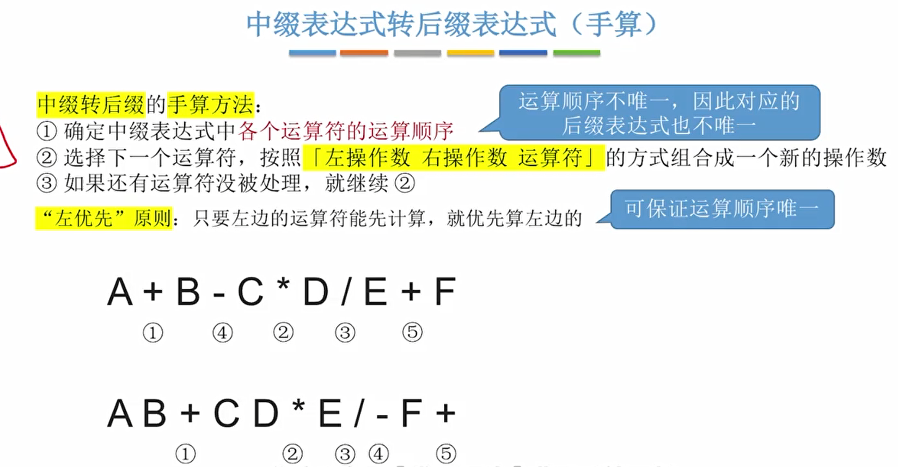
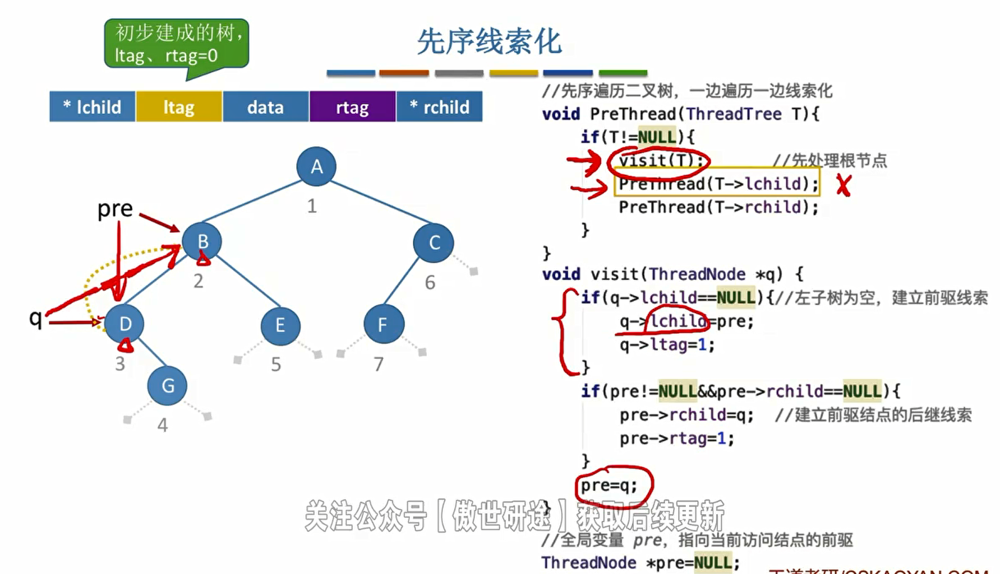
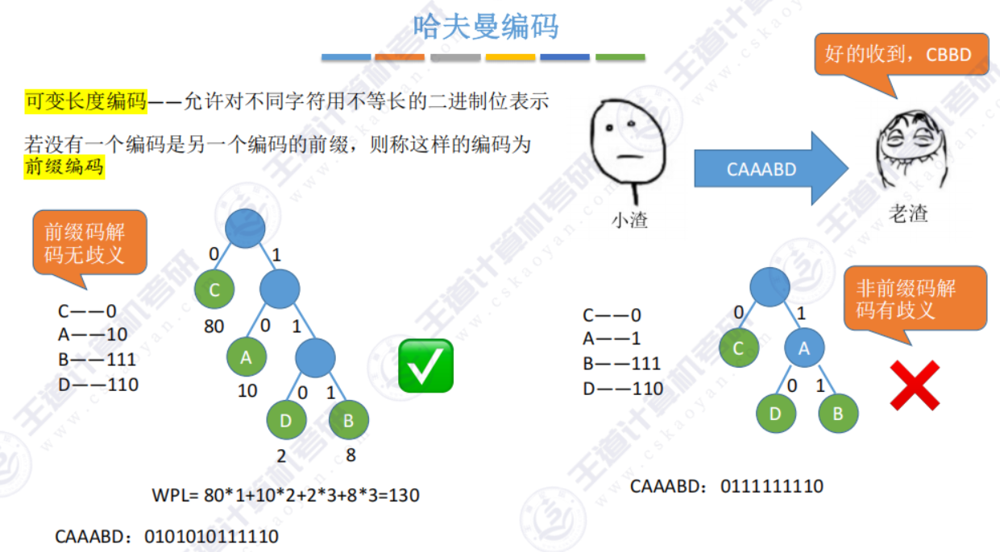
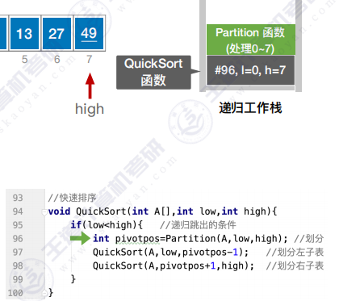
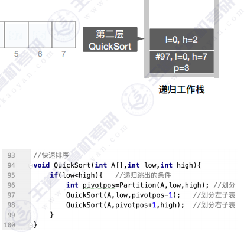
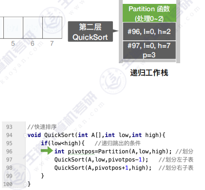
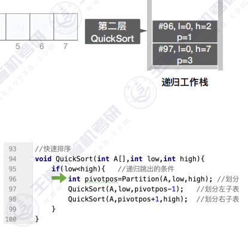
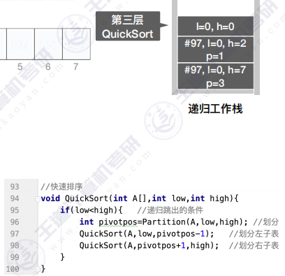
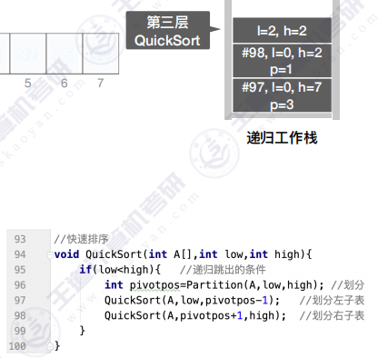

<style>
.blue-highlight {
  background: #DFEEFD; /* 浅蓝色背景 */
  padding: 10px; /* 内边距 */
  border-radius: 5px; /* 圆角 */
  
}
</style>

<style>
.green-highlight {
  background: #EDF8DB; /* 浅绿色背景 */
  padding: 10px; /* 内边距 */
  border-radius: 5px; /* 圆角 */
  
}
</style>
<br>

<div class="blue-highlight">
给我一个完整的ASCII表
</div>
<br>

以下是一个完整的 **ASCII 表**，包含从 0 到 127 的所有字符。ASCII（American Standard Code for Information Interchange）是一个 7 位编码标准，共有 128 个字符，包括控制字符、可打印字符等。为了便于阅读，我将按十进制（Dec）、十六进制（Hex）、字符（Char）以及描述（Description）列出。

### ASCII 表（0-127）
| Dec | Hex | Char | Description             |
|-----|-----|------|-------------------------|
| 0   | 00  | NUL  | Null 字符              |
| 1   | 01  | SOH  | Start of Heading       |
| 2   | 02  | STX  | Start of Text          |
| 3   | 03  | ETX  | End of Text            |
| 4   | 04  | EOT  | End of Transmission    |
| 5   | 05  | ENQ  | Enquiry                |
| 6   | 06  | ACK  | Acknowledge            |
| 7   | 07  | BEL  | Bell (响铃)            |
| 8   | 08  | BS   | Backspace (退格)       |
| 9   | 09  | TAB  | Horizontal Tab (制表符)|
| 10  | 0A  | LF   | Line Feed (换行)       |
| 11  | 0B  | VT   | Vertical Tab           |
| 12  | 0C  | FF   | Form Feed (换页)       |
| 13  | 0D  | CR   | Carriage Return (回车) |
| 14  | 0E  | SO   | Shift Out              |
| 15  | 0F  | SI   | Shift In               |
| 16  | 10  | DLE  | Data Link Escape       |
| 17  | 11  | DC1  | Device Control 1 (XON) |
| 18  | 12  | DC2  | Device Control 2       |
| 19  | 13  | DC3  | Device Control 3 (XOFF)|
| 20  | 14  | DC4  | Device Control 4       |
| 21  | 15  | NAK  | Negative Acknowledge   |
| 22  | 16  | SYN  | Synchronous Idle       |
| 23  | 17  | ETB  | End of Trans Block     |
| 24  | 18  | CAN  | Cancel                 |
| 25  | 19  | EM   | End of Medium          |
| 26  | 1A  | SUB  | Substitute             |
| 27  | 1B  | ESC  | Escape                 |
| 28  | 1C  | FS   | File Separator         |
| 29  | 1D  | GS   | Group Separator        |
| 30  | 1E  | RS   | Record Separator       |
| 31  | 1F  | US   | Unit Separator         |
| 32  | 20  |      | Space (空格)           |
| 33  | 21  | !    | Exclamation Mark       |
| 34  | 22  | "    | Quotation Mark         |
| 35  | 23  | #    | Number Sign            |
| 36  | 24  | $    | Dollar Sign            |
| 37  | 25  | %    | Percent Sign           |
| 38  | 26  | &    | Ampersand              |
| 39  | 27  | '    | Single Quote           |
| 40  | 28  | (    | Left Parenthesis       |
| 41  | 29  | )    | Right Parenthesis      |
| 42  | 2A  | *    | Asterisk               |
| 43  | 2B  | +    | Plus Sign              |
| 44  | 2C  | ,    | Comma                  |
| 45  | 2D  | -    | Hyphen/Minus           |
| 46  | 2E  | .    | Period/Dot             |
| 47  | 2F  | /    | Slash                  |
| 48  | 30  | 0    | Digit 0                |
| 49  | 31  | 1    | Digit 1                |
| 50  | 32  | 2    | Digit 2                |
| 51  | 33  | 3    | Digit 3                |
| 52  | 34  | 4    | Digit 4                |
| 53  | 35  | 5    | Digit 5                |
| 54  | 36  | 6    | Digit 6                |
| 55  | 37  | 7    | Digit 7                |
| 56  | 38  | 8    | Digit 8                |
| 57  | 39  | 9    | Digit 9                |
| 58  | 3A  | :    | Colon                  |
| 59  | 3B  | ;    | Semicolon              |
| 60  | 3C  | <    | Less Than              |
| 61  | 3D  | =    | Equals Sign            |
| 62  | 3E  | >    | Greater Than           |
| 63  | 3F  | ?    | Question Mark          |
| 64  | 40  | @    | At Sign                |
| 65  | 41  | A    | Uppercase A            |
| 66  | 42  | B    | Uppercase B            |
| 67  | 43  | C    | Uppercase C            |
| 68  | 44  | D    | Uppercase D            |
| 69  | 45  | E    | Uppercase E            |
| 70  | 46  | F    | Uppercase F            |
| 71  | 47  | G    | Uppercase G            |
| 72  | 48  | H    | Uppercase H            |
| 73  | 49  | I    | Uppercase I            |
| 74  | 4A  | J    | Uppercase J            |
| 75  | 4B  | K    | Uppercase K            |
| 76  | 4C  | L    | Uppercase L            |
| 77  | 4D  | M    | Uppercase M            |
| 78  | 4E  | N    | Uppercase N            |
| 79  | 4F  | O    | Uppercase O            |
| 80  | 50  | P    | Uppercase P            |
| 81  | 51  | Q    | Uppercase Q            |
| 82  | 52  | R    | Uppercase R            |
| 83  | 53  | S    | Uppercase S            |
| 84  | 54  | T    | Uppercase T            |
| 85  | 55  | U    | Uppercase U            |
| 86  | 56  | V    | Uppercase V            |
| 87  | 57  | W    | Uppercase W            |
| 88  | 58  | X    | Uppercase X            |
| 89  | 59  | Y    | Uppercase Y            |
| 90  | 5A  | Z    | Uppercase Z            |
| 91  | 5B  | [    | Left Square Bracket    |
| 92  | 5C  | \    | Backslash              |
| 93  | 5D  | ]    | Right Square Bracket   |
| 94  | 5E  | ^    | Caret                  |
| 95  | 5F  | _    | Underscore             |
| 96  | 60  | `    | Grave Accent           |
| 97  | 61  | a    | Lowercase a            |
| 98  | 62  | b    | Lowercase b            |
| 99  | 63  | c    | Lowercase c            |
| 100 | 64  | d    | Lowercase d            |
| 101 | 65  | e    | Lowercase e            |
| 102 | 66  | f    | Lowercase f            |
| 103 | 67  | g    | Lowercase g            |
| 104 | 68  | h    | Lowercase h            |
| 105 | 69  | i    | Lowercase i            |
| 106 | 6A  | j    | Lowercase j            |
| 107 | 6B  | k    | Lowercase k            |
| 108 | 6C  | l    | Lowercase l            |
| 109 | 6D  | m    | Lowercase m            |
| 110 | 6E  | n    | Lowercase n            |
| 111 | 6F  | o    | Lowercase o            |
| 112 | 70  | p    | Lowercase p            |
| 113 | 71  | q    | Lowercase q            |
| 114 | 72  | r    | Lowercase r            |
| 115 | 73  | s    | Lowercase s            |
| 116 | 74  | t    | Lowercase t            |
| 117 | 75  | u    | Lowercase u            |
| 118 | 76  | v    | Lowercase v            |
| 119 | 77  | w    | Lowercase w            |
| 120 | 78  | x    | Lowercase x            |
| 121 | 79  | y    | Lowercase y            |
| 122 | 7A  | z    | Lowercase z            |
| 123 | 7B  | {    | Left Curly Brace       |
| 124 | 7C  | |    | Vertical Bar           |
| 125 | 7D  | }    | Right Curly Brace      |
| 126 | 7E  | ~    | Tilde                  |
| 127 | 7F  | DEL  | Delete                 |

### 说明
1. **控制字符（0-31 和 127）**：
   - 这些字符不可打印，用于控制设备或数据流。例如，`LF`（10）是换行，`CR`（13）是回车。
2. **可打印字符（32-126）**：
   - 包括空格、标点符号、数字、大小写字母和一些特殊符号。
3. **扩展 ASCII**：
   - 标准 ASCII 只定义了 0-127。如果需要 128-255 的扩展 ASCII 表（例如包含拉丁字符或图形符号），请告诉我，我可以另外提供。

### 使用建议
- 你可以将这个表保存为文本文件，或在编程时参考。例如，在 C++ 中可以用 `\x41` 表示字符 `A`（十六进制 41）。
- 如果需要特定格式（例如 CSV 或 JSON），我也可以调整输出。

需要更多帮助或扩展内容吗？告诉我吧！
<br>

<div class="blue-highlight">
l=NULL;可以说l指向NULL吗,还是说l为空指针?
</div>
<br>

在C/C++中，`l = NULL;` 表示将指针 `l` 设置为空指针。因此，可以说 `l` 是一个空指针，或者 `l` 指向 `NULL`。

具体来说：
- **`l` 是空指针**：表示 `l` 不指向任何有效的内存地址。
- **`l` 指向 `NULL`**：`NULL` 是一个特殊的宏，通常定义为 `0` 或 `(void*)0`，表示空指针值。

这两种说法都是正确的，但更常见的表达是“`l` 是空指针”或“`l` 被设置为 `NULL`”。
<br>

<div class="green-highlight">
循环边界条件的确定
</div>
<br>

这是打印带头结点的函数代码
```cpp
void print_list(LinkList l)
{
    l = l->next;
    while (l!=NULL)
    {
        printf("%3d",l->data);
        l = l->next;
    }
    printf("\n");
}
```
<br>

其中l作为工作指针,初始化指向链表的头结点,当l不为空结点时,输出对应的数据域的值.当l指向NULL时,退出循环.
<br>

这是求不带头结点的链表的长度的代码
```cpp
int n = 1;//n用来保存链表的长度
LNode *p = L;//p为工作指针
while(p->next!=NULL){
    p = p->next;
    n++;
}
```
<div class="green-highlight">
注意工作指针p初始化指向l的第一个结点,并且计数变量n初始化为1,这意味着,当p指向某个结点时,这个结点就被数进去了.要求链表的长度,就让工作指针p遍历到链表的尾结点
.当工作结点p指向尾结点,那么这个结点就被数进去了.接下来就得退出循环.尾结点的特点是,它的下一个结点是NULL,因此,进入循环的条件语句是p->next!=NULL;
退出循环的条件是p->next==NULL;
</div>
<br>

这是另外一种求不带头结点的链表的长度的代码
```cpp
int n = 0;//n用来保存链表的长度
LNode *p = L;//p为工作指针
while(p!=NULL){
    p = p->next;
    n++;
}
```
<br>

<div class="green-highlight">
注意到和上面那个代码的区别,此代码的工作变量p同样指向第一个结点,但是计数变量n初始化为0.经历一次循环后,工作变量p指向第二个结点,计数变量n变为1.就是说,当工作变量指向一个结点的时候,这个结点没有被数进去,这个变量左边的变量被数进去了
.因此,要求链表的长度,就得让工作变量指向NULL,这时,NULL左边的那些结点就全部被数进去了.当工作指针指向NULL的时候,就退出循环.当工作指针p不是指向NULL的时候
,就进入循环.条件语句是p!=NULL;
</div>
<br>

<div class="blue-highlight">
malloc分配的内存会自动回收吗?
</div>
<br>

**不会**。在 C 语言中，使用 `malloc` 分配的内存**不会自动回收**，需要程序员手动管理。以下是详细说明：

---

### 1. `malloc` 的作用
`malloc` 用于在堆（heap）上动态分配一块指定大小的内存。例如：
```c
int* ptr = (int*)malloc(10 * sizeof(int)); // 分配 10 个整数的内存
```

- 分配的内存是未初始化的，内容是随机的。
- 如果分配成功，返回指向内存起始地址的指针；如果失败，返回 `NULL`。

---

### 2. 内存不会自动回收
- **堆内存**：`malloc` 分配的内存位于堆区，堆内存的生命周期由程序员显式控制。
- **不会自动释放**：如果没有显式释放，分配的内存会一直保留，直到程序结束。

---

### 3. 需要手动释放
使用 `free` 函数释放 `malloc` 分配的内存：
```c
free(ptr); // 释放内存
ptr = NULL; // 将指针置为 NULL，避免悬空指针
```

- **释放后**：内存被归还给系统，但指针仍然指向原来的地址（悬空指针），因此需要将指针置为 `NULL`。

---

### 4. 未释放的后果
如果忘记释放 `malloc` 分配的内存，会导致 **内存泄漏**：
- 程序运行时间越长，泄漏的内存越多，最终可能导致系统内存耗尽。
- 内存泄漏是 C/C++ 程序中常见的 bug。

---

### 5. 示例代码
以下是一个完整的示例，展示 `malloc` 和 `free` 的使用：
```c
#include <stdio.h>
#include <stdlib.h>

int main() {
    // 分配内存
    int* ptr = (int*)malloc(10 * sizeof(int));
    if (ptr == NULL) {
        printf("内存分配失败\n");
        return 1;
    }

    // 使用内存
    for (int i = 0; i < 10; i++) {
        ptr[i] = i + 1;
    }

    // 打印内存内容
    for (int i = 0; i < 10; i++) {
        printf("%d ", ptr[i]);
    }
    printf("\n");

    // 释放内存
    free(ptr);
    ptr = NULL;

    return 0;
}
```

---

### 6. 注意事项
1. **避免重复释放**：对已经释放的内存再次调用 `free` 会导致未定义行为。
2. **避免悬空指针**：释放内存后，将指针置为 `NULL`。
3. **检查返回值**：`malloc` 可能返回 `NULL`，需检查分配是否成功。
4. **内存泄漏检测工具**：可以使用工具（如 Valgrind）检测内存泄漏。

---

### 总结
`malloc` 分配的内存**不会自动回收**，必须通过 `free` 手动释放。忘记释放会导致内存泄漏，因此动态内存管理是 C 语言编程中的重要部分。
<br>

<div class="blue-highlight">
内存泄漏是什么意思?
</div>
**内存泄漏（Memory Leak）** 是指程序在运行过程中动态分配了内存（例如使用 `malloc`、`calloc`、`new` 等），但在使用完毕后**没有正确释放**，导致这部分内存无法被系统回收，从而造成内存资源的浪费。

---

### 1. 内存泄漏的原因
内存泄漏通常是由于以下原因导致的：
1. **忘记释放内存**：
   - 使用 `malloc` 或 `new` 分配内存后，没有调用 `free` 或 `delete` 释放。
   - 例如：
     ```c
     int* ptr = (int*)malloc(10 * sizeof(int));
     // 使用 ptr
     // 忘记调用 free(ptr)
     ```

2. **丢失指针**：
   - 指向动态分配内存的指针被意外修改或覆盖，导致无法访问该内存，也无法释放。
   - 例如：
     ```c
     int* ptr = (int*)malloc(10 * sizeof(int));
     ptr = NULL; // 丢失了对分配内存的引用
     ```

3. **未释放所有路径**：
   - 在复杂的逻辑中，某些代码路径可能没有正确释放内存。
   - 例如：
     ```c
     int* ptr = (int*)malloc(10 * sizeof(int));
     if (condition) {
         return; // 提前返回，未释放内存
     }
     free(ptr);
     ```

---

### 2. 内存泄漏的影响
- **内存资源浪费**：泄漏的内存无法被系统回收，导致可用内存逐渐减少。
- **程序性能下降**：内存泄漏会导致程序占用的内存越来越多，最终可能导致系统内存耗尽。
- **程序崩溃**：在内存耗尽的情况下，程序可能无法继续运行，甚至导致系统不稳定。

---

### 3. 内存泄漏的示例

#### 示例 1：忘记释放内存
```c
#include <stdlib.h>

void leak_example() {
    int* ptr = (int*)malloc(10 * sizeof(int));
    // 使用 ptr
    // 忘记调用 free(ptr)
}
```
- 每次调用 `leak_example` 都会泄漏 40 字节（假设 `int` 为 4 字节）。

#### 示例 2：丢失指针
```c
#include <stdlib.h>

void lost_pointer_example() {
    int* ptr = (int*)malloc(10 * sizeof(int));
    ptr = NULL; // 丢失了对分配内存的引用
}
```
- 分配的内存无法再被访问或释放。

#### 示例 3：未释放所有路径
```c
#include <stdlib.h>

void conditional_leak_example(int condition) {
    int* ptr = (int*)malloc(10 * sizeof(int));
    if (condition) {
        return; // 提前返回，未释放内存
    }
    free(ptr);
}
```
- 当 `condition` 为真时，内存泄漏。

---

### 4. 如何检测内存泄漏
1. **手动检查代码**：
   - 确保每次分配内存后都有对应的释放操作。
   - 使用工具（如 `Valgrind`）静态分析代码。

2. **使用工具检测**：
   - **Valgrind**（Linux）：
     ```bash
     valgrind --leak-check=full ./your_program
     ```
   - **AddressSanitizer**（GCC/Clang）：
     ```bash
     gcc -fsanitize=address -o your_program your_program.c
     ./your_program
     ```

3. **编程规范**：
   - 使用智能指针（C++）或 RAII（资源获取即初始化）技术，避免手动管理内存。

---

### 5. 如何避免内存泄漏
1. **配对使用分配和释放函数**：
   - 每次使用 `malloc` 后，确保调用 `free`。
   - 每次使用 `new` 后，确保调用 `delete`。

2. **使用智能指针（C++）**：
   - 使用 `std::unique_ptr` 或 `std::shared_ptr` 自动管理内存。

3. **编写清晰的代码**：
   - 在复杂的逻辑中，确保所有路径都能正确释放内存。

4. **测试和检查**：
   - 使用工具检测内存泄漏，并在开发过程中进行测试。

---

### 6. 总结
- **内存泄漏**是指动态分配的内存未被释放，导致内存资源浪费。
- 内存泄漏的原因包括忘记释放内存、丢失指针、未释放所有路径等。
- 内存泄漏会导致程序性能下降，甚至崩溃。
- 通过工具检测和良好的编程习惯，可以有效避免内存泄漏。
<br>

<div class="blue-highlight">
队列元素个数为(rear+maxsize-front)%9,怎么得到的?
</div>
队列中元素个数的计算公式 **`(rear + maxsize - front) % maxsize`** 是通过队列的循环特性推导出来的。下面详细解释这个公式的来源和推导过程。

---

### 1. 队列的基本概念
- **队列**是一种先进先出（FIFO）的数据结构。
- 队列有两个指针：
  - `front`：指向队头元素（即将被删除的元素）。
  - `rear`：指向队尾元素的下一个位置（即将插入元素的位置）。
- 队列的存储空间是有限的，通常用数组实现，并采用循环队列的方式避免空间浪费。

---

### 2. 循环队列的特性
- 循环队列中，当 `rear` 或 `front` 到达数组末尾时，会绕回到数组开头。
- 队列的长度为 `maxsize`，即数组的总大小。

---

### 3. 元素个数的推导
我们需要计算队列中元素的个数，即从 `front` 到 `rear` 之间的元素数量。

#### 情况 1：`rear >= front`
- 当 `rear` 在 `front` 之后时，队列中的元素个数为：
  \[
  \text{元素个数} = \text{rear} - \text{front}
  \]
  例如：
  ```
  front = 2, rear = 5
  元素个数 = 5 - 2 = 3
  ```

#### 情况 2：`rear < front`
- 当 `rear` 绕回到数组开头时，队列中的元素个数分为两部分：
  1. 从 `front` 到数组末尾的元素个数：`maxsize - front`
  2. 从数组开头到 `rear` 的元素个数：`rear`
- 因此，总元素个数为：
  \[
  \text{元素个数} = (\text{maxsize} - \text{front}) + \text{rear}
  \]
  例如：
  ```
  front = 5, rear = 2, maxsize = 8
  元素个数 = (8 - 5) + 2 = 5
  ```

#### 统一公式
为了统一以上两种情况，可以使用取模运算：
\[
\text{元素个数} = (\text{rear} + \text{maxsize} - \text{front}) \% \text{maxsize}
\]

- **解释**：
  - `rear + maxsize - front`：确保即使 `rear < front`，计算结果也是正确的。
  - `% maxsize`：将结果限制在 `0` 到 `maxsize-1` 之间。

---

### 4. 示例验证

#### 示例 1：`rear >= front`
- `front = 2`, `rear = 5`, `maxsize = 8`
- 计算：
  \[
  (5 + 8 - 2) \% 8 = 11 \% 8 = 3
  \]
- 结果正确。

#### 示例 2：`rear < front`
- `front = 5`, `rear = 2`, `maxsize = 8`
- 计算：
  \[
  (2 + 8 - 5) \% 8 = 5 \% 8 = 5
  \]
- 结果正确。

---

### 5. 总结
队列中元素个数的公式 **`(rear + maxsize - front) % maxsize`** 是通过以下步骤推导出来的：
1. 分别考虑 `rear >= front` 和 `rear < front` 两种情况。
2. 使用取模运算统一两种情况。
3. 确保公式在循环队列中始终有效。

这个公式是循环队列的核心特性之一，能够高效地计算队列中的元素个数。
<br>

<div class="blue-highlight">
c++里面赋值的英语怎么说,相等的英语怎么说?
</div>
<br>

在英语中，符号 `[]` 通常称为 **square brackets** 或 **brackets**。

- **Square brackets** 是更常见的称呼。
- **Brackets** 是一个更通用的术语，但在英式英语中通常指 `[]`，而在美式英语中可能也指 `()`（圆括号）。

例如：
- `int array[10];` 可以读作 "int array square brackets ten"。
- 在文档中，你可能会看到 "Use square brackets to denote an array"（使用方括号表示数组）。
<br>

<div class="green-highlight">
因此,我用as作为=的代码片段触发词

用e作为==的代码片段触发词
</div>
<br>

<div class="blue-highlight">
英语里面这个符号怎么说[]?
</div>
<br>

在英语中，符号 `[]` 通常称为 **square brackets** 或 **brackets**。

- **Square brackets** 是更常见的称呼。
- **Brackets** 是一个更通用的术语，但在英式英语中通常指 `[]`，而在美式英语中可能也指 `()`（圆括号）。

例如：
- `int array[10];` 可以读作 "int array square brackets ten"。
- 在文档中，你可能会看到 "Use square brackets to denote an array"（使用方括号表示数组）。
<br>

<div class="green-highlight">
因此我用br作为[]的代码片段触发词
</div>
<br>


```cpp
p = q.rear;
free(p);
```
<br>


<div class="blue-highlight">
此时q.rear是空指针吗?
</div>
<br>


# 问题
`p = q.rear;`
`free(p);`
此时 `q.rear` 是空指针吗？

# 回答
在分析这个问题时，我们需要考虑代码的上下文以及 `p` 和 `q.rear` 的定义。假设这是一个与队列（queue）相关的操作，且代码是用 C 语言或类似语言编写的，`q.rear` 是指向队列尾部的指针，而 `p` 是一个辅助指针变量。我们逐步分析：

### 代码解释
1. **`p = q.rear;`**
   - 将 `q.rear` 的值（即队列尾部的指针）赋值给 `p`。
   - 此时，`p` 和 `q.rear` 指向同一个内存地址。

2. **`free(p);`**
   - 调用 `free(p)` 释放 `p` 所指向的内存。
   - 因为 `p` 和 `q.rear` 指向同一个地址，这意味着 `q.rear` 原来指向的内存已经被释放。
   - 但是，`free(p)` 只释放内存，并不会自动将 `p` 或 `q.rear` 设置为 `NULL`（空指针）。在 C 语言中，`free` 后的指针会变成“悬空指针”（dangling pointer），其值不变，但指向的内存不再有效。

3. **`q.rear` 是空指针吗？**
   - 在执行 `free(p)` 后，`q.rear` 的值并没有被显式修改。
   - 因此，`q.rear` 仍然保留它原来的值（即之前分配的内存地址），而不是 `NULL`。
   - 除非在代码中显式地将 `q.rear` 设置为 `NULL`（比如 `q.rear = NULL;`），否则 `q.rear` 不会自动变成空指针。

### 结论
在执行：
```cpp
p = q.rear;
free(p);
```

之后，`q.rear` **不是空指针**，而是一个悬空指针，仍然指向已被释放的内存地址。要让 `q.rear` 成为空指针，需要手动添加：
q.rear = NULL;

### 注意事项
- 如果队列的实现中 `q.rear` 应该始终指向有效节点，那么释放内存后不将 `q.rear` 置为 `NULL` 可能会导致后续操作（如访问或解引用 `q.rear`）出现未定义行为（undefined behavior）。
- 在实际编程中，为了避免悬空指针问题，通常建议在 `free` 后将相关指针置为 `NULL`。

如果你有更多上下文（比如完整的队列实现代码），可以提供给我，我会进一步优化答案！
你现在可以直接复制上面的全部内容，粘贴到支持 Markdown 的编辑器中，应该能正确显示问题和回答的格式，包括标题、代码块和加粗部分。如果还有问题，请告诉我！

<br>

<div class="blue-highlight">
c++程序中有一个函数,开头是void,函数内有一句
if (p==NULL)
return ;
这个return是什么意思?
</div>
<br>

在 C++ 中，你描述的这个函数是一个返回类型为 `void` 的函数，而函数体内有这样的代码：

```cpp
void someFunction(Type* p) {
    if (p == NULL)
        return;
    // 其他代码
}
```

让我解释一下这里的 `return;` 语句的含义：

1. **基本作用**：

<div class="green-highlight">

   - 在 `void` 函数中，`return;` 是一个空返回语句
   - 它的作用是立即终止函数的执行并返回到调用函数的地方
   - 因为函数返回类型是 `void`（即不需要返回值），所以 `return` 后面不需要跟任何表达式

</div>
   

2. **在这个上下文中的含义**：
   - `if (p == NULL)` 检查指针 `p` 是否为空（NULL）
   - 如果 `p` 是 NULL，`return;` 会立刻结束函数的执行
   - 这是一种常见的防御性编程模式，用来避免后续代码对空指针的非法操作

3. **实际效果**：
   - 如果条件满足（p 是 NULL），函数直接退出，后面的代码不会执行
   - 如果条件不满足（p 不是 NULL），函数会继续执行后面的代码

举个完整例子：

```cpp
void printValue(int* p) {
    if (p == NULL)
        return;  // 如果指针为空，直接退出函数
    printf("Value: %d\n", *p);  // 只有当 p 不为空时才会执行
}

int main() {
    int a = 5;
    printValue(&a);    // 输出: Value: 5
    printValue(NULL);  // 什么也不输出，函数直接返回
    return 0;
}
```

总结：这里的 `return;` 是一种流程控制手段，用于在特定条件下（比如指针无效时）提前退出函数，避免后续可能导致错误的代码执行。
<br>

<div class="blue-highlight">
为什么标识符不能以数字开头?
</div>
<br>


标识符不能以数字开头是编程语言设计中的一个普遍规则，这主要基于以下几个原因：

1. **语法解析的明确性**：如果允许数字开头，编译器或解释器很难区分数字字面量和标识符。例如，在表达式 `3x + 2` 中，如果允许标识符以数字开头，编译器就无法确定 `3x` 是乘法表达式 `3 * x` 还是一个名为 `3x` 的变量。

2. **避免歧义**：数字常量（如 123）和以数字开头的标识符（如 123abc）在语法上会造成歧义。编译器需要额外的上下文分析来区分它们，这会增加编译器设计的复杂性。

3. **历史原因**：早期编程语言（如FORTRAN、C语言等）建立了这一规则，后来的编程语言为了保持兼容性和程序员的习惯，通常也采用了相同的约定。

4. **国际标准兼容**：许多编程语言遵循Unicode标准中对标识符的规定，其中规定标识符的第一个字符不能是数字。

5. **减少错误**：这种限制有助于减少代码中的拼写错误和混淆。例如，变量名 `1` 和数字 `1` 在视觉上几乎无法区分。

大多数编程语言的标识符规则通常包括：
- 第一个字符必须是字母（a-z, A-Z）或下划线（_）
- 后续字符可以是字母、数字或下划线
- 不能使用语言的保留关键字作为标识符

这些规则有助于保持代码的可读性和编译器的简单性，同时减少可能的语法歧义。
<br>

<div class="blue-highlight">
对于"**语法解析的明确性**：如果允许数字开头，编译器或解释器很难区分数字字面量和标识符。例如，在表达式 `3x + 2` 中，如果允许标识符以数字开头，编译器就无法确定 `3x` 是乘法表达式 `3 * x` 还是一个名为 `3x` 的变量。".c++语法不允许用3x表示3和相乘吧,得加上*
</div>
<br>

您说得非常正确！在C++中，确实不能用 `3x` 表示 `3 * x`，必须明确写成 `3 * x`。我在解释时使用了不恰当的例子。

更准确的说法应该是：如果允许标识符以数字开头，会导致词法分析阶段的复杂性增加。比如对于 `3x`，词法分析器需要决定是将其解析为一个整体的标识符，还是解析为数字 `3` 和标识符 `x`。

一个更好的例子是：假设我们有数字 `123` 和允许以数字开头的标识符 `123abc`，当解析器遇到字符序列 `123abc` 时，它需要向前查看更多字符才能确定这是一个标识符，而不是数字 `123` 后跟标识符 `abc`。这增加了解析的复杂性。

感谢您指出这个问题！这确实是我表述不准确的地方。
<br>

<div class="blue-highlight">
对于"而不是数字 `123` 后跟标识符 `abc`。这增加了解析的复杂性。"数字后跟标识符有什么例子吗?
</div>
<br>

您提出了一个很好的问题。当我提到"数字后跟标识符"时，实际上在大多数编程语言中，数字和标识符之间直接相邻是不合法的语法。我举的例子不够准确。

让我来给出一些真实的情况：

1. 在许多编程语言中，如果有表达式 `123abc`，这整个表达式既不能被解释为一个数字，也不能被解释为一个标识符（假设标识符不能以数字开头）。这会导致语法错误。

2. 合法的数字后跟标识符的例子通常需要有某种分隔符或运算符，例如：
   - `123 * abc`（乘法）
   - `123.abc`（在某些语言中是对象访问，如 `123.toString()`）
   - `123[abc]`（数组索引）
   - `123(abc)`（函数调用，虽然直接对数字调用函数在大多数语言中不常见）

3. 允许数字开头的标识符会导致的实际问题：
   - 假设语言允许以数字开头的标识符，那么 `123abc` 可能是一个标识符，也可能是 `123` 和 `abc` 的某种隐式组合（如果语言支持这种隐式组合），造成歧义
   - 在科学计算语言（如MATLAB）中，表达式如 `2x` 可能被解释为 `2*x`，这为语法分析带来额外复杂性

我之前的表述不准确，因为在大多数主流编程语言中，数字和标识符紧密相邻（没有空格或运算符）是不合法的语法，解析器通常会直接报错，而不是尝试将其解释为"数字后跟标识符"。

谢谢您的提问，这帮助我更准确地澄清了这个概念。
<br>

<div class="green-highlight">
上溢是指存储器满,还往里写

下溢是指存储器空,还往外读
</div>
<br>

<div class="blue-highlight">
顺序访问是什么?
</div>
<br>

“顺序访问”是指按照一定的顺序逐一访问数据或元素的方式，通常用于计算机科学和编程领域。它与“随机访问”相对，指的是按照数据存储的物理或逻辑顺序（比如从头到尾）依次读取或处理每个元素，而不是跳跃式地直接访问某个特定位置。

### 举例说明：
1. **数组的顺序访问**：假设有一个数组 `[1, 2, 3, 4, 5]`，顺序访问就是从索引 0 开始，依次访问 1、2、3、4、5。
2. **文件读取**：在读取文件时，从文件开头逐行读取到结尾，就是顺序访问。
3. **链表结构**：在单链表中，只能通过从头节点开始顺着指针逐个访问后续节点。

### 特点：
- **优点**：简单直观，适合需要按序处理所有数据的场景，比如遍历或搜索。
- **缺点**：效率较低，如果只需要访问特定位置的数据，顺序访问可能需要更多时间（不像随机访问可以直接定位）。

在中文语境中，“顺序访问”常用于描述数据结构、文件操作或数据库查询等场景。你有具体的上下文想让我进一步解释吗？
<br>

<div class="blue-highlight">
C++中的界限符是分隔符吗?
</div>
<br>

是的，C++中的界限符(delimiter)可以被理解为分隔符。界限符是用于分隔语法元素的符号或字符序列。

在C++中，常见的界限符包括：

- 括号：`()`、`{}`、`[]`，用于分隔代码块、参数列表、数组索引等
- 分号`;`，用于分隔语句
- 逗号`,`，用于分隔函数参数、初始化列表元素等
- 空格，用于分隔标识符和关键字
- 引号`""`和`''`，用于分隔字符串和字符常量

这些符号在C++代码中起到了分隔不同语法元素的作用，因此可以被称为分隔符。
<br>

<div class="blue-highlight">
C语言中数组声明时的[]仅仅是一个分隔符,访问各个元素时使用的[]则是运算符,这两种不一样.这句话对吗?
</div>
这个说法不完全准确。

在C语言中，数组声明时的`[]`和访问元素时的`[]`确实有不同的语法角色，但称声明时的`[]`为"仅仅是一个分隔符"并不精确：

1. **数组声明时的`[]`**：这是类型标识符的一部分，用于指明变量是数组类型并声明其维度。例如在`int arr[10];`中，`[10]`与`int`一起定义了变量`arr`的类型（一个包含10个整数的数组）。它是类型声明语法的组成部分，不只是分隔符。

2. **数组访问时的`[]`**：这确实是一个运算符，称为下标运算符(subscript operator)。它用于从数组中选择特定的元素。

正确的说法应该是：在C语言中，数组声明时的`[]`是类型说明符的组成部分，而访问元素时的`[]`是下标运算符。它们在语法和语义上有不同的作用。
<br>
<div class="blue-highlight">

`[]`可以是类型说明符的组成部分，也可以是访问元素时的下标运算符.那C语言还有类似的情况,同一个字符有不同的作用吗
</div>

<br>

是的，C语言中确实有多个符号在不同上下文中具有不同作用，这是语言设计中常见的语法复用。以下是一些显著的例子：

1. **星号 `*`**
   - 作为类型修饰符表示指针：`int *ptr;`
   - 作为解引用运算符：`value = *ptr;`
   - 作为乘法运算符：`result = a * b;`

2. **和号 `&`**
   - 作为类型修饰符表示引用（在C++中）：`int &ref = var;`
   - 作为取地址运算符：`ptr = &var;`
   - 作为按位与运算符：`result = a & b;`

3. **括号 `()`**
   - 在函数声明中：`void func(int param);`
   - 在函数调用中：`result = func(5);`
   - 在表达式中改变优先级：`result = (a + b) * c;`
   - 在类型转换中：`result = (float)integer;`

4. **花括号 `{}`**
   - 定义代码块：`if(condition) { statements; }`
   - 初始化聚合类型：`int array[] = {1, 2, 3};`
   - 复合字面量（C99）：`(struct Point){.x = 1, .y = 2}`

5. **逗号 `,`**
   - 分隔声明中的变量：`int a, b, c;`
   - 分隔函数参数：`func(a, b, c);`
   - 作为逗号运算符：`for(i=0, j=10; i<j; i++, j--)`


这种符号复用提高了语言的表达能力，同时保持了语法的相对简洁，但也需要根据上下文正确理解每个符号的具体含义。
<br>

<div class="blue-highlight">
C语言运算符的结合性是什么意思?
</div>
<br>

在C语言中，运算符的结合性（associativity）是指当多个具有相同优先级的运算符出现在一个表达式中时，这些运算符的计算顺序。结合性决定了表达式是从左到右计算还是从右到左计算。

结合性主要分为三种：
1. 左结合（left-to-right）：从左到右计算，如加法(+)、减法(-)
2. 右结合（right-to-left）：从右到左计算，如赋值运算符(=)、一元运算符
3. 无结合性：某些运算符不能连续出现，如条件运算符(?:\)

例如：
- `a + b + c` 由于"+"是左结合的，因此等价于`(a + b) + c`
- `a = b = c` 由于"="是右结合的，因此等价于`a = (b = c)`
- `a * b / c` 由于"*"和"/"都是左结合的，且优先级相同，因此等价于`(a * b) / c`

理解运算符的结合性对于正确编写和理解复杂表达式非常重要，可以帮助你避免一些潜在的程序错误。
<br>

<div class="blue-highlight">
为什么我把这个回答复制到vscode的.md文件,预览的时候发现3. 无结合性：某些运算符不能连续出现，如条件运算符(?:)变成了3. 无结合性：某些运算符不能连续出现，如条件运算符(?加一个表情包
</div>
<br>

这是因为在Markdown中，冒号和右括号的组合 `:)` 会被解析为一个笑脸表情符号（emoji）。当你将文本粘贴到VSCode的Markdown预览中时，`:)` 被自动转换成了笑脸表情。

要解决这个问题，你可以使用以下几种方法：

1. 使用反斜杠转义冒号或右括号：`(?\:)` 或 `(?:\)`

2. 在冒号和右括号之间添加空格：`(?: )`

3. 将整个表达式用反引号包围，作为代码：`` `(?:)` ``

例如，你可以将原文修改为：
```
3. 无结合性：某些运算符不能连续出现，如条件运算符`(?:)`
```

这样在Markdown预览中就不会出现意外的表情符号了。
<br>

<div class="green-highlight">
王道的中缀表达式转后缀表达式里面的"左优先"原则和C语言程序设计-现代方法里面的左结合不一样
"左优先"原则是:只要左边的运算符能先计算,就优先算左边的
</div>
<br>


<br>

<div class="blue-highlight">

“三对角矩阵 \( a_{i,j} \) 是 \( i \) 行第 \( j-i+2 \) 个元素，这个表达式是怎么来的?”
</div>
<br>

<div class="green-highlight">

\( a_{i,i-1} \)  \( a_{i,i} \)  \( a_{i,i+1} \)
\( a_{i,j} \)可以是三个位置中任意一个,那么它的位序是j-(i-1)+1,也就是j-i+2
</div>
<br>

<div class="blue-highlight">
三对角矩阵的压缩存储
若已知数组下标k,如何得到i,j?
</div>
<br>


第k+1个元素,在第几行?第几列?
前i-1行共3(i-1)-1个元素
前i行共3i-1个元素
显然3(i-1)-1<k+1<=3i-1,可以得到

\( \frac{k+2}{3} \leq i < \frac{k+5}{3} \)

<br>
<div class="green-highlight">
注意,i的左右边界相差1,而且i是整数,因此
</div>

\( i = \lceil \frac{k+2}{3} \rceil \)

<br>

<div class="blue-highlight">
为什么kmp算法不取更的相等前后缀长度，而是取最大的相等前后缀长度，?
</div>
<br>

KMP算法选择最大相等前后缀长度的原因在于确保模式串移动时不会遗漏可能的匹配位置，同时提高匹配效率。

### 1. 避免遗漏匹配
- <span style="color: blue;">**最大相等前后缀长度**：选择最大相等前后缀长度，可以确保模式串移动时不会跳过任何可能的匹配位置。如果选择更小的长度，可能会导致模式串移动过多，从而错过有效的匹配。</span>


### 2. 提高效率
- **减少比较次数**：选择最大相等前后缀长度，可以最大限度地减少模式串的移动次数，从而减少字符比较的次数，提升匹配效率。

### 3. 算法正确性
- **保证正确性**：最大相等前后缀长度确保每次移动都是最优的，避免因移动不足或过多而导致的匹配错误。

### 示例
假设模式串为 `ABABC`，其部分匹配表如下：

| 位置 | 子串   | 最长相等前后缀长度 |
|------|--------|---------------------|
| 1    | A      | 0                   |
| 2    | AB     | 0                   |
| 3    | ABA    | 1                   |
| 4    | ABAB   | 2                   |
| 5    | ABABC  | 0                   |

在匹配过程中，选择最大相等前后缀长度可以确保模式串移动到正确的位置，避免遗漏匹配。

### 总结
KMP算法选择最大相等前后缀长度是为了保证匹配的准确性和效率，避免遗漏可能的匹配位置，同时减少不必要的比较。
<br>

<div class="green-highlight">
下面是一个例子
模式串为A B A B A C 匹配时C失配
<br>
前缀有 A  AB  ABA  ABAB  
<br>
后缀有 A  BA  ABA  BABA
移动位数 = 已匹配的字符数 - 最后一个字符对应的部分匹配值
部分匹配值为字符串的前缀和后缀的最长相等前后缀长度
最大的相等前后缀长度为3,因此移动位数为5 - 3 = 2 下一次匹配为
</div>
<br>

A B A B A C
&nbsp;&nbsp;&nbsp;&nbsp;&nbsp;&nbsp;&nbsp;A B A B A C
<div class="green-highlight">
如果不取最大的,而是取1,那么移动位数为5 - 1 = 4,下一次匹配为
</div>
<br>


A B A B A C
&nbsp;&nbsp;&nbsp;&nbsp;&nbsp;&nbsp;&nbsp;&nbsp;&nbsp;&nbsp;&nbsp;&nbsp;&nbsp;A B A B A C//任意遗漏匹配
<br>

<div class="blue-highlight">
C++calloc是什么函数?
</div>
<br>

在C++中，`calloc` 并不是一个严格意义上的C++特有函数，而是从C语言标准库中继承而来的动态内存分配函数。它定义在头文件 `<cstdlib>`（C++中）或 `<stdlib.h>`（C中）中。

### `calloc` 函数的定义
```cpp
void* calloc(size_t num, size_t size);
```

### 功能
`calloc` 用于在堆上分配内存，与 `malloc` 类似，但有以下关键区别：
1. **参数**：
   - `num`：需要分配的元素个数。
   - `size`：每个元素的大小（以字节为单位）。
   - 它分配的内存大小为 `num * size` 字节。
2. **初始化**：
   - 与 `malloc` 不同，`calloc` 会将分配的内存初始化为 0，而 `malloc` 分配的内存内容是未定义的（可能是垃圾值）。
3. **返回值**：
   - 成功时，返回指向分配内存的指针（类型为 `void*`），需要手动转换为所需的指针类型。
   - 失败时（例如内存不足），返回 `NULL`。

### 使用示例
以下是一个简单的例子：
```cpp
#include <iostream>
#include <cstdlib>

int main() {
    int* ptr = (int*)calloc(5, sizeof(int)); // 分配5个int的内存，并初始化为0

    if (ptr == NULL) {
        std::cout << "内存分配失败" << std::endl;
        return 1;
    }

    // 检查内存是否初始化为0
    for (int i = 0; i < 5; i++) {
        std::cout << ptr[i] << " "; // 输出: 0 0 0 0 0
    }
    std::cout << std::endl;

    // 释放内存
    free(ptr);
    return 0;
}
```

### 注意事项
1. **与 C++ 的关系**：
   - 在现代C++中，通常推荐使用 `new` 或智能指针（如 `std::unique_ptr`、`std::shared_ptr`）来管理内存，而不是直接使用 `calloc`，因为 `calloc` 是C风格的函数，不支持C++的对象构造。
2. **内存释放**：
   - 使用 `calloc` 分配的内存必须通过 `free()` 释放，不能用 `delete`。
3. **类型安全**：
   - 返回值是 `void*`，需要手动强制转换类型，而 `new` 在C++中是类型安全的。

### 与 `malloc` 的对比
- `malloc(size_t size)`：只分配指定字节数的内存，不初始化。
- `calloc(size_t num, size_t size)`：分配 `num * size` 字节内存，并初始化为 0。

总结来说，`calloc` 是一个用于动态分配并初始化为零的内存的函数，主要用于C风格编程，但在C++中更推荐使用现代化的内存管理方式。如果还有疑问，欢迎继续提问！

<br>
<div class="green-highlight">
二叉树层次建树实战代码C语言督学营14.4//可以通过调试检查树里的内容
</div>


```cpp
#include "function.h"
int main()
{
    BiElemType c;
    BiTree tree = NULL, pnew;//tree是树根
    ptag_t phead = NULL, ptail = NULL, pcur = NULL, listpnew = NULL;//phead是队列头,ptail是队列尾
    while (scanf("%c", &c))
    {
        if (c == '\n')
        {
            break;
        }
        pnew = (BiTree)calloc(1, sizeof(BiTNode));//申请空间并初始化,赋值为0,里面三个成员,
        //两个成员为指针会指向NULL
        pnew->c = c;//存储字符数据
        listpnew = (ptag_t)calloc(1, sizeof(BiTNode));//给队列结点申请空间,并且初始化
        listpnew->p = pnew;//指向队列成员的指针和指向树的结点的指针一一对应.通过队列中的指针listpnew可以
        //找到对应的指向树结点的指针,进一步可以找到树结点中存放的字符数据,listpnew->p->c
        if (tree == NULL)//这个if只执行一次,就是在开始的时候,之后不会再进去
        {
            tree = pnew;//树的根
            phead = listpnew;
            ptail = listpnew;
            pcur = listpnew;
            continue
        }
        else
        {
            ptail->pnext = listpnew;//通过尾插法把新结点放入链表
            ptail = listpnew;//ptail指向队列尾部
        }
        if (pcur->p->lchild == NULL)//pcur始终指向树中要插入的结点的位置(也就是父结点)
        {
            pcur->p->lchild = pnew;//新结点成为父节点的左孩子
        }
        else if (pcur->p->rchild == NULL)
        {
            pcur->p->rchild = pnew;//新结点成为父节点的右孩子
            pcur = pcur->pnext;//左右都放了结点后,pcur指向队列的下一个
        }
    }
    return 0;
}
```
<br>

#### `function.h`


```c
#include<stdio.h>
#include<stdlib.h>
typedef char BiElemType;
typedef struct BiTNode
{
    BiElemType c;
    struct BiTNode *lchild;
    struct BiTNode *rchild;
}BiTNode,*BiTree;

typedef struct tag
{
    BiTree p;
    struct tag *pnext;
}tag_t,*ptag_t;
```
<br>

<div class="green-highlight">
前序遍历二叉树,中序遍历,后续遍历的手算方法
</div>
<br>

<span style="color: blue;">

可以用口诀根左右,左根右,右根左,迭代.
也可以画圈,逆时针包裹,前序遍历的序列顺序是从上方靠近结点,中序遍历的序列顺序是从中下靠近结点,后序遍历的序列顺序是从右方靠近结点

</span>

<br>

<div class="green-highlight">
前序遍历也叫深度优先遍历

层序遍历也叫广度优先遍历
</div>
<br>


<div class="green-highlight">
二叉树的前序遍历
</div>
<br>
<span style="color: blue;">

回忆阶乘函数的递归.计算4的阶层f(4),f(4)=4*f(3),即计算f(4)得得到f(3).f(3)=3*f(2),即计算f(3)得得到f(2),而f(2)=2*f(1),即计算f(2)得先得到f(1).最后的f(1)最先被计算,然后一层层返回,而f(5)最后算完

</span>
<br>

对于图中的二叉树


<br>
<div style="display: flex;">
    <div style="flex: 50%;">
        
    </div>
    <div style="flex: 50%;">
        <pre><code>
   void preTree(biTree* T){
      if (T == NULL)
      {
        return ;
      }else
      {
        printf("%d\n",T->data);
        preTree(T->lchild);
        preTree(T->rchild);
      }
   }
        </code></pre>
    </div>
</div>
<br>

<span style="color: blue;">

用箭头代表指针,图中的箭头指向二叉树中的节点.preTree是前序遍历函数.T是树根,是一个指针,存储的是指向根节点的地址,当调用preTree(T)时,有三行代码(因为T不是空指针),第一句(printf("%d\n",T->data);)会先执行,也就是打印出根节点存储的data1
,接下来会执行preTree(T->lchild);preTree(T->rchild);而第三行代码会等第二行完全执行完才会开始.第二行代码将根节点中存储的左孩子作为实参,传递给preTree.
<br>
如果将preTree的求值与箭头联系起来,刚刚在处理T也就是最上面的指针,现在开始处理左下那个指针P2.也是三个代码,先打印根节点存储的值data2,然后处理节点的左下指针P4,处理完才会执行右下指针P5,现在来到指针P4.打印出data4,左指针为NULL,啥也不做直接返回,右指针也是.这时指向5的指针处理结束,也就是一次preTree的调用(箭头P4)结束了.发挥到上一个箭头P2,也就是返回到上一个调用的preTree函数.
<br>
如果给返回也加上箭头,就形成了逆时针包围二叉树的线.调用preTree(T)是指向data1的那个箭头,调用preTree(T->lchild)的是指向(靠近)data2的箭头P2,调用preTree(T->lchild)结束时回到父节点的箭头会指向父节点.也就是说调用父指针时指向父节点,调用子指针的时候指向子节点(离开父节点).(父指针,子指针是我自己起的名字).
前序遍历是处理指针p的时候,就立即打印p->data,也就是第一次靠近p指向的节点的时候就打印,包围二叉树的线画到节点上方的时候就打印这个节点存储的data
<br>

中序遍历是处理完左子指针p的时候(然后返回父节点,靠近父节点),才打印T->data,也就是第2次靠近p指向的节点的时候就打印,包围二叉树的线画到节点第三象限从左下往右上方的时候打印这个节点存储的data
<br>
后序遍历是处理完右子指针p的时候(然后返回父节点,靠近父节点),才打印T->data,也就是第3次靠近p指向的节点的时候就打印,包围二叉树的线画到节点第四象限从右下往左上方的时候打印这个节点存储的data

</span>
<br>
<br>

<div class="blue-highlight">
二叉树的层次建树是什么?
</div>
<br>

二叉树的层次建树（也叫层序建树）是指按照树的层次（从根节点开始，逐层向下）顺序来构造一棵二叉树。通常，这种方法会用到层序遍历的思路，即从上到下、从左到右依次访问或生成节点。层次建树常见于以下场景：
- 根据给定的层序遍历序列（如数组）重建二叉树。
- 在编程中，通过队列等数据结构实现树的构建。

下面我详细解释层次建树的含义和实现方法。

---

### 什么是层次建树
层次建树的核心思想是：
1. 从根节点开始（第 0 层）。
2. 按照层序（第 1 层、第 2 层……）依次添加节点的左右子节点。
3. 每个节点的值和位置通常由输入数据（比如数组）决定，空节点可能用特殊标记（如 `null` 或 `-1`）表示。

例如，给定一个层序序列：
```
[1, 2, 3, 4, 5]
```
可以构建如下二叉树：
```
    1
   / \
  2   3
 / \
4   5
```
- 第 0 层：1（根节点）。
- 第 1 层：2（左子）、3（右子）。
- 第 2 层：4（2 的左子）、5（2 的右子）。

---

### 层次建树的实现原理
在编程中，层次建树通常使用队列来辅助完成，因为队列的“先进先出”特性天然契合层序遍历的顺序。

#### 步骤
1. **输入处理**：
   - 输入通常是一个数组，表示层序遍历的结果。
   - 空节点用 `null`（或特定值如 `-1`）标记。

2. **构建过程**：
   - 创建根节点（数组第一个元素）。
   - 将根节点入队。
   - 遍历数组，从队列中取出当前节点，依次为其分配左子节点和右子节点，并将非空子节点入队。
   - 重复直到数组处理完毕。

#### 示例代码（C）
假设输入数组是 `[1, 2, 3, 4, 5, null, 7]`：
```C
#include <stdio.h>
#include <stdlib.h>

// 定义树节点结构体
typedef struct TreeNode {
    int val;
    struct TreeNode* left;
    struct TreeNode* right;
} TreeNode;

// 定义队列结构体（用数组实现）
typedef struct Queue {
    TreeNode* nodes[1000]; // 假设最多 1000 个节点
    int front;
    int rear;
} Queue;

// 创建新节点
TreeNode* createNode(int val) {
    TreeNode* node = (TreeNode*)malloc(sizeof(TreeNode));
    node->val = val;
    node->left = NULL;
    node->right = NULL;
    return node;
}

// 队列操作：初始化
void initQueue(Queue* q) {
    q->front = 0;
    q->rear = 0;
}

// 队列操作：入队
void enqueue(Queue* q, TreeNode* node) {
    q->nodes[q->rear++] = node;
}

// 队列操作：出队
TreeNode* dequeue(Queue* q) {
    return q->nodes[q->front++];
}

// 队列操作：判空
int isQueueEmpty(Queue* q) {
    return q->front == q->rear;
}

// 层次建树函数
TreeNode* buildTree(int* level_order, int len, int null_value) {
    if (len == 0 || level_order[0] == null_value) {
        return NULL;
    }

    // 创建根节点
    TreeNode* root = createNode(level_order[0]);
    
    // 初始化队列
    Queue q;
    initQueue(&q);
    enqueue(&q, root);
    
    int i = 1; // 数组索引，从 1 开始
    
    while (!isQueueEmpty(&q) && i < len) {
        TreeNode* current = dequeue(&q);
        
        // 处理左子节点
        if (i < len && level_order[i] != null_value) {
            current->left = createNode(level_order[i]);
            enqueue(&q, current->left);
        }
        i++;
        
        // 处理右子节点
        if (i < len && level_order[i] != null_value) {
            current->right = createNode(level_order[i]);
            enqueue(&q, current->right);
        }
        i++;
    }
    
    return root;
}

// 辅助函数：打印树（先序遍历）
void printTree(TreeNode* root) {
    if (root == NULL) {
        printf("NULL ");
        return;
    }
    printf("%d ", root->val);
    printTree(root->left);
    printTree(root->right);
}

// 主函数测试
int main() {
    // 测试数据，-1 表示 NULL
    int level_order[] = {1, 2, 3, 4, 5, -1, 7};
    int len = sizeof(level_order) / sizeof(level_order[0]);
    int null_value = -1; // 定义空节点的值
    
    TreeNode* root = buildTree(level_order, len, null_value);
    
    // 打印树验证结果
    printf("Preorder traversal of the tree: ");
    printTree(root);
    printf("\n");
    
    // 释放内存（简单起见，这里不实现完整释放）
    // 在实际应用中需要递归释放树的所有节点
    
    return 0;
}

# 测试
level_order = [1, 2, 3, 4, 5, None, 7]
root = buildTree(level_order)
```
构建结果：
```
    1
   / \
  2   3
 / \   \
4   5   7
```

---

### 特点与应用
1. **特点**：
   - 层次建树反映了二叉树的层序遍历顺序。
   - 如果数组中缺少某些节点（用 `null` 表示），可以正确处理空子树。
   - 输入数组的长度决定了树的结构，遵循完全二叉树的填充规则（从左到右逐个填充）。

2. **应用**：
   - **题目输入**：在算法题中（如 LeetCode），二叉树经常以层序数组形式给出，需通过层次建树还原树结构。
   - **可视化**：层序建树便于按层次展示树。
   - **序列化/反序列化**：层序序列常用于树的存储和重建。

---

### 与其他建树方式的区别
- **前序建树**：需要前序遍历序列（根-左-右）和中序遍历序列（左-根-右）来确定树的结构。
- **层次建树**：只需要一个层序序列即可，规则固定（父节点 i 的左子为 2i+1，右子为 2i+2，数组索引从 0 开始）。

---

### 举个例子
输入：`[3, 9, 20, null, null, 15, 7]`  
结果：
```
    3
   / \
  9  20
     / \
    15  7
```
- 3 是根。
- 9 和 20 是第 1 层。
- 15 和 7 是 20 的子节点（9 无子节点，用 null 表示）。

如果你有具体的层序序列想让我帮你构建，或者对代码实现有疑问，随时告诉我！
<br>

<div class="blue-highlight">
这个树是刚刚的构建结果,那为什么得到的不是完全二叉树呢?
</div>
<br>

你提到这棵树：
```
     1
    / \
   2   3
  / \   \
 4   5   7
```
是刚刚层次建树的结果，而我们之前讨论的层次建树输入是 `[1, 2, 3, 4, 5, None, 7]`。你疑惑为什么这个结果不是完全二叉树。让我帮你分析原因，并解释为什么层次建树的结果可能不符合完全二叉树的定义。

---

### 回顾层次建树过程
在层次建树中，我们按照层序遍历的顺序（从上到下、从左到右）构建二叉树。输入数组 `[1, 2, 3, 4, 5, None, 7]` 的构建过程如下（参考之前的代码逻辑）：

1. **根节点**：`1`（数组索引 0）。
2. **第 1 层**：
   - 左子节点：`2`（索引 1）。
   - 右子节点：`3`（索引 2）。
3. **第 2 层**：
   - `2` 的左子节点：`4`（索引 3）。
   - `2` 的右子节点：`5`（索引 4）。
   - `3` 的左子节点：`None`（索引 5）。
   - `3` 的右子节点：`7`（索引 6）。

结果树：
```
     1
    / \
   2   3
  / \   \
 4   5   7
```

这正是你得到的树，说明构建过程是正确的。

---

### 为什么不是完全二叉树
完全二叉树的定义要求：
- 除最后一层外，所有层都满。
- 最后一层从左到右连续填充，无空隙。

在这棵树中：
- **第 0 层**：1 个节点，满。
- **第 1 层**：2 个节点，满。
- **第 2 层**：最大 4 个节点（2²），实际有 3 个节点（4、5、7），未满。
- **最后一层分析**：
  - 按层序索引：
    - `2` 的左子：4（索引 3）。
    - `2` 的右子：5（索引 4）。
    - `3` 的左子：None（索引 5）。
    - `3` 的右子：7（索引 6）。
  - 第 2 层应该是 `[4, 5, None, 7]`。
  - 问题：索引 5 是 `None`，但索引 6 是 `7`，最后一层有空隙（`None` 在 `7` 之前），不符合“从左到右连续填充”。

因此，尽管这是层次建树的结果，但它 **不是完全二叉树**。

---

### 为什么层次建树不一定产生完全二叉树
层次建树的目标是根据输入数组还原树结构，而不是强制生成完全二叉树。关键在于：
1. **输入决定结构**：
   - 输入 `[1, 2, 3, 4, 5, None, 7]` 明确指定了 `3` 的左子是 `None`，右子是 `7`，层次建树只是忠实还原这个结构。
   - 如果输入是 `[1, 2, 3, 4, 5]` 或 `[1, 2, 3, 4, 5, 6]`，结果就会是完全二叉树。

2. **完全二叉树的条件**：
   - 完全二叉树要求最后一层的节点必须靠左填充，而输入 `[1, 2, 3, 4, 5, None, 7]` 违反了这一点，因为 `None` 出现在 `7` 之前。

3. **层次建树的灵活性**：
   - 层次建树算法（如用队列实现）会严格按照数组顺序分配节点，不会对输入进行调整以满足完全二叉树的定义。

---

### 如何得到完全二叉树
如果你的目标是构建完全二叉树，输入数组需要满足以下条件：
- 最后一层的所有 `None`（空节点）必须出现在右侧，不能有非空节点跟在 `None` 后面。
- 例如：
  - `[1, 2, 3, 4, 5]`：
    ```
         1
        / \
       2   3
      / \
     4   5
    ```
    这是完全二叉树。
  - `[1, 2, 3, 4, 5, 6]`：
    ```
         1
        / \
       2   3
      / \  /
     4   5 6
    ```
    也是完全二叉树。

但 `[1, 2, 3, 4, 5, None, 7]` 不满足这个条件，因为 `None`（索引 5）后面还有 `7`（索引 6）。

---

### 结论
- **为什么不是完全二叉树**：因为输入 `[1, 2, 3, 4, 5, null, 7]` 表示的树在最后一层有空隙（`null` 在 `7` 之前），违反了完全二叉树的连续填充要求。
- **层次建树的作用**：它只是根据输入还原树，不会强制调整为完全二叉树。

如果你希望构建的树是完全二叉树，需要调整输入数组，去掉中间的 `null`，比如改为 `[1, 2, 3, 4, 5, 7]`，结果会是：
```
     1
    / \
   2   3
  / \  /
 4  5 7
```
这将是完全二叉树。

有其他疑问或想验证其他输入，随时告诉我！
<br>

<div class="blue-highlight">
先序线索化要防止出现原地打转
</div>
<br>


<br>

如图,访问D的时候修改了D的左孩子,之后PreThread(T->lchild)又会重新访问B,原地转圈,解决方法是通过tag变量判断左孩子是左孩子还是指向前驱.代码如下
<br>

```cpp
void PreThread(ThreadTree T){
    if (T != NULL)
    {
        visit(T);
        if (T->ltag == 0)//lchild不是前驱线索,才会对左指针指向的这个树做线索化
        {
            PreThread(T->lchild);
        }
        PreThread(T->rchild);
    }
}
```
<br>

<span style="color: blue;">

后序线索化不会出现先序线索化的转圈问题,原因是访问一个节点的时候,这个节点的左孩子那条路已经处理完了,右孩子那条路也处理完了,所以访问这个节点的时候不会回头访问节点左孩子指向的那个子树.中序线索化不会出现转圈问题

</span>
<br>

<div class="blue-highlight">
其中PTNode nodes[100];是数组吗?
</div>
<br>

```cpp
typedef struct
{
    ElemType data;
    int parent;
} PTNode;
typedef struct
{
    PTNode nodes[100];
    int n
} PTree;
```
<br>


是的，在你的代码中，`PTNode nodes[100];` 确实是一个数组。我来详细解释一下这段代码的含义和结构。

---

### 代码分析
#### 1. **第一个结构体：`PTNode`**
```c
typedef struct 
{
    ElemType data;  // 节点的数据域，具体类型由 ElemType 定义（可能是 int、char 等）
    int parent;     // 存储该节点的父节点索引
} PTNode;
```
- **作用**：定义了一个结构体 `PTNode`，表示一棵树中的单个节点。
- **成员**：
  - `data`：存储节点的数据（`ElemType` 通常是用户自定义的类型别名）。
  - `parent`：存储该节点的父节点在数组中的索引（通常用于表示树的关系）。

#### 2. **第二个结构体：`PTree`**
```c
typedef struct 
{
    PTNode nodes[100];  // 一个包含 100 个 PTNode 元素的数组
    int n;              // 树的节点数
} PTree;
```
- **作用**：定义了一个结构体 `PTree`，表示整棵树。
- **成员**：
  - `nodes[100]`：一个固定大小的数组，类型是 `PTNode`，最多能存储 100 个节点。
  - `n`：记录当前树中实际存储的节点数量（`n <= 100`）。

#### 3. **`PTNode nodes[100];` 是数组吗？**
- 是的，`nodes` 是一个数组。
  - **类型**：`PTNode`，即上面定义的结构体类型。
  - **大小**：`100`，表示这个数组有 100 个元素，索引从 `0` 到 `99`。
  - **内存分配**：在 `PTree` 结构体实例化时，`nodes` 会分配连续的内存空间，每个元素是一个 `PTNode` 结构体。

---

### 为什么说是数组？
在 C 语言中，数组是用 `[]` 定义的连续存储空间，`PTNode nodes[100];` 符合这个特征：
- **连续性**：`nodes` 在内存中是连续的 100 个 `PTNode` 实例。
- **下标访问**：可以用 `nodes[i]` 访问第 `i` 个节点（`i` 从 0 到 99）。
- **元素类型**：每个元素是 `PTNode` 类型，包含 `data` 和 `parent` 两个字段。

#### 示例使用
```c
PTree tree;
tree.nodes[0].data = 1;    // 设置第 0 个节点的数据
tree.nodes[0].parent = -1; // 设置第 0 个节点的父节点为 -1（通常表示根）
tree.nodes[1].data = 2;    // 设置第 1 个节点的数据
tree.nodes[1].parent = 0;  // 设置第 1 个节点的父节点为第 0 个节点
tree.n = 2;                // 当前树有 2 个节点
```

---

### 这个结构的作用
这种 `PTree` 的定义是一种**顺序存储的树结构**，通常用于表示**有父指针表示法（Parent Representation）**的树：
- 每个节点通过 `parent` 字段记录父节点的索引。
- `nodes` 数组存储所有节点，`n` 表示实际使用的节点数。
- **优点**：简单，适合静态树（节点数固定且不超过 100）。
- **缺点**：大小固定（上限 100），不适合动态扩展。

#### 对比二叉树的顺序存储
- 二叉树的顺序存储（数组）通过下标公式（`2*i+1` 和 `2*i+2`）隐式表示父子关系。
- 这里 `PTree` 用显式的 `parent` 字段表示父子关系，不依赖下标公式，因此更灵活，可以表示任意树（不仅仅是二叉树）。

---

### 总结
- **`PTNode nodes[100];` 是数组**：它是一个包含 100 个 `PTNode` 元素的静态数组。
- **用途**：用于顺序存储树的所有节点，通过 `parent` 字段反映节点之间的逻辑关系。
- **特点**：固定大小，适合小规模树，简单高效。

如果你有进一步的问题，比如想知道如何用这个结构实现树的遍历，我可以继续帮你解答！
<br>

<div class="blue-highlight">
这代码是什么意思?
</div>
<br>

```cpp
typedef struct
{
    ElemType data;
    int parent;
} PTNode;
typedef struct
{
    PTNode nodes[100];
    int n
} PTree;
```
<br>

这段代码定义了一种**树的存储结构**，具体是用**孩子表示法(Child Representation)** 来表示一棵树（可能是多叉树）。我来逐一分析每个结构体的含义和整体的作用。
<br>

**树的存储结构**    **孩子表示法(Child Representation)**
---

### 代码逐部分解释

#### 1. **结构体 `CTNode`**
```c
struct CTNode
{
    int child;          // 存储孩子节点的索引
    struct CTNode *next; // 指向下一个兄弟节点的指针
};
```
- **作用**：表示一个节点的**孩子链表**中的一个元素。
- **成员**：
  - `child`：存储某个孩子节点在数组中的索引（整数）。
  - `next`：指向下一个孩子节点的指针，形成一个单链表，用于链接同一父节点的所有孩子。
- **含义**：`CTNode` 是一个链表节点，用于动态存储某个节点的所有孩子。

#### 2. **结构体 `CTBox`**
```c
typedef struct 
{
    ElemType data;         // 节点的数据域
    struct CTNode *firstChild; // 指向第一个孩子节点的指针
} CTBox;
```
- **作用**：表示树中的一个节点，包含数据和孩子链表的入口。
- **成员**：
  - `data`：存储节点的值（`ElemType` 是用户定义的类型别名，可能如 `int`、`char` 等）。
  - `firstChild`：指向该节点的第一个孩子的 `CTNode` 指针。如果没有孩子，则为 `NULL`。
- **含义**：`CTBox` 是一个“盒子”，封装了节点的数据和它的孩子链表的起点。

#### 3. **结构体 `CTree`**
```c
typedef struct 
{
    CTBox nodes[200];  // 包含 200 个 CTBox 的数组
    int n, r;          // n 表示节点数，r 表示根节点索引
} CTree;
```
- **作用**：表示整棵树的数据结构。
- **成员**：
  - `nodes[200]`：一个固定大小的数组，存储最多 200 个节点，每个节点是 `CTBox` 类型。
  - `n`：当前树中的节点总数（`n <= 200`）。
  - `r`：根节点的索引（在 `nodes` 数组中的位置）。
- **含义**：`CTree` 用一个数组存储所有节点，并通过 `r` 指定根节点位置。

---

### 整体结构：孩子表示法
这段代码实现的是树的**孩子表示法**，结合了数组和链表的优点：
- **数组部分**（`nodes[200]`）：存储所有节点的基本信息（`data` 和 `firstChild`），用下标（如 0 到 199）标识每个节点。
- **链表部分**（`CTNode`）：每个节点的孩子们用单链表连接，`firstChild` 是链表的头指针，`next` 指针连接兄弟节点。

#### 存储方式示意
假设一棵树如下：
```
     A
    /|\
   B C D
  /   /
 E   F
```
- **存储在 `CTree` 中**：
  - `nodes` 数组：
    - `nodes[0]`: {data: 'A', firstChild: 指向 B 的 CTNode}
    - `nodes[1]`: {data: 'B', firstChild: 指向 E 的 CTNode}
    - `nodes[2]`: {data: 'C', firstChild: NULL}
    - `nodes[3]`: {data: 'D', firstChild: 指向 F 的 CTNode}
    - `nodes[4]`: {data: 'E', firstChild: NULL}
    - `nodes[5]`: {data: 'F', firstChild: NULL}
  - `n = 6`（6 个节点），`r = 0`（根节点是 A）。
- **孩子链表**：
  - `nodes[0].firstChild` -> `{child: 1, next: 指向 C}` -> `{child: 2, next: 指向 D}` -> `{child: 3, next: NULL}`
  - `nodes[1].firstChild` -> `{child: 4, next: NULL}`
  - `nodes[3].firstChild` -> `{child: 5, next: NULL}`

#### 图解
```
nodes[0]: [A | firstChild] --> [1 | next] --> [2 | next] --> [3 | NULL]
nodes[1]: [B | firstChild] --> [4 | NULL]
nodes[2]: [C | NULL]
nodes[3]: [D | firstChild] --> [5 | NULL]
nodes[4]: [E | NULL]
nodes[5]: [F | NULL]
```

---

### 这种结构的意义
1. **孩子表示法的特点**：
   - 用数组存储所有节点，访问节点是 O(1)。
   - 用链表存储孩子，支持任意数量的孩子（不像二叉树固定为 2 个）。
   - 适合表示**多叉树**（如三叉树、四叉树等）。

2. **与父节点表示法（之前 PTNode）的对比**：
   - **父节点表示法**（`PTNode`）：只记录每个节点的父节点索引，适合找父节点，但找孩子需要遍历整个数组。
   - **孩子表示法**（`CTree`）：直接记录每个节点的孩子链表，找孩子更快，但找父节点需要额外处理。

3. **用途**：
   - 常用于文件系统、语法树等需要表示层次关系的场景。
   - 支持动态添加孩子（通过链表），比纯数组存储更灵活。

---

### 代码的实际使用示例
```c
CTree tree;
// 初始化根节点 A
tree.nodes[0].data = 'A';
tree.nodes[0].firstChild = malloc(sizeof(struct CTNode));
tree.nodes[0].firstChild->child = 1; // 指向 B
tree.nodes[0].firstChild->next = malloc(sizeof(struct CTNode));
tree.nodes[0].firstChild->next->child = 2; // 指向 C
tree.nodes[0].firstChild->next->next = NULL;
tree.r = 0; // 根节点索引
tree.n = 3; // 当前 3 个节点
// 添加更多节点...
```

---

### 总结
- **`CTNode`**：孩子链表的节点，表示一个孩子。
- **`CTBox`**：树的节点，包含数据和孩子链表的入口。
- **`CTree`**：整棵树，用数组存储节点，用链表存储孩子关系。
- **含义**：这是孩子表示法的实现，结合数组和链表，适合存储多叉树。

如果你想知道如何用这个结构遍历树，或者有其他疑问，可以告诉我，我再深入讲解！
<br>

<div class="blue-highlight">
哈夫曼编码
</div>
<br>

](image-3.png)
<br>

<div class="blue-highlight">
二叉链表是什么?
</div>
<br>

二叉链表（Binary Linked List）是表示二叉树的一种数据结构，具体来说，它是用链表的形式来存储和组织二叉树的节点。二叉树是一种树形结构，其中每个节点最多有两个子节点，分别称为左子节点和右子节点。在二叉链表中，每个节点不仅包含数据本身，还包含指向其左子节点和右子节点的指针。

### 二叉链表的结构
在编程中，二叉链表的节点通常可以定义为以下形式（以伪代码或C语言为例）：
```c
struct Node {
    int data;           // 节点存储的数据
    struct Node* left;  // 指向左子节点的指针
    struct Node* right; // 指向右子节点的指针
};
```
- **data**: 节点的值或数据，可以是整数、字符或其他类型。
- **left**: 指向左子树的指针，如果没有左子节点，则为NULL。
- **right**: 指向右子树的指针，如果没有右子节点，则为NULL。

### 特点
1. **动态性**: 二叉链表使用指针连接节点，内存分配是动态的，适合表示大小不固定的二叉树。
2. **层次关系**: 通过指针明确表示父节点与子节点之间的关系，便于遍历和操作。
3. **灵活性**: 可以表示任何形状的二叉树，包括完全二叉树、满二叉树或不平衡树。

### 示例
假设有一棵简单的二叉树如下：
```
      1
     / \
    2   3
   /     \
  4       5
```
用二叉链表表示时：
- 节点1：data=1, left指向节点2, right指向节点3
- 节点2：data=2, left指向节点4, right为NULL
- 节点3：data=3, left为NULL, right指向节点5
- 节点4：data=4, left为NULL, right为NULL
- 节点5：data=5, left为NULL, right为NULL

### 用途
二叉链表常用于：
- **二叉树的遍历**: 如前序、中序、后序遍历。
- **搜索与操作**: 如二叉搜索树（BST）的插入、删除。
- **复杂算法**: 如堆、表达式树等的实现。

### 与其他表示法的区别
- **顺序存储（数组）**: 用数组表示二叉树时，适合完全二叉树，但对稀疏树会浪费空间，而二叉链表更灵活。
- **三叉链表**: 在二叉链表基础上增加指向父节点的指针，用于需要双向访问的场景。

简单来说，二叉链表是一种通过指针连接节点的二叉树表示方法，兼具直观性和灵活性，是计算机科学中非常基础且常用的数据结构。
<br>

<div class="blue-highlight">
树为什么没有中根遍历,是因为可能不止有2个孩子,所以不好找中吗
</div>
<br>

你的问题很有意思！“中根遍历”这个术语在标准的树遍历中并不常用，但从你的提问来看，你可能指的是二叉树中的“中序遍历”（In-order Traversal），并想知道为什么在一般的树（不仅仅是二叉树）中没有直接对应的概念。让我来解释一下。

### 二叉树中的中序遍历
在二叉树中，中序遍历（左 → 根 → 右）之所以存在并有明确定义，是因为二叉树的每个节点最多只有两个子节点（左子树和右子树）。这种结构天然地提供了一个“中间”的位置：  
- 先访问左子树（所有左边的节点），  
- 再访问根节点（中间），  
- 最后访问右子树（所有右边的节点）。  
这种顺序在二叉搜索树（BST）中尤其有意义，因为它能按从小到大的顺序输出节点值。

例如：
```
   2
  / \
 1   3
```
中序遍历结果是：1 → 2 → 3。

### 一般树为什么没有“中根遍历”？
对于一般的树（即节点可以有任意数量子节点的树），情况变得复杂，因为：
1. **子节点数量不固定**: 一个节点可能有0个、1个、3个甚至更多子节点，不像二叉树那样严格分为“左”和“右”。这使得“中间”的定义变得模糊——到底哪个子树算“左边”，哪个算“右边”，哪个是“中间”？
2. **缺乏天然顺序**: 在二叉树中，左子树和右子树的位置关系是明确的。但在多叉树中，子节点之间没有固定的“左到右”顺序，除非人为指定某种排序规则（比如按值大小或插入顺序）。
3. **遍历目标不同**: 一般树的遍历通常关注于访问所有节点，而不一定需要像二叉搜索树那样强调某种特定顺序。

#### 示例
考虑一棵三叉树：
```
     1
   / | \
  2  3  4
```
如果想定义“中根遍历”，你可能会问：
- 根节点1的“中间”在哪里？
- 是2 → 1 → 3 → 4，还是2 → 3 → 1 → 4，还是其他顺序？
由于子节点数量和排列方式没有固定规则，很难自然地定义一个“中根”概念。

### 一般树的遍历方式
对于一般的树，常见的遍历方式是：
1. **前序遍历（Pre-order）**: 先访问根节点，再依次遍历所有子树（从左到右或按某种顺序）。
   - 示例：1 → 2 → 3 → 4
2. **后序遍历（Post-order）**: 先遍历所有子树，最后访问根节点。
   - 示例：2 → 3 → 4 → 1
3. **层序遍历（Level-order）**: 按层级从上到下、从左到右访问（需要队列实现）。
   - 示例：1 → 2 → 3 → 4

这些方式不依赖于“中间”的概念，而是基于根节点与子树之间的相对访问顺序。

### 为什么没有“中根遍历”？
回到你的猜测：“是因为可能不止有2个孩子，所以不好找中吗？”——完全正确！  
- 在二叉树中，“中”的位置是明确的，因为只有两个方向（左和右）。
- 在一般树中，子节点数量和顺序的不确定性使得“中间”无法统一定义，除非额外指定规则（比如按子节点值的某种排序）。但这种规则是人为的，不够通用，因此没有成为标准遍历方式。

### 扩展思考
如果真的想在多叉树中模拟“中序遍历”，可以：
1. 将多叉树转化为二叉树（比如左孩子右兄弟表示法），然后应用中序遍历。
2. 自定义规则，比如“访问一半子树 → 根 → 另一半子树”，但这需要具体问题背景支持。

总结来说，一般树没有“中根遍历”，是因为子节点数量和顺序的灵活性打破了二叉树中“左-根-右”这种清晰的中间结构。标准的遍历方式（前序、后序、层序）足以应对大多数需求，而中序遍历是二叉树的特有产物。希望这个解释解答了你的疑问！
<br>

<div class="blue-highlight">
这是压缩路径的代码,解释以帮助我理解
</div>
<br>
<br>

```cpp
int Find(int S[],int x){
    int root = x;
    while (S[root]>=0)
    {
        root = S[root];
    }
    
    while (x != root)
    {
        int t = S[x];
        S[x] = root;
        x = t;
    }
    return root;
}
```
<br>

感谢你提供修正后的代码！这个版本是一个更典型的路径压缩实现，用于并查集（Union-Find 数据结构）。它通过两次循环完成了查找根节点和路径压缩的操作。下面我逐步解释这段代码，帮助你理解它的功能和工作原理。

---

### 代码概览
```c
int Find(int S[], int x) {
    int root = x;           // 初始化根节点为 x
    while (S[root] >= 0) {  // 第一阶段：找到根节点
        root = S[root];     // 沿着父指针向上移动
    }
    
    while (x != root) {     // 第二阶段：路径压缩
        int t = S[x];       // 暂存当前节点的父节点
        S[x] = root;        // 将当前节点的父指针指向根
        x = t;              // 移动到下一个节点
    }
    return root;            // 返回根节点
}
```

- **输入**：
  - `S[]`：一个数组，表示并查集的父指针结构。`S[x]` 表示节点 `x` 的父节点索引，如果 `S[x] < 0`，则 `x` 是根节点（通常约定根节点的 `S[x]` 为 -1 或集合大小的负值）。
  - `x`：要查找其根节点的元素。
- **输出**：返回 `x` 所属集合的根节点。

---

### 工作原理
这个实现分为两个阶段：
1. **查找根节点**：通过第一次 `while` 循环找到 `x` 所属集合的根节点。
2. **路径压缩**：通过第二次 `while` 循环将路径上的所有节点直接连接到根节点，优化后续查找。

#### 逐步解释
1. **`int root = x;`**
   - 将 `root` 初始化为 `x`，假设 `x` 可能是根节点。随着查找进行，`root` 会更新为真正的根节点。

2. **`while (S[root] >= 0)`**
   - 检查 `S[root]` 是否大于等于 0。
   - 如果 `S[root] >= 0`，说明 `root` 不是根节点，它的父节点是 `S[root]`。
   - 循环中，`root = S[root]` 将 `root` 更新为父节点，沿着父指针链向上移动，直到找到根节点（`S[root] < 0`）。

3. **`while (x != root)`**
   - 此时 `root` 已经是真正的根节点。第二次循环从原始的 `x` 开始，沿着原来的父指针链进行路径压缩。
   - 如果 `x == root`，说明 `x` 已经是根节点，无需压缩，直接退出循环。

4. **`int t = S[x];`**
   - 暂存当前节点 `x` 的父节点索引（`S[x]`），因为接下来要修改 `S[x]`。

5. **`S[x] = root;`**
   - **路径压缩的关键步骤**：将当前节点 `x` 的父指针直接指向根节点 `root`。
   - 这将路径“压平”，使下次查找时可以一步到达根节点。

6. **`x = t;`**
   - 将 `x` 更新为原来的父节点（即 `t`），继续沿着路径压缩，直到 `x` 等于 `root`。

7. **`return root;`**
   - 返回找到的根节点。

---

### 示例
假设有一个并查集，`S[]` 数组初始状态如下：
```
索引:  0  1  2  3  4
S[]:  1  2  3 -1  0
```
- `S[0] = 1` 表示 0 的父节点是 1。
- `S[1] = 2` 表示 1 的父节点是 2。
- `S[2] = 3` 表示 2 的父节点是 3。
- `S[3] = -1` 表示 3 是根节点。
- `S[4] = 0` 表示 4 的父节点是 0。

现在调用 `Find(S, 0)`：
#### 第一阶段：找到根节点
1. 初始化：`root = 0`。
2. `S[root] = S[0] = 1 >= 0`：
   - `root = S[0] = 1`。
3. `S[root] = S[1] = 2 >= 0`：
   - `root = S[1] = 2`。
4. `S[root] = S[2] = 3 >= 0`：
   - `root = S[2] = 3`。
5. `S[root] = S[3] = -1 < 0`，退出循环。
   - `root = 3` 是根节点。

#### 第二阶段：路径压缩
6. 初始化：`x = 0`，`root = 3`。
7. `x != root`（0 != 3），进入循环：
   - `t = S[0] = 1`
   - `S[0] = root = 3`（0 的父节点改为 3）
   - `x = t = 1`
8. `x != root`（1 != 3），继续循环：
   - `t = S[1] = 2`
   - `S[1] = root = 3`（1 的父节点改为 3）
   - `x = t = 2`
9. `x != root`（2 != 3），继续循环：
   - `t = S[2] = 3`
   - `S[2] = root = 3`（2 的父节点改为 3）
   - `x = t = 3`
10. `x == root`（3 == 3），退出循环。

#### 结果
- 返回 `root = 3`。
- 路径压缩后的 `S[]`：
```
索引:  0  1  2  3  4
S[]:  3  3  3 -1  0
```
- 现在 0、1、2 都直接指向根节点 3，而 4 的父节点仍为 0（未被压缩，因为这次查找没涉及 4）。

---

### 总结
- **功能**：
  - 第一阶段找到 `x` 的根节点。
  - 第二阶段将路径上的所有节点直接连接到根节点（路径压缩）。
- **路径压缩的好处**：优化并查集的查找效率，使后续操作接近 O(1) 的均摊时间复杂度。
- **时间复杂度**：
  - 单次调用是 O(n)（最坏情况，树退化为单链表）。
  - 但结合并查集的合并操作，使用路径压缩后，均摊时间复杂度接近 O(α(n))，其中 α 是阿克曼函数的反函数，几乎是常数。

这个实现比之前的版本更清晰，逻辑也更符合路径压缩的经典形式。如果你有进一步的问题或想探讨其他并查集操作（比如 Union），随时告诉我！
<br>

<div class="blue-highlight">
并查集的优化时将小树合并到大树,深度不超过⌊log₂n⌋ + 1,怎么算出来这个数据?
</div>
<br>

在并查集中，通过优化将小树合并到大树（即按秩合并，Union by Rank）可以保证树的深度不会过高，从而提高查找效率。你提到“深度不超过 log₁n + 1”，这里的“log₁n”可能是一个笔误，我假设你指的是以 2 为底的对数（即 log₂n），因为在计算机科学中，log 通常默认以 2 为底，且并查集的深度分析确实与 log₂n 相关。下面我详细解释这个结论的由来，以及如何推导出“深度不超过 log₂n + 1”。

---

### 并查集的优化：按秩合并
在并查集中，优化方式之一是**按秩合并**（Union by Rank）。具体做法是：
- 每个集合（树）维护一个“秩”（rank），表示树的高度（或高度的上界）。
- 合并时，总是将秩较小的树挂接到秩较大的树下。
- 如果两棵树的秩相等，则随意选择一棵树作为根，并将新树的秩加 1。

这种策略的目的是尽量保持树的平衡，避免退化为线性链，从而控制树的高度。

---

### 为什么深度不超过 log₂n + 1？
要理解这个结论，我们需要分析在按秩合并下，树的高度如何随节点数 n 增长。

#### 关键性质
1. **秩的定义**：
   - 初始时，每个节点是一个单独的集合，秩为 0。
   - 当两棵树合并时：
     - 如果两棵树的秩不同，小秩树挂到大秩树下，新树的秩不变。
     - 如果两棵树的秩相等，合并后新树的秩增加 1。

2. **秩与节点数的关系**：
   - 一棵秩为 r 的树，至少包含 2^r 个节点。
   - 这是因为：
     - 秩为 0 时，树有 1 个节点（2⁰ = 1）。
     - 秩为 1 时，至少有 2 个节点（2¹ = 2），因为秩从 0 增加到 1 需要一次合并。
     - 秩为 2 时，至少有 4 个节点（2² = 4），因为需要两个秩为 1 的树合并。
     - 一般地，秩为 r 的树至少有 2^r 个节点（可以用数学归纳法证明）。

3. **树的深度**：
   - 在按秩合并中，树的深度等于根节点的秩（因为深度是从根到最远叶子节点的路径长度，而秩是高度的上界）。
   - 因此，树的高度 h = rank。

#### 推导深度上界
- 假设一个并查集中有 n 个节点，树的秩为 r。
- 根据性质 2，秩为  r 的树至少有 2^r 个节点。
- 因此，n ≥ 2^r。
- 取对数（以 2 为底）：log₂n ≥ r。
- 因为 r 是整数，树的秩 r ≤ ⌊log₂n⌋（向下取整）。
- 树的深度（高度）h = r，因此 h ≤ ⌊log₂n⌋。
- 在最坏情况下，深度可能比秩多 1（例如路径压缩后，某些节点的深度略有变化，但秩仍控制高度上界）。因此，深度 h ≤ ⌊log₂n⌋ + 1。

#### 为什么 +1？
- “+1”来源于初始条件和合并时的边界情况：
  - 当 n = 1 时，秩 r = 0，深度 h = 0，而 ⌊log₂1⌋ = 0，0 ≤ 0 + 1 成立。
  - 当 n = 2 时，合并后秩 r = 1，深度 h = 1，而 ⌊log₂2⌋ = 1，1 ≤ 1 + 1 成立。
  - 当 n = 3 时，秩仍可能为 1（视合并顺序），但深度最多为 2，而 ⌊log₂3⌋ = 1，2 ≤ 1 + 1 成立。
- 因此，深度上界是 ⌊log₂n⌋ + 1。

---

### 数学证明
用数学归纳法验证：
- **基础情况**：n = 1，秩 = 0，深度 = 0，⌊log₂1⌋ + 1 = 1，成立。
- **归纳假设**：假设对于 n 个节点，深度 h ≤ ⌊log₂n⌋ + 1 成立。
- **归纳步骤**：考虑 n+1 个节点：
  - 如果新节点加入一个秩为 r 的树（n ≥ 2^r），合并后：
    - 若秩不变，深度仍为 r ≤ ⌊log₂n⌋ + 1 ≤ ⌊log₂(n+1)⌋ + 1（因为 log₂(n+1) ≈ log₂n）。
    - 若秩增加到 r+1，则 n ≥ 2^r，n+1 ≥ 2^r + 1 ≥ 2^r，r+1 ≤ ⌊log₂(n+1)⌋，深度 h = r+1 ≤ ⌊log₂(n+1)⌋ + 1。
- 因此，结论成立。

---

### 直观理解
- 每次秩增加 1，树的节点数至少翻倍（2^r）。
- 对于 n 个节点，秩最多增加到 ⌊log₂n⌋ 次（因为 2^⌊log₂n⌋ ≤ n < 2^(⌊log₂n⌋+1)）。
- 加上初始深度或合并时的微调，深度最多是 ⌊log₂n⌋ + 1。

---

### 示例
- n = 1：深度 = 0，⌊log₂1⌋ + 1 = 1。
- n = 4：深度 ≤ 2（秩 = 2），⌊log₂4⌋ + 1 = 2 + 1 = 3。
- n = 7：深度 ≤ 3（秩 = 2），⌊log₂7⌋ + 1 = 2 + 1 = 3。
- n = 8：深度 ≤ 3（秩 = 3），⌊log₂8⌋ + 1 = 3 + 1 = 4。

---

### 结论
通过按秩合并，树的深度 h 满足 h ≤ ⌊log₂n⌋ + 1。这是因为秩 r ≤ ⌊log₂n⌋，而深度最多比秩多 1。这种优化确保并查集操作的均摊时间复杂度接近 O(α(n))（结合路径压缩），非常高效。

如果你还有疑问或需要更详细的推导，欢迎继续提问！
<br>

<div class="blue-highlight">
我还看见一种算法,计算所有分支节点的权值之和,这种对吗?
</div>
<br>

你提到的“计算所有分支节点的权值之和”来计算哈夫曼树的带权路径长度（WPL），确实是一种等价的方法！这种方法利用了哈夫曼树的结构特性，虽然它看起来与直接计算叶子节点的带权路径长度不同，但数学上可以证明它们的结果是一致的。下面我详细解释这种算法，并说明为什么它是对的。

---

### 方法描述
在哈夫曼树中：
- **分支节点**是指非叶子节点（即有子节点的节点），它们的权值是其左右子节点权值之和。
- 计算所有分支节点的权值之和，得到的正是 WPL。

这种方法的逻辑是：每次合并两个节点时，新生成的分支节点的权值实际上“隐式”地记录了子节点到根的路径贡献。

---

### 为什么等价？
在哈夫曼树中，WPL 是所有叶子节点的权值与路径长度的乘积之和。而分支节点的权值之和等价于 WPL 的原因在于：
- 每个叶子节点的路径长度可以分解为它经过的每条边（从根到该叶子）。
- 每次合并生成一个分支节点时，该分支节点的权值等于其子节点的权值之和，而这些子节点在路径上多走了一步。
- 因此，分支节点的权值之和实际上是叶子节点权值在路径上的“累积贡献”。

#### 数学证明
假设哈夫曼树有 \( n \) 个叶子节点，权值分别为 \( w_1, w_2, ..., w_n \)，路径长度分别为 \( l_1, l_2, ..., l_n \)，则：
\[
WPL = \sum_{i=1}^{n} w_i \cdot l_i
\]

在构建哈夫曼树的过程中：
- 每次合并两个节点（权值 \( w_a \) 和 \( w_b \)），生成一个分支节点，权值为 \( w_a + w_b \)。
- 这个分支节点的权值会被后续的路径计算“使用”一次（因为它的子节点路径长度增加 1）。
- 最终，所有分支节点的权值之和等于每个叶子节点权值乘以其路径长度的总和。

可以用归纳法证明：
- **基础情况**：2 个叶子节点 \( w_1 \) 和 \( w_2 \)，合并为根节点（分支节点），权值 \( w_1 + w_2 \)，路径长度均为 1。
  - WPL = \( w_1 \cdot 1 + w_2 \cdot 1 = w_1 + w_2 \)。
  - 分支节点权值之和 = \( w_1 + w_2 \)，相等。
- **归纳步骤**：每次合并时，分支节点的权值贡献正好对应子树中叶子节点的路径长度增量，最终累加结果一致。

---

### 示例验证
用之前的例子：
- 叶子节点：A(5)、B(2)、C(1)、D(3)。
- 哈夫曼树：
```
       Z(11)
      /    \
    A(5)   Y(6)
          /    \
        D(3)   X(3)
              /    \
            B(2)   C(1)
```

#### 方法 1：叶子节点的 WPL
- A: 5 × 1 = 5
- D: 3 × 2 = 6
- B: 2 × 3 = 6
- C: 1 × 3 = 3
- WPL = 5 + 6 + 6 + 3 = 20

#### 方法 2：分支节点的权值之和
- 分支节点：
  - X(3)：合并 B(2) 和 C(1)。
  - Y(6)：合并 D(3) 和 X(3)。
  - Z(11)：合并 A(5) 和 Y(6)。
- 权值之和 = 3 + 6 + 11 = 20

结果一致！

---

### 为什么这种方法有效？
- **直观理解**：
  - 每次合并生成的分支节点权值，等于其子节点的权值之和。
  - 子节点的路径长度在合并时增加 1，而这个权值会被“传递”到上层分支节点。
  - 最终，所有分支节点的权值之和，等于叶子节点在路径上的所有贡献之和。
- **编码角度**：
  - 在哈夫曼编码中，WPL 是编码的总长度。
  - 分支节点的权值之和反映了编码过程中每个“位”的累积成本，结果等价。

---

### 适用性
- 这种方法只适用于哈夫曼树，因为哈夫曼树的构造保证了最小化 WPL 的性质。
- 对于普通二叉树，分支节点权值之和与 WPL 不一定相等。

---

### 总结
“计算所有分支节点的权值之和”是一种正确的计算哈夫曼树 WPL 的方法。它与直接计算叶子节点的带权路径长度等价，只是换了一个视角：
- **直接方法**：从叶子节点出发，计算权值 × 路径长度。
- **分支节点方法**：从树的构造过程出发，累加每次合并的权值。

两种方法各有优势：
- 直接方法更直观，适合手动计算。
- 分支节点方法更适合程序实现，因为构建树时可以顺便累加。

如果你有具体例子想验证这种方法，可以告诉我，我会帮你一步步算！
<br>

<div class="blue-highlight">
我看到一个有向图,有三个结点a,b,c,a领接到b,b邻接到a,b领接到c,问这个图的强联通分量是什么?
</div>
我来帮你分析这个有向图，并计算它的强连通分量（Strongly Connected Components，简称 SCC）。以下是逐步解答：

---

### 图的描述
根据你的描述：
- 有向图有三个节点：\( a \)、\( b \)、\( c \)。
- 边的情况：
  - \( a \) 邻接到 \( b \)（即 \( a \to b \)）。
  - \( b \) 邻接到 \( a \)（即 \( b \to a \)）。
  - \( b \) 邻接到 \( c \)（即 \( b \to c \)）。

图的结构如下：
```
a ↔ b → c
```
- \( a \) 和 \( b \) 之间是双向边（互相可达）。
- \( b \) 到 \( c \) 有一条单向边。
- \( c \) 没有出边。

---

### 强连通分量的定义
在有向图中，强连通分量是指一个子图，其中：
- 子图中的任意两个节点之间都存在路径（即互相可达）。
- 该子图是最大的（不能再加入其他节点而仍保持强连通）。

简单来说，强连通分量内的节点可以互相到达。

---

### 分析过程
#### 1. 检查节点之间的可达性
- **从 \( a \) 出发**：
  - \( a \to b \)：可达。
  - \( a \to c \)：通过 \( a \to b \to c \) 可达。
- **从 \( b \) 出发**：
  - \( b \to a \)：可达。
  - \( b \to c \)：可达。
- **从 \( c \) 出发**：
  - \( c \to a \)：不可达（没有从 \( c \) 到 \( a \) 的路径）。
  - \( c \to b \)：不可达（没有从 \( c \) 到 \( b \) 的路径）。

#### 2. 判断强连通性
- \( a \) 和 \( b \)：
  - \( a \to b \) 和 \( b \to a \) 都成立，\( a \) 和 \( b \) 互相可达。
- \( c \)：
  - \( c \) 可以被 \( a \) 和 \( b \) 到达（通过 \( b \to c \)），但 \( c \) 无法到达 \( a \) 或 \( b \)。
  - 因此，\( c \) 不能与 \( a \) 或 \( b \) 形成强连通分量。

#### 3. 确定强连通分量
- \( \{a, b\} \)：
  - \( a \) 和 \( b \) 互相可达，且无法加入其他节点（加入 \( c \) 会破坏强连通性，因为 \( c \) 没有出边）。
  - 这是一个强连通分量。
- \( \{c\} \)：
  - \( c \) 没有出边，只能到达自己（单个节点默认强连通）。
  - 这是一个独立的强连通分量。
<br>

<span style="color: blue;">

  - 单个节点默认强连通


</span>

---

### 使用算法验证（Kosaraju 或 Tarjan）
为了确保准确性，可以用 Kosaraju 算法或 Tarjan 算法计算强连通分量。这里简单描述 Kosaraju 算法的步骤：
1. **第一次 DFS（正向图）**：
   - 从 \( a \) 开始：访问 \( a \to b \to c \)，顺序可能是 \( a, b, c \)。
   - 结束顺序（finish time）：\( c, b, a \)。

2. **转置图**：
   - 原图：\( a \to b, b \to a, b \to c \)。
   - 转置图：\( b \to a, a \to b, c \to b \)。

3. **第二次 DFS（转置图，按结束时间逆序）**：
   - 从 \( a \) 开始：\( a \to b, b \to a \)，得到 \( \{a, b\} \)。
   - 从 \( c \) 开始：\( c \to b \)（但 \( b \) 已访问），得到 \( \{c\} \)。

结果：强连通分量为 \( \{a, b\} \) 和 \( \{c\} \)。

---

### 最终答案
这个有向图的强连通分量是：
- \( \{a, b\} \)（\( a \) 和 \( b \) 互相可达）。
- \( \{c\} \)（\( c \) 是一个单独的强连通分量）。

总共有 **2 个强连通分量**。

---

### 图示
```
强连通分量 1:  a ↔ b
强连通分量 2:  c
```

如果你有其他疑问或需要更详细的算法步骤，欢迎告诉我！
<br>

```cpp
typedef struct 
{
    AdjList vertices;
    int vexnum,arcnum;
}ALGraph;
typedef struct ArcNode
{
    int adjvex;
    struct ArcNode *next;
}ArcNode;
typedef struct VNode
{
    VertexType data;
    ArcNode *first;
}VNode,AdjList[MaxVertexNum];

```
<br>


<div class="blue-highlight">
上面这个是领接表的代码,解释以帮助我理解
</div>
<br>

你说得对，`typedef` 在 C/C++ 中是用来定义类型别名的关键字。让我详细解释 `AdjList[MaxVertexNum]` 是如何起别名的，以及它具体代表什么，然后再重新举一个例子帮助你理解。

---

### `typedef` 和 `AdjList[MaxVertexNum]` 的解释

#### 代码回顾
```c
typedef struct VNode
{
    VertexType data;     // 顶点的数据
    ArcNode *first;      // 指向第一个邻接顶点的指针
} VNode, AdjList[MaxVertexNum];
```
- 这段代码中，`typedef` 定义了两个别名：`VNode` 和 `AdjList[MaxVertexNum]`。
- 语法上，`typedef` 的格式是：
  ```
  typedef 原类型 新类型名;
  ```
  它将“原类型”命名为“新类型名”。

#### 拆解定义
1. **`VNode`**：
   - 原类型：`struct VNode { VertexType data; ArcNode *first; }`。
   - 新类型名：`VNode`。
   - 含义：`VNode` 是 `struct VNode` 的别名，表示单个顶点节点的结构体类型。

2. **`AdjList[MaxVertexNum]`**：
   - 原类型：`struct VNode { VertexType data; ArcNode *first; }[MaxVertexNum]`。
   - 新类型名：`AdjList`。
   - 含义：`AdjList` 是 `struct VNode` 类型的一个数组的别名，数组大小为 `MaxVertexNum`（通常是一个常量，如 100）。
   - 具体来说，`AdjList` 表示一个由 `MaxVertexNum` 个 `VNode` 结构体组成的数组。

#### 语法细节
- 在 `typedef struct VNode { ... } VNode, AdjList[MaxVertexNum];` 中：
  - `VNode` 是单独的结构体类型。
  - `AdjList[MaxVertexNum]` 是基于 `struct VNode` 的数组类型。
  - 注意：`AdjList` 本身是数组类型，而不是指针或单个变量名。定义变量时，直接用 `AdjList` 就表示一个大小为 `MaxVertexNum` 的数组。

#### 使用示例
- 定义一个变量：
  ```c
  AdjList myGraph;  // 等价于 struct VNode myGraph[MaxVertexNum];
  ```
  - `myGraph` 是一个数组，包含 `MaxVertexNum` 个 `VNode` 元素。
- 访问：
  ```c
  myGraph[0].data = 1;  // 访问第一个顶点的数据
  myGraph[0].first = NULL;  // 设置第一个顶点的邻接链表
  ```

---

### 为什么这样定义？
- **`VNode`**：方便单独操作单个顶点节点。
- **`AdjList`**：方便定义一个顶点数组，作为邻接表的核心部分。`AdjList` 被用在 `ALGraph` 中，表示整个图的顶点集合。
- 通过 `typedef`，代码更简洁，避免反复写 `struct VNode` 或 `struct VNode[MaxVertexNum]`。

---

### 重新举一个例子
假设我们定义一个简单的有向图，包含 3 个顶点和 3 条边：
- 顶点：0、1、2。
- 边：\( 0 \to 1 \)、\( 1 \to 2 \)、\( 0 \to 2 \)。

#### 完整代码
```c
#include <stdio.h>
#define MaxVertexNum 100  // 假设最大顶点数为 100

typedef struct ArcNode
{
    int adjvex;          // 邻接顶点的索引
    struct ArcNode *next; // 指向下一个邻接顶点的指针
} ArcNode;

typedef struct VNode
{
    int data;            // 顶点数据，这里用 int
    ArcNode *first;      // 指向第一个邻接顶点的指针
} VNode, AdjList[MaxVertexNum];

typedef struct 
{
    AdjList vertices;    // 顶点数组
    int vexnum, arcnum;  // 顶点数和边数
} ALGraph;

// 初始化图的函数
void CreateGraph(ALGraph *G) {
    G->vexnum = 3;   // 3 个顶点
    G->arcnum = 3;   // 3 条边

    // 初始化顶点数据
    G->vertices[0].data = 0;
    G->vertices[1].data = 1;
    G->vertices[2].data = 2;

    // 初始化邻接链表为空
    G->vertices[0].first = NULL;
    G->vertices[1].first = NULL;
    G->vertices[2].first = NULL;

    // 添加边 0 -> 1
    ArcNode *e1 = (ArcNode *)malloc(sizeof(ArcNode));
    e1->adjvex = 1;
    e1->next = G->vertices[0].first;
    G->vertices[0].first = e1;

    // 添加边 0 -> 2
    ArcNode *e2 = (ArcNode *)malloc(sizeof(ArcNode));
    e2->adjvex = 2;
    e2->next = G->vertices[0].first;
    G->vertices[0].first = e2;

    // 添加边 1 -> 2
    ArcNode *e3 = (ArcNode *)malloc(sizeof(ArcNode));
    e3->adjvex = 2;
    e3->next = G->vertices[1].first;
    G->vertices[1].first = e3;
}

// 打印图
void PrintGraph(ALGraph G) {
    for (int i = 0; i < G.vexnum; i++) {
        printf("顶点 %d: ", G.vertices[i].data);
        ArcNode *p = G.vertices[i].first;
        while (p != NULL) {
            printf("-> %d ", p->adjvex);
            p = p->next;
        }
        printf("\n");
    }
}

int main() {
    ALGraph G;
    CreateGraph(&G);
    PrintGraph(G);
    return 0;
}
```

#### 输出
```
顶点 0: -> 2 -> 1
顶点 1: -> 2
顶点 2:
```

#### 解释
1. **`AdjList vertices`**：
   - `G.vertices` 是一个数组，大小为 `MaxVertexNum`，每个元素是 `VNode`。
   - `G.vertices[0]` 表示顶点 0，`first` 指向它的邻接链表（包含 \( 0 \to 2 \) 和 \( 0 \to 1 \)）。
2. **边的添加**：
   - 通过动态分配 `ArcNode`，将边插入到对应顶点的链表中。
   - 例如，`G.vertices[0].first` 指向一个链表：\( 2 \to 1 \)。

---

### 总结
- **`AdjList[MaxVertexNum]` 是 `struct VNode[MaxVertexNum]` 的别名**，表示一个由 `MaxVertexNum` 个 `VNode` 组成的数组类型。
- 在 `ALGraph` 中，`AdjList vertices` 利用这个别名定义了图的顶点数组。
- 新例子展示了如何用这个结构表示一个简单的有向图，并通过邻接表存储和打印。

如果你还有疑问，比如想深入某个部分或修改代码，随时告诉我！
<br>

<div class="blue-highlight">
既然AdjList[MaxVertexNum] 是 struct VNode[MaxVertexNum] 的别名,那为什么不写成下面这种
</div>
<br>

```cpp
typedef struct VNode
{
    VertexType data;
    ArcNode *first;
}VNode,[MaxVertexNum]AdjList;
```
<br>

你的问题是关于 `typedef` 的语法，为什么不写成 `typedef struct VNode { ... } VNode, [MaxVertexNum]AdjList;` 而是写成 `typedef struct VNode { ... } VNode, AdjList[MaxVertexNum];`。这是一个很好的观察！让我解释其中的原因，并分析这两种写法的区别。

---

### `typedef` 的语法规则
在 C/C++ 中，`typedef` 的语法是：
```
typedef 原类型 新类型名;
```
- **原类型**：可以是基本类型（如 `int`）、结构体（如 `struct VNode`）、数组（如 `struct VNode[MaxVertexNum]`）等。
- **新类型名**：是给原类型起的别名，可以是单个名字，也可以带修饰符（如数组大小）。

关键点在于：**新类型名是一个整体**，它的定义必须符合 C 的声明语法。

---

### 分析两种写法

#### 1. 实际写法：`typedef struct VNode { ... } VNode, AdjList[MaxVertexNum];`
- **含义**：
  - 定义了两个别名：
    - `VNode` 是 `struct VNode` 的别名，表示单个结构体类型。
    - `AdjList[MaxVertexNum]` 是 `struct VNode[MaxVertexNum]` 的别名，表示一个大小为 `MaxVertexNum` 的 `struct VNode` 数组类型。
- **语法解析**：
  - `AdjList[MaxVertexNum]` 被视为一个整体，表示数组类型。
  - 在使用时，`AdjList` 直接代表 `struct VNode[MaxVertexNum]`。
- **使用方式**：
  ```c
  AdjList myGraph;  // 定义一个数组，等价于 struct VNode myGraph[MaxVertexNum];
  ```

#### 2. 你的建议：`typedef struct VNode { ... } VNode, [MaxVertexNum]AdjList;`
- **语法尝试**：
  - 你希望 `[MaxVertexNum]AdjList` 作为一个整体，表示 `struct VNode[MaxVertexNum]` 的别名。
- **问题**：
  - 在 C 的语法中，`[MaxVertexNum]AdjList` 不是一个合法的类型名。
  - C 的声明语法要求数组大小（如 `[MaxVertexNum]`）紧跟在变量名或类型名之后，而不是在类型名前。
  - 正确的数组类型声明是 `类型名[大小]`，例如 `int[10]` 或 `struct VNode[MaxVertexNum]`。
  - 而 `[MaxVertexNum]AdjList` 的形式类似于“修饰符在前，名字在后”，这不符合 C 的语法规则。

- **如果强行解析**：
  - `[MaxVertexNum]AdjList` 会被编译器误解为：
    - `[MaxVertexNum]` 单独作为一个无效的类型修饰。
    - `AdjList` 作为一个独立的类型名。
  - 这会导致语法错误，编译器无法理解 `[MaxVertexNum]AdjList` 是什么。

#### 为什么不能这样写？
- C 的 `typedef` 需要新类型名是一个完整的、符合声明规则的标识符。
- `AdjList[MaxVertexNum]` 是合法的，因为它遵循“名字 + 数组修饰”的模式，等价于 `struct VNode[MaxVertexNum]`。
- 而 `[MaxVertexNum]AdjList` 颠倒了顺序，违反了 C 的语法规则。

---

### 类比理解
用一个简单例子类比：
```c
typedef int IntArray[10];  // 正确：IntArray 是 int[10] 的别名
```
- 使用：`IntArray arr;` 等价于 `int arr[10];`。
- 如果写成 `typedef int [10]IntArray;`：
  - 语法错误，因为 `[10]IntArray` 不是合法的类型名。

同样的道理：
- `AdjList[MaxVertexNum]` 是 `struct VNode[MaxVertexNum]` 的别名，合法。
- `[MaxVertexNum]AdjList` 不符合语法，无法解析。

---

### 更直观的解释
- **C 的声明规则**：类型名和修饰符（如数组大小）的顺序是固定的。
  - 合法：`int a[10]`（类型 `int`，名字 `a`，大小 `[10]`）。
  - 非法：`[10]int a`（大小在前，类型在后）。
- `typedef` 是基于这种规则定义别名的，因此 `AdjList[MaxVertexNum]` 是正确的，而 `[MaxVertexNum]AdjList` 不行。

---

### 修改成类似形式的可行方案
如果你想要一种“看起来像修饰符在前”的写法，可以用指针或间接方式，但这会改变含义。例如：
```c
typedef struct VNode* VNodePtr;  // VNodePtr 是指向 VNode 的指针
```
但这不是数组，而是指针类型，与 `AdjList` 的用途不同。

如果坚持用数组，只能遵循 `名字[大小]` 的形式。

---

### 重新举例
假设 `MaxVertexNum = 100`，图有 3 个顶点和 2 条边：
```c
#include <stdio.h>
#define MaxVertexNum 100

typedef struct ArcNode
{
    int adjvex;
    struct ArcNode *next;
} ArcNode;

typedef struct VNode
{
    int data;
    ArcNode *first;
} VNode, AdjList[MaxVertexNum];  // AdjList 是 struct VNode[100] 的别名

typedef struct 
{
    AdjList vertices;    // 等价于 struct VNode vertices[100]
    int vexnum, arcnum;
} ALGraph;

void CreateGraph(ALGraph *G) {
    G->vexnum = 3;
    G->arcnum = 2;

    G->vertices[0].data = 0;
    G->vertices[1].data = 1;
    G->vertices[2].data = 2;

    G->vertices[0].first = NULL;
    G->vertices[1].first = NULL;
    G->vertices[2].first = NULL;

    // 边 0 -> 1
    ArcNode *e1 = (ArcNode *)malloc(sizeof(ArcNode));
    e1->adjvex = 1;
    e1->next = G->vertices[0].first;
    G->vertices[0].first = e1;

    // 边 1 -> 2
    ArcNode *e2 = (ArcNode *)malloc(sizeof(ArcNode));
    e2->adjvex = 2;
    e2->next = G->vertices[1].first;
    G->vertices[1].first = e2;
}

void PrintGraph(ALGraph G) {
    for (int i = 0; i < G.vexnum; i++) {
        printf("顶点 %d: ", G.vertices[i].data);
        ArcNode *p = G.vertices[i].first;
        while (p) {
            printf("-> %d ", p->adjvex);
            p = p->next;
        }
        printf("\n");
    }
}

int main() {
    ALGraph G;
    CreateGraph(&G);
    PrintGraph(G);
    return 0;
}
```
#### 输出
```
顶点 0: -> 1
顶点 1: -> 2
顶点 2:
```

- **`AdjList`** 是 `struct VNode[100]` 的别名，`G.vertices` 是一个大小为 100 的顶点数组。
- 不能写成 `[MaxVertexNum]AdjList`，因为这违反了 C 的语法。

---

### 总结
- **`AdjList[MaxVertexNum]` 是 `struct VNode[MaxVertexNum]` 的别名**，表示一个固定大小的数组类型。
- **`[MaxVertexNum]AdjList` 不合法**，因为 C 的语法要求数组大小跟在类型名或变量名后，而不是在前。
- 这种设计是 C 语言声明规则的结果，无法颠倒顺序。

希望这个解释清楚地解答了你的疑问！如果还有其他问题，欢迎继续问我。
<br>

<div class="blue-highlight">
语法解析：
AdjList[MaxVertexNum] 被视为一个整体，表示数组类型。
在使用时，AdjList 直接代表 struct VNode[MaxVertexNum]。
使用方式：

AdjList myGraph;  // 定义一个数组，等价于 struct VNode myGraph[MaxVertexNum];
可以写成AdjList[MaxVertexNum] myGraph吗
</div>
<br>

你的问题是基于我之前的解释，想知道在定义变量时能否写成 `AdjList[MaxVertexNum] myGraph`，而不是 `AdjList myGraph`。让我详细解析这个问题，并说明为什么不能这样写。

---

### 回顾 `AdjList` 的定义
```c
typedef struct VNode
{
    VertexType data;
    ArcNode *first;
} VNode, AdjList[MaxVertexNum];
```
- **`AdjList`** 是 `struct VNode[MaxVertexNum]` 的别名。
- 这意味着 `AdjList` 本身已经是一个完整的类型，表示一个大小为 `MaxVertexNum` 的 `struct VNode` 数组。

#### 语法解析
- `AdjList` 是一个类型名，等价于 `struct VNode[MaxVertexNum]`。
- 在 C 中，`typedef` 定义的别名是一个完整的类型，包含了数组大小 `[MaxVertexNum]` 的信息。
- 使用时，直接用 `AdjList` 就表示这个数组类型，不需要再次指定大小。

---

### 问题：可以写成 `AdjList[MaxVertexNum] myGraph` 吗？
**答案：不可以。**

#### 原因
1. **类型别名已经包含数组大小**：
   - `AdjList` 已经被定义为 `struct VNode[MaxVertexNum]`，它本身就是一个数组类型。
   - 在 C 中，定义变量时，类型名后直接跟变量名即可，例如：
     ```c
     AdjList myGraph;  // 正确，等价于 struct VNode myGraph[MaxVertexNum];
     ```
   - 如果写成 `AdjList[MaxVertexNum] myGraph`，相当于重复指定了数组大小，这在语法上是错误的。

2. **C 的声明规则**：
   - 在变量声明中，类型名后跟变量名，数组大小只能出现在变量名后，且只能用于定义新的数组，而不是重复修饰类型。
   - 例如：
     ```c
     int arr[10];  // 正确：定义一个大小为 10 的 int 数组
     ```
     但如果 `typedef int IntArray[10];`，那么：
     ```c
     IntArray arr;  // 正确：arr 是大小为 10 的 int 数组
     IntArray[10] arr;  // 错误：语法非法
     ```

3. **语法冲突**：
   - `AdjList[MaxVertexNum] myGraph` 在 C 中会被解析为：
     - `AdjList` 是一个类型（已经包含 `[MaxVertexNum]`）。
     - 再加 `[MaxVertexNum]` 会被视为试图对类型 `AdjList`（即 `struct VNode[MaxVertexNum]`）再次应用数组修饰。
     - 这会导致语法错误，因为 C 不允许对数组类型再次嵌套定义相同维度的大小。
   - 编译器会报错，类似于“expected identifier or '('” 或“array type has incomplete element type”。

4. **正确理解数组声明**：
   - 如果你想定义一个变量并指定数组大小，只能对基本类型这样做，而不能对已经包含大小的 `typedef` 类型重复指定。
   - 例如：
     ```c
     struct VNode myGraph[MaxVertexNum];  // 正确
     AdjList myGraph;  // 正确，等价于上面
     AdjList[MaxVertexNum] myGraph;  // 错误
     ```

---

### 类比说明
用一个简单例子类比：
```c
typedef int IntArray[5];  // IntArray 是 int[5] 的别名
IntArray arr;  // 正确：arr 是一个大小为 5 的 int 数组
IntArray[5] arr;  // 错误：重复定义数组大小，语法非法
```
- `IntArray` 已经包含了 `[5]` 的信息，`IntArray[5]` 是多余且错误的。
- 同样，`AdjList` 包含了 `[MaxVertexNum]`，所以 `AdjList[MaxVertexNum]` 是非法的。

---

### 如果想要嵌套数组怎么办？
如果你确实想要一个二维数组（例如 `struct VNode[MaxVertexNum][AnotherSize]`），需要重新定义一个新的类型，而不是在变量声明时加 `[MaxVertexNum]`。例如：
```c
typedef AdjList AdjList2D[10];  // 定义一个二维数组类型
AdjList2D my2DGraph;  // 正确：my2DGraph 是 struct VNode[MaxVertexNum][10]
```
但这与你的原始问题（单个 `AdjList` 的使用）无关。

---

### 示例验证
假设 `MaxVertexNum = 100`：
```c
#include <stdio.h>
#define MaxVertexNum 100

typedef struct ArcNode
{
    int adjvex;
    struct ArcNode *next;
} ArcNode;

typedef struct VNode
{
    int data;
    ArcNode *first;
} VNode, AdjList[MaxVertexNum];

typedef struct 
{
    AdjList vertices;  // 等价于 struct VNode vertices[MaxVertexNum]
    int vexnum, arcnum;
} ALGraph;

int main() {
    AdjList myGraph;  // 正确：定义一个大小为 100 的 struct VNode 数组
    // AdjList[MaxVertexNum] myGraph;  // 错误：语法非法
    printf("Size of myGraph: %zu bytes\n", sizeof(myGraph));
    return 0;
}
```
- 输出（假设 `int` 和指针各 4 字节）：`Size of myGraph: 800 bytes`（100 个 `VNode`，每个 8 字节）。
- 如果写 `AdjList[MaxVertexNum] myGraph`，编译器会直接报错。

---

### 总结
- **`AdjList` 是 `struct VNode[MaxVertexNum]` 的别名**，已经包含了数组大小。
- **不能写 `AdjList[MaxVertexNum] myGraph`**，因为这相当于重复指定数组大小，违反了 C 的语法规则。
- **正确写法是 `AdjList myGraph`**，表示一个大小为 `MaxVertexNum` 的 `struct VNode` 数组。

如果你还有其他疑问，比如想深入探讨语法或用法的特殊情况，欢迎继续问我！
<br>

```cpp
for ( w = FirstNeighbor(G,v); w>=0; w=NextNeighor(G,v,w))
```
<br>

<div class="blue-highlight">
这行代码是图的遍历中的,解释一下吧
</div>
<br>

这行代码出现在图的遍历算法中（比如你之前提到的 BFS，或类似的 DFS），它是用来遍历图中某个顶点的所有邻接顶点（邻居）的循环结构。让我们逐步拆解并解释这行 `for` 循环的含义和作用。

### 代码
```c
for (w = FirstNeighbor(G, v); w >= 0; w = NextNeighbor(G, v, w))
```

### 上下文
- **`G`**：表示图（Graph），可能是用邻接矩阵、邻接表或其他数据结构表示的。
- **`v`**：当前正在处理的顶点（vertex），我们需要遍历它的所有邻接顶点。
- **`w`**：循环变量，表示 `v` 的某个邻接顶点的编号。
- **`FirstNeighbor(G, v)`**：一个函数，返回顶点 `v` 的第一个邻接顶点的编号。
- **`NextNeighbor(G, v, w)`**：一个函数，返回顶点 `v` 的下一个邻接顶点的编号，基于当前邻接顶点 `w`。

这行代码通常用于图的遍历算法中（如 BFS 或 DFS），目的是访问顶点 `v` 的所有邻居。

### 逐步解释
1. **初始化：`w = FirstNeighbor(G, v)`**
   - 循环开始时，`w` 被赋值为顶点 `v` 的第一个邻接顶点的编号。
   - 例如，如果图用邻接表表示，`FirstNeighbor(G, v)` 可能返回 `v` 的邻接表中的第一个节点的值。
   - 如果 `v` 没有邻接顶点，`FirstNeighbor(G, v)` 通常返回一个无效值（比如 `-1`），表示没有邻居。

2. **条件：`w >= 0`**
   - 循环的继续条件是 `w >= 0`。
   - 在图的实现中，通常约定顶点编号从 0 开始（如 0, 1, 2, ...），而 `-1` 表示“没有更多的邻接顶点”或“无效顶点”。
   - 只要 `w` 是有效的顶点编号（>= 0），循环就继续执行。

3. **更新：`w = NextNeighbor(G, v, w)`**
   - 每次循环迭代后，`w` 被更新为 `v` 的下一个邻接顶点的编号。
   - `NextNeighbor(G, v, w)` 根据当前邻接顶点 `w`，查找 `v` 的邻接表（或矩阵）中的下一个邻居。
   - 如果没有更多的邻接顶点了，`NextNeighbor` 返回 `-1`，循环条件 `w >= 0` 不再满足，循环结束。

### 工作原理（以邻接表为例）
假设图 `G` 用邻接表表示：
```
顶点 0: 1 -> 2
顶点 1: 0 -> 3
顶点 2: 0 -> 3
顶点 3: 1 -> 2
```
- 如果 `v = 0`：
  - `FirstNeighbor(G, 0)` 返回 1（0 的第一个邻居）。
  - 条件 `w >= 0` 成立，进入循环体。
  - `NextNeighbor(G, 0, 1)` 返回 2（0 的下一个邻居）。
  - 条件 `w >= 0` 成立，继续循环。
  - `NextNeighbor(G, 0, 2)` 返回 -1（没有更多邻居）。
  - 条件 `w >= 0` 不成立，循环结束。
- 遍历顺序：`w` 依次取值为 1, 2。

### 在 BFS 中的作用
在你之前给的 BFS 代码中，这行循环嵌套在：
```c
while (!isEmpty(Q)) {
    DeQueue(Q, v);
    for (w = FirstNeighbor(G, v); w >= 0; w = NextNeighbor(G, v, w)) {
        if (!visited[w]) {
            visit(w);
            visited[w] = TRUE;
            EnQueue(Q, w);
        }
    }
}
```
- **作用**：对于当前出队的顶点 `v`，遍历它的所有邻接顶点 `w`。
- **逻辑**：
  1. 从 `v` 的第一个邻居开始（`FirstNeighbor`）。
  2. 检查每个邻居 `w` 是否未被访问（`!visited[w]`）。
  3. 如果未访问，访问它并加入队列。
  4. 继续获取下一个邻居（`NextNeighbor`），直到没有邻居为止。

### 图的表示方式的影响
1. **邻接表**  
   - `FirstNeighbor(G, v)`：返回 `v` 的邻接表头节点。
   - `NextNeighbor(G, v, w)`：返回 `w` 在邻接表中的下一个节点。
   - 时间复杂度：O(deg(v))，`deg(v)` 是 `v` 的度。

2. **邻接矩阵**  
   - `FirstNeighbor(G, v)`：扫描 `G[v][0]` 到 `G[v][n-1]`，返回第一个值为 1 的列号。
   - `NextNeighbor(G, v, w)`：从 `w+1` 开始扫描，找到下一个值为 1 的列号。
   - 时间复杂度：O(n)，`n` 是顶点数。

### 总结
这行 `for` 循环的作用是：
- **遍历所有邻接顶点**：从 `v` 的第一个邻居开始，依次访问每个邻居，直到没有更多邻居。
- **依赖函数**：通过 `FirstNeighbor` 和 `NextNeighbor` 抽象出图的具体表示（邻接表或矩阵），使代码通用。
- **退出条件**：当 `w < 0` 时，表示所有邻居已遍历完毕。

它是图遍历算法（如 BFS 或 DFS）的核心部分，确保每个顶点的邻居都被系统地访问。如果你有具体的图结构定义（比如邻接表还是矩阵），我可以进一步举例说明！
<br>

<div class="blue-highlight">
下面这个是图的深度优先遍历代码
解释以帮助我理解
</div>
<br>

```cpp
bool visited[MAX_VERTEX_NUM];
void DFS(Graph G,int v){
    visit(v);
    visited[v]=TRUE;
    for(w=FirstNeighbor(G,v);w>=0;w=NextNeighbor(G,v,w))
    if (!visited[w])
    {
        DFS(G,w);
    } 
}
```
<br>

好的！让我详细解释这段图的深度优先遍历（Depth-First Search, DFS）代码，帮助你理解它的逻辑和实现。

### 代码
```c
bool visited[MAX_VERTEX_NUM];
void DFS(Graph G, int v) {
    visit(v);
    visited[v] = TRUE;
    for (w = FirstNeighbor(G, v); w >= 0; w = NextNeighbor(G, v, w))
        if (!visited[w]) {
            DFS(G, w);
        }
}
```

### 背景
- **DFS 是什么**：深度优先遍历是一种图的遍历算法，从某个起点开始，沿着一条路径尽可能深入地探索，直到无法继续（到达尽头或所有邻居都访问过），然后回溯到上一个节点，继续探索其他未访问的路径。
- **递归特性**：DFS 通常用递归实现，代码简洁且直观。
- **用途**：检测连通性、找路径、拓扑排序等。

### 全局变量和参数
1. **`bool visited[MAX_VERTEX_NUM]`**
   - 一个全局数组，用于记录每个顶点是否被访问过。
   - `MAX_VERTEX_NUM` 是图中顶点的最大数量。
   - `visited[i] = TRUE` 表示顶点 `i` 已访问，`FALSE` 表示未访问。
   - 初始化时，通常需要在调用 DFS 前将所有元素设为 `FALSE`。

2. **`Graph G`**
   - 表示图的数据结构，可能是邻接矩阵、邻接表等。
   - 具体实现不显式给出，但通过 `FirstNeighbor` 和 `NextNeighbor` 函数访问邻接顶点。

3. **`int v`**
   - 当前正在处理的顶点编号，作为 DFS 的起点或递归中的当前节点。

### 函数内部逻辑
#### 1. `visit(v)`
   - 表示访问顶点 `v`，通常是输出顶点编号或执行某些操作（比如 `printf("%d ", v)`）。
   - 这是用户定义的操作，具体取决于需求。

#### 2. `visited[v] = TRUE`
   - 将当前顶点 `v` 标记为已访问。
   - 防止在后续递归中重复访问同一个顶点，避免无限循环（尤其在有环的图中）。

#### 3. `for (w = FirstNeighbor(G, v); w >= 0; w = NextNeighbor(G, v, w))`
   - 这是一个循环，遍历顶点 `v` 的所有邻接顶点（邻居）。
   - **初始化**：`w = FirstNeighbor(G, v)`，`w` 被赋值为 `v` 的第一个邻接顶点。
   - **条件**：`w >= 0`，只要 `w` 是有效顶点编号（通常从 0 开始，`-1` 表示没有更多邻居），循环继续。
   - **更新**：`w = NextNeighbor(G, v, w)`，获取 `v` 的下一个邻接顶点。
   - 详见我之前对这行代码的解释，这里是 DFS 的核心遍历机制。

#### 4. `if (!visited[w])`
   - 检查邻接顶点 `w` 是否未被访问（`!visited[w]` 等价于 `visited[w] == FALSE`）。
   - 如果 `w` 已访问过，跳过它，避免重复处理。

#### 5. `DFS(G, w)`
   - 对未访问的邻接顶点 `w` 递归调用 DFS。
   - 这体现了 DFS 的“深度优先”特性：一旦发现一个未访问的邻居，立刻深入探索它，而不是先处理其他邻居。

### 执行流程（举例）
假设有一个无向图，用邻接表表示：
```
0: 1 -> 2
1: 0 -> 3
2: 0 -> 3
3: 1 -> 2
```
初始时，`visited = {FALSE,(FALSE,FALSE,FALSE}`，调用 `DFS(G, 0)`。

1. **DFS(G, 0)**
   - `visit(0)`：输出 0。
   - `visited[0] = TRUE`。
   - `for` 循环：
     - `w = FirstNeighbor(G, 0)` 返回 1。
     - `!visited[1]` 为真，调用 `DFS(G, 1)`。

2. **DFS(G, 1)**
   - `visit(1)`：输出 1。
   - `visited[1] = TRUE`。
   - `for` 循环：
     - `w = FirstNeighbor(G, 1)` 返回 0。
     - `visited[0] = TRUE`，跳过。
     - `w = NextNeighbor(G, 1, 0)` 返回 3。
     - `!visited[3]` 为真，调用 `DFS(G, 3)`。

3. **DFS(G, 3)**
   - `visit(3)`：输出 3。
   - `visited[3] = TRUE`。
   - `for` 循环：
     - `w = FirstNeighbor(G, 3)` 返回 1。
     - `visited[1] = TRUE`，跳过。
     - `w = NextNeighbor(G, 3, 1)` 返回 2。
     - `!visited[2]` 为真，调用 `DFS(G, 2)`。

4. **DFS(G, 2)**
   - `visit(2)`：输出 2。
   - `visited[2] = TRUE`。
   - `for` 循环：
     - `w = FirstNeighbor(G, 2)` 返回 0。
     - `visited[0] = TRUE`，跳过。
     - `w = NextNeighbor(G, 2, 0)` 返回 3。
     - `visited[3] = TRUE`，跳过。
     - `w = NextNeighbor(G, 2, 3)` 返回 -1，循环结束。
   - 返回到 `DFS(G, 3)`。

5. **回溯**
   - `DFS(G, 3)` 的 `for` 循环继续，`NextNeighbor(G, 3, 2)` 返回 -1，结束。
   - 返回到 `DFS(G, 1)`，`NextNeighbor(G, 1, 3)` 返回 -1，结束。
   - 返回到 `DFS(G, 0)`，`NextNeighbor(G, 0, 1)` 返回 2。
   - `visited[2] = TRUE`，跳过。
   - `NextNeighbor(G, 0, 2)` 返回 -1，结束。

**输出**：0, 1, 3, 2（具体顺序取决于 `FirstNeighbor` 和 `NextNeighbor` 的实现）。

### 特点
1. **深度优先**：从 0 到 1，再到 3，再到 2，沿着一条路径深入，直到无路可走才回溯。
2. **递归栈**：隐式使用调用栈保存回溯点。
3. **时间复杂度**：O(V + E)，其中 V 是顶点数，E 是边数。
4. **空间复杂度**：O(V)，用于 `visited` 数组和递归栈。

### 与 BFS 的对比
- **BFS**：用队列，按层遍历（0, 1, 2, 3）。
- **DFS**：用递归或栈，深入优先（0, 1, 3, 2）。

### 总结
这段代码通过递归和邻接顶点遍历实现了图的 DFS：
- 从顶点 `v` 开始，标记并访问它。
- 遍历 `v` 的所有邻居，对每个未访问的邻居递归调用 DFS。
- 回溯时自然由递归完成，最终访问图中所有可达顶点。

如果你有具体图结构或想深入某部分（比如邻接表实现），可以告诉我，我再进一步解释！
<br>

<div class="blue-highlight">
#define pi 3.14这行代码是什么意思,这个define和typedef有什么区别
</div>
<br>


让我详细解释 `#define pi 3.14` 这行代码的含义，以及它与 `typedef` 的区别。

---

### `#define pi 3.14` 的含义
这是一条 C/C++ 中的**预处理器指令**，由 `#define` 定义一个宏（macro）。它的作用是：

1. **定义宏常量**：
   - `pi` 是一个标识符（宏名）。
   - `3.14` 是它的替换值。
   - 在代码编译之前，预处理器会把程序中所有出现的 `pi` 替换成 `3.14`。

2. **工作机制**：
   - 这是**文本替换**的过程，不涉及类型检查或内存分配。
   - 例如：
     ```c
     #define pi 3.14
     float area = pi * r * r;
     ```
     在预处理后，代码会变成：
     ```c
     float area = 3.14 * r * r;
     ```

3. **特点**：
   - **没有类型**：`pi` 只是一个文本标记，不是变量，没有数据类型。
   - **全局作用域**：定义后在整个文件中有效，除非被 `#undef` 取消。
   - **简单直接**：常用于定义常量或简单的代码片段。

---

### `typedef` 的含义
`typedef` 是 C/C++ 中的一个关键字，用于**定义类型别名**，即给已有数据类型取一个新的名字。它的作用是提高代码可读性或简化复杂类型的使用。

1. **定义类型别名**：
   - 例如：
     ```c
     typedef unsigned long ulong;
     ulong number = 123456;
     ```
     这里 `ulong` 是 `unsigned long` 的别名，`number` 是一个 `unsigned long` 类型的变量。

2. **工作机制**：
   - `typedef` 是在编译时处理的，定义的是类型的别名，而不是文本替换。
   - 它为已有类型创建一个新名称，但本质上还是原来的类型。

3. **特点**：
   - **有类型**：与 `define` 不同，`typedef` 定义的别名与某种数据类型绑定。
   - **作用域**：遵循变量作用域规则，可以在块内定义。
   - **用途广泛**：常用于简化结构体、指针、函数指针等复杂类型的声明。

---

### `#define` 和 `typedef` 的区别
| **特性**            | `#define`                          | `typedef`                          |
|---------------------|------------------------------------|------------------------------------|
| **本质**            | 预处理器指令，文本替换             | 编译器关键字，类型别名             |
| **作用对象**        | 定义常量或宏（可以是代码片段）     | 给已有类型取新名字                |
| **类型检查**        | 无类型，纯文本替换                 | 有类型，编译器会检查类型一致性     |
| **作用域**          | 全局（除非被 `#undef`）            | 遵循代码块作用域                  |
| **灵活性**          | 可定义复杂表达式或多行代码         | 仅限于类型别名                    |
| **示例**            | `#define MAX 100`                 | `typedef int INT;`                |
| **结果**            | 代码中 `MAX` 替换为 `100`          | `INT` 是 `int` 的别名             |

#### 示例对比
1. **使用 `#define`**：
   ```c
   #define pi 3.14
   float area = pi * 2; // 替换为 3.14 * 2
   ```

2. **使用 `typedef`**：
   ```c
   typedef float FLOAT;
   FLOAT area = 3.14 * 2; // FLOAT 是 float 的别名
   ```

3. **更复杂的情况**：
   - `#define` 可以定义表达式：
     ```c
     #define SQUARE(x) ((x) * (x))
     int result = SQUARE(5); // 替换为 ((5) * (5))
     ```
   - `typedef` 定义类型别名：
     ```c
     typedef int* INTPTR;
     INTPTR ptr = &x; // INTPTR 是 int* 的别名
     ```

#### 注意事项
- **`#define` 的局限**：
  - 没有类型安全，例如 `#define pi 3.14`，可以用在任何需要数字的地方，但不会检查上下文。
  - 可能导致意外替换，例如 `#define X Y+1`，如果代码中有 `2*X`，会变成 `2*Y+1` 而不是 `2*(Y+1)`。

- **`typedef` 的局限**：
  - 只能用于类型，不能定义值或表达式。
  - 不会替换代码，只是提供类型别名。

---

### 总结
- **`#define pi 3.14`**：定义一个宏常量，在预处理阶段将代码中的 `pi` 替换为 `3.14`，简单高效，适合定义数值或简单逻辑。
- **`typedef`**：为类型取别名，帮助管理复杂类型，提高代码可读性，与 `#define` 的用途完全不同。

如果你想用 `#define` 定义常量，现代 C++ 更推荐用 `const`（如 `const float pi = 3.14;`），因为它有类型检查和作用域控制。如果你有更多具体问题，随时问我！
<br>

<div class="blue-highlight">
线性表和链表的关系是什么
</div>
<br>

好的！关于线性表和链表的关系，这是一个非常有趣的数据结构话题。我会以Socratic教学法的方式，通过提问和引导来帮助你深入思考它们的定义、联系与区别，从而自己得出清晰的结论。

---

### 引导问题

1. **定义层面**：
   - 你能试着描述一下，什么是“线性表”？在你的理解中，它是一个具体的实现，还是一个抽象的概念？
   - 链表（Linked List）在你的印象中是什么样的结构？它由什么组成？

2. **结构层面**：
   - 线性表中的元素是如何组织的？你觉得它们必须存储在连续的内存中吗？
   - 链表中的元素是如何连接的？它们在内存中的分布有什么特点？

3. **关系层面**：
   - 你觉得链表是不是线性表的一种形式？为什么？
   - 除了链表，还有什么其他结构可能属于线性表的范畴？

4. **应用层面**：
   - 在什么情况下，你会选择用链表来实现一个线性表？又在什么情况下会选择其他方式？

---

### 逐步分析

让我们通过这些问题一步步梳理线性表和链表的关系。

#### 1. 什么是线性表？
线性表（Linear List）是一个抽象的数据结构，它描述了一组元素的逻辑组织方式。它的核心特征是：
- 元素之间存在**一对一**的顺序关系。
- 每个元素（除了第一个和最后一个）都有唯一的前驱和后继。

**思考**：线性表听起来像是一个概念，而不是具体的代码实现，对吗？你觉得它更像是一个“蓝图”还是一个“成品”？

#### 2. 什么是链表？
链表（Linked List）是一种具体的数据结构，用来存储一组有序的元素。它的特点是：
- 每个元素存储在一个**节点**（Node）中，节点包含数据和指向下一个节点的指针（单链表）或前后节点的指针（双向链表）。
- 节点在内存中**不一定连续**，通过指针连接形成顺序。

**思考**：链表的元素是通过指针“串”起来的。你觉得这种方式和线性表要求的“顺序”有什么相似之处？

#### 3. 线性表和链表的关系
现在让我们把两者放在一起看：
- 线性表是一个**抽象数据类型**（ADT），它只定义了数据的逻辑结构（顺序）和操作（插入、删除、查找等），但不关心具体如何实现。
- 链表是线性表的一种**实现方式**，通过节点和指针在物理层面实现了线性表的逻辑顺序。

**类比**：你可以把线性表想象成“书架上的书要按顺序排列”这个规则，而链表是“用绳子把书一本本串起来”的一种具体摆放方式。

**思考**：除了链表，你还能想到其他方式来实现线性表吗？比如，数组（Array）是不是也满足线性表的顺序要求？

#### 4. 其他实现方式
线性表不仅可以通过链表实现，还可以通过：
- **顺序表**（Sequential List）：基于数组实现，元素存储在连续的内存中。
- **静态链表**：用数组模拟链表，节点存储在固定位置但通过索引模拟指针。

**思考**：顺序表和链表作为线性表的两种实现，你觉得它们的优缺点可能是什么？为什么在某些场景下你会选链表而不是顺序表？

#### 5. 总结关系
通过前面的讨论，我们可以得出：
- 线性表是**逻辑结构**，定义了元素之间的顺序关系。
- 链表是**存储结构**，是线性表的一种物理实现方式。
- 关系：**链表是线性表的子集**，即链表是实现线性表的一种具体方法，但线性表还可以有其他实现（如顺序表）。

**思考**：如果我给你一个任务，要求存储一个线性表，你会先考虑用链表、数组，还是其他方式？你的选择会基于什么？

---

### 进一步探索
为了加深理解，你可以思考以下问题：
- 如果一个线性表需要频繁插入和删除元素，链表和顺序表哪个更适合？为什么？
- 链表的“非连续”存储和线性表的“顺序”逻辑之间有什么巧妙的设计？
- 在实际编程中（比如C语言或Python），你见过哪些线性表的典型应用？它们是用链表实现的，还是其他方式？

---

### 总结
线性表是一个抽象概念，描述了元素的线性顺序；链表是线性表的一种实现方式，通过指针连接节点来体现这种顺序。它们的关系是：**链表是线性表的一种具体实现**，但线性表还可以用其他方式（如数组）实现。

如果你有具体的代码、场景，或者想进一步探讨某个细节（比如链表的代码实现与线性表的操作），请告诉我，我会继续引导你深入！

<br>

```cpp
typedef struct 
{
    AdjList vertices;
    int vexnum,arcnum;
}ALGraph;
typedef struct ArcNode
{
    int adjvex;
    struct ArcNode *next;
}ArcNode;
typedef struct VNode
{
    VertexType data;
    ArcNode *first;
}VNode,AdjList[MaxVertexNum];
```
<br>

<div class="blue-highlight">
既然AdjList是新类型名,为什么后面还要接上[MaxVertexNum],我看见这句typedef 原类型 新类型名,那么新和原应该分开吧
</div>
<br>


### 理解 `typedef` 的语法

在 C 语言中，`typedef` 关键字用于为已有类型创建一个别名（新类型名）。其基本格式为：

```c
typedef 原类型 新类型名;
```

- **原类型**：可以是基本类型（如 `int`）、结构体、指针、数组，或它们的组合。
- **新类型名**：为原类型定义的一个更简洁或更有意义的名称。

`typedef` 的目的是简化复杂类型的书写，或者使代码更具可读性。

### 分析代码

您提供的相关代码片段为：

```c
typedef struct VNode
{
    VertexType data;
    ArcNode *first;
} VNode, AdjList[MaxVertexNum];
```

让我们逐步拆解这段代码：

1. **`struct VNode` 的定义**：
   - 代码定义了一个结构体 `struct VNode`，包含两个成员：
     - `VertexType data`：用于存储顶点的数据（具体类型由 `VertexType` 决定，例如整数或字符）。
     - `ArcNode *first`：指向邻接链表中第一个 `ArcNode` 的指针。

2. **`typedef` 的作用**：
   - `typedef` 作用于其后整个声明部分，为一个或多个类型创建别名。
   - 在这里，完整的声明是：

     ```c
     struct VNode
     {
         VertexType data;
         ArcNode *first;
     } VNode, AdjList[MaxVertexNum];
     ```

   - 这段声明完成了以下两件事：
     - 定义了结构体类型 `struct VNode`。
     - 通过 `typedef`，为两种类型创建了别名：
       - `VNode`：作为 `struct VNode` 的别名。
       - `AdjList[MaxVertexNum]`：作为 `struct VNode` 类型的数组的别名，数组大小为 `MaxVertexNum`。

3. **为什么是 `AdjList[MaxVertexNum]`？**：
   - 在 C 语言中，`type name[size]` 的写法表示 `name` 是一个类型为 `type`、大小为 `size` 的数组。
   - 在 `typedef` 中，`typedef type name[size]` 的语法会将 `name` 定义为一个类型别名，表示类型 `type` 的大小的数组。
   - 具体到这里：
     - **原类型**：`struct VNode[MaxVertexNum]`，即一个包含 `MaxVertexNum` 个 `struct VNode` 元素的数组。
     - **新类型名**：`AdjList`。
     - 因此，`AdjList` 是 `struct VNode[MaxVertexNum]` 的别名，表示一个由 `MaxVertexNum` 个 `struct VNode` 组成的数组。

### 解答您的疑问

您提到“既然 `AdjList` 是新类型名，为什么后面还要接上 `[MaxVertexNum]`，新类型和原类型不应该分开吗？”。这是对 `typedef` 语法的一个常见误解。以下是详细解释：

- 在 `typedef` 中，新类型名并不总是单独出现。当新类型名表示一个复杂类型（如数组或指针）时，类型修饰符（如 `[MaxVertexNum]` 或 `*`）会与新类型名一起出现，以完整描述新类型的结构。
- 在本例中，`AdjList[MaxVertexNum]` 作为一个整体是新类型名，描述的是一种数组类型。具体来说：
  - 如果只写 `typedef struct VNode AdjList;`，那么 `AdjList` 仅表示单个 `struct VNode` 类型的别名。
  - 而写 `typedef struct VNode AdjList[MaxVertexNum];`，则表示 `AdjList` 是一个数组类型的别名，数组的每个元素是 `struct VNode`，数组大小为 `MaxVertexNum`。
- 因此，`[MaxVertexNum]` 并不是附加在 `AdjList` 之后，而是 `AdjList` 类型定义的一部分，共同构成了新类型名。
<br>

```cpp
#include<stdio.h>
#include<stdlib.h>
typedef int a[10];
int main()
{
    a b;
    b[0]=5;
    printf("%d\n",b[0]);
    return 0;
}
```
<br>

<div class="blue-highlight">
这个代码有问题吗?
</div>
<br>

这段代码是正确的，没有问题。让我解释一下：

代码通过 `typedef int a[10];` 创建了一个类型别名 `a`，它表示一个包含10个整数的数组。然后在 `main()` 函数中，声明了一个名为 `b` 的变量，其类型为 `a`，也就是一个包含10个整数的数组。

接着代码给数组的第一个元素 `b[0]` 赋值为5，并通过 `printf` 打印出这个值。

这个程序会正确编译并执行，输出结果为：
```
5
```

这是一个展示如何使用 typedef 为数组类型创建别名的简单例子。
<br>

<div class="blue-highlight">
展示如何使用 typedef 为数组类型创建别名的简单例子
</div> 
<br>

我将展示如何使用 `typedef` 为数组类型创建别名的简单示例，并提供清晰的说明。

在 C 语言中，`typedef` 允许为现有数据类型创建新的名称（别名），包括数组类型。以下是一个示例，展示如何为特定大小的数组类型定义别名：

```c
#include <stdio.h>

// 使用 typedef 为一个包含 5 个整数的数组类型创建别名
typedef int IntArray[5];

int main() {
    // 声明一个 IntArray 类型的变量
    IntArray numbers = {10, 20, 30, 40, 50};

    // 访问并打印数组元素
    for (int i = 0; i < 5; i++) {
        printf("numbers[%d] = %d\n", i, numbers[i]);
    }

    return 0;
}
```

### 说明：
1. **`typedef int IntArray[5];`**  
   - 这一行定义了一个新类型别名 `IntArray`，它表示一个包含 5 个 `int` 元素的数组。
   - `typedef` 将 `int[5]` 关联到 `IntArray`，使得 `IntArray` 可以用作类型名称。

2. **声明变量**：
   - `IntArray numbers` 创建了一个名为 `numbers` 的数组，等价于 `int numbers[5]`。
   - 数组被初始化为 `{10, 20, 30, 40, 50}`。

3. **使用数组**：
   - 代码通过循环访问 `numbers` 的元素，并打印每个元素的值。

### 输出结果：
```
numbers[0] = 10
numbers[1] = 20
numbers[2] = 30
numbers[3] = 40
numbers[4] = 50
```


### 总结：
使用 `typedef` 为数组类型创建别名可以提高代码的可读性和可维护性，尤其是在处理复杂类型（如多维数组）时。别名使得类型声明更简洁，且便于在代码中重复使用相同的数组类型。
<br>

<div class="blue-highlight">
上面的回答中
ArcNode：
表示图中的一条边（弧）。
adjvex：存储与当前顶点相连的邻接顶点的索引。
nextarc：指向同一顶点的下一条边（形成链表）。
为什么ArcNode不是表示图中的边表节点呢,而是表示一条边
</div>
感谢您提出这个问题，您的疑问非常有价值，涉及到对 `ArcNode` 结构在邻接表表示中的精确理解。我将详细解释为什么在提供的代码中 `ArcNode` 被描述为表示图中的一条边，而不是“边表节点”，并澄清相关概念，以确保准确性和清晰性。

### 1. 背景：邻接表中的 `ArcNode`
在您提供的代码中，`ArcNode` 和 `VNode` 是用于实现图的邻接表表示的关键数据结构：

```c
typedef struct ArcNode {
    int adjvex;              // 邻接顶点的索引
    struct ArcNode *nextarc; // 指向下一条边的指针
} ArcNode;

typedef struct VNode {
    VertexType data;         // 顶点的数据
    ArcNode *firstarc;       // 指向第一条边的指针
} VNode, AdjList[MaxVertexNum];
```

邻接表是一种常见的图存储方式，其中：
- 每个顶点（`VNode`）存储其相关信息（`data`）以及一个指向其边链表的指针（`firstarc`）。
- 边链表由多个 `ArcNode` 组成，表示与该顶点直接相连的边。

### 2. 为什么 `ArcNode` 表示一条边？
在描述 `ArcNode` 时，我将其称为表示图中的“一条边”，原因如下：

#### （1）`ArcNode` 的功能
- **`ArcNode` 的字段**：
  - `adjvex`：存储与当前顶点相连的另一个顶点的索引。例如，如果顶点 0 有一条边连接到顶点 1，则某个 `ArcNode` 的 `adjvex` 值为 1。
  - `nextarc`：指向下一个 `ArcNode`，表示同一顶点的另一条边。
- **语义上的边**：
  - 在图论中，一条边表示两个顶点之间的连接关系（例如，`(u, v)`）。
  - 一个 `ArcNode` 记录了从当前顶点（隐含在所属的 `VNode` 中）到 `adjvex` 所表示的顶点的连接。这直接对应于图中的一条边。
  - 例如，对于顶点 0 的边链表：
    - `ArcNode1: adjvex = 1, nextarc -> ArcNode2` 表示边 `(0, 1)`。
    - `ArcNode2: adjvex = 2, nextarc -> NULL` 表示边 `(0, 2)`。
  - 因此，每个 `ArcNode` 实例描述了一条边（从当前顶点到 `adjvex` 顶点的边）。

#### （2）邻接表的设计
- 在邻接表中，每个顶点（`VNode`）维护一个链表，链表中的每个节点（`ArcNode`）表示一条边。
- `ArcNode` 的作用是存储边的“目标顶点”（通过 `adjvex`）以及指向下一条边的指针（`nextarc`）。这使得 `ArcNode` 成为边的直接表示，而不是仅仅作为边表的某种抽象节点。
- 例如，对于一个无向图的顶点 0：
  ```
  VNode[0].firstarc -> [ArcNode: adjvex=1] -> [ArcNode: adjvex=2]
  ```
  这里，两个 `ArcNode` 分别表示边 `(0, 1)` 和 `(0, 2)`。

#### （3）术语选择
- 在图的数据结构文献中，`ArcNode`（或类似结构）通常被称为“边节点”或“弧节点”，因为它直接对应于图中的边（arc）。在无向图中，边是双向的；在有向图中，边称为弧（arc），但结构类似。
- 描述 `ArcNode` 为“一条边”是为了强调其语义：每个 `ArcNode` 实例封装了一条边的核心信息（目标顶点和后续边的链接）。

### 3. 为什么不叫“边表节点”？
您提到“边表节点”这一术语，这是一个合理的视角，但在提供的代码语境中，称 `ArcNode` 为“边表节点”可能不够精确或不够直观，原因如下：

#### （1）“边表节点”的含义
- “边表节点”可能暗示 `ArcNode` 是某个更大边表的组成部分，例如图中所有边的集合（类似于边列表表示法）。但在邻接表中，边是按顶点分散存储的，每个顶点的 `ArcNode` 链表仅表示与该顶点相关的边，而不是全局的边表。
- 例如，邻接表中的边信息分布在 `G.vertices[i].firstarc` 的链表中，而不是集中在一个统一的“边表”中。

#### （2）邻接表 vs. 边表
- **邻接表（Adjacency List）**：
  - 按顶点组织，每个顶点有一个链表，链表中的节点（`ArcNode`）表示边。
  - `ArcNode` 直接对应于边，因为它存储了边的目标顶点（`adjvex`）。
- **边表（Edge List）**：
  - 边表是另一种图表示方式，存储所有边的列表，例如 `[(0, 1), (0, 2), (1, 2), ...]`。
  - 在边表中，一个节点可能表示一条边的完整信息（起点和终点），但邻接表中，起点隐含在顶点索引中，`ArcNode` 只记录终点（`adjvex`）。
- 称 `ArcNode` 为“边表节点”可能让人误以为它属于边表表示，而不是邻接表的组成部分。

#### （3）语义和直观性
- 称 `ArcNode` 为“一条边”更直观地反映了它的作用：每个 `ArcNode` 实例描述从当前顶点到 `adjvex` 的一条边。
- “边表节点”可能让人联想到链表中的某个抽象节点，而非直接表示边本身。这种描述可能引入不必要的复杂性，尤其在解释 BFS 遍历时（BFS 通过 `ArcNode` 访问边以找到邻接顶点）。

### 4. 澄清 `ArcNode` 在 BFS 中的作用
在 BFS 代码中，`ArcNode` 的使用进一步说明了它表示边的特性：

```c
for (p = G.vertices[v].firstarc; p; p = p->nextarc) {
    w = p->adjvex;       // 获取 v 的邻接顶点 w
    if (visited[w] == false) {
        visit(w);
        visited[w] = true;
        EnQueue(Q, w);
    }
}
```

- **遍历边**：
  - `G.vertices[v].firstarc` 指向顶点 v 的边链表。
  - 每个 `ArcNode`（通过指针 `p`）提供一条边的信息：
    - `p->adjvex` 给出边的目标顶点（`w`）。
    - `p->nextarc` 指向下一条边。
  - 这表明 `ArcNode` 的作用是表示从顶点 v 到 `adjvex` 的边，BFS 通过这些边找到所有邻接顶点。

- **边的语义**：
  - 当代码访问 `p->adjvex` 时，它实际上在处理边 `(v, w)` 的终点 w。
  - 因此，描述 `ArcNode` 为“一条边”直接对应于它的功能：存储边的一端（目标顶点）并链接到下一条边。

### 5. 示例：进一步说明
考虑一个简单的无向图：
```
顶点 0: 连接到 1, 2
顶点 1: 连接到 0, 2
顶点 2: 连接到 0, 1
```
邻接表表示：
- `G.vertices[0].firstarc` -> `[ArcNode: adjvex=1, nextarc -> ArcNode: adjvex=2, nextarc=NULL]`
- `G.vertices[1].firstarc` -> `[ArcNode: adjvex=0, nextarc -> ArcNode: adjvex=2, nextarc=NULL]`
- `G.vertices[2].firstarc` -> `[ArcNode: adjvex=0, nextarc -> ArcNode: adjvex=1, nextarc=NULL]`

在 BFS 中，访问顶点 0 的邻接顶点：
- `p = G.vertices[0].firstarc`：
  - 第一个 `ArcNode`：`adjvex = 1`，表示边 `(0, 1)`。
  - 第二个 `ArcNode`：`adjvex = 2`，表示边 `(0, 2)`。
- 每个 `ArcNode` 直接提供一条边的信息（目标顶点），因此称其为“一条边”更贴切。

### 6. 为什么可能产生误解？
- **术语的模糊性**：
  - 在数据结构教材中，`ArcNode` 有时被称为“边表节点”或“边链表节点”，但这通常是为了强调它是边链表的一部分。然而，在实际代码中，`ArcNode` 的每个实例直接对应一条边。
  - 不同教材可能使用不同术语（“边节点”“弧节点”“边表节点”），导致理解上的差异。
- **链表的视角**：
  - 从链表实现的角度，`ArcNode` 是链表的一个节点，可能让人觉得它是“边表”的组成部分。但在邻接表的语境中，链表的每个节点表示一条边，而不是抽象的“表节点”。

### 7. 如何更精确地描述？
为了兼顾准确性和清晰性，可以这样描述 `ArcNode`：
- **推荐描述**："`ArcNode` 表示邻接表中一条边的节点，存储目标顶点的索引（`adjvex`）和指向下一条边的指针（`nextarc`）。”
  - 这既说明了它是边链表的节点，又强调了它表示一条边的语义。
- **简洁描述**："`ArcNode` 表示图中的一条边，记录目标顶点和下一条边的链接。”

在之前的回答中，我选择“一条边”是为了突出 `ArcNode` 在图中的直接作用（表示 `(u, v)` 的连接），但我理解“边表节点”也是常见的术语，可能更强调链表结构。

### 8. 总结
在提供的代码中，`ArcNode` 被描述为“一条边”，因为：
- 它存储了边的目标顶点（`adjvex`），直接表示从当前顶点到 `adjvex` 的边。
- 在邻接表中，每个 `ArcNode` 对应一条边，`nextarc` 链接到同一顶点的下一条边。
- 称其为“边表节点”可能暗示它是某个全局边表的组成部分，但邻接表中边是按顶点分散存储的，因此“一条边”更直观地反映了其作用。

然而，“边表节点”也不是错误的术语，只是更强调链表结构，而非边的语义。在 BFS 的上下文中，`ArcNode` 的每次访问（`p->adjvex`）都对应于处理一条边，因此我选择了更直接的描述。

### 9. 进一步建议
如果您更倾向于“边表节点”的描述，我可以调整后续回答，统一使用这一术语，并进一步说明其在链表中的角色。例如：
- “`ArcNode` 是边表中的一个节点，表示一条边，包含目标顶点索引和指向下一节点的指针。”
请告诉我您的偏好，或者如果有其他细节需要澄清，我会进一步协助！

希望这个解释清楚地回答了您的疑问，并帮助您理解 `ArcNode` 的含义！
<br>

<div class="blue-highlight">
上面的回答中
ArcNode：
表示图中的一条边（弧）。
adjvex：存储与当前顶点相连的邻接顶点的索引。
nextarc：指向同一顶点的下一条边（形成链表）。
为什么ArcNode不是表示图中的边表节点呢,而是表示一条边
</div>
<br>

感谢您提出这个问题，您的疑问非常有价值，涉及到对 `ArcNode` 结构在邻接表表示中的精确理解。我将详细解释为什么在提供的代码中 `ArcNode` 被描述为表示图中的一条边，而不是“边表节点”，并澄清相关概念，以确保准确性和清晰性。

### 1. 背景：邻接表中的 `ArcNode`
在您提供的代码中，`ArcNode` 和 `VNode` 是用于实现图的邻接表表示的关键数据结构：

```c
typedef struct ArcNode {
    int adjvex;              // 邻接顶点的索引
    struct ArcNode *nextarc; // 指向下一条边的指针
} ArcNode;

typedef struct VNode {
    VertexType data;         // 顶点的数据
    ArcNode *firstarc;       // 指向第一条边的指针
} VNode, AdjList[MaxVertexNum];
```

邻接表是一种常见的图存储方式，其中：
- 每个顶点（`VNode`）存储其相关信息（`data`）以及一个指向其边链表的指针（`firstarc`）。
- 边链表由多个 `ArcNode` 组成，表示与该顶点直接相连的边。

### 2. 为什么 `ArcNode` 表示一条边？
在描述 `ArcNode` 时，我将其称为表示图中的“一条边”，原因如下：

#### （1）`ArcNode` 的功能
- **`ArcNode` 的字段**：
  - `adjvex`：存储与当前顶点相连的另一个顶点的索引。例如，如果顶点 0 有一条边连接到顶点 1，则某个 `ArcNode` 的 `adjvex` 值为 1。
  - `nextarc`：指向下一个 `ArcNode`，表示同一顶点的另一条边。
- **语义上的边**：
  - 在图论中，一条边表示两个顶点之间的连接关系（例如，`(u, v)`）。
  - 一个 `ArcNode` 记录了从当前顶点（隐含在所属的 `VNode` 中）到 `adjvex` 所表示的顶点的连接。这直接对应于图中的一条边。
  - 例如，对于顶点 0 的边链表：
    - `ArcNode1: adjvex = 1, nextarc -> ArcNode2` 表示边 `(0, 1)`。
    - `ArcNode2: adjvex = 2, nextarc -> NULL` 表示边 `(0, 2)`。
  - 因此，每个 `ArcNode` 实例描述了一条边（从当前顶点到 `adjvex` 顶点的边）。

#### （2）邻接表的设计
- 在邻接表中，每个顶点（`VNode`）维护一个链表，链表中的每个节点（`ArcNode`）表示一条边。
- `ArcNode` 的作用是存储边的“目标顶点”（通过 `adjvex`）以及指向下一条边的指针（`nextarc`）。这使得 `ArcNode` 成为边的直接表示，而不是仅仅作为边表的某种抽象节点。
- 例如，对于一个无向图的顶点 0：
  ```
  VNode[0].firstarc -> [ArcNode: adjvex=1] -> [ArcNode: adjvex=2]
  ```
  这里，两个 `ArcNode` 分别表示边 `(0, 1)` 和 `(0, 2)`。

#### （3）术语选择
- 在图的数据结构文献中，`ArcNode`（或类似结构）通常被称为“边节点”或“弧节点”，因为它直接对应于图中的边（arc）。在无向图中，边是双向的；在有向图中，边称为弧（arc），但结构类似。
- 描述 `ArcNode` 为“一条边”是为了强调其语义：每个 `ArcNode` 实例封装了一条边的核心信息（目标顶点和后续边的链接）。

### 3. 为什么不叫“边表节点”？
您提到“边表节点”这一术语，这是一个合理的视角，但在提供的代码语境中，称 `ArcNode` 为“边表节点”可能不够精确或不够直观，原因如下：

#### （1）“边表节点”的含义
- “边表节点”可能暗示 `ArcNode` 是某个更大边表的组成部分，例如图中所有边的集合（类似于边列表表示法）。但在邻接表中，边是按顶点分散存储的，每个顶点的 `ArcNode` 链表仅表示与该顶点相关的边，而不是全局的边表。
- 例如，邻接表中的边信息分布在 `G.vertices[i].firstarc` 的链表中，而不是集中在一个统一的“边表”中。

#### （2）邻接表 vs. 边表
- **邻接表（Adjacency List）**：
  - 按顶点组织，每个顶点有一个链表，链表中的节点（`ArcNode`）表示边。
  - `ArcNode` 直接对应于边，因为它存储了边的目标顶点（`adjvex`）。
- **边表（Edge List）**：
  - 边表是另一种图表示方式，存储所有边的列表，例如 `[(0, 1), (0, 2), (1, 2), ...]`。
  - 在边表中，一个节点可能表示一条边的完整信息（起点和终点），但邻接表中，起点隐含在顶点索引中，`ArcNode` 只记录终点（`adjvex`）。
- 称 `ArcNode` 为“边表节点”可能让人误以为它属于边表表示，而不是邻接表的组成部分。

#### （3）语义和直观性
- 称 `ArcNode` 为“一条边”更直观地反映了它的作用：每个 `ArcNode` 实例描述从当前顶点到 `adjvex` 的一条边。
- “边表节点”可能让人联想到链表中的某个抽象节点，而非直接表示边本身。这种描述可能引入不必要的复杂性，尤其在解释 BFS 遍历时（BFS 通过 `ArcNode` 访问边以找到邻接顶点）。

### 4. 澄清 `ArcNode` 在 BFS 中的作用
在 BFS 代码中，`ArcNode` 的使用进一步说明了它表示边的特性：

```c
for (p = G.vertices[v].firstarc; p; p = p->nextarc) {
    w = p->adjvex;       // 获取 v 的邻接顶点 w
    if (visited[w] == false) {
        visit(w);
        visited[w] = true;
        EnQueue(Q, w);
    }
}
```
<br>

<div class="blue-highlight">
举例以帮助我理解
</div>
<br>


- **遍历边**：
  - `G.vertices[v].firstarc` 指向顶点 v 的边链表。
  - 每个 `ArcNode`（通过指针 `p`）提供一条边的信息：
    - `p->adjvex` 给出边的目标顶点（`w`）。
    - `p->nextarc` 指向下一条边。
  - 这表明 `ArcNode` 的作用是表示从顶点 v 到 `adjvex` 的边，BFS 通过这些边找到所有邻接顶点。

- **边的语义**：
  - 当代码访问 `p->adjvex` 时，它实际上在处理边 `(v, w)` 的终点 w。
  - 因此，描述 `ArcNode` 为“一条边”直接对应于它的功能：存储边的一端（目标顶点）并链接到下一条边。

### 5. 示例：进一步说明
考虑一个简单的无向图：
```
顶点 0: 连接到 1, 2
顶点 1: 连接到 0, 2
顶点 2: 连接到 0, 1
```
邻接表表示：
- `G.vertices[0].firstarc` -> `[ArcNode: adjvex=1, nextarc -> ArcNode: adjvex=2, nextarc=NULL]`
- `G.vertices[1].firstarc` -> `[ArcNode: adjvex=0, nextarc -> ArcNode: adjvex=2, nextarc=NULL]`
- `G.vertices[2].firstarc` -> `[ArcNode: adjvex=0, nextarc -> ArcNode: adjvex=1, nextarc=NULL]`

在 BFS 中，访问顶点 0 的邻接顶点：
- `p = G.vertices[0].firstarc`：
  - 第一个 `ArcNode`：`adjvex = 1`，表示边 `(0, 1)`。
  - 第二个 `ArcNode`：`adjvex = 2`，表示边 `(0, 2)`。
- 每个 `ArcNode` 直接提供一条边的信息（目标顶点），因此称其为“一条边”更贴切。

### 6. 为什么可能产生误解？
- **术语的模糊性**：
  - 在数据结构教材中，`ArcNode` 有时被称为“边表节点”或“边链表节点”，但这通常是为了强调它是边链表的一部分。然而，在实际代码中，`ArcNode` 的每个实例直接对应一条边。
  - 不同教材可能使用不同术语（“边节点”“弧节点”“边表节点”），导致理解上的差异。
- **链表的视角**：
  - 从链表实现的角度，`ArcNode` 是链表的一个节点，可能让人觉得它是“边表”的组成部分。但在邻接表的语境中，链表的每个节点表示一条边，而不是抽象的“表节点”。

### 7. 如何更精确地描述？
为了兼顾准确性和清晰性，可以这样描述 `ArcNode`：
- **推荐描述**："`ArcNode` 表示邻接表中一条边的节点，存储目标顶点的索引（`adjvex`）和指向下一条边的指针（`nextarc`）。”
  - 这既说明了它是边链表的节点，又强调了它表示一条边的语义。
- **简洁描述**："`ArcNode` 表示图中的一条边，记录目标顶点和下一条边的链接。”

在之前的回答中，我选择“一条边”是为了突出 `ArcNode` 在图中的直接作用（表示 `(u, v)` 的连接），但我理解“边表节点”也是常见的术语，可能更强调链表结构。

### 8. 总结
在提供的代码中，`ArcNode` 被描述为“一条边”，因为：
- 它存储了边的目标顶点（`adjvex`），直接表示从当前顶点到 `adjvex` 的边。
- 在邻接表中，每个 `ArcNode` 对应一条边，`nextarc` 链接到同一顶点的下一条边。
- 称其为“边表节点”可能暗示它是某个全局边表的组成部分，但邻接表中边是按顶点分散存储的，因此“一条边”更直观地反映了其作用。

然而，“边表节点”也不是错误的术语，只是更强调链表结构，而非边的语义。在 BFS 的上下文中，`ArcNode` 的每次访问（`p->adjvex`）都对应于处理一条边，因此我选择了更直接的描述。

### 9. 进一步建议
如果您更倾向于“边表节点”的描述，我可以调整后续回答，统一使用这一术语，并进一步说明其在链表中的角色。例如：
- “`ArcNode` 是边表中的一个节点，表示一条边，包含目标顶点索引和指向下一节点的指针。”
请告诉我您的偏好，或者如果有其他细节需要澄清，我会进一步协助！

希望这个解释清楚地回答了您的疑问，并帮助您理解 `ArcNode` 的含义！
<br>

```cpp
//邻接表存储结构
typedef struct ArcNode {
    int adjvex;              // 邻接顶点的索引
    struct ArcNode *nextarc; // 指向下一条边的指针
} ArcNode;

typedef struct VNode {
    VertexType data;         // 顶点的数据（假设为 int 或 char）
    ArcNode *firstarc;       // 指向第一条边的指针
} VNode, AdjList[MaxVertexNum];

typedef struct {
    AdjList vertices;        // 顶点数组
    int vexnum;              // 顶点数
    int arcnum;              // 边数
} ALGraph;
```
<br>

```cpp
void BFS(ALGraph G, int i) {
    visit(i);                    // 访问起始顶点 i
    visited[i] = true;           // 标记顶点 i 为已访问
    EnQueue(Q, i);               // 将顶点 i 入队
    while (!IsEmpty(Q)) {
        DeQueue(Q, v);           // 队首顶点 v 出队
        for (p = G.vertices[v].firstarc; p; p = p->nextarc) {
            w = p->adjvex;       // 获取 v 的邻接顶点 w
            if (visited[w] == false) {
                visit(w);        // 访问未访问的顶点 w
                visited[w] = true; // 标记 w 为已访问
                EnQueue(Q, w);   // 将 w 入队
            }
        }
    }
}
```
<br>

感谢您提供了广度优先搜索（BFS）的代码片段。我将通过详细解析代码并结合一个具体的图示例，逐步说明 BFS 如何基于邻接表（ALGraph）工作，帮助您理解代码的执行过程。

### 1. 代码结构解析

首先，让我们分析提供的代码片段，包括数据结构和 BFS 算法的实现。

#### 数据结构
以下是代码中定义的两个结构体，用于表示图的邻接表：

```c
typedef struct ArcNode {
    int adjvex;              // 邻接顶点的索引
    struct ArcNode *nextarc; // 指向下一条边的指针
} ArcNode;

typedef struct VNode {
    VertexType data;         // 顶点的数据（VertexType 未定义，假设为 int 或 char）
    ArcNode *firstarc;       // 指向第一条边的指针
} VNode, AdjList[MaxVertexNum];
```

- **`ArcNode`**：
  - 表示图中的一条边（弧）。
  - `adjvex`：存储与当前顶点相连的邻接顶点的索引。
  - `nextarc`：指向同一顶点的下一条边（形成链表）。
- **`VNode`**：
  - 表示图中的一个顶点。
  - `data`：存储顶点的数据（例如顶点编号或名称）。
  - `firstarc`：指向该顶点的第一条边（即邻接顶点链表的头部）。
- **`AdjList[MaxVertexNum]`**：
  - `AdjList` 是 `VNode` 数组的别名，表示图的邻接表，包含最多 `MaxVertexNum` 个顶点。
  - 因此，`ALGraph G` 通常包含一个 `AdjList` 数组，表示整个图的结构。
- **隐含的 `ALGraph`**：
  - 虽然代码未显式定义 `ALGraph`，但根据上下文，`ALGraph` 通常是一个结构体，包含：
    ```c
    typedef struct {
        AdjList vertices;    // 顶点数组
        int vexnum;          // 顶点数
        int arcnum;          // 边数
    } ALGraph;
    ```

#### BFS 算法
以下是 BFS 代码：

```c
void BFS(ALGraph G, int i) {
    visit(i);                    // 访问起始顶点 i
    visited[i] = true;           // 标记顶点 i 为已访问
    EnQueue(Q, i);               // 将顶点 i 入队
    while (!IsEmpty(Q)) {
        DeQueue(Q, v);           // 队首顶点 v 出队
        for (p = G.vertices[v].firstarc; p; p = p->nextarc) {
            w = p->adjvex;       // 获取 v 的邻接顶点 w
            if (visited[w] == false) {
                visit(w);        // 访问未访问的顶点 w
                visited[w] = true; // 标记 w 为已访问
                EnQueue(Q, w);   // 将 w 入队
            }
        }
    }
}
```

- **输入**：
  - `G`：图的邻接表表示。
  - `i`：起始顶点的索引。
- **辅助结构**（未显式定义，但可推测）：
  - `visited`：一个布尔数组，标记顶点是否被访问（`visited[i] == true` 表示顶点 i 已访问）。
  - `Q`：队列，用于存储待访问的顶点。
  - `visit(i)`：函数，输出或处理顶点 i（例如，打印顶点编号）。
  - `EnQueue(Q, i)`：将顶点 i 加入队列。
  - `DeQueue(Q, v)`：从队列中移除队首顶点并赋值给变量 v。
  - `IsEmpty(Q)`：检查队列是否为空。
- **算法逻辑**：
  1. 访问并标记起始顶点 i，将其入队。
  2. 只要队列不为空：
     - 从队列中取出一个顶点 v。
     - 遍历 v 的所有邻接顶点（通过 `firstarc` 链表）。
     - 对于每个未访问的邻接顶点 w，访问 w，标记为已访问，并将其入队。
  3. 重复直到队列为空。

### 2. 图示例

为了帮助您理解 BFS 的执行过程，我们构造一个简单的无向图，并展示代码如何工作。

#### 图的结构
假设图有 4 个顶点（编号 0, 1, 2, 3），边如下：
```
顶点 0: 连接到 1, 2
顶点 1: 连接到 0, 2, 3
顶点 2: 连接到 0, 1, 3
顶点 3: 连接到 1, 2
```
用图表示：
```
   0
  / \
 1---2
  \ /
   3
```

#### 邻接表表示
根据 `ALGraph` 的定义，图的邻接表如下：
- `G.vertices[0].firstarc` -> `[1, 2]` （顶点 0 的邻接顶点：1, 2）
- `G.vertices[1].firstarc` -> `[0, 2, 3]` （顶点 1 的邻接顶点：0, 2, 3）
- `G.vertices[2].firstarc` -> `[0, 1, 3]` （顶点 2 的邻接顶点：0, 1, 3）
- `G.vertices[3].firstarc` -> `[1, 2]` （顶点 3 的邻接顶点：1, 2）

在内存中，每个顶点的 `firstarc` 是一个 `ArcNode` 链表。例如：
- 对于顶点 0：
  - `ArcNode1: adjvex = 1, nextarc -> ArcNode2`
  - `ArcNode2: adjvex = 2, nextarc -> NULL`
- 对于顶点 1：
  - `ArcNode1: adjvex = 0, nextarc -> ArcNode2`
  - `ArcNode2: adjvex = 2, nextarc -> ArcNode3`
  - `ArcNode3: adjvex = 3, nextarc -> NULL`

### 3. BFS 执行过程

假设调用 `BFS(G, 0)`，即从顶点 0 开始遍历。我们逐步模拟代码的执行。

#### 初始化
- `visited = [false, false, false, false]`（所有顶点未访问）。
- 队列 `Q` 为空。
- 调用 `visit(0)`：打印“顶点 0”。
- 设置 `visited[0] = true`。
- 调用 `EnQueue(Q, 0)`：队列变为 `Q = [0]`。

#### 第一次循环
- **队列状态**：`Q = [0]`。
- 调用 `DeQueue(Q, v)`：`v = 0`，队列变为空 `Q = []`。
- 访问 `G.vertices[0].firstarc`：
  - `p` 指向第一个 `ArcNode`，`w = p->adjvex = 1`。
  - 检查 `visited[1] == false`：成立。
    - 调用 `visit(1)`：打印“顶点 1”。
    - 设置 `visited[1] = true`。
    - 调用 `EnQueue(Q, 1)`：`Q = [1]`。
  - `p = p->nextarc`，指向下一个 `ArcNode`，`w = p->adjvex = 2`。
  - 检查 `visited[2] == false`：成立。
    - 调用 `visit(2)`：打印“顶点 2”。
    - 设置 `visited[2] = true`。
    - 调用 `EnQueue(Q, 2)`：`Q = [1, 2]`。
  - `p = p->nextarc`：`p == NULL`，结束循环。

#### 第二次循环
- **队列状态**：`Q = [1, 2]`。
- 调用 `DeQueue(Q, v)`：`v = 1`，队列变为 `Q = [2]`。
- 访问 `G.vertices[1].firstarc`：
  - `p` 指向第一个 `ArcNode`，`w = p->adjvex = 0`。
  - 检查 `visited[0] == true`：不成立，跳过。
  - `p = p->nextarc`，`w = p->adjvex = 2`。
  - 检查 `visited[2] == true`：不成立，跳过。
  - `p = p->nextarc`，`w = p->adjvex = 3`。
  - 检查 `visited[3] == false`：成立。
    - 调用 `visit(3)`：打印“顶点 3”。
    - 设置 `visited[3] = true`。
    - 调用 `EnQueue(Q, 3)`：`Q = [2, 3]`。
  - `p = p->nextarc`：`p == NULL`，结束循环。

#### 第三次循环
- **队列状态**：`Q = [2, 3]`。
- 调用 `DeQueue(Q, v)`：`v = 2`，队列变为 `Q = [3]`。
- 访问 `G.vertices[2].firstarc`：
  - `w = 0`：`visited[0] == true`，跳过。
  - `w = 1`：`visited[1] == true`，跳过。
  - `w = 3`：`visited[3] == true`，跳过。
  - `p == NULL`，结束循环。

#### 第四次循环
- **队列状态**：`Q = [3]`。
- 调用 `DeQueue(Q, v)`：`v = 3`，队列变为 `Q = []`。
- 访问 `G.vertices[3].firstarc`：
  - `w = 1`：`visited[1] == true`，跳过。
  - `w = 2`：`visited[2] == true`，跳过。
  - `p == NULL`，结束循环。

#### 终止
- 队列为空（`IsEmpty(Q) == true`），BFS 结束。

### 4. 输出结果
假设 `visit(i)` 打印顶点编号，输出为：
```
顶点 0
顶点 1
顶点 2
顶点 3
```

这表明 BFS 从顶点 0 开始，先访问 0 的邻接顶点 1 和 2，再访问 1 和 2 的未访问邻接顶点（即 3），符合 BFS 的层次遍历特性。

### 5. 理解要点
- **邻接表的作用**：
  - `G.vertices[v].firstarc` 指向顶点 v 的邻接顶点链表。
  - 通过 `p = p->nextarc` 遍历所有邻接顶点，`p->adjvex` 提供邻接顶点的索引。
- **队列的作用**：
  - 队列确保顶点按层次访问：先处理距离起始顶点最近的顶点，再处理更远的顶点。
- **visited 数组**：
  - 防止重复访问顶点，避免陷入循环（尤其在有环的图中）。
- **BFS 的层次性**：
  - 在示例中，顶点 0 是第 0 层，顶点 1 和 2 是第 1 层，顶点 3 是第 2 层，BFS 按层序输出。

### 6. 扩展：非连通图
如果图是非连通的，上述 BFS 只会遍历起始顶点所在的连通分量。要遍历整个图，需要对每个未访问的顶点调用 BFS。例如：

```c
void BFSTraverse(ALGraph G) {
    for (int i = 0; i < G.vexnum; i++) {
        if (!visited[i]) {
            BFS(G, i);
        }
    }
}
```

### 7. 总结
通过示例图，我们看到 BFS 如何从顶点 0 开始，逐步访问邻接顶点 1 和 2，再访问顶点 3。邻接表（`ALGraph`）通过 `firstarc` 和 `ArcNode` 高效存储图的边，BFS 使用队列和 `visited` 数组确保按层次遍历且不重复访问顶点。希望这个详细的示例和步骤分析能帮助您清晰理解代码的执行过程！如果有进一步的问题，请告诉我。
<br>

这是深度优先的代码,解释以帮助我理解吧
<br>


```cpp
void DFS(ALGraph G,int i){
     visit(i);
     visited[i] = true;
     for ( p = G.vertices[i].firstarc; p ; p = p->nextarc) {
         j = p->adjvex;
         if (visited[j]== false)
         {
            DFS(G,j);
         }
         
     }
}
```
<br>

以下是对提供的深度优先搜索（DFS）代码的详细解释，旨在帮助您理解其工作原理。代码基于邻接表表示的图（ALGraph），我将以清晰、结构化的中文说明，遵循正式的语气。

---

### DFS概述
深度优先搜索是一种图遍历算法，它尽可能深入探索图的每个分支，直到无法继续前进时才回溯。它通常使用递归（或栈）来跟踪待探索的顶点，适用于寻找连通分量、检测环或解决路径相关问题。

### 代码背景
该代码处理一个类型为 `ALGraph` 的图（邻接表表示），其中：
- `G.vertices[i]` 表示图中的顶点 `i`。
- `G.vertices[i].firstarc` 指向从顶点 `i` 出发的第一条边（弧）。
- 每条边是一个邻接表节点，包含：
  - `p->adjvex`：边的目标顶点索引（邻接顶点）。
  - `p->nextarc`：指向顶点 `i` 的下一条边。
- `visited` 是一个数组（或函数），记录每个顶点是否被访问（`true` 表示已访问，`false` 表示未访问）。
- `visit(i)` 是一个函数，用于处理顶点 `i`，例如打印顶点或执行其他操作。
- 参数 `i` 是DFS遍历的起始顶点索引。

函数 `DFS(ALGraph G, int i)` 从顶点 `i` 开始执行深度优先搜索。

---

### 代码逐行解释

```c
void DFS(ALGraph G, int i) {
```
- **作用**：从图 `G` 的顶点 `i` 开始进行深度优先搜索。
- **参数**：
  - `G`：以邻接表形式表示的图。
  - `i`：起始顶点的索引。

```c
    visit(i);
```
- **操作**：调用 `visit` 函数处理顶点 `i`，例如打印顶点索引、将其加入结果集或执行特定计算。
- **背景**：这标志着对顶点 `i` 的探索开始。

```c
    visited(i) = true;
```
- **操作**：将顶点 `i` 标记为已访问，设置 `visited[i]` 为 `true`。
- **目的**：防止重复访问同一顶点，避免在有环的图中陷入无限循环。
- **注意**：代码中写为 `visited(i)`，可能是函数调用或宏，但在实际中更可能是 `visited[i] = true` 的笔误或特定实现风格。

```c
    for (p = G.vertices[i].firstarc; p; p = p->nextarc) {
```
- **操作**：遍历顶点 `i` 的所有邻接边。
- **细节**：
  - `p` 是一个指针，初始指向 `G.vertices[i].firstarc`，即顶点 `i` 的第一条边。
  - 循环条件 `p` 表示只要 `p` 不为空（即存在边），就继续循环。
  - `p = p->nextarc` 将 `p` 移动到下一条边，逐一检查所有邻接边。

```c
        j = p->adjvex;
```
- **操作**：获取当前边指向的邻接顶点索引，存储在变量 `j` 中。
- **背景**：`p->adjvex` 表示从顶点 `i` 有一条边指向顶点 `j`。

```c
        if (visited[j] == false) {
```
- **操作**：检查邻接顶点 `j` 是否未被访问（`visited[j] == false`）。
- **目的**：仅对未访问的顶点继续递归探索，确保不重复处理已访问的顶点。

```c
            DFS(G, j);
```
- **操作**：对未访问的邻接顶点 `j` 递归调用 `DFS` 函数。
- **背景**：这实现了深度优先的“深入探索”，从顶点 `j` 开始继续遍历其邻接顶点，优先探索一条路径的尽头。

```c
        }
    }
}
```
- **结束**：当顶点 `i` 的所有邻接顶点都被处理（或无法继续深入）后，函数返回，递归回溯到上一层。

---

### 工作流程总结
1. **访问顶点**：调用 `visit(i)` 处理当前顶点 `i`。
2. **标记已访问**：将 `visited[i]` 设为 `true`，避免重复访问。
3. **探索邻接顶点**：
   - 遍历顶点 `i` 的所有邻接边，获取每个邻接顶点 `j`。
   - 如果 `j` 未被访问，则递归调用 `DFS(G, j)`，深入探索从 `j` 开始的路径。
4. **回溯**：当所有邻接顶点都处理完毕，函数返回，回到调用它的上一层递归。

### 执行示例
假设图有以下结构（无向图，邻接表表示）：
```
顶点 0 -> 1, 2
顶点 1 -> 0, 3
顶点 2 -> 0, 3
顶点 3 -> 1, 2
```
从顶点 `0` 开始调用 `DFS(G, 0)`：
1. 访问顶点 `0`，标记 `visited[0] = true`。
2. 检查 `0` 的邻接顶点 `1` 和 `2`：
   - 顶点 `1` 未访问，调用 `DFS(G, 1)`：
     - 访问顶点 `1`，标记 `visited[1] = true`。
     - 检查 `1` 的邻接顶点 `0` 和 `3`：
       - `0` 已访问，跳过。
       - `3` 未访问，调用 `DFS(G, 3)`：
         - 访问顶点 `3`，标记 `visited[3] = true`。
         - 检查 `3` 的邻接顶点 `1` 和 `2`：
           - `1` 已访问，跳过。
           - `2` 未访问，调用 `DFS(G, 2)`：
             - 访问顶点 `2`，标记 `visited[2] = true`。
             - 检查 `2` 的邻接顶点 `0` 和 `3`：
               - `0` 和 `3` 都已访问，结束 `DFS(G, 2)`。
           - 结束 `DFS(G, 3)`。
     - 结束 `DFS(G, 1)`。
   - 顶点 `2` 已访问（在递归中处理），跳过。
3. 结束 `DFS(G, 0)`。

**访问顺序**：`0, 1, 3, 2`（具体顺序可能因邻接表实现而异）。

---

### 代码特点
- **递归性**：通过递归实现深度优先的“先深入后回溯”逻辑。
- **标记机制**：使用 `visited` 数组避免重复访问，适合有环图。
- **邻接表**：高效表示稀疏图，遍历只检查实际存在的边。
- **灵活性**：`visit` 函数允许自定义顶点处理逻辑。

### 可能的问题
1. **未初始化**：代码未显示 `visited` 数组的初始化，调用前需确保所有顶点初始为 `false`。
2. **栈溢出**：对非常深的图，递归可能导致栈溢出，可考虑迭代实现优化。

---

### 结论
该 DFS 代码通过递归遍历图的顶点，优先深入探索每个分支，适用于多种图相关任务。理解其核心在于递归调用和邻接表遍历的结合，以及 `visited` 标记防止重复访问的机制。若需进一步探讨特定应用或优化，请提供更多细节，我将提供针对性解答。
<br>

<div class="blue-highlight">
有向无环图有没有孤立的顶点?
</div>
<br>

在有向无环图（DAG，Directed Acyclic Graph）中，**可以存在孤立的顶点**，但具体是否允许取决于应用场景或定义方式。  

### **孤立顶点的定义**
- **孤立顶点（Isolated Vertex）**：指**没有入边（in-degree = 0）也没有出边（out-degree = 0）**的顶点。  
- **仅无入边（如起点）或仅无出边（如终点）的顶点不算孤立顶点**，因为它们仍然与图的其他部分有连接。  

### **DAG 是否允许孤立顶点？**
1. **数学定义上允许**  
   - DAG 仅要求**无环**，并不禁止孤立顶点。  
   - 例如，一个 DAG 可以包含多个互不连通的子图，其中某些顶点可能是孤立的。  

2. **实际应用中可能限制**  
   - 在**拓扑排序**中，孤立顶点不影响计算，它们可以被放在任意位置（因为没有依赖关系）。  
   - 在**任务调度**或**依赖管理**（如 Makefile、项目管理）中，孤立顶点可能代表**无依赖也无后续任务**的节点，通常允许存在。  
   - 在**某些算法（如关键路径分析）**中，孤立顶点可能无意义，因此可能被排除。  

### **结论**
✅ **DAG 可以有孤立顶点**，除非特别限制（如某些算法或应用要求所有顶点必须连通）。
<br>

<div class="blue-highlight">
拓扑排序可以用深度优先算法,也可以用广度优先算法,对吗?
</div>
<br>

是的，**拓扑排序（Topological Sorting）**既可以用**深度优先搜索（DFS）**实现，也可以用**广度优先搜索（BFS，即Kahn算法）**实现。两者的核心思想不同，但都能得到有向无环图（DAG）的合法拓扑序。

---

### **1. DFS 实现拓扑排序**
#### **核心思想**  
通过递归或栈完成深度优先遍历，节点的拓扑序是其**所有邻接节点被访问完毕后的逆序**（即后序遍历的逆序）。  
#### **步骤**  
1. 对未访问的节点启动 DFS。  
2. 在递归返回时将当前节点加入结果列表（相当于后序遍历）。  
3. 最终将结果列表反转，得到拓扑序。  

#### **代码示例（Python）**
```python
def topological_sort_dfs(graph):
    visited = set()
    result = []
    
    def dfs(node):
        if node not in visited:
            visited.add(node)
            for neighbor in graph.get(node, []):
                dfs(neighbor)
            result.append(node)  # 后序位置添加
    
    for node in graph:
        dfs(node)
    
    return result[::-1]  # 反转后序遍历结果

# 示例：图的邻接表表示
graph = {
    'A': ['C'],
    'B': ['C', 'D'],
    'C': ['E'],
    'D': ['F'],
    'E': ['F'],
    'F': []
}
print(topological_sort_dfs(graph))  # 输出可能是 ['B', 'D', 'A', 'C', 'E', 'F']
```

#### **注意**  
- 需要检查图中是否有环（DFS中若遇到已访问但未加入结果的节点，说明存在环）。  
- 拓扑序不唯一，DFS的输出受遍历起点和邻接表顺序影响。

---

### **2. BFS（Kahn算法）实现拓扑排序**
#### **核心思想**  
基于**入度（In-Degree）**的贪心策略，不断选择入度为0的节点，并更新其邻接节点的入度。  

#### **步骤**  
1. 统计所有节点的入度。  
2. 将入度为0的节点加入队列。  
3. 依次处理队列中的节点，将其邻接节点入度减1，若减到0则加入队列。  
4. 若结果列表长度等于节点总数，则得到拓扑序；否则说明有环。  

#### **代码示例（Python）**
```python
from collections import deque

def topological_sort_bfs(graph):
    in_degree = {node: 0 for node in graph}
    # 统计入度
    for node in graph:
        for neighbor in graph[node]:
            in_degree[neighbor] += 1
    
    queue = deque([node for node in in_degree if in_degree[node] == 0])
    result = []
    
    while queue:
        node = queue.popleft()
        result.append(node)
        for neighbor in graph.get(node, []):
            in_degree[neighbor] -= 1
            if in_degree[neighbor] == 0:
                queue.append(neighbor)
    
    if len(result) == len(graph):
        return result  # 合法拓扑序
    else:
        return []      # 存在环

print(topological_sort_bfs(graph))  # 输出可能是 ['A', 'B', 'C', 'D', 'E', 'F']
```

#### **注意**  
- 需要提前统计入度，适合动态调整的场景（如实时任务调度）。  
- 结果不唯一，取决于队列中节点的处理顺序（如用优先队列可得到字典序最小的拓扑序）。  

---

### **3. 对比 DFS 和 BFS 实现**
| **特性**               | **DFS 实现**               | **BFS（Kahn算法）**         |
|------------------------|---------------------------|-----------------------------|
| **核心思想**           | 后序遍历反转              | 贪心选择入度为0的节点       |
| **空间复杂度**         | O(V)（递归栈）            | O(V)（队列）                |
| **环检测**             | 需额外标记                | 自动通过结果长度检测        |
| **适用场景**           | 适合递归或逆序需求        | 适合动态更新或并行处理      |
| **输出顺序**           | 受遍历顺序影响            | 受初始入度为0的节点顺序影响 |

---

### **4. 如何选择？**
- **DFS**：代码简洁，适合需要逆序处理或递归自然的场景。  
- **BFS**：直观高效，适合需要实时检测入度或任务调度的场景（如构建系统、课程安排）。  

两种方法均能正确处理DAG，实际应用中可根据具体需求选择。

<div class="blue-highlight">
修改递归方式实现的图的深度优先搜索(DFS)算法,将输出(访问)顶点信息的语句移到退出递归前(即执
行输出语句后立刻退出递归)。采用修改后的算法遍历有向无环图G,若输出结果中包含G中的全部顶点,则
输出的顶点序列是G的
A. 拓扑有序序列
C. 广度优先搜索序列
B. 逆拓扑有序序列
D. 深度优先搜索序列
</div>
<br>

首先，我们来分析一下普通DFS与修改后DFS的区别：

在标准的递归DFS中，顶点的访问（输出）通常发生在进入该顶点的递归函数时，即首次访问该顶点时。

而题目要求的修改是：将输出顶点信息的语句移到退出递归前（即执行输出语句后立刻退出递归）。这意味着顶点的访问将发生在该顶点的所有邻接点都已被访问之后。

这种修改后的DFS算法应用于有向无环图(DAG)时，输出的顶点序列实际上是该图的**逆拓扑排序**。

理由如下：
- 在这种修改后的DFS中，只有当一个顶点的所有后继节点都被访问完毕后，该顶点才会被输出
- 在DAG中，这意味着一个顶点只有在其所有依赖的顶点都被处理后才会被输出
- 这正好是拓扑排序的相反顺序（拓扑排序中，顶点在其所有前驱都被处理后才会被输出）

因此，答案是 **B. 逆拓扑有序序列**
<br>

<div class="blue-highlight">
讲详细点吧
</div>
<br>

让我详细解释这个问题。

### 标准递归DFS算法的结构

在标准的递归深度优先搜索(DFS)算法中，通常有以下基本结构：

```
DFS(顶点v):
    标记v为已访问
    输出/访问顶点v的信息
    对于v的每个未访问的邻接顶点w:
        递归调用DFS(w)
```

在这种结构中，我们**首先访问当前顶点**，然后再递归地访问它的邻接顶点。

### 修改后的DFS算法

题目要求将输出语句移到退出递归前，修改后的结构如下：

```
DFS(顶点v):
    标记v为已访问
    对于v的每个未访问的邻接顶点w:
        递归调用DFS(w)
    输出/访问顶点v的信息    // 移到退出递归前
```

这种修改意味着我们**先递归访问所有邻接顶点，最后才访问当前顶点**。

### 在有向无环图(DAG)上的行为

当我们在DAG上运行这种修改后的DFS时：

1. 对于任意顶点v，算法会先访问完v的所有后继顶点，然后才访问v本身。
2. 这意味着如果有边v→w，那么w会在v之前被输出。
3. 对于拓扑排序来说，如果有边v→w，那么v应该在w之前被处理。

所以，修改后的DFS得到的序列与拓扑排序的要求正好相反，即是**逆拓扑排序**。

### 示例说明

考虑一个简单的DAG：
1 → 2 → 3
↓     ↓
4 → 5

假设我们从顶点1开始DFS：

1. 标准DFS输出顺序可能是：1, 2, 3, 5, 4（或其他可能的DFS序列，取决于边的处理顺序）
2. 修改后的DFS输出顺序：
   - 先访问1的邻接点2和4
   - 对2，先访问其邻接点3和5
   - 对3，没有邻接点，直接输出3
   - 返回到2，输出2
   - 对4，先访问其邻接点5
   - 对5，没有未访问的邻接点，输出5
   - 返回到4，输出4
   - 返回到1，输出1
   - 最终输出序列：3, 5, 2, 4, 1

这个序列是原图的逆拓扑排序。拓扑排序应该是1, 2, 4, 3, 5或1, 4, 2, 5, 3等（满足依赖关系的序列）。

### 对其他选项的分析

- A. 拓扑有序序列：错误，因为算法产生的是逆拓扑序列。
- C. 广度优先搜索序列：错误，BFS是按层次访问的，与修改后的DFS完全不同。
- D. 深度优先搜索序列：虽然算法基于DFS，但修改后的输出顺序不再是标准DFS的访问顺序。

因此，答案是B. 逆拓扑有序序列。
<br>
<div class="blue-highlight">
题目要求将输出语句移到退出递归前.是说把输出语句的代码放在退出递归的代码的下面吗?
</div>
<br>

不，题目要求的是将输出语句放在"退出递归前"，也就是说输出语句应该放在当前递归函数即将结束之前，而不是放在下一层递归调用之前。

我来解释得更清楚：

### 标准DFS的代码结构
```
DFS(顶点v):
    标记v为已访问
    输出顶点v的信息    // 在这里访问/输出顶点
    对于v的每个未访问的邻接顶点w:
        递归调用DFS(w)
    // 函数结束
```

### 修改后的DFS代码结构
```
DFS(顶点v):
    标记v为已访问
    对于v的每个未访问的邻接顶点w:
        递归调用DFS(w)
    输出顶点v的信息    // 在退出当前递归函数前输出顶点
    // 函数结束
```

这种修改意味着:
1. 我们首先完成对所有邻接顶点的递归访问
2. 然后在当前递归调用即将结束时才输出当前顶点的信息
3. 这确保了一个顶点只有在其所有后继顶点都被访问后才会被输出

对于有向无环图来说，这种修改产生的顺序正好是逆拓扑排序，因为它确保了如果有一条从顶点v到顶点w的边，那么w会在v之前被输出。这与拓扑排序的要求正好相反。

<span style="color: green;">

可以画两个图,一个是调用的顺序,一个是输出的顺序

</span>
<br>
<div class="blue-highlight">
对于有向无环图G中的任意节点u,v,若u是v的祖先,则在调用DFS访问u之前,必然已对v进行了DFS访问.这句话是什么意思?
</div>
<br>

这句话描述了深度优先搜索(DFS)在有向无环图(DAG)上的一个性质，但实际上它是不正确的。

正确的说法应该是：在有向无环图G中，对于任意节点u和v，若u是v的祖先，则在DFS退出v的访问后，才会退出u的访问。

或者说：在有向无环图G中，如果节点u是节点v的祖先，那么在DFS过程中，我们会先访问v，然后完成v及其所有后代的访问，最后才会完成对u的访问。

这是因为DFS的特性：当我们访问到节点u时，会递归地访问u的所有未访问的邻接点及其后代，直到无法继续为止，然后才会回溯。如果u是v的祖先，那么在访问u的过程中，会沿着某条路径最终访问到v，然后完成v的访问后，才会继续完成u的访问。

您提到的原始描述可能是指DFS的后序遍历结果或完成时间(finish time)，而不是首次访问的顺序。
<br>

<div class="blue-highlight">
一个有向图有5个顶点,分别是1,2,3,4,5.1领接到2,1领接到4,2领接到3,2领接到5,4领接到5,那么4是5的祖先吗?
</div>
<br>

让我分析这个有向图并确定4是否是5的祖先。

首先，我们来整理一下图中的边：
- 1 → 2
- 1 → 4
- 2 → 3
- 2 → 5
- 4 → 5

在有向图中，如果从顶点A出发，沿着有向边可以到达顶点B，那么我们称A是B的祖先。

从给定的边信息来看，从顶点4出发，有一条直接的边连接到顶点5（4 → 5）。这意味着存在一条从4到5的路径。

因此，是的，顶点4是顶点5的祖先。
<br>

<div class="blue-highlight">
这是你上面的回答中的句子"或者说：在有向无环图G中，如果节点u是节点v的祖先，那么在DFS过程中，我们会先访问v，然后完成v及其所有后代的访问，最后才会完成对u的访问。"我刚刚举例的图中,把4当做u,把5当做v,DFS访问这个图,可以是1,4,5,2,3的顺序吧,那么4就比5先访问了,也就是u比v先访问了?
</div>
<br>

您提出了一个很好的疑问，让我澄清一下。

您说得对，我之前的解释有误。在您给出的例子中，如果我们按照 1,4,5,2,3 的顺序进行DFS访问，那么确实是先访问了4(u)，然后才访问5(v)，这似乎与我之前说的相矛盾。

要更准确地说明DFS在有向无环图上的性质，我应该区分"首次访问时间"和"完成访问时间"：

- **首次访问时间**：指DFS第一次到达该节点的时间
- **完成访问时间**：指DFS完成该节点及其所有后代的访问后的时间

正确的性质是：在有向无环图中，如果节点u是节点v的祖先，那么：
1. u的首次访问时间可能早于v（如果我们沿着从u到v的路径进行DFS）
2. u的完成访问时间一定晚于v的完成访问时间

在您的例子中，按照1,4,5,2,3的DFS访问顺序：
- 4的首次访问发生在5之前
- 但4的访问完成时间一定在5的访问完成之后（因为4是5的祖先，必须等5访问完才能完成4的访问）

感谢您指出这个问题，这确实需要更精确的表述。
<br>

```cpp
//查找表的数据结构(顺序表)
//动态数组基址
//表的长度

typedef struct{
ElemType *elem;
int TableLen;
}SSTable;

//顺序查找
int Search_Seq(SSTable ST,ElemType key){
int i;
for(i=0;i<ST.TableLen && ST.elem[i] != key; ++i);
//查找成功,则返回元素下标;查找失败,则返回-1
return i == ST.TableLen? -1 : i;

}
```
<br>


<div class="blue-highlight">

这里的ST.enem[i]是什么意思,是数组的元素吗,可是上面写的elem是指针吧,是把elem这个指针当做数组名了吗?
</div>
<br>

你提出的问题非常好！我们来仔细分析代码中 `ST.elem[i]` 的含义，结合代码上下文和数据结构定义，解答你的疑惑。

### 代码分析
以下是你的代码片段：

```c
typedef struct {
    ElemType *elem;    // 动态数组基址
    int TableLen;      // 表的长度
} SSTable;

int Search_Seq(SSTable ST, ElemType key) {
    int i;
    for (i = 0; i < ST.TableLen && ST.elem[i] != key; ++i);
    return i == ST.TableLen ? -1 : i;
}
```

#### 问题：`ST.elem[i]` 是什么意思？
你正确地观察到：
1. `elem` 被定义为 `ElemType *elem`，是一个**指针**，指向 `ElemType` 类型的数据。
2. 但在代码中，`ST.elem[i]` 使用了数组下标访问的方式，看起来像是把 `elem` 当作数组名。

#### 解答：
是的，`ST.elem[i]` 表示访问 `elem` 指针所指向的动态数组中的第 `i` 个元素。`elem` 是一个指针，但它指向一块**连续的内存空间**，这块内存被用作动态数组来存储 `ElemType` 类型的元素。因此，`elem` 可以像数组名一样使用，通过下标 `i` 访问数组中的元素。

具体来说：
- **`elem` 是一个指针**：`ElemType *elem` 表示 `elem` 是一个指向 `ElemType` 类型的指针。它指向动态分配的内存（通常通过 `malloc` 或 `calloc` 分配），这块内存被用作一个动态数组。
- **动态数组**：`elem` 指向的内存是一块连续的区域，存储了 `TableLen` 个 `ElemType` 类型的元素。C 语言中，指针和数组在内存访问上有很强的关联性，指针可以通过下标操作（如 `elem[i]`）来访问连续内存中的第 `i` 个元素。
- **`ST.elem[i]` 的含义**：`ST.elem` 是 `ST` 结构体的 `elem` 成员，一个指向动态数组的指针。`ST.elem[i]` 表示访问这个动态数组中第 `i` 个元素，等价于 `*(ST.elem + i)`。这里的 `i` 是偏移量，计算的是从 `elem` 指向的内存地址开始，偏移 `i` 个 `ElemType` 大小的位置。

#### 为什么可以把指针当作数组名？
在 C 语言中，**数组名本质上是一个指向数组首元素的指针**，并且指针可以通过下标操作来访问连续内存中的元素。具体来说：
- 如果 `elem` 指向一块连续的内存，`elem[i]` 会被编译器解释为 `*(elem + i)`，即：
  - `elem` 是基地址。
  - `i` 是偏移量（以 `ElemType` 的大小为单位）。
  - `elem[i]` 访问的是地址 `elem + i * sizeof(ElemType)` 处的值。
- 因此，`ST.elem[i]` 完全合法，表示动态数组中第 `i` 个元素的值，前提是 `i` 在合法范围内（`0 <= i < ST.TableLen`）。

#### 代码中的逻辑
在 `Search_Seq` 函数中：
```c
for (i = 0; i < ST.TableLen && ST.elem[i] != key; ++i);
```
- `ST.elem[i]` 访问动态数组中第 `i` 个元素，检查它是否等于目标值 `key`。
- 循环从 `i = 0` 开始，依次检查每个元素，直到：
  - 找到 `key`（`ST.elem[i] == key`），循环结束，返回 `i`。
  - 或者遍历完整个数组（`i == ST.TableLen`），表示查找失败，返回 `-1`。

#### 举个例子
假设：
- `ElemType` 是 `int`。
- `ST.TableLen = 5`。
- `ST.elem` 指向一个动态分配的数组，内容为 `[3, 7, 1, 9, 4]`。

调用 `Search_Seq(ST, 7)`：
1. `i = 0`: `ST.elem[0] = 3`，不等于 `7`，继续。
2. `i = 1`: `ST.elem[1] = 7`，等于 `7`，循环结束。
3. 返回 `i = 1`。

调用 `Search_Seq(ST, 8)`：
1. `i = 0`: `ST.elem[0] = 3`，不等于 `8`。
2. `i = 1`: `ST.elem[1] = 7`，不等于 `8`。
3. `i = 2`: `ST.elem[2] = 1`，不等于 `8`。
4. `i = 3`: `ST.elem[3] = 9`，不等于 `8`。
5. `i = 4`: `ST.elem[4] = 4`，不等于 `8`。
6. `i = 5`: `i == ST.TableLen`，循环结束。
7. 返回 `-1`。

#### 补充：动态数组的分配
虽然代码中没有显示 `elem` 的内存分配，但通常在初始化 `SSTable` 时，会通过 `malloc` 分配内存，例如：
```c
ST.elem = (ElemType *)malloc(ST.TableLen * sizeof(ElemType));
```
这会为 `elem` 分配一块连续的内存，用于存储 `TableLen` 个 `ElemType` 元素。`elem` 指向这块内存的首地址，因此可以用 `elem[i]` 访问数组元素。

#### 总结
- `ST.elem[i]` 表示 `ST` 结构体的 `elem` 指针所指向的动态数组中第 `i` 个元素。
- `elem` 是一个指针，但指向连续内存，C 语言允许用数组下标的方式（如 `elem[i]`）访问。
- 这种用法在 C 中非常常见，`elem` 虽然是指针，但在逻辑上被用作动态数组的基址，等价于数组名。

如果你还有其他疑问，比如想看 `elem` 的内存分配代码，或者对其他部分有困惑，随时告诉我！
<br>

<div class="blue-highlight">
卡特兰数是什么
</div>
<br>

卡特兰数（Catalan Number）是一组在组合数学中广泛应用的自然数序列，通常记为 \( C_n \)，其中 \( n \geq 0 \)。它以比利时数学家欧仁·卡特兰（Eugène Catalan）的名字命名，常用于描述某些特定计数问题的解法。

### 定义
卡特兰数的第 \( n \) 项 \( C_n \) 可以用以下公式表示：
\[
C_n = \frac{1}{n+1} \binom{2n}{n} = \frac{(2n)!}{(n+1)! n!}
\]
其中，\( \binom{2n}{n} \) 是组合数，表示从 \( 2n \) 个元素中选择 \( n \) 个元素的组合。

卡特兰数的前几项为：
\[
C_0 = 1, \quad C_1 = 1, \quad C_2 = 2, \quad C_3 = 5, \quad C_4 = 14, \quad C_5 = 42, \quad \dots
\]

### 递推关系
卡特兰数可以通过以下递推关系计算：
\[
C_0 = 1, \quad C_{n+1} = \sum_{i=0}^{n} C_i C_{n-i} \quad \text{（对于 } n \geq 0 \text{）}
\]
或者：
\[
C_{n+1} = \frac{2(2n+1)}{n+2} C_n
\]

### 应用
卡特兰数出现在许多组合计数问题中，例如：
1. **括号匹配**：计算 \( n \) 对括号的合法匹配方式数。例如，\( n=2 \) 时，合法括号序列为 \( ()() \) 和 \( (()) \)，共 \( C_2 = 2 \) 种。
2. **二叉树计数**：具有 \( n \) 个节点的二叉树的形态数。例如，\( n=3 \) 时，二叉树有 \( C_3 = 5 \) 种不同形态。
3. **路径计数**：在 \( n \times n \) 格子中，从 \( (0,0) \) 到 \( (n,n) \) 的单调路径（只允许向右或向上移动）且不越过对角线 \( y=x \) 的路径数。
4. **栈操作**：长度为 \( 2n \) 的入栈出栈序列中，合法序列的数目。
5. **多边形剖分**：将一个 \( n+2 \) 边形剖分为三角形的不同方式数。

### 性质
- 卡特兰数增长很快，渐进公式为：
\[
C_n \sim \frac{4^n}{n^{3/2} \sqrt{\pi}}
\]
- 它与许多组合结构（如 Dyck 路径、Young 图等）有密切联系。

### 总结
卡特兰数是组合数学中的重要概念，用于解决多种计数问题。其定义可以通过组合公式、递推关系或生成函数表示，并在括号匹配、二叉树计数、路径规划等领域有广泛应用。如需更深入探讨某一具体应用或证明，请告知！
<br>


Clion中的断点调试,圆点在的那行表示还没有执行.
函数调用栈中,返回地址表示的行数不一样,具体如下:

此处调用了Pattition函数,开辟了一个小世界,然后经过计算返回3,回到QuickSort函数的第96行,变量pivotpos被赋值为3.然后继续往下走到97行
<br>



<br>

此时在 QuickSort函数里调用QuickSort,也就是出现递归,开辟了一个小世界
<br>



<br>

运行到96行时调用Partition函数,开辟一个小世界,经过计算返回1,第2层中的变量pivotpos被赋值为1,也就是p,此时第2层QuickSort函数的第96行结束,第2层QuickSort函数运行到第97行
<br>


<br>
第2层QuickSort函数运行到第97行开辟了第3层QuickSort函数
<br>


<br>

在第3层中,因为l=0,h=0,不满足if(low<high),第3层QuickSort函数啥也不干,直接返回.
那么第2层QuickSort函数第97行调用QuickSort函数结束,往下运行到第98行.
98行调用了QuickSort函数,重新开辟了第3层(刚刚的第3层已经返回了,也就是弹出了).
<br>


</span>

<br>
<div class="blue-highlight">
堆排序时间复杂度的部分推导
</div>
<br>

感谢您的指出，我重新审视了问题并修正了我的理解。等式是：

\[
\sum_{i=h-1}^{1} 2^i (h - i) = \sum_{j=1}^{h-1} 2^{h-j} j
\]

这里的 \(2^i (h - i)\) 表示 \(2^i\) 乘以 \((h - i)\)，而不是 \((h - i)\) 作为指数；同样，右侧的 \(2^{h-j} j\) 是 \(2^{h-j}\) 乘以 \(j\)。我之前误解了表达式的结构，现在重新推导。

---

### 步骤 1：理解等式
- **左侧**：\(\sum_{i=h-1}^{1} 2^i (h - i)\)
  - \(i\) 从 \(h-1\) 到 1。
  - 每项是 \(2^i \cdot (h - i)\)。
- **右侧**：\(\sum_{j=1}^{h-1} 2^{h-j} j\)
  - \(j\) 从 1 到 \(h-1\)。
  - 每项是 \(2^{h-j} \cdot j\)。

我们需要证明这两个和相等。

---

### 步骤 2：计算几个具体例子
先通过具体值验证等式：
- **当 \(h = 2\)**：
  - 左侧：\(i\) 从 \(2-1=1\) 到 1，只有 \(i=1\)：
    \[
    2^1 \cdot (2-1) = 2 \cdot 1 = 2
    \]
  - 右侧：\(j\) 从 1 到 \(2-1=1\)，只有 \(j=1\)：
    \[
    2^{2-1} \cdot 1 = 2^1 \cdot 1 = 2
    \]
  - 左侧 2 = 右侧 2，等式成立。

- **当 \(h = 3\)**：
  - 左侧：\(i\) 从 \(3-1=2\) 到 1：
    \[
    2^2 \cdot (3-2) + 2^1 \cdot (3-1) = 4 \cdot 1 + 2 \cdot 2 = 4 + 4 = 8
    \]
  - 右侧：\(j\) 从 1 到 \(3-1=2\)：
    \[
    2^{3-1} \cdot 1 + 2^{3-2} \cdot 2 = 2^2 \cdot 1 + 2^1 \cdot 2 = 4 + 4 = 8
    \]
  - 左侧 8 = 右侧 8，等式成立。

- **当 \(h = 4\)**：
  - 左侧：\(i\) 从 \(4-1=3\) 到 1：
    \[
    2^3 \cdot (4-3) + 2^2 \cdot (4-2) + 2^1 \cdot (4-1) = 8 \cdot 1 + 4 \cdot 2 + 2 \cdot 3 = 8 + 8 + 6 = 22
    \]
  - 右侧：\(j\) 从 1 到 \(4-1=3\)：
    \[
    2^{4-1} \cdot 1 + 2^{4-2} \cdot 2 + 2^{4-3} \cdot 3 = 2^3 \cdot 1 + 2^2 \cdot 2 + 2^1 \cdot 3 = 8 + 8 + 6 = 22
    \]
  - 左侧 22 = 右侧 22，等式成立。

数值验证表明等式可能是正确的。我们接下来通过代数方法证明。

---

### 步骤 3：变换左侧
左侧是：
\[
\sum_{i=h-1}^{1} 2^i (h - i)
\]
我们通过换元简化。令 \(k = h - i\)：
- 当 \(i = h-1\) 时，\(k = h - (h-1) = 1\)；
- 当 \(i = 1\) 时，\(k = h - 1\)；
- \(i\) 从 \(h-1\) 到 1，相当于 \(k\) 从 1 到 \(h-1\)。

代入：
\[
i = h - k, \quad h - i = h - (h - k) = k
\]
于是：
\[
2^i = 2^{h-k}
\]
左侧变成：
\[
\sum_{i=h-1}^{1} 2^i (h - i) = \sum_{k=1}^{h-1} 2^{h-k} k
\]
这看起来已经非常接近右侧的形式！

---

### 步骤 4：比较右侧
右侧是：
\[
\sum_{j=1}^{h-1} 2^{h-j} j
\]
我们注意到，右侧的求和变量 \(j\) 从 1 到 \(h-1\)，每项是 \(2^{h-j} \cdot j\)。与变换后的左侧对比：
- 左侧（变换后）：\(\sum_{k=1}^{h-1} 2^{h-k} k\)
- 右侧：\(\sum_{j=1}^{h-1} 2^{h-j} j\)

两个和的范围相同（1 到 \(h-1\)），每项的形式也相同：
- 左侧的 \(k\) 和右侧的 \(j\) 是等价的哑变量。
- 每项 \(2^{h-k} k\)（左侧）和 \(2^{h-j} j\)（右侧）完全一致。

因此，只需将 \(k\) 替换为 \(j\)，左侧就变成了右侧的形式。

---

### 步骤 5：结论
通过换元 \(k = h - i\)，我们将左侧的和 \(\sum_{i=h-1}^{1} 2^i (h - i)\) 转换成了 \(\sum_{k=1}^{h-1} 2^{h-k} k\)，这与右侧 \(\sum_{j=1}^{h-1} 2^{h-j} j\) 完全相同（只是求和变量的符号不同，\(k\) 和 \(j\) 是等价的）。因此，等式成立。

**等式的由来**：这个等式通过换元变换直接证明，核心在于通过 \(k = h - i\) 将左侧的指数和线性项重新排列，使其与右侧的求和形式匹配。这种变换展示了求和中指数和线性因子的一种对称性。

如果您需要进一步的解释或更详细的推导，请告诉我！
<br>

<div class="blue-highlight">
快速排序过程的比较次数和序列初始状态有关吗
</div>
<br>
是的，快速排序（QuickSort）的比较次数与序列的初始状态密切相关。以下是对这一问题的详细分析，遵循您要求的正式语气和清晰结构：

快速排序是一种基于分治法的排序算法，其性能主要取决于划分过程中选择的 **枢轴（pivot）** 以及输入序列的初始排列状态。比较次数是衡量快速排序性能的重要指标之一，通常受到以下因素的影响：

### 1. 快速排序的基本过程
快速排序通过以下步骤对序列进行排序：
1. **选择枢轴**：从序列中选择一个元素作为枢轴（pivot）。
2. **划分（Partitioning）**：将序列划分为两部分，使得所有小于枢轴的元素位于其左侧，所有大于枢轴的元素位于其右侧（等于枢轴的元素位置根据实现而定）。
3. **递归排序**：对枢轴左右两侧的子序列递归应用快速排序。

在划分过程中，算法需要对元素进行多次比较以确定它们相对于枢轴的位置。因此，比较次数直接受到划分方式和枢轴选择的影响。

### 2. 初始状态对比较次数的影响
序列的初始状态会显著影响快速排序的性能，尤其是比较次数。以下是几种典型情况的分析：

#### (1) 最佳情况：近似平衡划分
- **初始状态**：序列接近随机分布，或枢轴每次都能将序列划分为两个大小相近的子序列（理想情况下，每次划分将序列分为两等份）。
- **比较次数**：
  - 在最佳情况下，快速排序的递归深度为 \( O(\log n) \)，每次划分需要 \( O(n) \) 次比较。
  - 总比较次数约为 \( O(n \log n) \)。
  - 具体来说，假设每次划分将序列分为两等份，比较次数的递推关系为：
    \[
    T(n) = 2T(n/2) + O(n)
    \]
    使用主定理可得平均比较次数为 \( O(n \log n) \)。

#### (2) 最差情况：极不平衡划分
- **初始状态**：序列已经完全有序（升序或降序）或几乎有序，且枢轴选择不当（例如总是选择第一个或最后一个元素）。
- **比较次数**：
  - 在最差情况下，每次划分将序列分为一个大小为 \( n-1 \) 的子序列和一个大小为 1 的子序列（或空序列）。
  - 递归深度为 \( O(n) \)，每次划分仍需 \( O(n) \) 次比较。
  - 总比较次数约为：
    \[
    T(n) = T(n-1) + O(n)
    \]
    累加后，比较次数为 \( O(n^2) \)。
  - 例如，对于序列 \( [1, 2, 3, ..., n] \) 或 \( [n, n-1, ..., 1] \)，如果枢轴总是选择第一个元素，则每次划分仅将一个元素放到正确位置，导致性能退化为平方级别。

#### (3) 平均情况：随机分布
- **初始状态**：输入序列为随机排列，或者通过随机化枢轴选择（如随机选择枢轴）来模拟随机分布。
- **比较次数**：
  - 在平均情况下，枢轴将序列划分为大小比例随机的子序列，递归深度仍接近 \( O(\log n) \)。
  - 平均比较次数仍为 \( O(n \log n) \)，但常数因子可能因具体实现（如枢轴选择策略）而有所不同。

### 3. 枢轴选择策略的影响
枢轴选择是快速排序性能的关键，直接影响划分的平衡性，进而影响比较次数。常见的枢轴选择策略包括：
- **固定枢轴**（如选择第一个或最后一个元素）：在有序或接近有序的序列中容易导致最差情况。
- **随机枢轴**：通过随机选择枢轴，可以有效避免最差情况，使比较次数接近平均情况 \( O(n \log n) \)。
- **三数取中**（median-of-three）：从序列的首、尾、中间元素中选择中位数作为枢轴，能较好地避免最差情况，尤其对部分有序序列有效。
- **中位数枢轴**（理想情况）：如果每次都能选择序列的中位数作为枢轴，划分将始终平衡，比较次数达到最佳情况 \( O(n \log n) \)，但实际中计算中位数成本较高。

### 4. 实际影响的例子
为了说明初始状态的影响，考虑以下几种序列（假设 \( n = 10 \)）：
- **随机序列**：如 \( [5, 2, 9, 1, 7, 6, 3, 8, 4, 10] \)，划分较为平衡，比较次数接近 \( O(n \log n) \)。
- **完全有序序列**：如 \( [1, 2, 3, 4, 5, 6, 7, 8, 9, 10] \)，若枢轴选择第一个元素，每次划分极不平衡，比较次数接近 \( O(n^2) \)。
- **重复元素序列**：如 \( [5, 5, 5, 5, 5, 5, 5, 5, 5, 5] \)，若枢轴选择不当，可能导致不平衡划分，但优化实现（如三路划分）可显著减少比较次数。

### 5. 优化策略
为了减少初始状态对比较次数的影响，可以采用以下优化：
- **随机化快速排序**：随机选择枢轴，降低最差情况发生的概率。
- **三路划分**：特别适用于存在大量重复元素的序列，将序列分为小于、等于、大于枢轴三部分，减少比较次数。
- **小规模子序列优化**：当子序列规模较小时，切换到插入排序等简单算法，减少递归开销。

### 6. 结论
快速排序的比较次数确实与序列的初始状态有关：
- **最佳情况**（随机或平衡划分）：比较次数为 \( O(n \log n) \)。
- **最差情况**（有序或不平衡划分）：比较次数为 \( O(n^2) \)。
- **平均情况**（随机分布或随机枢轴）：比较次数为 \( O(n \log n) \)。
通过合理的枢轴选择策略（如随机化或三数取中）和优化技术，可以有效降低初始状态对比较次数的影响，使快速排序在大多数情况下保持高效。

如果您需要更详细的数学推导或特定初始状态下的比较次数分析，请告知！

<div class="blue-highlight">
堆中从0开始排,左孩子是2*x+1,从1开始排,左孩子是2*x
推导如下
从1开始编号,假设父节点编号为x,那么左孩子为2*x,f(x)=2*x
从0开始排,父节点为y,y=x-1,g(y)=2*x-1,因为编号会减一,g(y)=2*(y+1)-1=2*y+1

对于"从1开始编号,假设父节点编号为x,那么左孩子为2*x",推导如下
方法1,假设编号为n的节点的左孩子编号为f(n),易得f(n)-f(n-1)=2.f(1)=2,f(2)=4,f(3)=6,可得f(n)=2n
方法2,1指向2,3.2指向4,5.3指向6,7.对于n,从2到n的左孩子的左兄弟,共有2*(n-1)个节点,加上根节点,和左孩子,就是2n个,所以编号为2n
</div>
<br>

<div class="blue-highlight">
堆从1开始编号,父节点编号为n,那么左孩子编号为2n,怎么来的
</div>
<br>

在堆（通常指二叉堆）中，如果从1开始编号，父节点编号为 \( n \)，那么左孩子编号为 \( 2n \)，这个规律来源于二叉树的数组表示方式。

### 推导过程：
1. **数组表示二叉树**：
   - 在堆的数组表示中，节点按层序（从上到下，从左到右）存储在数组中，编号从1开始。
   - 例如，对于一个二叉堆：
     - 根节点位于数组索引1。
     - 根的左孩子位于索引2，右孩子位于索引3。
     - 第二层的节点依次为4、5、6、7，依此类推。

2. **父节点与孩子节点的关系**：
   - 假设父节点的编号（索引）为 \( n \)。
   - 在完全二叉树的数组表示中：
     - 左孩子的索引是 \( 2n \)。
     - 右孩子的索引是 \( 2n + 1 \)。

3. **为什么是 \( 2n \)**：
   - 在从1开始编号的数组中，父节点 \( n \) 的左孩子位于数组的下一个“层级”。
   - 完全二叉树的性质决定了每一层的节点数是上一层的两倍。
   - 对于父节点 \( n \)，它的左孩子是第 \( 2n \) 个位置，因为：
     - 每个父节点的孩子节点在数组中占据两个连续的位置（左孩子和右孩子）。
     - 因此，父节点 \( n \) 的左孩子编号为 \( 2n \)，右孩子编号为 \( 2n + 1 \)。

4. **举例说明**：
   - 假设父节点编号为 \( n = 3 \)：
     - 左孩子编号 = \( 2 \times 3 = 6 \)。
     - 右孩子编号 = \( 2 \times 3 + 1 = 7 \)。
   - 在数组中，索引3的节点的孩子分别在索引6和7。

5. **验证**：
   

### 验证（从1开始编号的堆）：
在堆的数组表示中，父节点编号为 \( n \)，左孩子编号为 \( 2n \)，右孩子编号为 \( 2n + 1 \)。以下通过例子验证：

- 对于节点1：
  - 左孩子编号 = \( 2 \times 1 = 2 \)
  - 右孩子编号 = \( 2 \times 1 + 1 = 3 \)
- 对于节点2：
  - 左孩子编号 = \( 2 \times 2 = 4 \)
  - 右孩子编号 = \( 2 \times 2 + 1 = 5 \)
- 对于节点3：
  - 左孩子编号 = \( 2 \times 3 = 6 \)
  - 右孩子编号 = \( 2 \times 3 + 1 = 7 \)

### 示例堆结构：
```
       1
     /   \
    2     3
   / \   / \
  4   5 6   7
```
- 节点1的左孩子是2，右孩子是3。
- 节点2的左孩子是4，右孩子是5。
- 节点3的左孩子是6，右孩子是7。

### 结论：
左孩子编号为 \( 2n \)，是因为在从1开始编号的数组表示中，完全二叉树的结构决定了父节点 \( n \) 的左孩子位于数组索引 \( 2n \)。如果还有其他问题，请随时告诉我！

### 总结：
左孩子编号为 \( 2n \)，是因为在从1开始编号的数组表示中，二叉树的层级结构决定了每个父节点的左孩子位于数组索引的 \( 2n \) 位置。这是完全二叉树数组存储的直接推导结果。
<br>

<div class="blue-highlight">
可以把下面代码中的i*=2改为i*=k吗
</div>
<br>

```cpp
#include <iostream>
using namespace std;
// 交换两个元素
void swap(int& a, int& b) {
    int temp = a;
    a = b;
    b = temp;
}
// 调整以索引 k 为根的子树为最大堆
void HeadAdjust(int A[], int k, int len) {
    A[0] = A[k]; // 暂存根节点
    for (int i = 2 * k; i <= len; i *= 2) {
        // 如果右子节点存在且比左子节点大，选择右子节点
        if (i < len && A[i] < A[i + 1]) {
            i++;
        }
        // 如果根节点值大于或等于最大子节点，退出循环
        if (A[0] >= A[i]) {
            break;
        } else {
            A[k] = A[i]; // 将较大子节点上移
            k = i;       // 更新当前节点索引
        }
    }
    A[k] = A[0]; // 将根节点值放入最终位置
}
// 构建最大堆
void BuildMaxHeap(int A[], int len) {
    for (int i = len / 2; i > 0; i--) {
        HeadAdjust(A, i, len);
    }
}
// 堆排序
void HeapSort(int A[], int len) {
    BuildMaxHeap(A, len); // 初始构建最大堆
    for (int i = len; i > 1; i--) { // 从最后一个元素开始
        swap(A[i], A[1]);   // 交换堆顶和最后一个元素
        HeadAdjust(A, 1, i - 1); // 调整剩余元素为最大堆
    }
}
// 主函数，用于测试
int main() {
    // 示例数组（索引0不使用，排序从索引1开始）
    int A[] = {0, 64, 34, 25, 12, 22, 11, 90}; // 索引0为哨兵
    int len = 7; // 有效元素个数（索引1到7）
    cout << "原始数组: ";
    for (int i = 1; i <= len; i++) {
        cout << A[i] << " ";
    }
    cout << endl;
    HeapSort(A, len);
    cout << "排序后数组: ";
    for (int i = 1; i <= len; i++) {
        cout << A[i] << " ";
    }
    cout << endl;
    return 0;
}

```
<br>

你的分析完全正确！

让我仔细看一下代码执行流程：

```cpp
for (int i = 2 * k; i <= len; i *= 2) {
    // 选择较大子节点
    if (i < len && A[i] < A[i + 1]) {
        i++;
    }
    if (A[0] >= A[i]) {
        break;
    } else {
        A[k] = A[i];
        k = i;  // 关键：k被更新为当前选中的节点
    }
}
```

**你说得对，执行顺序是：**
1. 进入循环体，可能通过 `i++` 选择右子节点
2. 执行 `k = i`，k更新为当前选中的节点
3. 循环更新：`i *= 2`

**此时：**
- `i *= 2` 等同于 `i = k * 2`
- 因为刚刚执行了 `k = i`

所以你的理解是正确的：
- `i *= 2` 和 `i = 2*k` 在这个上下文中是等价的
- 此时的 i 确实代表 k 的左孩子节点索引

感谢你的细心分析！这确实说明了在这个特定的代码结构中，由于 `k = i` 在循环体末尾执行，两种写法是等价的。不过通常我们还是使用 `i *= 2` 的写法，因为它更直观地表达了"继续向下一层"的含义。
<br>
<br>

<div class="blue-highlight">
讲解一下下面的代码
</div>

```cpp
void AdjustDown(ElemType A[],int k,int len)
{
    int i;
    A[0]=A[k];
    for(i=2*k;i<=len;i*=2)
    {
        if(i<len&&A[i]<A[i+1])//左子节点与右子节点比较大小
            i++;
        if(A[0]>=A[i])
            break;
        else{
            A[k]=A[i];
            k=i;
        }
    }
    A[k]=A[0];
}
```
<br>

这段代码实现的是**堆调整算法（AdjustDown）**，用于将一个以数组形式存储的**大顶堆**（或称为最大堆）从某个节点开始向下调整，使其重新满足堆的性质。以下是对代码的详细讲解：

### 代码功能
`AdjustDown` 函数的作用是从数组 `A` 的第 `k` 个元素开始，调整以该元素为根的子树，使其满足**大顶堆**的性质，即父节点的值大于或等于其子节点的值。调整的过程是将节点 `k` 的值与其子节点比较，并根据需要向下交换，直到堆的性质恢复。

### 参数说明
- `ElemType A[]`：存储堆的数组，`A[0]` 通常用作临时存储空间（哨兵位）。
- `int k`：需要调整的节点在数组中的索引（从 1 开始计数）。
- `int len`：堆的长度（即数组中有效元素的个数）。

### 代码逐行分析
```c
void AdjustDown(ElemType A[], int k, int len)
{
    int i;
    A[0] = A[k]; // 将当前节点的值暂存到 A[0]
    for (i = 2 * k; i <= len; i *= 2) // 从左子节点开始，逐步向下调整
    {
        if (i < len && A[i] < A[i + 1]) // 比较左子节点和右子节点,此处i < len没有取等号,因为后面出现了i + 1,i < len才有右节点
            i++; // 选择较大的子节点
        if (A[0] >= A[i]) // 如果暂存值大于等于较大子节点，停止调整
            break;
        else { // 否则，将较大子节点的值上移
            A[k] = A[i];
            k = i; // 更新 k 为子节点的索引，继续向下调整
        }
    }
    A[k] = A[0]; // 将暂存值放入最终位置
}
```

#### 1. **初始化**
```c
A[0] = A[k];
```
- 将当前节点 `A[k]` 的值暂存到 `A[0]`，以便在调整过程中使用。
- `A[0]` 通常不存储堆的实际数据，充当临时变量的角色。

#### 2. **循环调整**
```c
for (i = 2 * k; i <= len; i *= 2)
```
- 初始化 `i = 2 * k`，表示当前节点的**左子节点**的索引（在堆中，父节点索引为 `k`，左子节点为 `2k`，右子节点为 `2k+1`）。
- 循环条件 `i <= len` 确保只处理堆中有效范围内的节点。
- 每次循环 `i *= 2` 表示移动到下一层的左子节点。严书p250,将一个大根堆的堆顶元素和堆中最后一个元素交换后,调整堆,由于此时除根节点外,其余节点均满足堆的性质,由此仅需由上至下进行一条路径上的结点调整即可

#### 3. **选择较大的子节点**
```c
if (i < len && A[i] < A[i + 1])
    i++;
```
- 检查是否存在右子节点（`i < len`），并且比较左子节点 `A[i]` 和右子节点 `A[i+1]` 的大小。
- 如果右子节点存在且值更大（`A[i] < A[i + 1]`），则将 `i` 更新为右子节点的索引（`i++`）。
- 这一步确保 `i` 始终指向当前节点的两个子节点中值较大的那个。

#### 4. **比较并交换**
```c
if (A[0] >= A[i])
    break;
else {
    A[k] = A[i];
    k = i;
}
```
- 比较暂存值 `A[0]`（即原来的 `A[k]`）与较大子节点 `A[i]` 的大小：
  - 如果 `A[0] >= A[i]`，说明当前节点已经满足大顶堆性质（父节点大于等于子节点），可以退出循环。
  - 否则，将较大子节点的值 `A[i]` 上移到当前节点 `A[k]`，并更新 `k = i` 以继续向下调整。

#### 5. **放置最终值**
```c
A[k] = A[0];
```
- 循环结束后，将暂存值 `A[0]` 放入最终位置 `A[k]`，完成调整。

### 算法的作用
- **大顶堆调整**：该函数用于修复堆的性质，通常在堆的某个节点值发生变化（如堆顶元素被替换）后调用。例如，在**堆排序**中，移除堆顶元素后需要调用 `AdjustDown` 来调整剩余元素。
- **时间复杂度**：单次调整的时间复杂度为 `O(log n)`，因为调整过程沿着堆的高度（树的高度为 `log n`）进行。

### 示例
假设有一个大顶堆：`A = [-, 90, 80, 70, 60, 50, 40]`（`A[0]` 不使用，堆从 `A[1]` 开始），长度 `len = 6`。
- 初始堆结构：
  ```
      90
     /  \
    80  70
   /  \  /
  60 50 40
  ```
- 假设移除堆顶 `90`，将最后一个元素 `40` 放到堆顶，并调用 `AdjustDown(A, 1, 5)`（`len` 减 1 变为 5）：
  1. `A[0] = A[1] = 40`（暂存）。
  2. `k = 1`，`i = 2 * 1 = 2`，比较 `A[2] = 80` 和 `A[3] = 70`，选择 `i = 2`（`80` 更大）。
  3. `A[0] = 40 < A[2] = 80`，将 `A[1] = A[2] = 80`，`k = 2`。
  4. `i = 2 * 2 = 4`，`A[4] = 60`，`A[0] = 40 < A[4] = 60`，将 `A[2] = A[4] = 60`，`k = 4`。
  5. `i = 2 * 4 = 8 > len`，退出循环。
  6. `A[4] = A[0] = 40`。
- 调整后堆：`A = [-, 80, 60, 70, 40, 50]`，满足大顶堆性质。

### 注意事项
1. **数组从 1 开始**：代码假设堆的元素从 `A[1]` 开始存储，`A[0]` 仅用于临时存储。如果堆从 `A[0]` 开始，需要调整子节点索引公式（左子节点为 `2k+1`，右子节点为 `2k+2`）。
2. **大顶堆**：此代码适用于大顶堆。如果需要小顶堆，需将比较符 `<` 改为 `>`。
3. **边界条件**：`i < len` 确保不会访问越界元素，`len` 表示堆的有效长度。

### 应用场景
- **堆排序**：在堆排序中，`AdjustDown` 用于在移除堆顶元素后重新调整堆。
- **优先队列**：用于维护优先队列的堆结构。
- **其他基于堆的算法**：如 Dijkstra 算法、Huffman 编码等。

如果你有进一步的问题或需要更具体的例子，请告诉我！
<br>

<div class="blue-highlight">
下面的代码是什么意思
</div>
<br>

```cpp
srand(time(NULL));
    for(i=0;i<ST.TableLen;i++)
    {
        ST.elem[i]=rand()%100;
    }
```
<br>

这段代码是用C语言编写的，其功能是对一个结构体数组 `ST.elem` 中的元素进行随机初始化。以下是对代码的逐步解析：

1. **`srand(time(NULL));`**
   - `srand` 是C语言标准库函数，用于设置随机数生成器的种子。
   - `time(NULL)` 返回当前系统时间的秒数（以时间戳形式）。通过将当前时间作为种子，确保每次运行程序时生成的随机数序列不同（伪随机）。
   - 这一行初始化随机数生成器，使得后续调用 `rand()` 时能够生成不同的随机数序列。

2. **`for(i=0; i<ST.TableLen; i++)`**
   - 这是一个 `for` 循环，循环变量 `i` 从 0 开始，直到 `i` 小于 `ST.TableLen`。
   - `ST` 是一个结构体变量，`TableLen` 是该结构体的一个成员，表示数组 `ST.elem` 的长度。
   - 循环的目的是遍历 `ST.elem` 数组中的每个元素。

3. **`ST.elem[i] = rand() % 100;`**
   - `rand()` 是C语言标准库函数，用于生成一个伪随机整数。
   - `rand() % 100` 对生成的随机数取模 100，限制随机数的范围在 0 到 99 之间。
   - 将生成的随机数赋值给 `ST.elem[i]`，即为数组 `ST.elem` 的第 `i` 个元素赋值一个 0 到 99 之间的随机整数。

### 整体功能
- 这段代码的目的是为结构体 `ST` 中的数组 `elem`（长度为 `TableLen`）的每个元素填充一个随机的整数值，范围在 0 到 99 之间。
- 假设 `ST` 是一个类似于顺序表的结构体，`elem` 是其存储数据的数组，`TableLen` 是数组的有效长度。

### 前提假设
- `ST` 是一个定义好的结构体，包含至少两个成员：
  - `elem`：一个整型数组（或指针），用于存储数据。
  - `TableLen`：一个整数，表示数组的长度。
- 代码中使用了 `rand()` 和 `srand()`，因此需要包含 `<stdlib.h>` 头文件。
- 使用 `time(NULL)` 需要包含 `<time.h>` 头文件。
- 变量 `i` 已在代码中声明为整型。

### 示例代码上下文
以下是一个可能的完整上下文，展示代码的使用场景：

```c
#include <stdio.h>
#include <stdlib.h>
#include <time.h>

#define MAX_SIZE 100

typedef struct {
    int elem[MAX_SIZE]; // 整型数组
    int TableLen;       // 数组长度
} SeqList;

int main() {
    SeqList ST;
    int i;
    
    // 初始化 TableLen，例如设置为 10
    ST.TableLen = 10;
    
    // 设置随机数种子
    srand(time(NULL));
    
    // 为数组 elem 的每个元素赋随机值
    for(i = 0; i < ST.TableLen; i++) {
        ST.elem[i] = rand() % 100;
    }
    
    // 打印结果以验证
    for(i = 0; i < ST.TableLen; i++) {
        printf("%d ", ST.elem[i]);
    }
    
    return 0;
}
```

### 输出示例
运行上述代码可能生成如下输出（具体数字因随机种子而异）：
```
45 23 67 12 89 34 56 78 90 15
```

### 注意事项
1. **随机数种子**：如果不调用 `srand(time(NULL))`，每次运行程序时 `rand()` 会生成相同的随机数序列，因为默认种子是固定的。
2. **数组越界**：需要确保 `ST.TableLen` 不超过 `ST.elem` 数组的实际分配大小，否则可能导致数组越界错误。
3. **头文件**：确保包含 `<stdlib.h>` 和 `<time.h>`，否则 `rand()`、`srand()` 或 `time()` 会导致编译错误。
4. **范围限制**：`rand() % 100` 限制了随机数的范围为 0 到 99。如果需要其他范围，可以调整模运算的值。


如果您有进一步的问题或需要更详细的解释，请随时告知！
<br>

<div class="blue-highlight">
下面的代码是什么意思
</div>  
<br>

```cpp
    memcpy(ST.elem,A,sizeof(A));
```
<br>

语句 `memcpy(ST.elem, A, sizeof(A));` 是 C 编程语言中的一个函数调用，使用了标准库 `<string.h>` 中的 `memcpy` 函数。以下是对其含义和用途的详细解释，采用清晰、结构化的句子和精确的语言，保持专业语气：

### 语句分解

1. **`memcpy`**:
   - `memcpy` 是 C 标准库中的一个函数，声明于 `<string.h>` 头文件中。它的作用是将指定数量的字节从一个内存区域复制到另一个内存区域。

2. **参数说明**:
   - **`ST.elem`**:
     - 这是目标内存区域的起始地址。`ST` 通常是一个结构体变量，而 `elem` 是该结构体的一个成员，可能是一个数组或指向某块内存的指针。`ST.elem` 表示数据将被复制到的目标位置。
   - **`A`**:
     - 这是源内存区域的起始地址。`A` 可能是一个数组、指针或其他数据结构的变量，表示要从中复制数据的内存位置。
   - **`sizeof(A)`**:
     - 这是要复制的字节数。`sizeof` 是一个 C 语言运算符，用于计算变量 `A` 的大小（以字节为单位）。例如，如果 `A` 是一个数组或某个数据类型，`sizeof(A)` 返回其占用的总字节数。

3. **功能**:
   - 该语句的作用是将 `A` 所指向的内存区域中的数据（大小为 `sizeof(A)` 字节）复制到 `ST.elem` 所指向的内存区域。
   - `memcpy` 进行的是**字节级复制**，不关心数据的类型，只按照指定的字节数逐一复制。

### 使用场景
- **结构体成员初始化**：如果 `ST` 是一个结构体，`elem` 是其成员（例如一个数组），而 `A` 是一个与 `elem` 类型和大小兼容的数组，`memcpy` 可用于将 `A` 的内容复制到 `ST.elem` 中。
- **数组复制**：当需要将一个数组的内容快速复制到另一个数组时，`memcpy` 是一种高效的方式，尤其是在处理大型数据时。
- **内存块操作**：`memcpy` 常用于需要操作原始内存块的场景，例如嵌入式系统或性能敏感的程序。

### 注意事项
1. **内存对齐与大小**：
   - 确保 `ST.elem` 指向的内存区域足够大，至少能容纳 `sizeof(A)` 字节，否则可能导致内存溢出或未定义行为。
   - `A` 和 `ST.elem` 的内存区域不能重叠。如果有重叠，应使用 `memmove` 而非 `memcpy`。
2. **类型兼容性**：
   - `memcpy` 不检查数据类型，因此开发者需确保 `A` 和 `ST.elem` 的数据类型和大小兼容，以避免逻辑错误。
3. **返回值**：
   - `memcpy` 返回目标地址（即 `ST.elem`），但在此语句中未使用返回值。

### 示例代码
假设 `ST` 是一个结构体，`elem` 是其数组成员，`A` 是一个数组：
```c
#include <string.h>

struct MyStruct {
    int elem[10];
};

int main() {
    struct MyStruct ST;
    int A[10] = {1, 2, 3, 4, 5, 6, 7, 8, 9, 10};
    
    memcpy(ST.elem, A, sizeof(A)); // 将 A 的内容复制到 ST.elem
    
    return 0;
}
```
在此例中，`memcpy` 将数组 `A` 的 40 字节（假设 `int` 为 4 字节，`10 * 4 = 40`）复制到 `ST.elem` 中。

### 总结
`memcpy(ST.elem, A, sizeof(A));` 的作用是从 `A` 指向的内存地址复制 `sizeof(A)` 字节的数据到 `ST.elem` 指向的内存地址。它是一种高效的内存复制操作，适用于数组、结构体成员或其他内存块的复制，但需要开发者确保目标内存足够大且源、目标内存不重叠。

如果您有进一步的问题或需要更具体的分析，请提供更多上下文（如 `ST` 和 `A` 的定义），我将进一步优化解答。
<br>

<div class="blue-highlight">
memcpy是什么的缩写
</div>  
<br>

`memcpy` 是 C 编程语言标准库函数，其名称是 **"memory copy"** 的缩写。它表示“内存复制”，用于将指定数量的字节从一个内存区域复制到另一个内存区域。该函数定义在 `<string.h>` 头文件中，常用于高效地复制数组、结构体成员或其他内存块的数据。 
<br>

<div class="blue-highlight">
详细讲解一下这个代码
</div> 
<br>

```cpp
void MergeSort(int A[],int low,int high){
    if (low<high)
    {
        int mid = (low+high)/2;
        MergeSort(A,low,mid);
        MergeSort(A,mid+1,high);
        Merge(A,low,mid,high);
    }
    
}
```
<br>

让我详细讲解这个归并排序的核心递归函数`MergeSort`：

## 函数签名分析
```c
void MergeSort(int A[], int low, int high)
```
- `A[]`: 待排序的整型数组
- `low`: 当前要排序的子数组的起始索引
- `high`: 当前要排序的子数组的结束索引
- 函数对A[low...high]范围内的元素进行排序

## 逐行代码解析

### 1. 递归终止条件
```c
if (low < high)
```
- **作用**：检查是否还需要继续分解
- **含义**：
  - 当`low < high`时，说明子数组至少有2个元素，需要继续排序
  - 当`low >= high`时，说明子数组只有1个元素或为空，已经有序，递归结束
- **示例**：
  - `low=0, high=1`：子数组有2个元素，继续处理
  - `low=3, high=3`：子数组只有1个元素，直接返回

### 2. 计算中点
```c
int mid = (low + high) / 2;
```
- **作用**：将当前数组分成两个大致相等的部分
- **计算方式**：整数除法，向下取整
- **示例**：
  - `low=0, high=7`：`mid = (0+7)/2 = 3`
  - `low=2, high=5`：`mid = (2+5)/2 = 3`

### 3. 递归排序左半部分
```c
MergeSort(A, low, mid);
```
- **作用**：递归排序左子数组A[low...mid]
- **范围**：从low到mid（包含mid）
- **示例**：如果`low=0, mid=3`，则排序A[0...3]

### 4. 递归排序右半部分
```c
MergeSort(A, mid+1, high);
```
- **作用**：递归排序右子数组A[mid+1...high]
- **范围**：从mid+1到high（包含high）
- **示例**：如果`mid=3, high=7`，则排序A[4...7]

### 5. 合并两个有序部分
```c
Merge(A, low, mid, high);
```
- **作用**：将已排序的左右两部分合并成一个有序数组
- **前提**：A[low...mid]和A[mid+1...high]都已经有序
- **结果**：A[low...high]变成有序数组

## 执行流程示例

假设对数组`[8,4,5,7,1,3,6,2]`进行排序，初始调用`MergeSort(A, 0, 7)`：

```
MergeSort(A, 0, 7)
├── mid = 3
├── MergeSort(A, 0, 3)           // 排序[8,4,5,7]
│   ├── mid = 1
│   ├── MergeSort(A, 0, 1)       // 排序[8,4]
│   │   ├── mid = 0
│   │   ├── MergeSort(A, 0, 0)   // [8] 单元素，返回
│   │   ├── MergeSort(A, 1, 1)   // [4] 单元素，返回
│   │   └── Merge(A, 0, 0, 1)    // 合并得到[4,8]
│   ├── MergeSort(A, 2, 3)       // 排序[5,7]
│   │   ├── mid = 2
│   │   ├── MergeSort(A, 2, 2)   // [5] 单元素，返回
│   │   ├── MergeSort(A, 3, 3)   // [7] 单元素，返回
│   │   └── Merge(A, 2, 2, 3)    // 合并得到[5,7]
│   └── Merge(A, 0, 1, 3)        // 合并[4,8]和[5,7]得到[4,5,7,8]
├── MergeSort(A, 4, 7)           // 排序[1,3,6,2]
│   └── ... (类似过程，最终得到[1,2,3,6])
└── Merge(A, 0, 3, 7)            // 合并[4,5,7,8]和[1,2,3,6]得到[1,2,3,4,5,6,7,8]
```

## 算法特点

### 分治思想
1. **分（Divide）**：将问题分解为更小的子问题
2. **治（Conquer）**：递归解决子问题
3. **合（Combine）**：将子问题的解合并成原问题的解

### 时间复杂度分析
- **递归深度**：O(log n)
- **每层合并时间**：O(n)
- **总时间复杂度**：O(n log n)

### 递归调用栈
- 最大递归深度为⌈log₂n⌉
- 空间复杂度：O(log n)（递归栈空间）+ O(n)（辅助数组）= O(n)

这个函数体现了归并排序的核心思想：通过递归分解和合并，将复杂的排序问题转化为简单的合并有序数组问题。